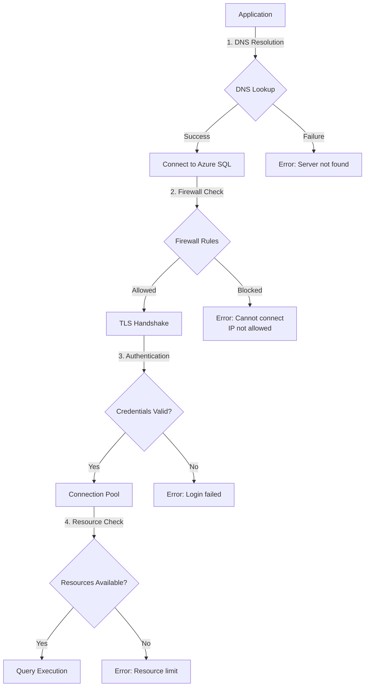
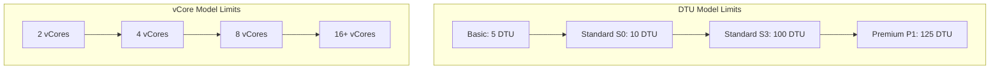

# How to Fix 'Azure SQL' Connection Errors

Author: [nawazdhandala](https://www.github.com/nawazdhandala)

Tags: Azure, SQL, Database, Errors, Troubleshooting, Connection, Microsoft Azure

Description: Learn how to diagnose and fix common Azure SQL Database connection errors including firewall issues, authentication failures, and timeout problems.

---

## Introduction

Azure SQL Database is a managed relational database service that offers high availability and scalability. However, connection errors can occur due to various reasons including network configuration, authentication issues, or resource constraints. This guide covers the most common Azure SQL connection errors and provides practical solutions to resolve them.

## Common Connection Error Types

Here is an overview of the connection flow and potential failure points:



## Error 1: Cannot Connect to Server

### Symptoms

```
A network-related or instance-specific error occurred while establishing a
connection to SQL Server. The server was not found or was not accessible.
```

### Diagnosis and Solutions

#### Check Firewall Rules

Azure SQL Database requires explicit firewall rules for client IP addresses:

```bash
# List current firewall rules using Azure CLI
az sql server firewall-rule list \
    --resource-group myResourceGroup \
    --server myserver

# Add your current IP address
az sql server firewall-rule create \
    --resource-group myResourceGroup \
    --server myserver \
    --name AllowMyIP \
    --start-ip-address $(curl -s ifconfig.me) \
    --end-ip-address $(curl -s ifconfig.me)

# Allow Azure services (for Azure-hosted applications)
az sql server firewall-rule create \
    --resource-group myResourceGroup \
    --server myserver \
    --name AllowAzureServices \
    --start-ip-address 0.0.0.0 \
    --end-ip-address 0.0.0.0
```

#### Verify Connection String

Ensure your connection string is correctly formatted:

```csharp
// Correct connection string format
string connectionString =
    "Server=tcp:myserver.database.windows.net,1433;" +
    "Initial Catalog=mydatabase;" +
    "Persist Security Info=False;" +
    "User ID=myuser;" +
    "Password=mypassword;" +
    "MultipleActiveResultSets=False;" +
    "Encrypt=True;" +
    "TrustServerCertificate=False;" +
    "Connection Timeout=30;";
```

For .NET applications, use SqlConnectionStringBuilder to avoid formatting errors:

```csharp
var builder = new SqlConnectionStringBuilder
{
    DataSource = "myserver.database.windows.net",
    InitialCatalog = "mydatabase",
    UserID = "myuser",
    Password = Environment.GetEnvironmentVariable("SQL_PASSWORD"),
    Encrypt = true,
    TrustServerCertificate = false,
    ConnectTimeout = 30,
    MultipleActiveResultSets = true
};

string connectionString = builder.ConnectionString;
```

## Error 2: Login Failed for User

### Symptoms

```
Login failed for user 'username'. (Error 18456)
```

### Common Causes and Fixes

#### Wrong Database Context

The user might exist but not have access to the specified database:

```sql
-- Connect to the master database first
-- Then check if the user exists
SELECT name, type_desc, authentication_type_desc
FROM sys.database_principals
WHERE name = 'myuser';

-- Create the user in your target database if missing
CREATE USER [myuser] FROM LOGIN [myuser];

-- Grant appropriate permissions
ALTER ROLE db_datareader ADD MEMBER [myuser];
ALTER ROLE db_datawriter ADD MEMBER [myuser];
```

#### Azure AD Authentication Issues

For Azure Active Directory authentication:

```csharp
// Using Azure AD interactive authentication
string connectionString =
    "Server=tcp:myserver.database.windows.net,1433;" +
    "Initial Catalog=mydatabase;" +
    "Authentication=Active Directory Interactive;" +
    "Encrypt=True;";

// Using Azure AD with Managed Identity
string connectionString =
    "Server=tcp:myserver.database.windows.net,1433;" +
    "Initial Catalog=mydatabase;" +
    "Authentication=Active Directory Managed Identity;" +
    "Encrypt=True;";
```

To configure Azure AD admin:

```bash
# Set Azure AD admin for the SQL server
az sql server ad-admin create \
    --resource-group myResourceGroup \
    --server myserver \
    --display-name "SQL Admin" \
    --object-id <azure-ad-user-object-id>
```

## Error 3: Connection Timeout Expired

### Symptoms

```
Connection Timeout Expired. The timeout period elapsed while attempting to
consume the pre-login handshake acknowledgement.
```

### Solutions

#### Increase Timeout Values

```csharp
var builder = new SqlConnectionStringBuilder(connectionString)
{
    // Increase connection timeout (default is 15 seconds)
    ConnectTimeout = 60,
};

// For command execution timeout
using var connection = new SqlConnection(builder.ConnectionString);
await connection.OpenAsync();

using var command = connection.CreateCommand();
command.CommandText = "SELECT * FROM LargeTable";
command.CommandTimeout = 120;  // 120 seconds for this query
```

#### Implement Retry Logic

Transient failures are common in cloud environments. Implement exponential backoff:

```csharp
public class SqlRetryPolicy
{
    private readonly int _maxRetries;
    private readonly TimeSpan _baseDelay;

    public SqlRetryPolicy(int maxRetries = 5, int baseDelayMs = 1000)
    {
        _maxRetries = maxRetries;
        _baseDelay = TimeSpan.FromMilliseconds(baseDelayMs);
    }

    public async Task<T> ExecuteAsync<T>(Func<Task<T>> operation)
    {
        int attempt = 0;

        while (true)
        {
            try
            {
                return await operation();
            }
            catch (SqlException ex) when (IsTransient(ex) && attempt < _maxRetries)
            {
                attempt++;
                var delay = TimeSpan.FromMilliseconds(
                    _baseDelay.TotalMilliseconds * Math.Pow(2, attempt));

                Console.WriteLine(
                    $"Transient error (attempt {attempt}/{_maxRetries}). " +
                    $"Retrying in {delay.TotalSeconds}s. Error: {ex.Message}");

                await Task.Delay(delay);
            }
        }
    }

    private bool IsTransient(SqlException ex)
    {
        // Common transient error codes
        int[] transientErrors = {
            -2,      // Timeout
            20,      // Instance does not support encryption
            64,      // Connection was successfully established but login failed
            233,     // Connection initialization error
            10053,   // Software caused connection abort
            10054,   // Connection reset by peer
            10060,   // Connection timed out
            40143,   // Connection could not be initialized
            40197,   // Service error processing request
            40501,   // Service is busy
            40613,   // Database not available
            49918,   // Not enough resources
            49919,   // Too many create requests
            49920    // Too many requests
        };

        return transientErrors.Contains(ex.Number);
    }
}

// Usage
var retryPolicy = new SqlRetryPolicy();
var result = await retryPolicy.ExecuteAsync(async () =>
{
    using var connection = new SqlConnection(connectionString);
    await connection.OpenAsync();

    using var command = new SqlCommand("SELECT COUNT(*) FROM Users", connection);
    return (int)await command.ExecuteScalarAsync();
});
```

## Error 4: Resource Limit Reached

### Symptoms

```
Resource ID: 1. The request limit for the database is 30 and has been reached.
```

### Understanding DTU and vCore Limits



### Solutions

#### Monitor and Scale Resources

```bash
# Check current DTU usage
az monitor metrics list \
    --resource /subscriptions/{sub}/resourceGroups/{rg}/providers/Microsoft.Sql/servers/{server}/databases/{db} \
    --metric "dtu_consumption_percent" \
    --interval PT1M

# Scale up the database
az sql db update \
    --resource-group myResourceGroup \
    --server myserver \
    --name mydatabase \
    --service-objective S3
```

#### Optimize Queries to Reduce Resource Usage

```sql
-- Find resource-intensive queries
SELECT TOP 10
    qs.total_worker_time / qs.execution_count AS avg_cpu_time,
    qs.total_logical_reads / qs.execution_count AS avg_reads,
    qs.execution_count,
    SUBSTRING(qt.text, (qs.statement_start_offset/2)+1,
        ((CASE qs.statement_end_offset
            WHEN -1 THEN DATALENGTH(qt.text)
            ELSE qs.statement_end_offset
        END - qs.statement_start_offset)/2)+1) AS query_text
FROM sys.dm_exec_query_stats qs
CROSS APPLY sys.dm_exec_sql_text(qs.sql_handle) qt
ORDER BY avg_cpu_time DESC;

-- Check for missing indexes
SELECT
    mig.index_handle,
    mid.statement AS table_name,
    mid.equality_columns,
    mid.inequality_columns,
    mid.included_columns,
    migs.user_seeks * migs.avg_total_user_cost * migs.avg_user_impact AS improvement_measure
FROM sys.dm_db_missing_index_groups mig
JOIN sys.dm_db_missing_index_group_stats migs ON mig.index_group_handle = migs.group_handle
JOIN sys.dm_db_missing_index_details mid ON mig.index_handle = mid.index_handle
ORDER BY improvement_measure DESC;
```

## Error 5: SSL/TLS Connection Errors

### Symptoms

```
A connection was successfully established with the server, but then an error
occurred during the pre-login handshake. (provider: SSL Provider, error: 0)
```

### Solutions

#### Update TLS Configuration

Azure SQL requires TLS 1.2 or higher:

```csharp
// Ensure TLS 1.2 is enabled in your application
System.Net.ServicePointManager.SecurityProtocol =
    SecurityProtocolType.Tls12 | SecurityProtocolType.Tls13;
```

For Node.js applications:

```javascript
const sql = require('mssql');

const config = {
    server: 'myserver.database.windows.net',
    database: 'mydatabase',
    user: 'myuser',
    password: process.env.SQL_PASSWORD,
    options: {
        encrypt: true,
        trustServerCertificate: false,
        // Force TLS 1.2
        cryptoCredentialsDetails: {
            minVersion: 'TLSv1.2'
        }
    }
};

async function connect() {
    try {
        await sql.connect(config);
        console.log('Connected to Azure SQL');
    } catch (err) {
        console.error('Connection error:', err.message);
    }
}
```

## Implementing Connection Pooling

Proper connection pooling reduces connection errors and improves performance:

```csharp
public class DatabaseConnectionPool
{
    private readonly string _connectionString;

    public DatabaseConnectionPool(string connectionString)
    {
        // Configure pooling in the connection string
        var builder = new SqlConnectionStringBuilder(connectionString)
        {
            Pooling = true,
            MinPoolSize = 5,
            MaxPoolSize = 100,
            ConnectTimeout = 30,
            // Connection lifetime to handle Azure SQL failovers
            LoadBalanceTimeout = 30
        };

        _connectionString = builder.ConnectionString;
    }

    public async Task<T> ExecuteAsync<T>(
        Func<SqlConnection, Task<T>> operation)
    {
        // Connection is returned to pool when disposed
        using var connection = new SqlConnection(_connectionString);
        await connection.OpenAsync();
        return await operation(connection);
    }
}
```

## Diagnostic Queries

Run these queries to diagnose connection issues:

```sql
-- Check active connections
SELECT
    session_id,
    login_name,
    host_name,
    program_name,
    status,
    cpu_time,
    memory_usage,
    last_request_start_time
FROM sys.dm_exec_sessions
WHERE is_user_process = 1
ORDER BY last_request_start_time DESC;

-- Check connection wait statistics
SELECT
    wait_type,
    waiting_tasks_count,
    wait_time_ms,
    signal_wait_time_ms
FROM sys.dm_db_wait_stats
WHERE wait_type LIKE '%NETWORK%' OR wait_type LIKE '%LOGIN%'
ORDER BY wait_time_ms DESC;

-- Check for blocked processes
SELECT
    blocked.session_id AS blocked_session,
    blocking.session_id AS blocking_session,
    blocked.wait_type,
    blocked.wait_time,
    blocking_text.text AS blocking_query
FROM sys.dm_exec_requests blocked
JOIN sys.dm_exec_sessions blocking ON blocked.blocking_session_id = blocking.session_id
CROSS APPLY sys.dm_exec_sql_text(blocking.most_recent_sql_handle) blocking_text
WHERE blocked.blocking_session_id > 0;
```

## Best Practices Summary

1. **Always use connection pooling**: Reduce overhead from opening new connections
2. **Implement retry logic**: Handle transient failures gracefully
3. **Set appropriate timeouts**: Balance between reliability and responsiveness
4. **Use parameterized queries**: Prevent SQL injection and improve plan caching
5. **Monitor connection metrics**: Track connection counts and wait times
6. **Keep firewall rules tight**: Only allow necessary IP ranges
7. **Use managed identity when possible**: Avoid storing credentials in code
8. **Enable Advanced Threat Protection**: Detect anomalous database activities

## Conclusion

Azure SQL connection errors can be frustrating, but most issues fall into predictable categories: firewall rules, authentication, timeouts, or resource limits. By implementing proper retry logic, connection pooling, and monitoring, you can build resilient applications that handle transient failures gracefully. Regular monitoring of your database metrics will help you identify and resolve issues before they impact your users.
