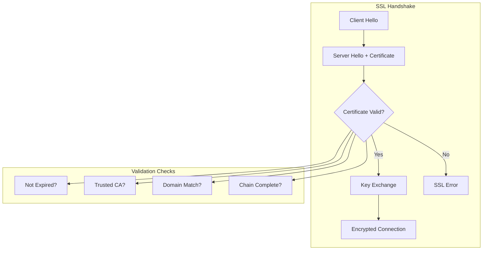
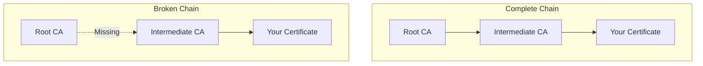
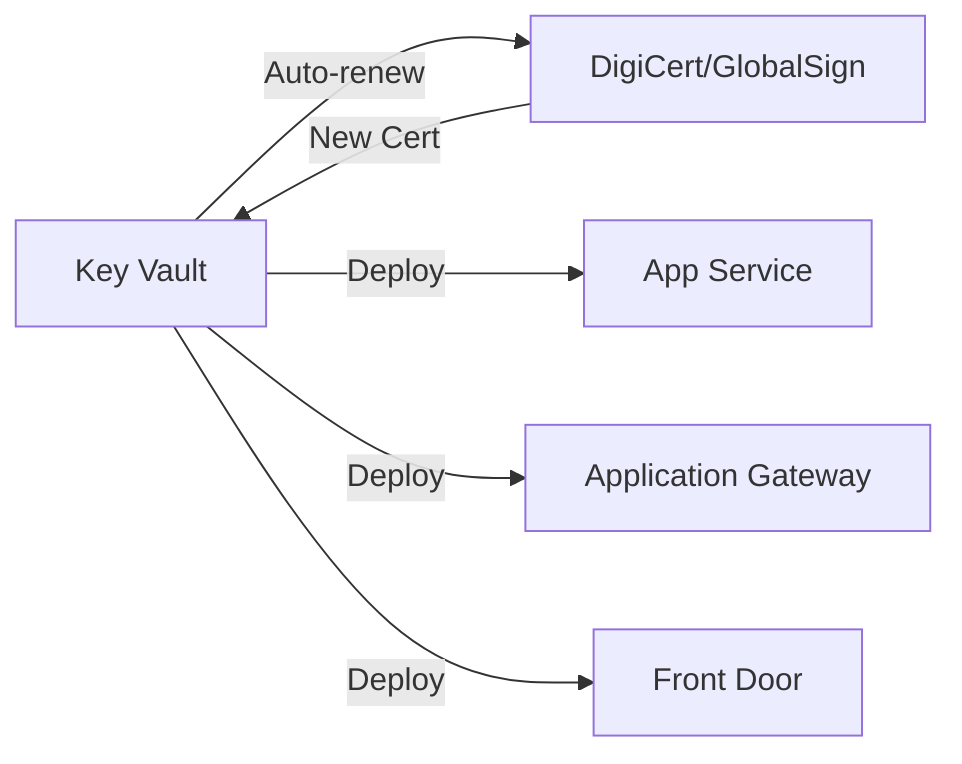

# How to Fix 'SSL Certificate' Errors in Azure

Author: [nawazdhandala](https://www.github.com/nawazdhandala)

Tags: Azure, SSL, TLS, Certificates, Security, App Service, HTTPS, Troubleshooting

Description: A comprehensive guide to diagnosing and fixing SSL/TLS certificate errors in Azure including expired certs, chain issues, and configuration problems.

---

SSL certificate errors in Azure can break your entire application. Users see scary browser warnings, APIs fail with certificate validation errors, and search rankings drop. This guide covers the most common SSL issues in Azure and how to fix them quickly.

## Understanding SSL Certificate Errors

Before fixing errors, understand what can go wrong with SSL certificates.



### Common Error Messages

| Error | Meaning |
|-------|---------|
| ERR_CERT_DATE_INVALID | Certificate expired or not yet valid |
| ERR_CERT_AUTHORITY_INVALID | Not issued by trusted CA |
| ERR_CERT_COMMON_NAME_INVALID | Domain name mismatch |
| ERR_CERT_REVOKED | Certificate has been revoked |
| SSL_ERROR_HANDSHAKE_FAILURE | TLS version or cipher mismatch |

## Diagnosing SSL Issues

Start by identifying exactly what is wrong with your certificate.

### Check Certificate Details

```bash
# Check certificate from command line
openssl s_client -connect myapp.azurewebsites.net:443 -servername myapp.azurewebsites.net 2>/dev/null | openssl x509 -noout -dates -subject -issuer

# Expected output:
# notBefore=Jan  1 00:00:00 2026 GMT
# notAfter=Dec 31 23:59:59 2026 GMT
# subject=CN = myapp.azurewebsites.net
# issuer=C = US, O = Microsoft Corporation, CN = Microsoft Azure TLS Issuing CA 05
```

### Check Certificate Chain

```bash
# Get full certificate chain
openssl s_client -connect myapp.azurewebsites.net:443 -servername myapp.azurewebsites.net -showcerts 2>/dev/null

# Verify the chain is complete
openssl s_client -connect myapp.azurewebsites.net:443 -servername myapp.azurewebsites.net 2>&1 | grep -E "Verify return code|depth"
```

### Test with cURL

```bash
# Test SSL connection (will show errors)
curl -vI https://myapp.azurewebsites.net 2>&1 | grep -E "SSL|certificate|error"

# Ignore certificate errors to test connectivity (for debugging only)
curl -k https://myapp.azurewebsites.net
```

## Fix 1: Expired Certificate

The most common issue. Certificates expire, and renewals get missed.

### For Azure App Service Managed Certificates

Azure can automatically manage and renew certificates for custom domains.

```bash
# Check current certificate status
az webapp config ssl list --resource-group myresourcegroup --query "[].{name:name,thumbprint:thumbprint,expirationDate:expirationDate}"

# Create a new managed certificate (free, auto-renewing)
az webapp config ssl create \
    --name myapp \
    --resource-group myresourcegroup \
    --hostname www.mydomain.com

# Bind the certificate to your domain
az webapp config ssl bind \
    --name myapp \
    --resource-group myresourcegroup \
    --certificate-thumbprint <new-thumbprint> \
    --ssl-type SNI
```

### For Custom Certificates

If you use your own certificate, upload the renewed one:

```bash
# Upload new PFX certificate
az webapp config ssl upload \
    --name myapp \
    --resource-group myresourcegroup \
    --certificate-file /path/to/certificate.pfx \
    --certificate-password "your-password"

# Bind to hostname
az webapp config ssl bind \
    --name myapp \
    --resource-group myresourcegroup \
    --certificate-thumbprint <new-thumbprint> \
    --ssl-type SNI
```

### For Azure Key Vault Certificates

Key Vault can auto-renew certificates from integrated CAs.

```bash
# Check certificate in Key Vault
az keyvault certificate show \
    --vault-name mykeyvault \
    --name mycertificate \
    --query "{name:name,expires:attributes.expires,enabled:attributes.enabled}"

# If using DigiCert or GlobalSign integration, renewal is automatic
# Otherwise, upload renewed certificate
az keyvault certificate import \
    --vault-name mykeyvault \
    --name mycertificate \
    --file /path/to/certificate.pfx \
    --password "your-password"
```

## Fix 2: Certificate Chain Issues

Incomplete certificate chains cause validation failures on some clients.



### Verify Chain Completeness

```bash
# This should show multiple certificates in the chain
openssl s_client -connect myapp.com:443 -servername myapp.com -showcerts 2>/dev/null | grep -E "s:|i:"

# Expected: Your cert, intermediate(s), root
# Problem: Only your cert showing
```

### Fix: Include Intermediate Certificates

When creating your PFX, include the full chain:

```bash
# Combine certificates in correct order
cat your-certificate.crt intermediate.crt root.crt > fullchain.crt

# Create PFX with full chain
openssl pkcs12 -export \
    -out certificate.pfx \
    -inkey private.key \
    -in fullchain.crt \
    -password pass:your-password
```

## Fix 3: Domain Name Mismatch

The certificate must match the domain users access.

### Check What Domains the Certificate Covers

```bash
# Check Subject Alternative Names (SANs)
openssl s_client -connect myapp.com:443 -servername myapp.com 2>/dev/null | \
    openssl x509 -noout -text | grep -A1 "Subject Alternative Name"

# Output example:
# X509v3 Subject Alternative Name:
#     DNS:myapp.com, DNS:www.myapp.com, DNS:*.myapp.com
```

### Solutions

**Option 1: Get a certificate that covers all your domains**

```bash
# Using Let's Encrypt via certbot for multiple domains
certbot certonly --manual \
    -d myapp.com \
    -d www.myapp.com \
    -d api.myapp.com
```

**Option 2: Use a wildcard certificate**

```bash
# Wildcard covers *.myapp.com but NOT myapp.com itself
# You need both in your certificate
certbot certonly --manual \
    -d myapp.com \
    -d "*.myapp.com"
```

**Option 3: Configure App Service to use correct hostname**

```bash
# Add custom domain to App Service
az webapp config hostname add \
    --webapp-name myapp \
    --resource-group myresourcegroup \
    --hostname www.mydomain.com

# Bind certificate to specific hostname
az webapp config ssl bind \
    --name myapp \
    --resource-group myresourcegroup \
    --certificate-thumbprint <thumbprint> \
    --ssl-type SNI
```

## Fix 4: TLS Version Incompatibility

Old TLS versions (1.0, 1.1) are disabled by default. Clients using them will fail.

### Check Current TLS Configuration

```bash
# Check App Service TLS settings
az webapp config show \
    --name myapp \
    --resource-group myresourcegroup \
    --query "minTlsVersion"

# Test TLS version support
openssl s_client -connect myapp.com:443 -tls1_2 # Should work
openssl s_client -connect myapp.com:443 -tls1_1 # May fail
```

### Update TLS Settings

```bash
# Set minimum TLS version to 1.2 (recommended)
az webapp config set \
    --name myapp \
    --resource-group myresourcegroup \
    --min-tls-version 1.2

# For Azure Front Door
az afd custom-domain update \
    --profile-name myprofile \
    --resource-group myresourcegroup \
    --custom-domain-name mydomain \
    --minimum-tls-version TLS12
```

## Fix 5: Certificate Not Binding Correctly

The certificate exists but is not serving for your domain.

### Check Current Bindings

```bash
# List all SSL bindings
az webapp config ssl list \
    --resource-group myresourcegroup \
    --query "[].{hostname:hostNames,thumbprint:thumbprint}"

# Check specific app bindings
az webapp show \
    --name myapp \
    --resource-group myresourcegroup \
    --query "hostNameSslStates"
```

### Rebind Certificate

```bash
# Unbind existing certificate
az webapp config ssl unbind \
    --name myapp \
    --resource-group myresourcegroup \
    --certificate-thumbprint <old-thumbprint>

# Bind correct certificate
az webapp config ssl bind \
    --name myapp \
    --resource-group myresourcegroup \
    --certificate-thumbprint <correct-thumbprint> \
    --ssl-type SNI
```

## Fix 6: Self-Signed Certificate Issues

Self-signed certificates work for testing but cause errors in production.

### Create Proper Self-Signed Cert for Development

```bash
# Generate self-signed certificate with proper SAN
openssl req -x509 -nodes -days 365 -newkey rsa:2048 \
    -keyout dev.key \
    -out dev.crt \
    -subj "/CN=localhost" \
    -addext "subjectAltName=DNS:localhost,DNS:*.localhost,IP:127.0.0.1"

# Convert to PFX for Azure
openssl pkcs12 -export -out dev.pfx -inkey dev.key -in dev.crt
```

### Trust Self-Signed Cert in Your Application

```csharp
// C# - Only for development/testing
var handler = new HttpClientHandler();
if (Environment.IsDevelopment())
{
    handler.ServerCertificateCustomValidationCallback =
        (message, cert, chain, errors) => true;
}
var client = new HttpClient(handler);
```

```python
# Python - Only for development/testing
import requests
response = requests.get('https://localhost:5001', verify=False)
```

## Automating Certificate Management

### Using Azure Key Vault with Auto-Renewal



### Set Up Certificate Auto-Rotation

```bash
# Create certificate policy for auto-renewal
az keyvault certificate create \
    --vault-name mykeyvault \
    --name auto-renew-cert \
    --policy @cert-policy.json
```

```json
// cert-policy.json
{
    "issuerParameters": {
        "name": "DigiCert"
    },
    "keyProperties": {
        "keySize": 2048,
        "keyType": "RSA"
    },
    "lifetimeActions": [
        {
            "action": { "actionType": "AutoRenew" },
            "trigger": { "daysBeforeExpiry": 30 }
        }
    ],
    "x509CertificateProperties": {
        "subject": "CN=mydomain.com",
        "subjectAlternativeNames": {
            "dnsNames": ["mydomain.com", "www.mydomain.com"]
        },
        "validityInMonths": 12
    }
}
```

## Monitoring Certificate Expiration

Set up alerts before certificates expire.

```bash
# Create alert for certificates expiring within 30 days
az monitor scheduled-query create \
    --name "CertExpiryAlert" \
    --resource-group myresourcegroup \
    --scopes "/subscriptions/{sub-id}/resourceGroups/{rg}" \
    --condition "count > 0" \
    --condition-query "AzureDiagnostics | where ResourceType == 'VAULTS' | where certificateExpiry_d < 30"
```

## SSL Certificate Checklist

- [ ] Certificate not expired
- [ ] Certificate matches domain (check SANs)
- [ ] Full certificate chain included
- [ ] Using TLS 1.2 or higher
- [ ] Certificate properly bound to hostname
- [ ] Auto-renewal configured
- [ ] Expiration alerts set up
- [ ] No mixed content (HTTP resources on HTTPS page)

---

SSL errors are usually one of five things: expired certificate, missing intermediate certificates, domain mismatch, TLS version issues, or incorrect binding. Use the diagnostic commands to identify which one, then apply the appropriate fix. For production, always use Azure-managed certificates or Key Vault with auto-renewal to avoid expiration surprises.
