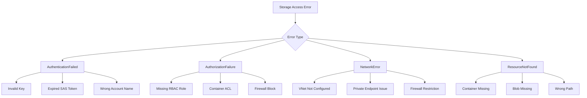
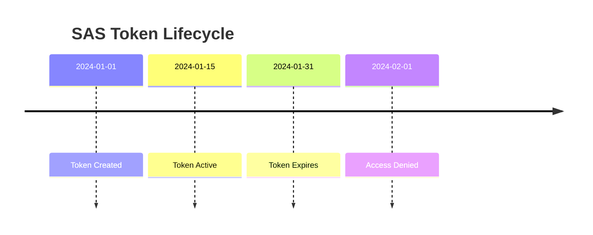

# How to Fix 'Storage Account' Access Errors

Author: [nawazdhandala](https://www.github.com/nawazdhandala)

Tags: Azure, Storage Account, Blob Storage, Access Errors, Authentication, SAS Tokens, RBAC

Description: Learn how to diagnose and fix common Azure Storage Account access errors including authentication failures, authorization issues, and network restrictions.

---

## Introduction

Azure Storage Account provides scalable cloud storage for blobs, files, queues, and tables. Access errors are among the most common issues developers face when working with Azure Storage. This guide covers the diagnosis and resolution of storage access errors, including authentication problems, RBAC misconfigurations, network restrictions, and SAS token issues.

## Common Error Types Overview



## Error 1: AuthenticationFailed

### Symptoms

```xml
<?xml version="1.0" encoding="utf-8"?>
<Error>
  <Code>AuthenticationFailed</Code>
  <Message>Server failed to authenticate the request. Make sure the value of
  Authorization header is formed correctly including the signature.</Message>
</Error>
```

### Common Causes and Solutions

#### Invalid or Rotated Access Keys

Storage account keys may have been rotated:

```bash
# List current access keys
az storage account keys list \
    --resource-group myResourceGroup \
    --account-name mystorageaccount \
    --output table

# Regenerate key1 if compromised
az storage account keys renew \
    --resource-group myResourceGroup \
    --account-name mystorageaccount \
    --key key1
```

Update your application with the new key:

```csharp
// Use environment variables or Azure Key Vault for credentials
public class StorageConfig
{
    public static BlobServiceClient CreateClient()
    {
        // Option 1: Connection string from environment
        string connectionString = Environment.GetEnvironmentVariable("AZURE_STORAGE_CONNECTION_STRING");
        return new BlobServiceClient(connectionString);

        // Option 2: Use DefaultAzureCredential (recommended)
        string accountUrl = "https://mystorageaccount.blob.core.windows.net";
        return new BlobServiceClient(new Uri(accountUrl), new DefaultAzureCredential());
    }
}
```

#### Incorrect Account Name or Key

Verify your connection string format:

```csharp
// Correct connection string format
string connectionString =
    "DefaultEndpointsProtocol=https;" +
    "AccountName=mystorageaccount;" +
    "AccountKey=your-base64-encoded-key;" +
    "EndpointSuffix=core.windows.net";

// Validate connection string
var builder = new BlobServiceClient(connectionString);
try
{
    // Test the connection
    var properties = await builder.GetPropertiesAsync();
    Console.WriteLine($"Connected. SKU: {properties.Value.SkuName}");
}
catch (RequestFailedException ex) when (ex.ErrorCode == "AuthenticationFailed")
{
    Console.WriteLine("Authentication failed. Check account name and key.");
}
```

#### Clock Skew Issues

Storage authentication uses timestamps. Significant clock drift causes auth failures:

```csharp
// The SDK handles clock skew automatically, but for manual requests:
public class StorageRequestSigner
{
    public void SignRequest(HttpRequestMessage request, string accountName, string accountKey)
    {
        // Use UTC time for the Date header
        string dateHeader = DateTime.UtcNow.ToString("R");
        request.Headers.Add("x-ms-date", dateHeader);
        request.Headers.Add("x-ms-version", "2021-08-06");

        // Generate signature based on canonical resource and headers
        string signature = GenerateSignature(request, accountName, accountKey);
        request.Headers.Authorization = new AuthenticationHeaderValue(
            "SharedKey", $"{accountName}:{signature}");
    }
}
```

## Error 2: AuthorizationFailure

### Symptoms

```xml
<Error>
  <Code>AuthorizationFailure</Code>
  <Message>This request is not authorized to perform this operation.</Message>
</Error>
```

### RBAC Role Assignment Issues

Check and assign appropriate roles:

```bash
# List current role assignments for the storage account
az role assignment list \
    --scope /subscriptions/{sub}/resourceGroups/{rg}/providers/Microsoft.Storage/storageAccounts/mystorageaccount \
    --output table

# Common storage roles:
# - Storage Blob Data Owner: Full access to blob data
# - Storage Blob Data Contributor: Read, write, delete blobs
# - Storage Blob Data Reader: Read-only access to blobs

# Assign Storage Blob Data Contributor role to a user
az role assignment create \
    --role "Storage Blob Data Contributor" \
    --assignee user@domain.com \
    --scope /subscriptions/{sub}/resourceGroups/{rg}/providers/Microsoft.Storage/storageAccounts/mystorageaccount

# Assign role to a managed identity
az role assignment create \
    --role "Storage Blob Data Contributor" \
    --assignee-object-id <managed-identity-object-id> \
    --assignee-principal-type ServicePrincipal \
    --scope /subscriptions/{sub}/resourceGroups/{rg}/providers/Microsoft.Storage/storageAccounts/mystorageaccount
```

### Using Azure AD Authentication in Code

```csharp
using Azure.Identity;
using Azure.Storage.Blobs;

public class AzureAdStorageClient
{
    private readonly BlobServiceClient _client;

    public AzureAdStorageClient(string accountName)
    {
        // DefaultAzureCredential tries multiple auth methods:
        // 1. Environment variables
        // 2. Managed Identity
        // 3. Visual Studio
        // 4. Azure CLI
        // 5. Interactive browser

        var credential = new DefaultAzureCredential(new DefaultAzureCredentialOptions
        {
            // Exclude methods that are not needed for faster auth
            ExcludeVisualStudioCredential = true,
            ExcludeInteractiveBrowserCredential = true
        });

        string blobUri = $"https://{accountName}.blob.core.windows.net";
        _client = new BlobServiceClient(new Uri(blobUri), credential);
    }

    public async Task<bool> TestAccessAsync(string containerName)
    {
        try
        {
            var container = _client.GetBlobContainerClient(containerName);
            await container.GetPropertiesAsync();
            return true;
        }
        catch (RequestFailedException ex)
        {
            Console.WriteLine($"Access denied: {ex.Message}");
            Console.WriteLine($"Error code: {ex.ErrorCode}");
            return false;
        }
    }
}
```

### Container-Level Access Policy

Check container access level:

```bash
# Get container access level
az storage container show \
    --name mycontainer \
    --account-name mystorageaccount \
    --query "properties.publicAccess"

# Set container access level (use with caution)
# Options: off, blob, container
az storage container set-permission \
    --name mycontainer \
    --account-name mystorageaccount \
    --public-access off
```

## Error 3: SAS Token Issues

### Expired or Invalid SAS Token



### Generate Valid SAS Tokens

```csharp
public class SasTokenGenerator
{
    public string GenerateBlobSasToken(
        BlobContainerClient container,
        string blobName,
        TimeSpan validFor,
        BlobSasPermissions permissions)
    {
        // Check if we can generate SAS (requires account key or user delegation key)
        if (!container.CanGenerateSasUri)
        {
            throw new InvalidOperationException(
                "Cannot generate SAS. Use account key authentication.");
        }

        var sasBuilder = new BlobSasBuilder
        {
            BlobContainerName = container.Name,
            BlobName = blobName,
            Resource = "b", // b = blob, c = container
            StartsOn = DateTimeOffset.UtcNow.AddMinutes(-5), // Allow for clock skew
            ExpiresOn = DateTimeOffset.UtcNow.Add(validFor)
        };

        sasBuilder.SetPermissions(permissions);

        var blobClient = container.GetBlobClient(blobName);
        return blobClient.GenerateSasUri(sasBuilder).ToString();
    }

    // Generate user delegation SAS (more secure, no account key needed)
    public async Task<string> GenerateUserDelegationSasAsync(
        BlobServiceClient serviceClient,
        string containerName,
        string blobName,
        TimeSpan validFor)
    {
        // Get user delegation key (valid for up to 7 days)
        var delegationKey = await serviceClient.GetUserDelegationKeyAsync(
            DateTimeOffset.UtcNow,
            DateTimeOffset.UtcNow.AddDays(1));

        var sasBuilder = new BlobSasBuilder
        {
            BlobContainerName = containerName,
            BlobName = blobName,
            Resource = "b",
            StartsOn = DateTimeOffset.UtcNow.AddMinutes(-5),
            ExpiresOn = DateTimeOffset.UtcNow.Add(validFor)
        };

        sasBuilder.SetPermissions(BlobSasPermissions.Read | BlobSasPermissions.Write);

        var blobUriBuilder = new BlobUriBuilder(
            new Uri($"{serviceClient.Uri}{containerName}/{blobName}"))
        {
            Sas = sasBuilder.ToSasQueryParameters(
                delegationKey, serviceClient.AccountName)
        };

        return blobUriBuilder.ToUri().ToString();
    }
}
```

### Debugging SAS Token Issues

```csharp
public class SasTokenDebugger
{
    public void AnalyzeSasToken(string sasToken)
    {
        var uri = new Uri(sasToken);
        var queryParams = HttpUtility.ParseQueryString(uri.Query);

        Console.WriteLine("SAS Token Analysis:");
        Console.WriteLine($"  Service Version (sv): {queryParams["sv"]}");
        Console.WriteLine($"  Start Time (st): {queryParams["st"]}");
        Console.WriteLine($"  Expiry Time (se): {queryParams["se"]}");
        Console.WriteLine($"  Permissions (sp): {queryParams["sp"]}");
        Console.WriteLine($"  Resource (sr): {queryParams["sr"]}");
        Console.WriteLine($"  Signed Resource Type (srt): {queryParams["srt"]}");

        // Check if expired
        if (DateTime.TryParse(queryParams["se"], out DateTime expiry))
        {
            if (expiry < DateTime.UtcNow)
            {
                Console.WriteLine("WARNING: Token has expired!");
            }
            else
            {
                Console.WriteLine($"  Expires in: {expiry - DateTime.UtcNow}");
            }
        }

        // Decode permissions
        string permissions = queryParams["sp"] ?? "";
        Console.WriteLine("  Permissions decoded:");
        if (permissions.Contains("r")) Console.WriteLine("    - Read");
        if (permissions.Contains("w")) Console.WriteLine("    - Write");
        if (permissions.Contains("d")) Console.WriteLine("    - Delete");
        if (permissions.Contains("l")) Console.WriteLine("    - List");
        if (permissions.Contains("a")) Console.WriteLine("    - Add");
        if (permissions.Contains("c")) Console.WriteLine("    - Create");
    }
}
```

## Error 4: Network Access Denied

### Symptoms

```xml
<Error>
  <Code>AuthorizationFailure</Code>
  <Message>This request is not authorized to perform this operation.
  RequestId:xxx
  Time:xxx</Message>
</Error>
```

### Check Firewall Configuration

```bash
# View current network rules
az storage account show \
    --resource-group myResourceGroup \
    --name mystorageaccount \
    --query "networkRuleSet"

# Allow access from specific IP
az storage account network-rule add \
    --resource-group myResourceGroup \
    --account-name mystorageaccount \
    --ip-address 203.0.113.1

# Allow access from a virtual network subnet
az storage account network-rule add \
    --resource-group myResourceGroup \
    --account-name mystorageaccount \
    --vnet-name myVNet \
    --subnet mySubnet

# Allow Azure services to access storage
az storage account update \
    --resource-group myResourceGroup \
    --name mystorageaccount \
    --bypass AzureServices
```

### Network Configuration with Terraform

```hcl
resource "azurerm_storage_account" "main" {
  name                     = "mystorageaccount"
  resource_group_name      = azurerm_resource_group.main.name
  location                 = azurerm_resource_group.main.location
  account_tier             = "Standard"
  account_replication_type = "LRS"

  # Network rules
  network_rules {
    default_action             = "Deny"
    bypass                     = ["AzureServices", "Logging", "Metrics"]
    ip_rules                   = ["203.0.113.0/24"]
    virtual_network_subnet_ids = [azurerm_subnet.app.id]
  }

  # Enable private endpoint
  public_network_access_enabled = false
}

# Create private endpoint for blob storage
resource "azurerm_private_endpoint" "blob" {
  name                = "blob-private-endpoint"
  location            = azurerm_resource_group.main.location
  resource_group_name = azurerm_resource_group.main.name
  subnet_id           = azurerm_subnet.private_endpoints.id

  private_service_connection {
    name                           = "blob-connection"
    private_connection_resource_id = azurerm_storage_account.main.id
    subresource_names              = ["blob"]
    is_manual_connection           = false
  }

  private_dns_zone_group {
    name                 = "blob-dns-zone-group"
    private_dns_zone_ids = [azurerm_private_dns_zone.blob.id]
  }
}
```

## Error 5: ResourceNotFound

### Common Causes

```csharp
public class StoragePathValidator
{
    private readonly BlobContainerClient _container;

    public async Task<ValidationResult> ValidatePathAsync(string blobPath)
    {
        var result = new ValidationResult();

        // Check if container exists
        if (!await _container.ExistsAsync())
        {
            result.AddError($"Container '{_container.Name}' does not exist");
            return result;
        }

        // Check if blob exists
        var blob = _container.GetBlobClient(blobPath);
        if (!await blob.ExistsAsync())
        {
            result.AddError($"Blob '{blobPath}' does not exist");

            // Suggest similar blobs
            var suggestions = await FindSimilarBlobsAsync(blobPath);
            if (suggestions.Any())
            {
                result.AddInfo($"Did you mean: {string.Join(", ", suggestions)}");
            }
        }

        return result;
    }

    private async Task<List<string>> FindSimilarBlobsAsync(string targetPath)
    {
        var suggestions = new List<string>();
        var directory = Path.GetDirectoryName(targetPath)?.Replace("\\", "/") ?? "";

        await foreach (var item in _container.GetBlobsAsync(prefix: directory))
        {
            if (LevenshteinDistance(item.Name, targetPath) < 5)
            {
                suggestions.Add(item.Name);
            }
        }

        return suggestions.Take(5).ToList();
    }
}
```

## Comprehensive Diagnostic Tool

```csharp
public class StorageAccessDiagnostics
{
    private readonly BlobServiceClient _client;
    private readonly ILogger<StorageAccessDiagnostics> _logger;

    public async Task<DiagnosticReport> RunDiagnosticsAsync(
        string containerName,
        string blobName = null)
    {
        var report = new DiagnosticReport();

        // Test 1: Service connectivity
        _logger.LogInformation("Testing service connectivity...");
        try
        {
            var properties = await _client.GetPropertiesAsync();
            report.AddSuccess("Service connectivity",
                $"Connected to {_client.AccountName}");
        }
        catch (RequestFailedException ex)
        {
            report.AddFailure("Service connectivity", ex.Message, ex.ErrorCode);
            return report; // Cannot continue
        }

        // Test 2: Container access
        _logger.LogInformation($"Testing container access: {containerName}");
        var container = _client.GetBlobContainerClient(containerName);
        try
        {
            var containerProps = await container.GetPropertiesAsync();
            report.AddSuccess("Container access",
                $"Container exists. Last modified: {containerProps.Value.LastModified}");
        }
        catch (RequestFailedException ex) when (ex.ErrorCode == "ContainerNotFound")
        {
            report.AddFailure("Container access",
                $"Container '{containerName}' not found", ex.ErrorCode);
            report.AddRecommendation("Create the container or verify the name");
        }
        catch (RequestFailedException ex)
        {
            report.AddFailure("Container access", ex.Message, ex.ErrorCode);
        }

        // Test 3: Blob access (if specified)
        if (!string.IsNullOrEmpty(blobName))
        {
            _logger.LogInformation($"Testing blob access: {blobName}");
            var blob = container.GetBlobClient(blobName);
            try
            {
                var blobProps = await blob.GetPropertiesAsync();
                report.AddSuccess("Blob access",
                    $"Blob exists. Size: {blobProps.Value.ContentLength} bytes");
            }
            catch (RequestFailedException ex) when (ex.ErrorCode == "BlobNotFound")
            {
                report.AddFailure("Blob access",
                    $"Blob '{blobName}' not found", ex.ErrorCode);
            }
            catch (RequestFailedException ex)
            {
                report.AddFailure("Blob access", ex.Message, ex.ErrorCode);
            }
        }

        // Test 4: Write permission
        _logger.LogInformation("Testing write permission...");
        try
        {
            var testBlob = container.GetBlobClient($".diagnostic-test-{Guid.NewGuid()}");
            await testBlob.UploadAsync(BinaryData.FromString("test"));
            await testBlob.DeleteAsync();
            report.AddSuccess("Write permission", "Write access confirmed");
        }
        catch (RequestFailedException ex)
        {
            report.AddFailure("Write permission", ex.Message, ex.ErrorCode);
            if (ex.ErrorCode == "AuthorizationFailure")
            {
                report.AddRecommendation(
                    "Grant 'Storage Blob Data Contributor' role to the identity");
            }
        }

        return report;
    }
}
```

## Best Practices

1. **Use Managed Identity**: Avoid storing keys in application configuration
2. **Apply least privilege**: Grant only necessary permissions
3. **Use short-lived SAS tokens**: Set appropriate expiration times
4. **Enable storage analytics**: Monitor access patterns and failures
5. **Implement retry logic**: Handle transient failures gracefully
6. **Use private endpoints**: Secure access over private network
7. **Rotate keys regularly**: Automate key rotation with Key Vault
8. **Enable soft delete**: Protect against accidental deletion

## Conclusion

Azure Storage access errors can stem from various causes including authentication issues, authorization problems, network restrictions, and configuration mistakes. By understanding the error codes and following the diagnostic approaches outlined in this guide, you can quickly identify and resolve storage access issues. Implementing proper security practices like managed identity and private endpoints will help prevent many common access errors while maintaining a strong security posture.
