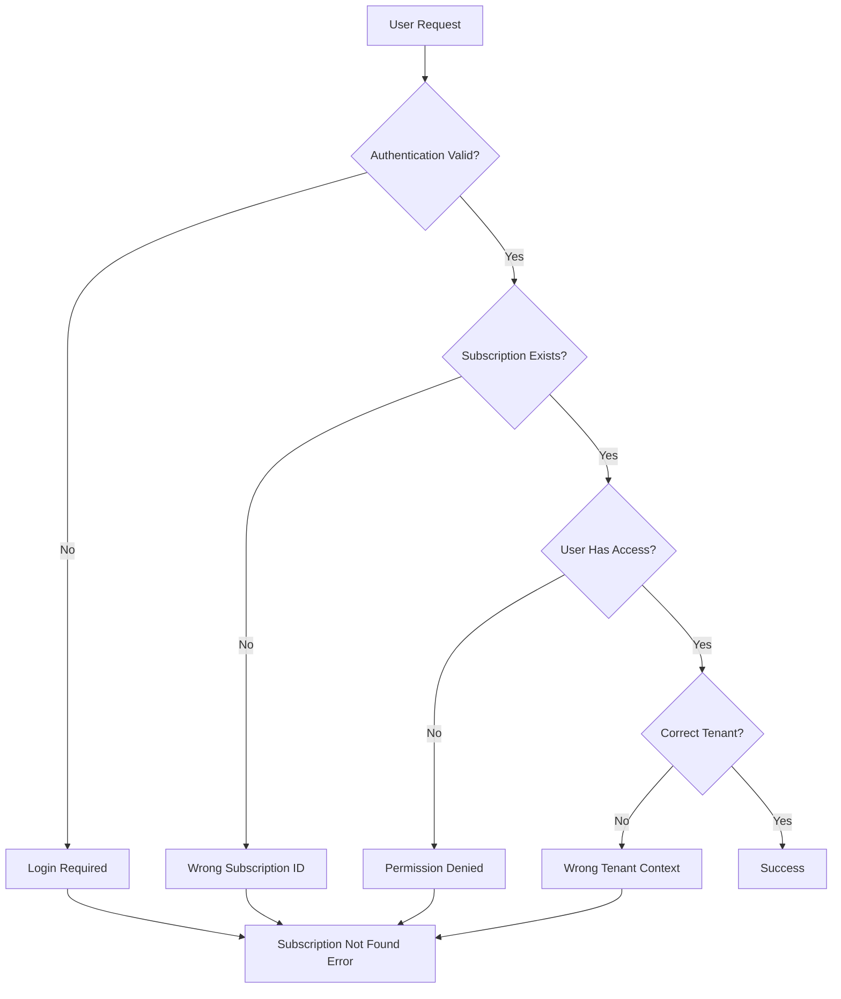
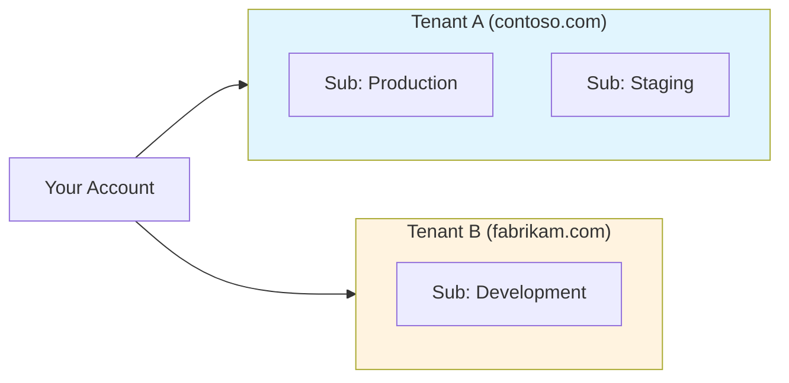

# How to Fix 'Subscription Not Found' Errors in Azure

Author: [nawazdhandala](https://www.github.com/nawazdhandala)

Tags: Azure, Troubleshooting, Subscription, Azure CLI, Cloud, DevOps

Description: Learn how to diagnose and fix 'Subscription Not Found' errors in Azure, including authentication issues, context problems, and permission misconfigurations.

---

The "Subscription Not Found" error is one of the most common and frustrating issues Azure users encounter. It can appear when using the Azure CLI, Portal, PowerShell, or SDKs. This guide covers all the common causes and provides practical solutions to get you back on track.

## Understanding the Error

When you see "SubscriptionNotFound" or "The subscription 'xxx' could not be found," Azure is telling you that your current authentication context cannot locate or access the specified subscription.



## Common Causes and Solutions

### 1. Not Logged In or Session Expired

The most basic cause is simply not being authenticated.

```bash
# Check your current login status
az account show

# If you see an error, log in again
az login

# For service principals
az login --service-principal \
  --username <app-id> \
  --password <password-or-cert-path> \
  --tenant <tenant-id>
```

For browser-based login issues:

```bash
# Use device code flow if browser login fails
az login --use-device-code
```

### 2. Wrong Subscription Selected

You might be authenticated but pointing to a different subscription.

```bash
# List all subscriptions you have access to
az account list --output table

# Sample output:
# Name                  CloudName    SubscriptionId                        State    IsDefault
# --------------------  -----------  ------------------------------------  -------  -----------
# Production            AzureCloud   xxxxxxxx-xxxx-xxxx-xxxx-xxxxxxxxxxxx  Enabled  False
# Development           AzureCloud   yyyyyyyy-yyyy-yyyy-yyyy-yyyyyyyyyyyy  Enabled  True

# Set the correct subscription
az account set --subscription "Production"

# Or use the subscription ID
az account set --subscription "xxxxxxxx-xxxx-xxxx-xxxx-xxxxxxxxxxxx"
```

### 3. Multi-Tenant Access Issues

If your account has access to multiple Azure AD tenants, you might be in the wrong tenant context.

```bash
# List all tenants you have access to
az account list --all --query "[].{Name:name, Tenant:tenantId, Sub:id}" --output table

# Login to a specific tenant
az login --tenant <tenant-id>

# Set subscription in a specific tenant
az account set --subscription <subscription-id>
```



### 4. Subscription ID Typo or Copy-Paste Error

Verify the subscription ID is correct:

```bash
# Find subscription by name (partial match)
az account list --query "[?contains(name, 'prod')].{Name:name, Id:id}" --output table

# Validate a specific subscription ID exists
SUBSCRIPTION_ID="your-subscription-id"
az account show --subscription $SUBSCRIPTION_ID 2>/dev/null && echo "Valid" || echo "Not Found"
```

### 5. Service Principal Permission Issues

Service principals need explicit access to subscriptions.

```bash
# Check what the service principal can access
az login --service-principal -u <app-id> -p <secret> --tenant <tenant-id>
az account list --output table

# If subscription is missing, you need to grant access in Azure Portal or via CLI
# Grant Reader role to service principal
az role assignment create \
  --assignee <app-id> \
  --role "Reader" \
  --scope "/subscriptions/<subscription-id>"
```

### 6. Azure CLI Cache Issues

Sometimes the local Azure CLI cache gets corrupted.

```bash
# Clear the Azure CLI cache
az account clear

# Log in fresh
az login

# Refresh the subscription list
az account list --refresh --output table
```

For more stubborn issues:

```bash
# Remove Azure CLI configuration entirely (Linux/macOS)
rm -rf ~/.azure

# Windows
# Remove %USERPROFILE%\.azure folder

# Log in again
az login
```

### 7. Environment Variables Overriding Settings

Check if environment variables are causing issues:

```bash
# Check for Azure-related environment variables
env | grep -i azure

# Key variables that can override settings:
# AZURE_SUBSCRIPTION_ID
# AZURE_TENANT_ID
# AZURE_CLIENT_ID

# Unset if they're causing problems
unset AZURE_SUBSCRIPTION_ID
```

## Fixing in Different Contexts

### Azure PowerShell

```powershell
# Check current context
Get-AzContext

# List all subscriptions
Get-AzSubscription

# Set the correct subscription
Set-AzContext -SubscriptionId "xxxxxxxx-xxxx-xxxx-xxxx-xxxxxxxxxxxx"

# Or by name
Set-AzContext -SubscriptionName "Production"

# Clear cached credentials if needed
Clear-AzContext -Force
Connect-AzAccount
```

### Terraform

```hcl
# provider.tf - Explicitly set subscription
provider "azurerm" {
  features {}

  subscription_id = "xxxxxxxx-xxxx-xxxx-xxxx-xxxxxxxxxxxx"
  tenant_id       = "yyyyyyyy-yyyy-yyyy-yyyy-yyyyyyyyyyyy"

  # For service principal auth
  client_id       = var.client_id
  client_secret   = var.client_secret
}
```

```bash
# Set via environment variables
export ARM_SUBSCRIPTION_ID="xxxxxxxx-xxxx-xxxx-xxxx-xxxxxxxxxxxx"
export ARM_TENANT_ID="yyyyyyyy-yyyy-yyyy-yyyy-yyyyyyyyyyyy"
export ARM_CLIENT_ID="zzzzzzzz-zzzz-zzzz-zzzz-zzzzzzzzzzzz"
export ARM_CLIENT_SECRET="your-client-secret"

terraform plan
```

### Azure SDK for Python

```python
from azure.identity import DefaultAzureCredential
from azure.mgmt.resource import SubscriptionClient

# List available subscriptions
credential = DefaultAzureCredential()
subscription_client = SubscriptionClient(credential)

print("Available subscriptions:")
for sub in subscription_client.subscriptions.list():
    print(f"  {sub.display_name}: {sub.subscription_id}")

# Use a specific subscription
from azure.mgmt.compute import ComputeManagementClient

subscription_id = "xxxxxxxx-xxxx-xxxx-xxxx-xxxxxxxxxxxx"
compute_client = ComputeManagementClient(credential, subscription_id)
```

### Azure SDK for Node.js

```javascript
const { DefaultAzureCredential } = require("@azure/identity");
const { SubscriptionClient } = require("@azure/arm-subscriptions");

async function listSubscriptions() {
    const credential = new DefaultAzureCredential();
    const client = new SubscriptionClient(credential);

    console.log("Available subscriptions:");
    for await (const subscription of client.subscriptions.list()) {
        console.log(`  ${subscription.displayName}: ${subscription.subscriptionId}`);
    }
}

listSubscriptions().catch(console.error);
```

## Debugging Script

Create a diagnostic script to help identify the issue:

```bash
#!/bin/bash
# azure-subscription-diagnostic.sh

echo "=== Azure CLI Version ==="
az version

echo -e "\n=== Current Account ==="
az account show 2>&1 || echo "Not logged in"

echo -e "\n=== Available Subscriptions ==="
az account list --output table 2>&1 || echo "Cannot list subscriptions"

echo -e "\n=== Environment Variables ==="
env | grep -i "azure\|arm_" || echo "No Azure env vars set"

echo -e "\n=== Cached Tokens ==="
ls -la ~/.azure/*.json 2>/dev/null || echo "No cached tokens found"

echo -e "\n=== Testing Specific Subscription ==="
if [ -n "$1" ]; then
    az account show --subscription "$1" 2>&1
else
    echo "Usage: $0 <subscription-id-to-test>"
fi
```

## Prevention Best Practices

### 1. Use Azure Configuration Files

```bash
# Create a defaults file
mkdir -p ~/.azure
cat > ~/.azure/config << 'EOF'
[defaults]
subscription = xxxxxxxx-xxxx-xxxx-xxxx-xxxxxxxxxxxx

[core]
output = table
EOF
```

### 2. Set Up Named Profiles

```bash
# Create profile for different environments
az config set defaults.subscription=<prod-sub-id> --local
az config set defaults.group=<prod-resource-group> --local
```

### 3. Use Managed Identities in Azure

When running in Azure VMs, App Service, or Functions:

```python
from azure.identity import ManagedIdentityCredential

# No need to manage credentials - uses VM's identity
credential = ManagedIdentityCredential()
```

### 4. Validate in CI/CD Pipelines

```yaml
# Azure DevOps Pipeline
steps:
  - task: AzureCLI@2
    inputs:
      azureSubscription: 'Production-Connection'
      scriptType: 'bash'
      scriptLocation: 'inlineScript'
      inlineScript: |
        # Verify subscription before proceeding
        EXPECTED_SUB="xxxxxxxx-xxxx-xxxx-xxxx-xxxxxxxxxxxx"
        CURRENT_SUB=$(az account show --query id -o tsv)

        if [ "$CURRENT_SUB" != "$EXPECTED_SUB" ]; then
          echo "ERROR: Wrong subscription context!"
          echo "Expected: $EXPECTED_SUB"
          echo "Got: $CURRENT_SUB"
          exit 1
        fi

        echo "Subscription verified: $CURRENT_SUB"
```

## Quick Reference Table

| Symptom | Likely Cause | Solution |
|---------|--------------|----------|
| "Please run 'az login'" | Not authenticated | `az login` |
| Subscription missing from list | Wrong tenant | `az login --tenant <id>` |
| Service principal cannot see sub | Missing RBAC | Add role assignment |
| Works in portal, not CLI | Cache issue | `az account clear && az login` |
| Intermittent failures | Token expiry | Refresh with `az login` |

---

The "Subscription Not Found" error almost always comes down to authentication context, tenant selection, or permission issues. Start by verifying you are logged in, then check you are in the correct tenant, and finally confirm you have the necessary permissions. The diagnostic script above can help you quickly identify which of these is the root cause.
