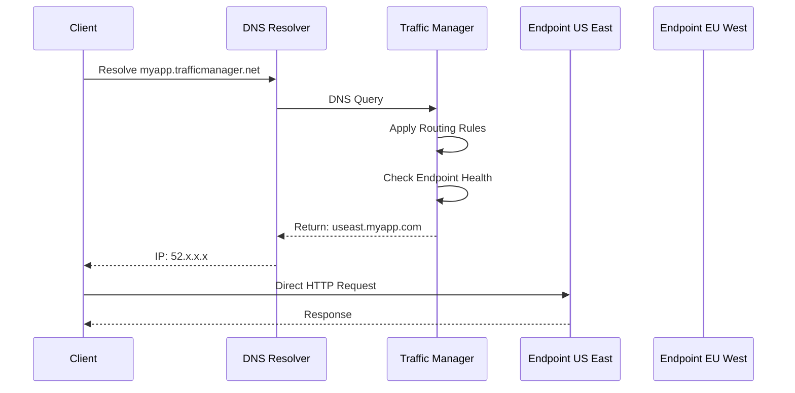
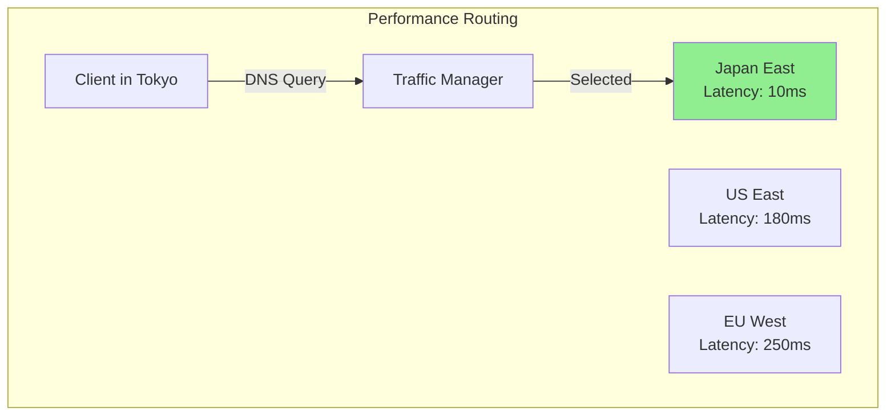
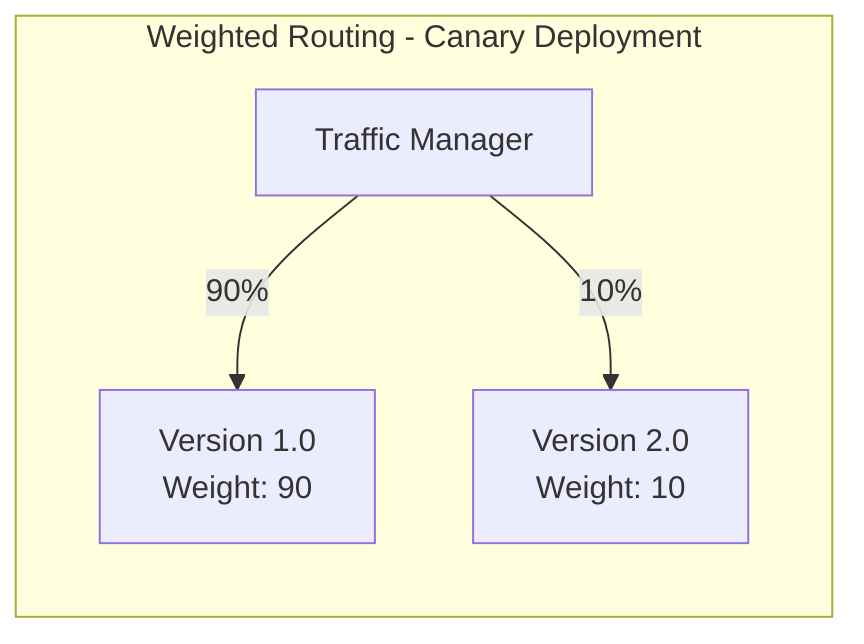
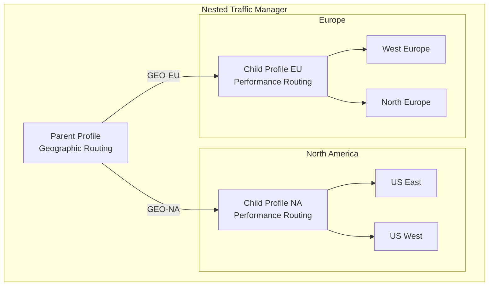
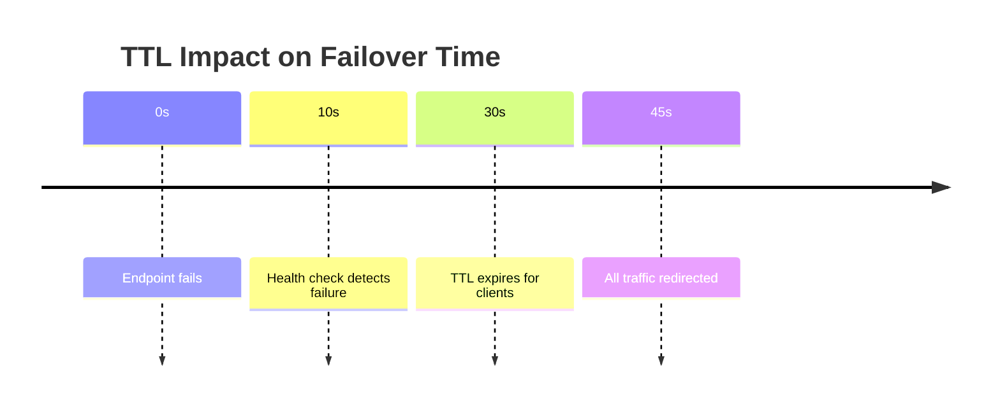

# How to Configure Azure Traffic Manager

Author: [nawazdhandala](https://www.github.com/nawazdhandala)

Tags: Azure, Traffic Manager, Load Balancing, DNS, High Availability, Disaster Recovery, Microsoft Azure

Description: Learn how to configure Azure Traffic Manager for global load balancing, failover, and performance optimization across multiple regions.

---

## Introduction

Azure Traffic Manager is a DNS-based traffic load balancer that distributes traffic across global Azure regions. Unlike traditional load balancers that operate at the network level, Traffic Manager works at the DNS level, directing clients to the most appropriate endpoint based on routing rules. This guide covers configuration, routing methods, health monitoring, and best practices.

## Understanding Traffic Manager Architecture

Traffic Manager does not proxy traffic. Instead, it returns the DNS name or IP address of the selected endpoint:



## Creating a Traffic Manager Profile

### Using Azure CLI

```bash
# Create a Traffic Manager profile with performance routing
az network traffic-manager profile create \
    --resource-group myResourceGroup \
    --name myTrafficManagerProfile \
    --routing-method Performance \
    --unique-dns-name myapp \
    --ttl 30 \
    --protocol HTTPS \
    --port 443 \
    --path "/health" \
    --interval 10 \
    --timeout 5 \
    --max-failures 3

# Output will include the FQDN: myapp.trafficmanager.net
```

### Using Terraform

```hcl
# Configure the Azure provider
provider "azurerm" {
  features {}
}

# Create a resource group
resource "azurerm_resource_group" "main" {
  name     = "traffic-manager-rg"
  location = "East US"
}

# Create Traffic Manager profile
resource "azurerm_traffic_manager_profile" "main" {
  name                   = "myapp-traffic-manager"
  resource_group_name    = azurerm_resource_group.main.name
  traffic_routing_method = "Performance"

  dns_config {
    relative_name = "myapp"
    ttl           = 30
  }

  monitor_config {
    protocol                     = "HTTPS"
    port                         = 443
    path                         = "/health"
    interval_in_seconds          = 10
    timeout_in_seconds           = 5
    tolerated_number_of_failures = 3

    custom_header {
      name  = "Host"
      value = "myapp.com"
    }
  }

  tags = {
    environment = "production"
  }
}

# Add Azure endpoint (Web App in East US)
resource "azurerm_traffic_manager_azure_endpoint" "us_east" {
  name                 = "endpoint-us-east"
  profile_id           = azurerm_traffic_manager_profile.main.id
  target_resource_id   = azurerm_app_service.us_east.id
  weight               = 100
  priority             = 1
  endpoint_location    = "East US"
}

# Add Azure endpoint (Web App in West Europe)
resource "azurerm_traffic_manager_azure_endpoint" "eu_west" {
  name                 = "endpoint-eu-west"
  profile_id           = azurerm_traffic_manager_profile.main.id
  target_resource_id   = azurerm_app_service.eu_west.id
  weight               = 100
  priority             = 2
  endpoint_location    = "West Europe"
}
```

## Routing Methods Explained

### Performance Routing

Routes users to the endpoint with the lowest network latency:



Configuration:

```bash
# Update profile to use performance routing
az network traffic-manager profile update \
    --resource-group myResourceGroup \
    --name myTrafficManagerProfile \
    --routing-method Performance
```

### Priority Routing

Routes all traffic to the primary endpoint, using secondary endpoints only during failover:

```bash
# Create profile with priority routing
az network traffic-manager profile create \
    --resource-group myResourceGroup \
    --name myFailoverProfile \
    --routing-method Priority \
    --unique-dns-name myapp-failover \
    --ttl 30 \
    --protocol HTTPS \
    --port 443 \
    --path "/health"

# Add primary endpoint with priority 1
az network traffic-manager endpoint create \
    --resource-group myResourceGroup \
    --profile-name myFailoverProfile \
    --name primary-endpoint \
    --type azureEndpoints \
    --target-resource-id /subscriptions/{sub}/resourceGroups/{rg}/providers/Microsoft.Web/sites/myapp-primary \
    --priority 1 \
    --endpoint-status Enabled

# Add secondary endpoint with priority 2
az network traffic-manager endpoint create \
    --resource-group myResourceGroup \
    --profile-name myFailoverProfile \
    --name secondary-endpoint \
    --type azureEndpoints \
    --target-resource-id /subscriptions/{sub}/resourceGroups/{rg}/providers/Microsoft.Web/sites/myapp-secondary \
    --priority 2 \
    --endpoint-status Enabled
```

### Weighted Routing

Distributes traffic based on assigned weights, useful for canary deployments:



```bash
# Create weighted endpoints for canary deployment
az network traffic-manager endpoint create \
    --resource-group myResourceGroup \
    --profile-name myWeightedProfile \
    --name stable-version \
    --type azureEndpoints \
    --target-resource-id /subscriptions/{sub}/resourceGroups/{rg}/providers/Microsoft.Web/sites/myapp-v1 \
    --weight 90 \
    --endpoint-status Enabled

az network traffic-manager endpoint create \
    --resource-group myResourceGroup \
    --profile-name myWeightedProfile \
    --name canary-version \
    --type azureEndpoints \
    --target-resource-id /subscriptions/{sub}/resourceGroups/{rg}/providers/Microsoft.Web/sites/myapp-v2 \
    --weight 10 \
    --endpoint-status Enabled
```

### Geographic Routing

Routes users based on their geographic location:

```bash
# Create geographic profile
az network traffic-manager profile create \
    --resource-group myResourceGroup \
    --name myGeoProfile \
    --routing-method Geographic \
    --unique-dns-name myapp-geo \
    --ttl 30 \
    --protocol HTTPS \
    --port 443 \
    --path "/health"

# Add endpoint for European users
az network traffic-manager endpoint create \
    --resource-group myResourceGroup \
    --profile-name myGeoProfile \
    --name europe-endpoint \
    --type azureEndpoints \
    --target-resource-id /subscriptions/{sub}/resourceGroups/{rg}/providers/Microsoft.Web/sites/myapp-eu \
    --geo-mapping "GEO-EU" \
    --endpoint-status Enabled

# Add endpoint for US users
az network traffic-manager endpoint create \
    --resource-group myResourceGroup \
    --profile-name myGeoProfile \
    --name us-endpoint \
    --type azureEndpoints \
    --target-resource-id /subscriptions/{sub}/resourceGroups/{rg}/providers/Microsoft.Web/sites/myapp-us \
    --geo-mapping "GEO-NA" \
    --endpoint-status Enabled

# Add fallback endpoint for all other regions
az network traffic-manager endpoint create \
    --resource-group myResourceGroup \
    --profile-name myGeoProfile \
    --name world-endpoint \
    --type azureEndpoints \
    --target-resource-id /subscriptions/{sub}/resourceGroups/{rg}/providers/Microsoft.Web/sites/myapp-default \
    --geo-mapping "WORLD" \
    --endpoint-status Enabled
```

## Configuring Health Monitoring

### Health Check Best Practices

Create a dedicated health endpoint that validates all dependencies:

```csharp
// ASP.NET Core health check endpoint
public class Startup
{
    public void ConfigureServices(IServiceCollection services)
    {
        services.AddHealthChecks()
            .AddCheck("self", () => HealthCheckResult.Healthy())
            .AddSqlServer(
                connectionString: Configuration.GetConnectionString("DefaultConnection"),
                name: "database",
                failureStatus: HealthStatus.Unhealthy,
                timeout: TimeSpan.FromSeconds(3))
            .AddRedis(
                redisConnectionString: Configuration.GetConnectionString("Redis"),
                name: "redis",
                failureStatus: HealthStatus.Degraded,
                timeout: TimeSpan.FromSeconds(3));
    }

    public void Configure(IApplicationBuilder app)
    {
        app.UseHealthChecks("/health", new HealthCheckOptions
        {
            ResponseWriter = async (context, report) =>
            {
                context.Response.ContentType = "application/json";

                var response = new
                {
                    status = report.Status.ToString(),
                    checks = report.Entries.Select(e => new
                    {
                        name = e.Key,
                        status = e.Value.Status.ToString(),
                        duration = e.Value.Duration.TotalMilliseconds
                    }),
                    totalDuration = report.TotalDuration.TotalMilliseconds
                };

                await context.Response.WriteAsync(
                    JsonSerializer.Serialize(response));
            }
        });
    }
}
```

### Custom Health Check Headers

Configure custom headers for health probes:

```bash
# Update profile with custom health check headers
az network traffic-manager profile update \
    --resource-group myResourceGroup \
    --name myTrafficManagerProfile \
    --custom-headers host=myapp.com x-health-check=traffic-manager
```

### Monitor Status

```bash
# Check endpoint status
az network traffic-manager endpoint show \
    --resource-group myResourceGroup \
    --profile-name myTrafficManagerProfile \
    --name endpoint-us-east \
    --type azureEndpoints \
    --query "endpointMonitorStatus"

# Check profile status
az network traffic-manager profile show \
    --resource-group myResourceGroup \
    --name myTrafficManagerProfile \
    --query "profileStatus"
```

## Nested Profiles for Complex Scenarios

Combine multiple routing methods using nested profiles:



```hcl
# Terraform configuration for nested profiles

# Child profile for North America
resource "azurerm_traffic_manager_profile" "na" {
  name                   = "na-performance-profile"
  resource_group_name    = azurerm_resource_group.main.name
  traffic_routing_method = "Performance"

  dns_config {
    relative_name = "myapp-na"
    ttl           = 30
  }

  monitor_config {
    protocol = "HTTPS"
    port     = 443
    path     = "/health"
  }
}

# Child profile for Europe
resource "azurerm_traffic_manager_profile" "eu" {
  name                   = "eu-performance-profile"
  resource_group_name    = azurerm_resource_group.main.name
  traffic_routing_method = "Performance"

  dns_config {
    relative_name = "myapp-eu"
    ttl           = 30
  }

  monitor_config {
    protocol = "HTTPS"
    port     = 443
    path     = "/health"
  }
}

# Parent profile with geographic routing
resource "azurerm_traffic_manager_profile" "parent" {
  name                   = "global-geo-profile"
  resource_group_name    = azurerm_resource_group.main.name
  traffic_routing_method = "Geographic"

  dns_config {
    relative_name = "myapp-global"
    ttl           = 30
  }

  monitor_config {
    protocol = "HTTPS"
    port     = 443
    path     = "/health"
  }
}

# Nested endpoint for North America
resource "azurerm_traffic_manager_nested_endpoint" "na" {
  name                    = "na-nested-endpoint"
  profile_id              = azurerm_traffic_manager_profile.parent.id
  target_resource_id      = azurerm_traffic_manager_profile.na.id
  minimum_child_endpoints = 1
  geo_mappings            = ["GEO-NA"]
}

# Nested endpoint for Europe
resource "azurerm_traffic_manager_nested_endpoint" "eu" {
  name                    = "eu-nested-endpoint"
  profile_id              = azurerm_traffic_manager_profile.parent.id
  target_resource_id      = azurerm_traffic_manager_profile.eu.id
  minimum_child_endpoints = 1
  geo_mappings            = ["GEO-EU"]
}
```

## Real User Measurements

Enable Real User Measurements to improve performance routing accuracy:

```javascript
// Add this script to your web pages
<script>
(function() {
    var rum = document.createElement('script');
    rum.src = 'https://www.azuretm.net/aznr/rum.js';
    rum.dataset.trafficManagerKey = 'YOUR_RUM_KEY';
    document.head.appendChild(rum);
})();
</script>
```

Get your RUM key:

```bash
# Enable Real User Measurements and get the key
az network traffic-manager profile update \
    --resource-group myResourceGroup \
    --name myTrafficManagerProfile \
    --traffic-view-enrollment-status Enabled

# Retrieve the key
az network traffic-manager profile show \
    --resource-group myResourceGroup \
    --name myTrafficManagerProfile \
    --query "trafficViewEnrollmentStatus"
```

## DNS and TTL Considerations

### Understanding TTL Impact



Configure TTL based on your requirements:

```bash
# Lower TTL for faster failover (increases DNS queries)
az network traffic-manager profile update \
    --resource-group myResourceGroup \
    --name myTrafficManagerProfile \
    --ttl 10

# Higher TTL for reduced DNS load (slower failover)
az network traffic-manager profile update \
    --resource-group myResourceGroup \
    --name myTrafficManagerProfile \
    --ttl 300
```

## Monitoring and Alerts

Set up alerts for endpoint failures:

```bash
# Create action group for notifications
az monitor action-group create \
    --resource-group myResourceGroup \
    --name TrafficManagerAlerts \
    --short-name TMAlerts \
    --email-receiver name=Admin email=admin@company.com

# Create alert for endpoint degradation
az monitor metrics alert create \
    --resource-group myResourceGroup \
    --name "EndpointDegraded" \
    --description "Traffic Manager endpoint is degraded" \
    --scopes /subscriptions/{sub}/resourceGroups/{rg}/providers/Microsoft.Network/trafficManagerProfiles/myTrafficManagerProfile \
    --condition "avg ProbeAgentCurrentEndpointStateByProfileResourceId < 1" \
    --window-size 5m \
    --evaluation-frequency 1m \
    --action-group TrafficManagerAlerts
```

## Testing Failover

Test your failover configuration:

```bash
# Disable an endpoint to simulate failure
az network traffic-manager endpoint update \
    --resource-group myResourceGroup \
    --profile-name myTrafficManagerProfile \
    --name primary-endpoint \
    --type azureEndpoints \
    --endpoint-status Disabled

# Verify DNS returns secondary endpoint
nslookup myapp.trafficmanager.net

# Re-enable the endpoint
az network traffic-manager endpoint update \
    --resource-group myResourceGroup \
    --profile-name myTrafficManagerProfile \
    --name primary-endpoint \
    --type azureEndpoints \
    --endpoint-status Enabled
```

## Best Practices

1. **Use appropriate TTL values**: Balance between failover speed and DNS query costs
2. **Implement robust health checks**: Validate all critical dependencies
3. **Use nested profiles for complex routing**: Combine routing methods effectively
4. **Monitor endpoint health**: Set up alerts for degradation
5. **Test failover regularly**: Verify your disaster recovery works
6. **Enable Real User Measurements**: Improve performance routing accuracy
7. **Use custom health check paths**: Avoid using root path for health checks
8. **Configure multiple endpoints per region**: Provide redundancy within regions

## Conclusion

Azure Traffic Manager provides powerful DNS-based load balancing for global applications. By choosing the right routing method, configuring proper health checks, and implementing nested profiles for complex scenarios, you can build highly available and performant applications. Regular testing of your failover procedures ensures your disaster recovery plan works when needed.
