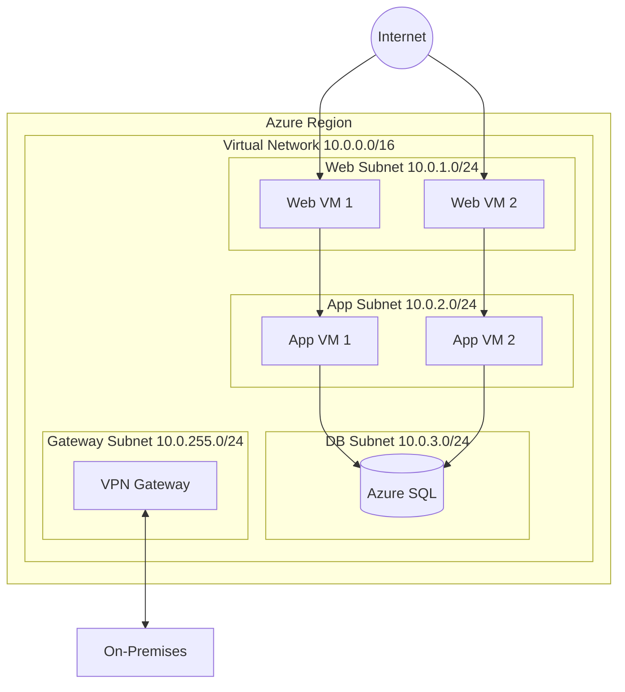
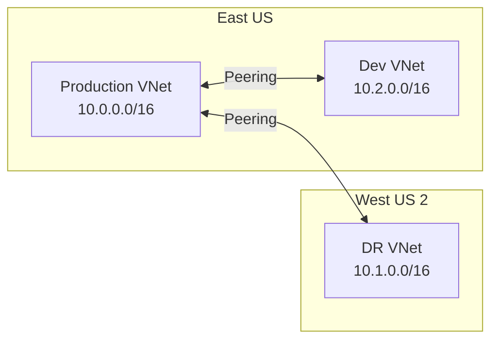

# How to Configure Azure Virtual Network

Author: [nawazdhandala](https://www.github.com/nawazdhandala)

Tags: Azure, Networking, VNet, Security, Cloud, Infrastructure, DevOps

Description: A practical guide to designing and configuring Azure Virtual Networks including subnets, peering, security groups, and hybrid connectivity.

---

Azure Virtual Network (VNet) is the foundation of your cloud infrastructure. Every VM, container, and managed service needs a network home. Getting the network design right from the start prevents painful migrations later. This guide covers practical VNet configuration from basic setup to advanced architectures.

## VNet Architecture Overview



## Creating a Virtual Network

### Using Azure CLI

```bash
# Set variables
RESOURCE_GROUP="network-rg"
LOCATION="eastus"
VNET_NAME="production-vnet"

# Create resource group
az group create \
    --name $RESOURCE_GROUP \
    --location $LOCATION

# Create VNet with address space
az network vnet create \
    --resource-group $RESOURCE_GROUP \
    --name $VNET_NAME \
    --address-prefix 10.0.0.0/16 \
    --location $LOCATION

# Add subnets
az network vnet subnet create \
    --resource-group $RESOURCE_GROUP \
    --vnet-name $VNET_NAME \
    --name web-subnet \
    --address-prefix 10.0.1.0/24

az network vnet subnet create \
    --resource-group $RESOURCE_GROUP \
    --vnet-name $VNET_NAME \
    --name app-subnet \
    --address-prefix 10.0.2.0/24

az network vnet subnet create \
    --resource-group $RESOURCE_GROUP \
    --vnet-name $VNET_NAME \
    --name db-subnet \
    --address-prefix 10.0.3.0/24

# Create gateway subnet (required for VPN/ExpressRoute)
az network vnet subnet create \
    --resource-group $RESOURCE_GROUP \
    --vnet-name $VNET_NAME \
    --name GatewaySubnet \
    --address-prefix 10.0.255.0/24
```

### Using Terraform

```hcl
# network.tf - Complete VNet configuration
resource "azurerm_virtual_network" "main" {
  name                = "production-vnet"
  location            = azurerm_resource_group.main.location
  resource_group_name = azurerm_resource_group.main.name
  address_space       = ["10.0.0.0/16"]

  tags = {
    Environment = "Production"
    ManagedBy   = "Terraform"
  }
}

# Web tier subnet
resource "azurerm_subnet" "web" {
  name                 = "web-subnet"
  resource_group_name  = azurerm_resource_group.main.name
  virtual_network_name = azurerm_virtual_network.main.name
  address_prefixes     = ["10.0.1.0/24"]

  service_endpoints = [
    "Microsoft.Storage",
    "Microsoft.KeyVault"
  ]
}

# Application tier subnet
resource "azurerm_subnet" "app" {
  name                 = "app-subnet"
  resource_group_name  = azurerm_resource_group.main.name
  virtual_network_name = azurerm_virtual_network.main.name
  address_prefixes     = ["10.0.2.0/24"]

  # Delegate to Azure Container Instances if needed
  delegation {
    name = "aci-delegation"
    service_delegation {
      name    = "Microsoft.ContainerInstance/containerGroups"
      actions = ["Microsoft.Network/virtualNetworks/subnets/action"]
    }
  }
}

# Database tier subnet
resource "azurerm_subnet" "db" {
  name                 = "db-subnet"
  resource_group_name  = azurerm_resource_group.main.name
  virtual_network_name = azurerm_virtual_network.main.name
  address_prefixes     = ["10.0.3.0/24"]

  service_endpoints = [
    "Microsoft.Sql"
  ]

  # Disable private endpoint network policies for Private Link
  private_endpoint_network_policies = "Disabled"
}
```

## Network Security Groups (NSGs)

NSGs are stateful firewalls for controlling traffic flow.

### Create and Configure NSG

```bash
# Create NSG for web subnet
az network nsg create \
    --resource-group $RESOURCE_GROUP \
    --name web-nsg

# Allow HTTP/HTTPS from internet
az network nsg rule create \
    --resource-group $RESOURCE_GROUP \
    --nsg-name web-nsg \
    --name AllowHTTP \
    --priority 100 \
    --direction Inbound \
    --access Allow \
    --protocol Tcp \
    --source-address-prefixes Internet \
    --destination-port-ranges 80 443

# Allow SSH from specific IP (your office)
az network nsg rule create \
    --resource-group $RESOURCE_GROUP \
    --nsg-name web-nsg \
    --name AllowSSH \
    --priority 110 \
    --direction Inbound \
    --access Allow \
    --protocol Tcp \
    --source-address-prefixes 203.0.113.0/24 \
    --destination-port-ranges 22

# Deny all other inbound traffic (explicit)
az network nsg rule create \
    --resource-group $RESOURCE_GROUP \
    --nsg-name web-nsg \
    --name DenyAllInbound \
    --priority 4000 \
    --direction Inbound \
    --access Deny \
    --protocol '*' \
    --source-address-prefixes '*' \
    --destination-port-ranges '*'

# Associate NSG with subnet
az network vnet subnet update \
    --resource-group $RESOURCE_GROUP \
    --vnet-name $VNET_NAME \
    --name web-subnet \
    --network-security-group web-nsg
```

### Terraform NSG Configuration

```hcl
# nsg.tf - Network Security Groups
resource "azurerm_network_security_group" "web" {
  name                = "web-nsg"
  location            = azurerm_resource_group.main.location
  resource_group_name = azurerm_resource_group.main.name

  # Allow HTTP/HTTPS
  security_rule {
    name                       = "AllowHTTPS"
    priority                   = 100
    direction                  = "Inbound"
    access                     = "Allow"
    protocol                   = "Tcp"
    source_port_range          = "*"
    destination_port_ranges    = ["80", "443"]
    source_address_prefix      = "*"
    destination_address_prefix = "*"
  }

  # Allow health probe from Azure Load Balancer
  security_rule {
    name                       = "AllowAzureLB"
    priority                   = 110
    direction                  = "Inbound"
    access                     = "Allow"
    protocol                   = "*"
    source_port_range          = "*"
    destination_port_range     = "*"
    source_address_prefix      = "AzureLoadBalancer"
    destination_address_prefix = "*"
  }

  # Deny direct internet access from app tier
  security_rule {
    name                       = "DenyInternetOutbound"
    priority                   = 4000
    direction                  = "Outbound"
    access                     = "Deny"
    protocol                   = "*"
    source_port_range          = "*"
    destination_port_range     = "*"
    source_address_prefix      = "*"
    destination_address_prefix = "Internet"
  }
}

resource "azurerm_subnet_network_security_group_association" "web" {
  subnet_id                 = azurerm_subnet.web.id
  network_security_group_id = azurerm_network_security_group.web.id
}
```

## VNet Peering

Connect VNets for cross-network communication without going through the internet.



### Configure Peering

```bash
# Get VNet IDs
VNET1_ID=$(az network vnet show \
    --resource-group prod-rg \
    --name production-vnet \
    --query id -o tsv)

VNET2_ID=$(az network vnet show \
    --resource-group dr-rg \
    --name dr-vnet \
    --query id -o tsv)

# Create peering from VNet1 to VNet2
az network vnet peering create \
    --resource-group prod-rg \
    --name prod-to-dr \
    --vnet-name production-vnet \
    --remote-vnet $VNET2_ID \
    --allow-vnet-access \
    --allow-forwarded-traffic

# Create peering from VNet2 to VNet1 (required for bidirectional)
az network vnet peering create \
    --resource-group dr-rg \
    --name dr-to-prod \
    --vnet-name dr-vnet \
    --remote-vnet $VNET1_ID \
    --allow-vnet-access \
    --allow-forwarded-traffic
```

## Private Endpoints

Connect to Azure PaaS services over private IP addresses.

```bash
# Create private endpoint for Azure SQL
az network private-endpoint create \
    --resource-group $RESOURCE_GROUP \
    --name sql-private-endpoint \
    --vnet-name $VNET_NAME \
    --subnet db-subnet \
    --private-connection-resource-id /subscriptions/<sub>/resourceGroups/<rg>/providers/Microsoft.Sql/servers/myserver \
    --group-id sqlServer \
    --connection-name sql-connection

# Create private DNS zone
az network private-dns zone create \
    --resource-group $RESOURCE_GROUP \
    --name privatelink.database.windows.net

# Link DNS zone to VNet
az network private-dns link vnet create \
    --resource-group $RESOURCE_GROUP \
    --zone-name privatelink.database.windows.net \
    --name sql-dns-link \
    --virtual-network $VNET_NAME \
    --registration-enabled false

# Create DNS record for private endpoint
az network private-endpoint dns-zone-group create \
    --resource-group $RESOURCE_GROUP \
    --endpoint-name sql-private-endpoint \
    --name sql-dns-group \
    --private-dns-zone privatelink.database.windows.net \
    --zone-name sql-zone
```

## Route Tables (User Defined Routes)

Control traffic routing within your VNet.

```bash
# Create route table
az network route-table create \
    --resource-group $RESOURCE_GROUP \
    --name app-route-table

# Route all internet traffic through firewall
az network route-table route create \
    --resource-group $RESOURCE_GROUP \
    --route-table-name app-route-table \
    --name to-firewall \
    --address-prefix 0.0.0.0/0 \
    --next-hop-type VirtualAppliance \
    --next-hop-ip-address 10.0.10.4

# Associate with subnet
az network vnet subnet update \
    --resource-group $RESOURCE_GROUP \
    --vnet-name $VNET_NAME \
    --name app-subnet \
    --route-table app-route-table
```

## Network Troubleshooting

### Verify Connectivity

```bash
# Check effective routes for a NIC
az network nic show-effective-route-table \
    --resource-group $RESOURCE_GROUP \
    --name myvm-nic \
    --output table

# Check effective security rules
az network nic list-effective-nsg \
    --resource-group $RESOURCE_GROUP \
    --name myvm-nic

# Use Network Watcher for connectivity check
az network watcher test-connectivity \
    --resource-group $RESOURCE_GROUP \
    --source-resource myvm \
    --dest-address 10.0.2.5 \
    --dest-port 443
```

### Common Issues and Fixes

```bash
# Issue: VMs in peered VNets cannot communicate
# Fix: Verify peering status
az network vnet peering list \
    --resource-group $RESOURCE_GROUP \
    --vnet-name $VNET_NAME \
    --output table

# Issue: Cannot reach PaaS service over private endpoint
# Fix: Check DNS resolution
nslookup myserver.database.windows.net
# Should return private IP (10.x.x.x), not public IP

# Issue: Asymmetric routing with load balancer
# Fix: Enable "Allow gateway transit" and "Use remote gateways" correctly
```

## Best Practices

### IP Address Planning

```
Production Environment:
  VNet: 10.0.0.0/16 (65,536 addresses)
    - web-subnet:     10.0.1.0/24   (254 hosts)
    - app-subnet:     10.0.2.0/24   (254 hosts)
    - db-subnet:      10.0.3.0/24   (254 hosts)
    - aks-subnet:     10.0.16.0/20  (4,094 hosts)
    - GatewaySubnet:  10.0.255.0/24 (reserved)

Development Environment:
  VNet: 10.1.0.0/16
    - Similar structure

DR Environment:
  VNet: 10.2.0.0/16
    - Mirror production
```

### Security Checklist

- Use NSGs on all subnets
- Enable DDoS Protection Standard for public-facing workloads
- Use Private Endpoints for PaaS services
- Implement Azure Firewall or NVA for egress filtering
- Enable VNet flow logs for traffic analysis
- Use service endpoints for Azure services without Private Link support
- Never put databases in subnets with public IP addresses

---

A well-designed virtual network is the foundation for secure and scalable cloud infrastructure. Take time to plan your IP address space, implement defense in depth with NSGs and firewalls, and use Private Endpoints to keep traffic off the public internet. Your security team will thank you.
