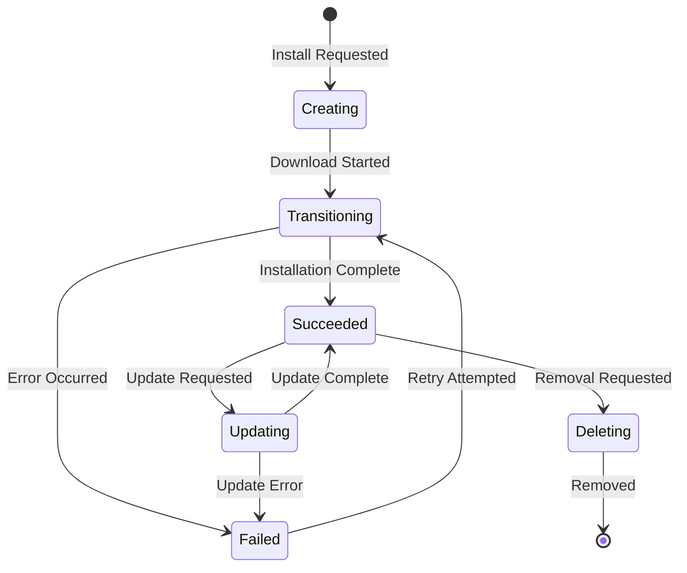
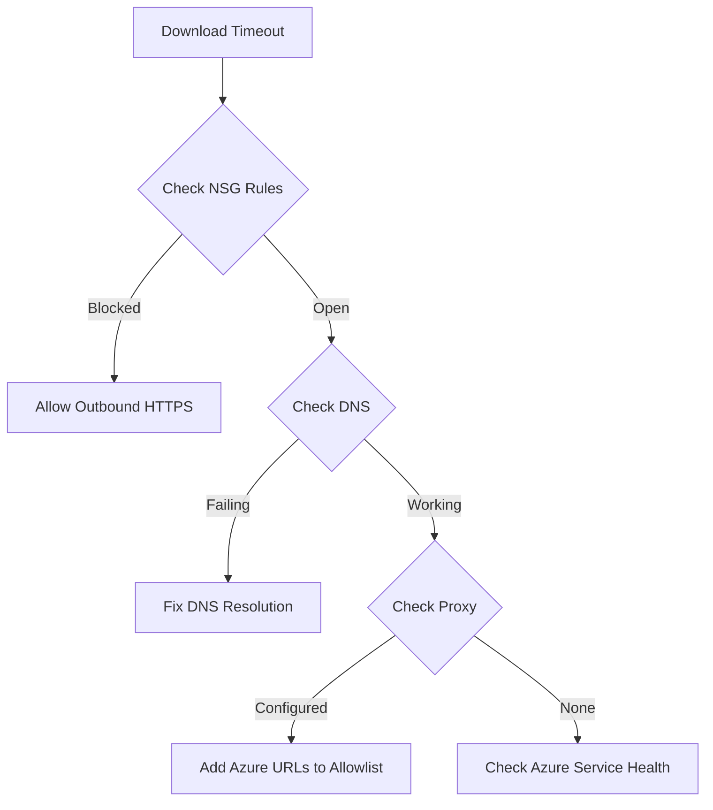
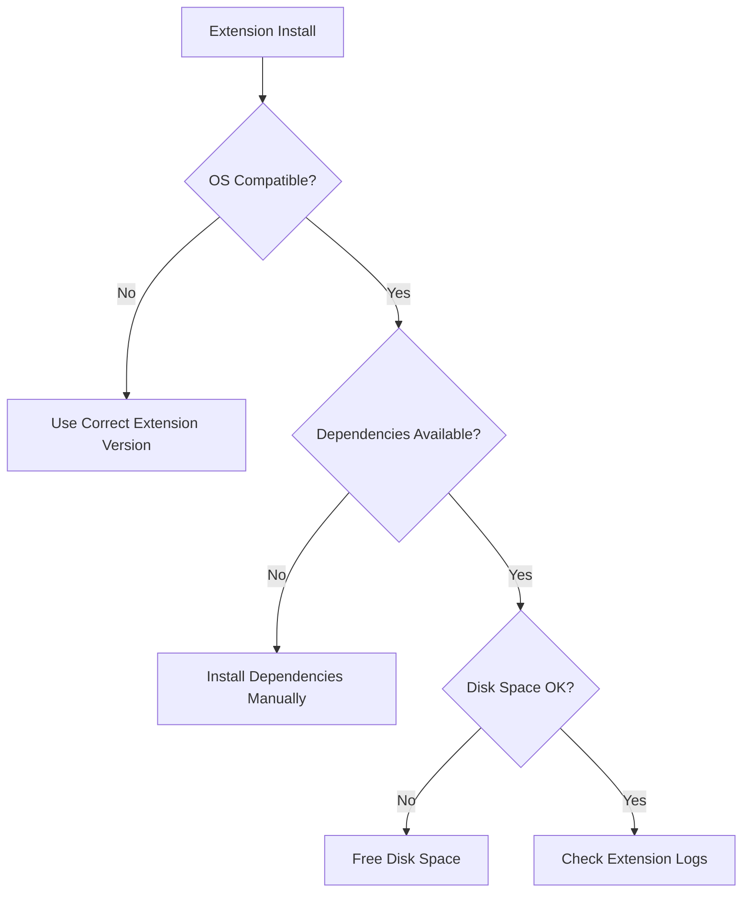

# How to Fix 'VM Extension' Installation Errors

Author: [nawazdhandala](https://www.github.com/nawazdhandala)

Tags: Azure, Virtual Machines, VM Extensions, DevOps, Troubleshooting, Automation, Cloud

Description: Learn how to diagnose and fix common Azure VM extension installation errors including timeout issues, dependency failures, and permission problems.

---

Azure VM extensions add configuration, monitoring, and management capabilities to virtual machines. However, extension installations can fail due to various reasons including network issues, permission problems, and dependency conflicts. This guide covers the most common VM extension errors and provides practical solutions.

## Understanding VM Extension Lifecycle

VM extensions go through several states during installation. Understanding this lifecycle helps with troubleshooting.



## Checking Extension Status

The first step in troubleshooting is to check the current extension status and error details.

```bash
# List all extensions on a VM with their status
az vm extension list \
  --resource-group myResourceGroup \
  --vm-name myVM \
  --query "[].{name:name, status:provisioningState, type:typePropertiesType}" \
  --output table

# Get detailed status for a specific extension
az vm extension show \
  --resource-group myResourceGroup \
  --vm-name myVM \
  --name CustomScriptExtension \
  --query "instanceView.statuses" \
  --output json

# View extension logs from within the VM (Linux)
# Extensions store logs in /var/log/azure/
sudo ls -la /var/log/azure/
sudo cat /var/log/azure/custom-script/handler.log
```

## Error 1: Extension Download Timeout

Download timeouts occur when the VM cannot reach Azure storage or the extension package URL.

### Symptoms

```json
{
  "code": "VMExtensionProvisioningError",
  "message": "VM Extension provisioning error: The extension download timed out"
}
```

### Diagnosis and Fix



**Check and fix network connectivity:**

```bash
# From within the VM, test connectivity to Azure endpoints
# These URLs must be accessible for extensions to work
curl -v https://management.azure.com
curl -v https://packages.microsoft.com
curl -v https://azureedge.net

# Check NSG rules that might block outbound traffic
az network nsg rule list \
  --resource-group myResourceGroup \
  --nsg-name myNSG \
  --query "[?direction=='Outbound']" \
  --output table

# Add outbound rule to allow Azure services
az network nsg rule create \
  --resource-group myResourceGroup \
  --nsg-name myNSG \
  --name AllowAzureOutbound \
  --priority 100 \
  --direction Outbound \
  --access Allow \
  --protocol Tcp \
  --destination-port-ranges 443 \
  --destination-address-prefixes AzureCloud
```

**Configure proxy settings if required:**

```bash
# Set proxy environment variables for the VM agent (Linux)
sudo mkdir -p /etc/systemd/system/waagent.service.d
sudo tee /etc/systemd/system/waagent.service.d/proxy.conf << EOF
[Service]
Environment="http_proxy=http://proxy.example.com:8080"
Environment="https_proxy=http://proxy.example.com:8080"
Environment="no_proxy=169.254.169.254,localhost"
EOF

sudo systemctl daemon-reload
sudo systemctl restart waagent
```

## Error 2: Custom Script Extension Failures

Custom Script Extension is one of the most commonly used extensions and has specific error patterns.

### Exit Code Errors

```json
{
  "code": "VMExtensionHandlerNonTransientError",
  "message": "Handler 'Microsoft.Azure.Extensions.CustomScript' failed with exit code 1"
}
```

**Debug script execution:**

```bash
# View Custom Script Extension logs (Linux)
sudo cat /var/log/azure/custom-script/handler.log
sudo cat /var/lib/waagent/custom-script/download/0/stderr
sudo cat /var/lib/waagent/custom-script/download/0/stdout

# View Custom Script Extension logs (Windows)
# Check: C:\Packages\Plugins\Microsoft.Compute.CustomScriptExtension\
# Logs are in the status folder
```

**Fix common script issues:**

```bash
# Example: Install extension with proper error handling
az vm extension set \
  --resource-group myResourceGroup \
  --vm-name myVM \
  --name CustomScript \
  --publisher Microsoft.Azure.Extensions \
  --version 2.1 \
  --settings '{
    "fileUris": ["https://mystorageaccount.blob.core.windows.net/scripts/install.sh"],
    "commandToExecute": "bash install.sh 2>&1 | tee /var/log/custom-script-output.log"
  }' \
  --protected-settings '{
    "storageAccountName": "mystorageaccount",
    "storageAccountKey": "your-storage-key"
  }'
```

**Script best practices:**

```bash
#!/bin/bash
# install.sh - Robust installation script for Custom Script Extension

# Exit on any error, treat unset variables as errors
set -e
set -u

# Log all output for debugging
exec > >(tee -a /var/log/custom-script-install.log) 2>&1
echo "Starting installation at $(date)"

# Function to handle errors
error_exit() {
    echo "Error: $1" >&2
    exit 1
}

# Check if running as root
if [[ $EUID -ne 0 ]]; then
    error_exit "This script must be run as root"
fi

# Update package lists with retry
for i in {1..3}; do
    apt-get update && break
    echo "Retry $i: apt-get update failed"
    sleep 10
done || error_exit "Failed to update package lists after 3 attempts"

# Install required packages
apt-get install -y nginx || error_exit "Failed to install nginx"

# Start service
systemctl enable nginx
systemctl start nginx || error_exit "Failed to start nginx"

echo "Installation completed successfully at $(date)"
exit 0
```

## Error 3: VM Agent Issues

Many extension failures stem from problems with the Azure VM Agent.

### Symptoms

```json
{
  "code": "VMAgentStatusCommunicationError",
  "message": "VM Agent is not reporting ready status"
}
```

**Check and repair VM Agent:**

```bash
# Check VM Agent status (Linux)
sudo systemctl status waagent
sudo waagent -version

# Check VM Agent status (Windows)
# Run in PowerShell
Get-Service WindowsAzureGuestAgent

# Restart the VM Agent (Linux)
sudo systemctl restart waagent

# View agent logs
sudo tail -100 /var/log/waagent.log

# Reinstall VM Agent if corrupted (Linux - Ubuntu/Debian)
sudo apt-get update
sudo apt-get install --reinstall waagent

# Reinstall VM Agent (Linux - RHEL/CentOS)
sudo yum reinstall WALinuxAgent
```

**Fix common agent issues:**

```bash
# Ensure agent is enabled in VM configuration
az vm update \
  --resource-group myResourceGroup \
  --name myVM \
  --set osProfile.linuxConfiguration.provisionVMAgent=true

# Reset the VM Agent to factory state
sudo waagent -deprovision+user -force

# Then redeploy or restart the VM
az vm restart \
  --resource-group myResourceGroup \
  --name myVM
```

## Error 4: Extension Conflicts

Multiple extensions or extension versions can conflict with each other.

### Diagnosis

```bash
# List all installed extensions with versions
az vm extension list \
  --resource-group myResourceGroup \
  --vm-name myVM \
  --query "[].{name:name, publisher:publisher, version:typeHandlerVersion}" \
  --output table

# Check for multiple versions of same extension
ls -la /var/lib/waagent/ | grep -i "Microsoft"
```

**Resolve conflicts by removing and reinstalling:**

```bash
# Remove conflicting extension
az vm extension delete \
  --resource-group myResourceGroup \
  --vm-name myVM \
  --name OldExtension

# Wait for removal to complete
az vm extension wait \
  --resource-group myResourceGroup \
  --vm-name myVM \
  --name OldExtension \
  --deleted

# Install the correct version
az vm extension set \
  --resource-group myResourceGroup \
  --vm-name myVM \
  --name NewExtension \
  --publisher Microsoft.Azure.Extensions \
  --version 2.1
```

## Error 5: Dependency Installation Failures

Extensions that require specific dependencies may fail if those dependencies cannot be installed.



**Pre-install dependencies:**

```bash
# For monitoring extensions, install required packages first
# Linux (Ubuntu/Debian)
sudo apt-get update
sudo apt-get install -y \
  python3 \
  python3-pip \
  ca-certificates \
  curl

# For Azure Monitor Agent specifically
sudo apt-get install -y \
  auditd \
  rsyslog

# Then install the extension
az vm extension set \
  --resource-group myResourceGroup \
  --vm-name myVM \
  --name AzureMonitorLinuxAgent \
  --publisher Microsoft.Azure.Monitor \
  --version 1.0
```

## Error 6: Permission and Authentication Issues

Extensions may fail due to insufficient permissions or authentication problems.

### Managed Identity Issues

```bash
# Enable system-assigned managed identity
az vm identity assign \
  --resource-group myResourceGroup \
  --name myVM

# Grant the identity required permissions
# Example: Storage Blob Data Reader for accessing script files
az role assignment create \
  --assignee $(az vm show --resource-group myResourceGroup --name myVM --query identity.principalId -o tsv) \
  --role "Storage Blob Data Reader" \
  --scope /subscriptions/{sub-id}/resourceGroups/myResourceGroup/providers/Microsoft.Storage/storageAccounts/mystorageaccount
```

### SAS Token Issues

```bash
# Generate a SAS token with proper permissions and expiry
az storage blob generate-sas \
  --account-name mystorageaccount \
  --container-name scripts \
  --name install.sh \
  --permissions r \
  --expiry $(date -u -d "1 day" '+%Y-%m-%dT%H:%MZ') \
  --output tsv

# Use the SAS token in extension settings
az vm extension set \
  --resource-group myResourceGroup \
  --vm-name myVM \
  --name CustomScript \
  --publisher Microsoft.Azure.Extensions \
  --settings '{
    "fileUris": ["https://mystorageaccount.blob.core.windows.net/scripts/install.sh?sv=2021-06-08&se=...&sp=r&sig=..."]
  }' \
  --protected-settings '{
    "commandToExecute": "bash install.sh"
  }'
```

## Error 7: Timeout During Long Operations

Extensions have default timeouts that may not be sufficient for complex operations.

**Handle long-running installations:**

```bash
# Use background execution for long operations
az vm extension set \
  --resource-group myResourceGroup \
  --vm-name myVM \
  --name CustomScript \
  --publisher Microsoft.Azure.Extensions \
  --settings '{
    "commandToExecute": "nohup bash /var/lib/waagent/custom-script/download/0/long-install.sh > /var/log/long-install.log 2>&1 &"
  }'
```

**Script with progress tracking:**

```bash
#!/bin/bash
# long-install.sh - Handle long-running installations

PROGRESS_FILE="/var/log/install-progress.txt"
LOCK_FILE="/var/run/long-install.lock"

# Prevent multiple executions
if [ -f "$LOCK_FILE" ]; then
    echo "Installation already in progress"
    exit 0
fi
touch "$LOCK_FILE"

# Cleanup on exit
cleanup() {
    rm -f "$LOCK_FILE"
}
trap cleanup EXIT

echo "Starting installation" > "$PROGRESS_FILE"

# Stage 1: Download
echo "Stage 1: Downloading packages" >> "$PROGRESS_FILE"
wget -q https://example.com/large-package.tar.gz -O /tmp/package.tar.gz

# Stage 2: Extract
echo "Stage 2: Extracting" >> "$PROGRESS_FILE"
tar xzf /tmp/package.tar.gz -C /opt/

# Stage 3: Configure
echo "Stage 3: Configuring" >> "$PROGRESS_FILE"
/opt/package/configure.sh

# Stage 4: Complete
echo "Installation complete" >> "$PROGRESS_FILE"
```

## Extension Recovery Procedures

When extensions are stuck or corrupted, follow these recovery steps.

```bash
# Force remove a stuck extension
az vm extension delete \
  --resource-group myResourceGroup \
  --vm-name myVM \
  --name StuckExtension \
  --force-deletion

# Clean up extension state on the VM (Linux)
sudo rm -rf /var/lib/waagent/Microsoft.*Extension*
sudo systemctl restart waagent

# Reset all extensions by redeploying the VM
az vm redeploy \
  --resource-group myResourceGroup \
  --name myVM
```

## Best Practices for Extension Management

1. **Test extensions in non-production first** - Always validate extension behavior in a test environment.

2. **Use version pinning** - Specify exact versions to avoid unexpected updates.

```bash
# Pin to specific version
az vm extension set \
  --resource-group myResourceGroup \
  --vm-name myVM \
  --name CustomScript \
  --publisher Microsoft.Azure.Extensions \
  --version 2.1 \
  --no-auto-upgrade-minor-version
```

3. **Implement idempotent scripts** - Scripts should be safe to run multiple times.

4. **Monitor extension health** - Set up alerts for extension failures.

```bash
# Create alert rule for extension failures
az monitor metrics alert create \
  --name ExtensionFailureAlert \
  --resource-group myResourceGroup \
  --scopes /subscriptions/{sub-id}/resourceGroups/myResourceGroup/providers/Microsoft.Compute/virtualMachines/myVM \
  --condition "count VMExtensionStatusCode < 0" \
  --description "Alert when VM extension fails"
```

5. **Use protected settings for secrets** - Never put sensitive data in plain settings.

```bash
# Correct: Use protected-settings for secrets
az vm extension set \
  --resource-group myResourceGroup \
  --vm-name myVM \
  --name CustomScript \
  --publisher Microsoft.Azure.Extensions \
  --settings '{"fileUris": ["https://example.com/script.sh"]}' \
  --protected-settings '{"commandToExecute": "bash script.sh --password=secret123"}'
```

## Summary

Azure VM extension errors typically fall into categories: network connectivity, agent issues, script failures, permissions, and timeouts. By systematically checking extension status, reviewing logs, and addressing the specific error type, you can resolve most extension installation failures. Always test extensions in non-production environments first, use version pinning for stability, and implement proper error handling in custom scripts. With proper monitoring and alerting, you can catch and resolve extension issues before they impact your workloads.
