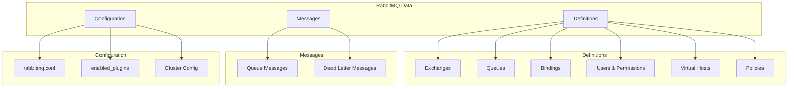
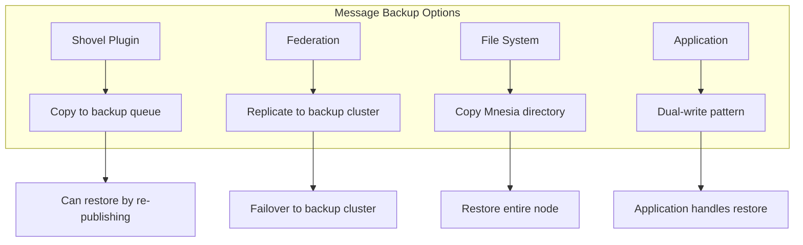
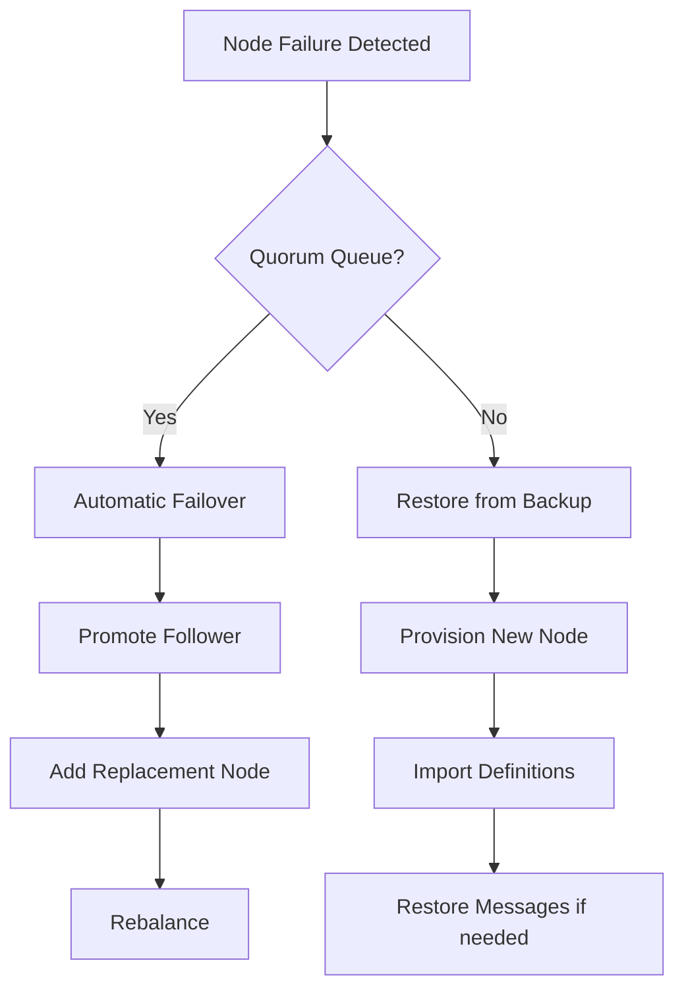
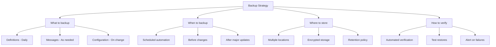

# How to Backup and Restore RabbitMQ

Author: [nawazdhandala](https://www.github.com/nawazdhandala)

Tags: RabbitMQ, Backup, Restore, Disaster Recovery, Message Queue, DevOps, High Availability, Data Management

Description: A practical guide to backing up and restoring RabbitMQ configurations, definitions, and messages for disaster recovery and migration scenarios.

---

> Proper backup and restore procedures are essential for maintaining RabbitMQ reliability and enabling disaster recovery. This guide covers backing up definitions (exchanges, queues, bindings), message data, and cluster configurations with practical scripts for automation.

RabbitMQ stores different types of data that require different backup strategies: definitions (metadata about queues, exchanges, users) and messages (the actual data in queues). Understanding what to back up and when is critical for effective disaster recovery.

---

## What to Back Up



### Data Location Reference

| Data Type | Default Location | Backup Method |
|-----------|-----------------|---------------|
| Definitions | Mnesia database | Export via API |
| Messages | Mnesia + disk | Shovel or file copy |
| Configuration | /etc/rabbitmq/ | File copy |
| Logs | /var/log/rabbitmq/ | File copy (optional) |

---

## Backing Up Definitions

### Using the Management API

```bash
# Export all definitions (exchanges, queues, bindings, users, vhosts, policies)
curl -u admin:password \
    http://localhost:15672/api/definitions \
    -o rabbitmq-definitions.json

# Export definitions for a specific vhost
curl -u admin:password \
    "http://localhost:15672/api/definitions/%2F" \
    -o rabbitmq-vhost-definitions.json

# Using rabbitmqadmin
rabbitmqadmin export rabbitmq-definitions.json
```

### Using rabbitmqctl

```bash
# Export definitions using rabbitmqctl
rabbitmqctl export_definitions /backup/definitions.json

# Export with specific format
rabbitmqctl export_definitions /backup/definitions.json --format=json
```

### Automated Backup Script

```python
#!/usr/bin/env python3
"""
RabbitMQ Definitions Backup Script
Backs up definitions and rotates old backups
"""

import requests
import json
import os
import shutil
from datetime import datetime
import gzip
import logging

logging.basicConfig(level=logging.INFO)
logger = logging.getLogger(__name__)

class RabbitMQBackup:
    def __init__(self, host, port, username, password, backup_dir):
        self.base_url = f"http://{host}:{port}/api"
        self.auth = (username, password)
        self.backup_dir = backup_dir

        # Ensure backup directory exists
        os.makedirs(backup_dir, exist_ok=True)

    def export_definitions(self):
        """Export all definitions from RabbitMQ"""
        try:
            response = requests.get(
                f"{self.base_url}/definitions",
                auth=self.auth,
                timeout=30
            )
            response.raise_for_status()
            return response.json()
        except requests.RequestException as e:
            logger.error(f"Failed to export definitions: {e}")
            raise

    def save_backup(self, definitions, compress=True):
        """Save definitions to backup file"""
        timestamp = datetime.now().strftime("%Y%m%d_%H%M%S")

        if compress:
            filename = f"rabbitmq_definitions_{timestamp}.json.gz"
            filepath = os.path.join(self.backup_dir, filename)

            with gzip.open(filepath, 'wt', encoding='utf-8') as f:
                json.dump(definitions, f, indent=2)
        else:
            filename = f"rabbitmq_definitions_{timestamp}.json"
            filepath = os.path.join(self.backup_dir, filename)

            with open(filepath, 'w') as f:
                json.dump(definitions, f, indent=2)

        logger.info(f"Backup saved to {filepath}")
        return filepath

    def rotate_backups(self, keep_count=7):
        """Remove old backups, keeping only the most recent ones"""
        backups = sorted([
            f for f in os.listdir(self.backup_dir)
            if f.startswith('rabbitmq_definitions_')
        ], reverse=True)

        for old_backup in backups[keep_count:]:
            filepath = os.path.join(self.backup_dir, old_backup)
            os.remove(filepath)
            logger.info(f"Removed old backup: {old_backup}")

    def verify_backup(self, filepath):
        """Verify backup file is valid JSON"""
        try:
            if filepath.endswith('.gz'):
                with gzip.open(filepath, 'rt') as f:
                    data = json.load(f)
            else:
                with open(filepath, 'r') as f:
                    data = json.load(f)

            # Basic validation
            required_keys = ['rabbit_version', 'users', 'vhosts', 'queues']
            for key in required_keys:
                if key not in data:
                    raise ValueError(f"Missing required key: {key}")

            logger.info(f"Backup verified: {len(data.get('queues', []))} queues, "
                       f"{len(data.get('exchanges', []))} exchanges")
            return True

        except (json.JSONDecodeError, ValueError) as e:
            logger.error(f"Backup verification failed: {e}")
            return False

    def run_backup(self, rotate=True, keep_count=7):
        """Run complete backup process"""
        logger.info("Starting RabbitMQ definitions backup...")

        # Export definitions
        definitions = self.export_definitions()

        # Save backup
        filepath = self.save_backup(definitions)

        # Verify backup
        if not self.verify_backup(filepath):
            raise Exception("Backup verification failed")

        # Rotate old backups
        if rotate:
            self.rotate_backups(keep_count)

        logger.info("Backup completed successfully")
        return filepath

if __name__ == '__main__':
    backup = RabbitMQBackup(
        host='localhost',
        port=15672,
        username='admin',
        password='admin',
        backup_dir='/backup/rabbitmq'
    )

    backup.run_backup(rotate=True, keep_count=7)
```

---

## Backing Up Messages

### Understanding Message Backup Challenges



### Using Shovel for Message Backup

```bash
# Enable shovel plugin
rabbitmq-plugins enable rabbitmq_shovel
rabbitmq-plugins enable rabbitmq_shovel_management
```

```python
import pika
import json

def setup_backup_shovel(source_queue, backup_queue):
    """Configure shovel to copy messages to backup queue"""

    connection = pika.BlockingConnection(
        pika.ConnectionParameters('localhost')
    )
    channel = connection.channel()

    # Create backup queue
    channel.queue_declare(
        queue=backup_queue,
        durable=True,
        arguments={
            'x-queue-type': 'quorum',  # Use quorum for reliability
            'x-max-length': 1000000     # Limit backup size
        }
    )

    # Shovel configuration via HTTP API
    import requests

    shovel_config = {
        "value": {
            "src-protocol": "amqp091",
            "src-uri": "amqp://localhost",
            "src-queue": source_queue,
            "dest-protocol": "amqp091",
            "dest-uri": "amqp://localhost",
            "dest-queue": backup_queue,
            "ack-mode": "on-confirm",
            "reconnect-delay": 5
        }
    }

    response = requests.put(
        f"http://localhost:15672/api/parameters/shovel/%2F/{source_queue}-backup",
        auth=('admin', 'admin'),
        json=shovel_config
    )

    print(f"Shovel configured: {response.status_code}")
    connection.close()

# Create backup shovel for critical queues
setup_backup_shovel('orders-queue', 'orders-queue-backup')
```

### File System Backup

```bash
#!/bin/bash
# File system backup script for RabbitMQ
# WARNING: Requires stopping the node for consistent backup

set -e

BACKUP_DIR="/backup/rabbitmq/$(date +%Y%m%d_%H%M%S)"
MNESIA_DIR="/var/lib/rabbitmq/mnesia"
CONFIG_DIR="/etc/rabbitmq"

# Create backup directory
mkdir -p "$BACKUP_DIR"

echo "Stopping RabbitMQ..."
rabbitmqctl stop_app

echo "Backing up Mnesia directory..."
cp -a "$MNESIA_DIR" "$BACKUP_DIR/mnesia"

echo "Backing up configuration..."
cp -a "$CONFIG_DIR" "$BACKUP_DIR/config"

echo "Starting RabbitMQ..."
rabbitmqctl start_app

echo "Compressing backup..."
tar -czf "${BACKUP_DIR}.tar.gz" -C "$(dirname $BACKUP_DIR)" "$(basename $BACKUP_DIR)"
rm -rf "$BACKUP_DIR"

echo "Backup completed: ${BACKUP_DIR}.tar.gz"
```

### Hot Backup with Quorum Queues

```bash
#!/bin/bash
# Hot backup for quorum queues (no downtime required)

BACKUP_DIR="/backup/rabbitmq/$(date +%Y%m%d_%H%M%S)"
mkdir -p "$BACKUP_DIR"

# Export definitions
rabbitmqctl export_definitions "${BACKUP_DIR}/definitions.json"

# For quorum queues, take a snapshot
# This triggers a Raft snapshot which can be used for backup
rabbitmqctl eval 'rabbit_quorum_queue:force_checkpoint_all().'

# Copy the quorum queue data
QUORUM_DIR="/var/lib/rabbitmq/mnesia/$(rabbitmqctl eval 'node().' | tr -d "'")/quorum"
if [ -d "$QUORUM_DIR" ]; then
    cp -a "$QUORUM_DIR" "$BACKUP_DIR/quorum"
fi

# Compress
tar -czf "${BACKUP_DIR}.tar.gz" -C "$(dirname $BACKUP_DIR)" "$(basename $BACKUP_DIR)"
rm -rf "$BACKUP_DIR"

echo "Backup completed: ${BACKUP_DIR}.tar.gz"
```

---

## Restoring RabbitMQ

### Restoring Definitions

```bash
# Restore definitions via Management API
curl -u admin:password \
    -X POST \
    -H "Content-Type: application/json" \
    --data @rabbitmq-definitions.json \
    http://localhost:15672/api/definitions

# Using rabbitmqctl
rabbitmqctl import_definitions /backup/definitions.json

# Using rabbitmqadmin
rabbitmqadmin import /backup/definitions.json
```

### Restore Script with Validation

```python
#!/usr/bin/env python3
"""
RabbitMQ Definitions Restore Script
Restores definitions with validation and rollback support
"""

import requests
import json
import gzip
import logging
from datetime import datetime

logging.basicConfig(level=logging.INFO)
logger = logging.getLogger(__name__)

class RabbitMQRestore:
    def __init__(self, host, port, username, password):
        self.base_url = f"http://{host}:{port}/api"
        self.auth = (username, password)

    def load_backup(self, filepath):
        """Load backup file"""
        if filepath.endswith('.gz'):
            with gzip.open(filepath, 'rt') as f:
                return json.load(f)
        else:
            with open(filepath, 'r') as f:
                return json.load(f)

    def get_current_definitions(self):
        """Export current definitions for rollback"""
        response = requests.get(
            f"{self.base_url}/definitions",
            auth=self.auth
        )
        response.raise_for_status()
        return response.json()

    def restore_definitions(self, definitions):
        """Restore definitions to RabbitMQ"""
        response = requests.post(
            f"{self.base_url}/definitions",
            auth=self.auth,
            json=definitions,
            headers={'Content-Type': 'application/json'}
        )
        response.raise_for_status()
        return response

    def validate_restore(self, expected_definitions):
        """Validate that restore was successful"""
        current = self.get_current_definitions()

        # Check key counts
        checks = {
            'queues': len(expected_definitions.get('queues', [])),
            'exchanges': len(expected_definitions.get('exchanges', [])),
            'bindings': len(expected_definitions.get('bindings', [])),
            'users': len(expected_definitions.get('users', [])),
        }

        for key, expected_count in checks.items():
            actual_count = len(current.get(key, []))
            if actual_count < expected_count:
                logger.warning(f"{key}: expected {expected_count}, got {actual_count}")
                return False

        return True

    def run_restore(self, backup_filepath, create_rollback=True):
        """Run complete restore process"""
        logger.info(f"Starting restore from {backup_filepath}")

        # Load backup
        definitions = self.load_backup(backup_filepath)
        logger.info(f"Loaded backup: {len(definitions.get('queues', []))} queues, "
                   f"{len(definitions.get('exchanges', []))} exchanges")

        # Create rollback point
        if create_rollback:
            rollback = self.get_current_definitions()
            rollback_file = f"rollback_{datetime.now().strftime('%Y%m%d_%H%M%S')}.json"
            with open(rollback_file, 'w') as f:
                json.dump(rollback, f)
            logger.info(f"Rollback point saved to {rollback_file}")

        # Restore definitions
        try:
            self.restore_definitions(definitions)
            logger.info("Definitions restored")
        except Exception as e:
            logger.error(f"Restore failed: {e}")
            if create_rollback:
                logger.info("Attempting rollback...")
                self.restore_definitions(rollback)
            raise

        # Validate
        if self.validate_restore(definitions):
            logger.info("Restore validated successfully")
        else:
            logger.warning("Restore validation had warnings")

        return True

if __name__ == '__main__':
    import sys

    if len(sys.argv) < 2:
        print("Usage: restore.py <backup_file>")
        sys.exit(1)

    restore = RabbitMQRestore(
        host='localhost',
        port=15672,
        username='admin',
        password='admin'
    )

    restore.run_restore(sys.argv[1])
```

### Full System Restore

```bash
#!/bin/bash
# Complete RabbitMQ restore from file system backup

set -e

BACKUP_FILE="$1"
RESTORE_DIR="/tmp/rabbitmq_restore"

if [ -z "$BACKUP_FILE" ]; then
    echo "Usage: $0 <backup_file.tar.gz>"
    exit 1
fi

echo "Extracting backup..."
mkdir -p "$RESTORE_DIR"
tar -xzf "$BACKUP_FILE" -C "$RESTORE_DIR"

# Find the backup directory
BACKUP_DIR=$(ls -d ${RESTORE_DIR}/*/ | head -1)

echo "Stopping RabbitMQ..."
systemctl stop rabbitmq-server

echo "Backing up current state..."
mv /var/lib/rabbitmq/mnesia /var/lib/rabbitmq/mnesia.old.$(date +%s)

echo "Restoring Mnesia directory..."
cp -a "${BACKUP_DIR}mnesia" /var/lib/rabbitmq/mnesia
chown -R rabbitmq:rabbitmq /var/lib/rabbitmq/mnesia

echo "Restoring configuration..."
cp -a "${BACKUP_DIR}config/"* /etc/rabbitmq/

echo "Starting RabbitMQ..."
systemctl start rabbitmq-server

echo "Waiting for RabbitMQ to be ready..."
sleep 10

echo "Checking cluster status..."
rabbitmqctl cluster_status

echo "Restore completed!"

# Cleanup
rm -rf "$RESTORE_DIR"
```

---

## Disaster Recovery Scenarios

### Scenario 1: Single Node Failure



### Scenario 2: Complete Cluster Loss

```bash
#!/bin/bash
# Complete cluster recovery script

set -e

BACKUP_FILE="$1"
CLUSTER_NODES=("rabbit1" "rabbit2" "rabbit3")

# Step 1: Provision new nodes
echo "Provisioning new cluster nodes..."
for node in "${CLUSTER_NODES[@]}"; do
    echo "Setting up $node..."
    # Your provisioning logic here (Terraform, Ansible, etc.)
done

# Step 2: Install RabbitMQ on all nodes
echo "Installing RabbitMQ..."
for node in "${CLUSTER_NODES[@]}"; do
    ssh "$node" "apt-get update && apt-get install -y rabbitmq-server"
done

# Step 3: Form cluster
echo "Forming cluster..."
FIRST_NODE="${CLUSTER_NODES[0]}"

for node in "${CLUSTER_NODES[@]:1}"; do
    ssh "$node" "rabbitmqctl stop_app && \
                 rabbitmqctl reset && \
                 rabbitmqctl join_cluster rabbit@${FIRST_NODE} && \
                 rabbitmqctl start_app"
done

# Step 4: Restore definitions
echo "Restoring definitions..."
scp "$BACKUP_FILE" "${FIRST_NODE}:/tmp/definitions.json"
ssh "$FIRST_NODE" "rabbitmqctl import_definitions /tmp/definitions.json"

# Step 5: Verify
echo "Verifying cluster..."
ssh "$FIRST_NODE" "rabbitmqctl cluster_status"

echo "Recovery completed!"
```

### Scenario 3: Point-in-Time Recovery

```python
#!/usr/bin/env python3
"""
Point-in-time recovery using backup and message replay
"""

import json
import gzip
from datetime import datetime
import pika

class PointInTimeRecovery:
    def __init__(self, host='localhost'):
        self.connection = pika.BlockingConnection(
            pika.ConnectionParameters(host)
        )
        self.channel = self.connection.channel()

    def restore_definitions_to_point(self, backup_file, target_time):
        """Restore definitions, filtering out objects created after target_time"""

        # Load backup
        with gzip.open(backup_file, 'rt') as f:
            definitions = json.load(f)

        # Note: Standard definitions don't include timestamps
        # This is a simplified example - real implementation would need
        # additional metadata tracking

        # Filter queues (example with naming convention)
        filtered_queues = [
            q for q in definitions.get('queues', [])
            if not q['name'].startswith('temp_')
        ]
        definitions['queues'] = filtered_queues

        return definitions

    def replay_messages_from_backup(self, backup_queue, target_queue,
                                    start_time=None, end_time=None):
        """Replay messages from backup queue with optional time filtering"""

        # Declare queues
        self.channel.queue_declare(queue=target_queue, durable=True)

        messages_replayed = 0

        while True:
            method, properties, body = self.channel.basic_get(
                queue=backup_queue,
                auto_ack=False
            )

            if method is None:
                break

            # Check timestamp if filtering
            if properties.timestamp:
                msg_time = datetime.fromtimestamp(properties.timestamp)

                if start_time and msg_time < start_time:
                    self.channel.basic_ack(method.delivery_tag)
                    continue

                if end_time and msg_time > end_time:
                    self.channel.basic_ack(method.delivery_tag)
                    continue

            # Republish to target queue
            self.channel.basic_publish(
                exchange='',
                routing_key=target_queue,
                body=body,
                properties=properties
            )

            self.channel.basic_ack(method.delivery_tag)
            messages_replayed += 1

        print(f"Replayed {messages_replayed} messages")
        return messages_replayed

# Usage
recovery = PointInTimeRecovery()
recovery.replay_messages_from_backup(
    'orders-backup',
    'orders-queue',
    start_time=datetime(2024, 1, 1),
    end_time=datetime(2024, 1, 15)
)
```

---

## Backup Automation

### Cron-Based Backup

```bash
# /etc/cron.d/rabbitmq-backup

# Daily definitions backup at 2 AM
0 2 * * * root /usr/local/bin/rabbitmq-backup.sh definitions

# Weekly full backup on Sunday at 3 AM
0 3 * * 0 root /usr/local/bin/rabbitmq-backup.sh full

# Hourly definitions backup for critical systems
0 * * * * root /usr/local/bin/rabbitmq-backup.sh definitions-hourly
```

### Kubernetes CronJob

```yaml
apiVersion: batch/v1
kind: CronJob
metadata:
  name: rabbitmq-backup
  namespace: messaging
spec:
  schedule: "0 2 * * *"  # Daily at 2 AM
  jobTemplate:
    spec:
      template:
        spec:
          containers:
            - name: backup
              image: curlimages/curl:latest
              command:
                - /bin/sh
                - -c
                - |
                  curl -u ${RABBITMQ_USER}:${RABBITMQ_PASS} \
                    http://rabbitmq:15672/api/definitions \
                    -o /backup/definitions-$(date +%Y%m%d).json
              env:
                - name: RABBITMQ_USER
                  valueFrom:
                    secretKeyRef:
                      name: rabbitmq-credentials
                      key: username
                - name: RABBITMQ_PASS
                  valueFrom:
                    secretKeyRef:
                      name: rabbitmq-credentials
                      key: password
              volumeMounts:
                - name: backup-volume
                  mountPath: /backup
          volumes:
            - name: backup-volume
              persistentVolumeClaim:
                claimName: rabbitmq-backup-pvc
          restartPolicy: OnFailure
```

### Backup to S3

```python
#!/usr/bin/env python3
"""
RabbitMQ backup to S3 with encryption
"""

import boto3
import requests
import json
import gzip
from datetime import datetime
import os

class S3BackupManager:
    def __init__(self, bucket_name, rabbitmq_url, rabbitmq_auth):
        self.s3 = boto3.client('s3')
        self.bucket = bucket_name
        self.rabbitmq_url = rabbitmq_url
        self.rabbitmq_auth = rabbitmq_auth

    def backup_to_s3(self):
        """Export definitions and upload to S3"""

        # Export definitions
        response = requests.get(
            f"{self.rabbitmq_url}/api/definitions",
            auth=self.rabbitmq_auth
        )
        response.raise_for_status()
        definitions = response.json()

        # Compress
        compressed = gzip.compress(
            json.dumps(definitions).encode('utf-8')
        )

        # Upload to S3
        timestamp = datetime.now().strftime("%Y/%m/%d/%H%M%S")
        key = f"rabbitmq-backups/{timestamp}/definitions.json.gz"

        self.s3.put_object(
            Bucket=self.bucket,
            Key=key,
            Body=compressed,
            ServerSideEncryption='AES256',
            Metadata={
                'backup-type': 'definitions',
                'rabbitmq-version': definitions.get('rabbit_version', 'unknown'),
                'queue-count': str(len(definitions.get('queues', []))),
            }
        )

        print(f"Backup uploaded to s3://{self.bucket}/{key}")
        return key

    def restore_from_s3(self, key):
        """Download and restore from S3"""

        # Download from S3
        response = self.s3.get_object(Bucket=self.bucket, Key=key)
        compressed = response['Body'].read()

        # Decompress
        definitions = json.loads(gzip.decompress(compressed))

        # Restore
        response = requests.post(
            f"{self.rabbitmq_url}/api/definitions",
            auth=self.rabbitmq_auth,
            json=definitions
        )
        response.raise_for_status()

        print(f"Restored from s3://{self.bucket}/{key}")

    def list_backups(self, prefix='rabbitmq-backups/'):
        """List available backups"""

        paginator = self.s3.get_paginator('list_objects_v2')

        backups = []
        for page in paginator.paginate(Bucket=self.bucket, Prefix=prefix):
            for obj in page.get('Contents', []):
                backups.append({
                    'key': obj['Key'],
                    'size': obj['Size'],
                    'modified': obj['LastModified']
                })

        return sorted(backups, key=lambda x: x['modified'], reverse=True)

# Usage
backup_manager = S3BackupManager(
    bucket_name='my-backup-bucket',
    rabbitmq_url='http://localhost:15672',
    rabbitmq_auth=('admin', 'admin')
)

# Create backup
backup_manager.backup_to_s3()

# List backups
for backup in backup_manager.list_backups()[:5]:
    print(f"{backup['modified']}: {backup['key']}")
```

---

## Best Practices

### Backup Checklist



### Verification Script

```bash
#!/bin/bash
# Verify backup integrity

BACKUP_FILE="$1"

if [ -z "$BACKUP_FILE" ]; then
    echo "Usage: $0 <backup_file>"
    exit 1
fi

echo "Verifying backup: $BACKUP_FILE"

# Check file exists and is readable
if [ ! -r "$BACKUP_FILE" ]; then
    echo "ERROR: Cannot read backup file"
    exit 1
fi

# Decompress and validate JSON
if [[ "$BACKUP_FILE" == *.gz ]]; then
    CONTENT=$(zcat "$BACKUP_FILE")
else
    CONTENT=$(cat "$BACKUP_FILE")
fi

# Check JSON validity
echo "$CONTENT" | jq empty
if [ $? -ne 0 ]; then
    echo "ERROR: Invalid JSON"
    exit 1
fi

# Check required fields
QUEUES=$(echo "$CONTENT" | jq '.queues | length')
EXCHANGES=$(echo "$CONTENT" | jq '.exchanges | length')
USERS=$(echo "$CONTENT" | jq '.users | length')
VERSION=$(echo "$CONTENT" | jq -r '.rabbit_version')

echo "Backup verification passed:"
echo "  - RabbitMQ Version: $VERSION"
echo "  - Queues: $QUEUES"
echo "  - Exchanges: $EXCHANGES"
echo "  - Users: $USERS"
```

---

## Conclusion

A robust backup and restore strategy is essential for RabbitMQ reliability. By implementing automated backups, testing restore procedures regularly, and having clear disaster recovery runbooks, you can ensure your messaging infrastructure remains resilient.

Key takeaways:
- Back up definitions daily at minimum
- Use quorum queues for automatic message replication
- Test restore procedures regularly
- Store backups in multiple locations
- Automate and monitor your backup processes

---

*Need comprehensive monitoring for your RabbitMQ backup processes? [OneUptime](https://oneuptime.com) can alert you when backups fail and help track your disaster recovery metrics.*

**Related Reading:**
- [How to Configure RabbitMQ Quorum Queues](https://oneuptime.com/blog)
- [How to Monitor RabbitMQ with Prometheus](https://oneuptime.com/blog)
