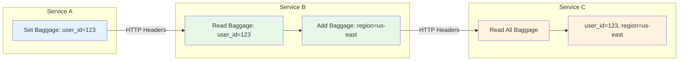
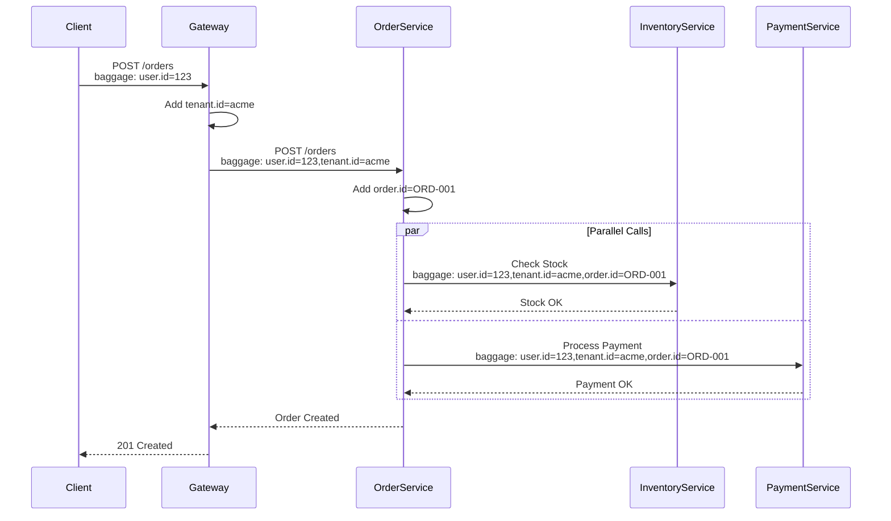
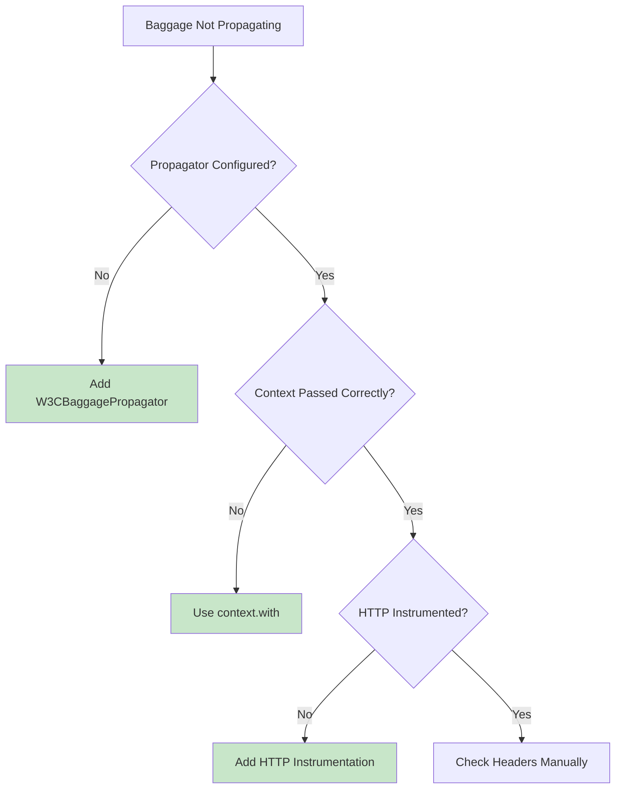

# How to Handle Baggage Propagation in OpenTelemetry

Author: [nawazdhandala](https://www.github.com/nawazdhandala)

Tags: OpenTelemetry, Baggage, Context Propagation, Distributed Tracing, Observability

Description: A comprehensive guide to using OpenTelemetry Baggage for propagating contextual data across service boundaries in distributed systems.

---

Baggage in OpenTelemetry is a powerful mechanism for propagating key-value pairs across service boundaries along with trace context. Unlike span attributes which are local to a single span, baggage travels with the request through your entire distributed system. This guide covers everything you need to know about implementing baggage propagation effectively.

## What is Baggage?

Baggage allows you to attach contextual information to a request that can be accessed by any service in the call chain. Common use cases include:

- Propagating user IDs or tenant IDs for multi-tenant systems
- Passing feature flags across services
- Sharing request metadata like client version or region
- Debugging with request-specific identifiers



## Setting Up Baggage Propagation

First, you need to configure your application to propagate baggage. This requires setting up the appropriate propagators.

```javascript
// setup.js - Configure OpenTelemetry with baggage propagation

const { NodeTracerProvider } = require('@opentelemetry/sdk-trace-node');
const { registerInstrumentations } = require('@opentelemetry/instrumentation');
const { HttpInstrumentation } = require('@opentelemetry/instrumentation-http');
const { ExpressInstrumentation } = require('@opentelemetry/instrumentation-express');
const {
  CompositePropagator,
  W3CTraceContextPropagator,
  W3CBaggagePropagator
} = require('@opentelemetry/core');
const { propagation, context } = require('@opentelemetry/api');

// Create a composite propagator that handles both trace context and baggage
// W3CTraceContextPropagator: Handles traceparent and tracestate headers
// W3CBaggagePropagator: Handles the baggage header
const propagator = new CompositePropagator({
  propagators: [
    new W3CTraceContextPropagator(),  // For trace context (traceparent header)
    new W3CBaggagePropagator()        // For baggage (baggage header)
  ]
});

// Register the propagator globally
// This tells OpenTelemetry to use these propagators for all context injection/extraction
propagation.setGlobalPropagator(propagator);

// Create and register the tracer provider
const provider = new NodeTracerProvider();
provider.register();

// Register instrumentations that will automatically propagate context
registerInstrumentations({
  instrumentations: [
    new HttpInstrumentation(),      // Auto-propagates on HTTP calls
    new ExpressInstrumentation()    // Extracts context from incoming requests
  ]
});

console.log('OpenTelemetry configured with baggage propagation');
```

## Working with Baggage

### Creating and Setting Baggage

```javascript
const { context, propagation, baggage } = require('@opentelemetry/api');

// Method 1: Create baggage with a single entry
function setBaggageSimple() {
  // Create a baggage entry with a key and value
  const userBaggage = propagation.createBaggage({
    'user.id': { value: '12345' }
  });

  // Set the baggage in the current context
  // This returns a new context with the baggage attached
  const ctxWithBaggage = propagation.setBaggage(context.active(), userBaggage);

  return ctxWithBaggage;
}

// Method 2: Create baggage with multiple entries and metadata
function setBaggageWithMetadata() {
  // Create baggage with multiple entries
  // Each entry can have optional metadata for additional context
  const requestBaggage = propagation.createBaggage({
    'user.id': { value: '12345' },
    'tenant.id': { value: 'acme-corp' },
    'feature.flags': {
      value: 'new-ui,beta-search',
      metadata: 'encoded=true'  // Optional metadata about the value
    },
    'request.priority': { value: 'high' }
  });

  return propagation.setBaggage(context.active(), requestBaggage);
}

// Method 3: Add to existing baggage
function addToBaggage(existingContext) {
  // Get current baggage from context
  const currentBaggage = propagation.getBaggage(existingContext);

  if (currentBaggage) {
    // Add a new entry to existing baggage
    // setEntry returns a new baggage instance (immutable)
    const updatedBaggage = currentBaggage.setEntry('new.key', {
      value: 'new-value'
    });

    return propagation.setBaggage(existingContext, updatedBaggage);
  }

  // If no existing baggage, create new
  const newBaggage = propagation.createBaggage({
    'new.key': { value: 'new-value' }
  });

  return propagation.setBaggage(existingContext, newBaggage);
}
```

### Reading Baggage

```javascript
const { context, propagation } = require('@opentelemetry/api');

// Read a specific baggage entry
function readBaggageEntry(key) {
  // Get baggage from the active context
  const currentBaggage = propagation.getBaggage(context.active());

  if (!currentBaggage) {
    console.log('No baggage found in current context');
    return null;
  }

  // Get a specific entry by key
  const entry = currentBaggage.getEntry(key);

  if (entry) {
    console.log(`Baggage entry: ${key} = ${entry.value}`);
    if (entry.metadata) {
      console.log(`  Metadata: ${entry.metadata}`);
    }
    return entry.value;
  }

  console.log(`No baggage entry found for key: ${key}`);
  return null;
}

// Read all baggage entries
function readAllBaggage() {
  const currentBaggage = propagation.getBaggage(context.active());

  if (!currentBaggage) {
    return {};
  }

  // getAllEntries returns an array of [key, BaggageEntry] pairs
  const entries = currentBaggage.getAllEntries();

  // Convert to a simple object for easier use
  const baggageObject = {};
  for (const [key, entry] of entries) {
    baggageObject[key] = entry.value;
  }

  console.log('All baggage entries:', baggageObject);
  return baggageObject;
}
```

### Removing Baggage Entries

```javascript
const { context, propagation } = require('@opentelemetry/api');

// Remove a specific baggage entry
function removeBaggageEntry(key) {
  const currentBaggage = propagation.getBaggage(context.active());

  if (!currentBaggage) {
    return context.active();
  }

  // removeEntry returns a new baggage without the specified key
  const updatedBaggage = currentBaggage.removeEntry(key);

  return propagation.setBaggage(context.active(), updatedBaggage);
}

// Clear all baggage
function clearAllBaggage() {
  // Create empty baggage
  const emptyBaggage = propagation.createBaggage({});

  return propagation.setBaggage(context.active(), emptyBaggage);
}
```

## Express.js Integration Example

Here is a complete example of using baggage in an Express.js application:

```javascript
// server.js - Express server with baggage propagation

const express = require('express');
const { context, propagation, trace } = require('@opentelemetry/api');

// Initialize OpenTelemetry first (see setup.js above)
require('./setup');

const app = express();
const tracer = trace.getTracer('baggage-example');

// Middleware to extract and log incoming baggage
app.use((req, res, next) => {
  // The HTTP instrumentation automatically extracts baggage from headers
  // into the active context, so we can read it directly
  const currentBaggage = propagation.getBaggage(context.active());

  if (currentBaggage) {
    const entries = currentBaggage.getAllEntries();
    console.log('Incoming baggage:');
    for (const [key, entry] of entries) {
      console.log(`  ${key}: ${entry.value}`);
    }
  }

  next();
});

// Middleware to add service-specific baggage
app.use((req, res, next) => {
  // Get current baggage or create new
  let currentBaggage = propagation.getBaggage(context.active())
    || propagation.createBaggage({});

  // Add this service's identifier to baggage
  currentBaggage = currentBaggage.setEntry('service.name', {
    value: 'order-service'
  });

  // Add processing timestamp
  currentBaggage = currentBaggage.setEntry('received.at', {
    value: new Date().toISOString()
  });

  // Create new context with updated baggage
  const newContext = propagation.setBaggage(context.active(), currentBaggage);

  // Run the rest of the request in the new context
  context.with(newContext, () => {
    next();
  });
});

// Route that uses baggage
app.post('/orders', async (req, res) => {
  return tracer.startActiveSpan('create-order', async (span) => {
    try {
      // Read user ID from baggage (set by upstream service or gateway)
      const userId = readBaggageValue('user.id');
      const tenantId = readBaggageValue('tenant.id');

      // Add baggage values as span attributes for searchability
      if (userId) span.setAttribute('user.id', userId);
      if (tenantId) span.setAttribute('tenant.id', tenantId);

      // Add order-specific baggage for downstream services
      const orderId = generateOrderId();
      const ctxWithOrder = addBaggageEntry('order.id', orderId);

      // Make downstream call with updated baggage
      await context.with(ctxWithOrder, async () => {
        await callInventoryService(orderId);
        await callPaymentService(orderId);
      });

      span.setStatus({ code: 0 });
      res.json({ orderId, status: 'created' });
    } catch (error) {
      span.recordException(error);
      span.setStatus({ code: 2, message: error.message });
      res.status(500).json({ error: error.message });
    } finally {
      span.end();
    }
  });
});

// Helper function to read baggage value
function readBaggageValue(key) {
  const baggage = propagation.getBaggage(context.active());
  const entry = baggage?.getEntry(key);
  return entry?.value;
}

// Helper function to add baggage entry
function addBaggageEntry(key, value) {
  let baggage = propagation.getBaggage(context.active())
    || propagation.createBaggage({});
  baggage = baggage.setEntry(key, { value });
  return propagation.setBaggage(context.active(), baggage);
}

function generateOrderId() {
  return `ORD-${Date.now()}-${Math.random().toString(36).substr(2, 9)}`;
}

app.listen(3000, () => {
  console.log('Server running on port 3000');
});
```

## Propagating Baggage in HTTP Clients

When making outbound HTTP requests, baggage is automatically propagated if you use instrumented HTTP clients:

```javascript
const { context, propagation } = require('@opentelemetry/api');
const http = require('http');

// With auto-instrumentation, baggage is automatically injected
// The HTTP instrumentation handles this for you
async function callServiceWithAutoInstrumentation() {
  // Baggage from current context is automatically added to headers
  const response = await fetch('http://downstream-service/api/data');
  return response.json();
}

// Manual propagation (if not using auto-instrumentation)
async function callServiceManually() {
  const headers = {};

  // Inject current context (including baggage) into headers
  // This adds both traceparent and baggage headers
  propagation.inject(context.active(), headers);

  console.log('Injected headers:', headers);
  // Output: { traceparent: '00-...', baggage: 'user.id=123,tenant.id=acme' }

  const response = await fetch('http://downstream-service/api/data', {
    headers
  });

  return response.json();
}
```

## Baggage Propagation Flow



## Best Practices

### 1. Keep Baggage Small

Baggage is transmitted with every request, so keep it minimal to avoid overhead.

```javascript
// GOOD: Small, essential data
const goodBaggage = propagation.createBaggage({
  'user.id': { value: '12345' },
  'tenant.id': { value: 'acme' }
});

// BAD: Large data that adds overhead
const badBaggage = propagation.createBaggage({
  'user.profile': { value: JSON.stringify(largeUserObject) },  // Too large!
  'permissions': { value: JSON.stringify(permissionsArray) }   // Too large!
});
```

### 2. Use Consistent Naming Conventions

```javascript
// Recommended naming pattern: category.attribute
const wellNamedBaggage = propagation.createBaggage({
  'user.id': { value: '12345' },
  'user.role': { value: 'admin' },
  'request.id': { value: 'req-abc123' },
  'feature.new-checkout': { value: 'enabled' }
});
```

### 3. Validate and Sanitize Baggage

```javascript
// Middleware to validate incoming baggage
function validateBaggage(req, res, next) {
  const baggage = propagation.getBaggage(context.active());

  if (baggage) {
    const entries = baggage.getAllEntries();

    for (const [key, entry] of entries) {
      // Check for maximum value length
      if (entry.value.length > 256) {
        console.warn(`Baggage value too long for key: ${key}`);
        // Optionally truncate or remove
      }

      // Validate expected keys have valid values
      if (key === 'user.id' && !/^\d+$/.test(entry.value)) {
        console.warn(`Invalid user.id in baggage: ${entry.value}`);
      }
    }
  }

  next();
}
```

### 4. Copy Baggage to Span Attributes When Needed

```javascript
// Copy relevant baggage to span attributes for querying
function copyBaggageToSpan(span) {
  const baggage = propagation.getBaggage(context.active());

  if (!baggage) return;

  // Define which baggage keys should become span attributes
  const keysToInclude = ['user.id', 'tenant.id', 'request.id'];

  for (const key of keysToInclude) {
    const entry = baggage.getEntry(key);
    if (entry) {
      // Prefix with baggage. to distinguish from regular attributes
      span.setAttribute(`baggage.${key}`, entry.value);
    }
  }
}
```

## Common Pitfalls and Solutions

### Pitfall 1: Baggage Not Propagating



### Pitfall 2: Losing Context in Async Operations

```javascript
// WRONG: Context is lost in setTimeout
app.get('/api/data', (req, res) => {
  const baggage = propagation.getBaggage(context.active());
  console.log('Before timeout:', baggage?.getEntry('user.id'));

  setTimeout(() => {
    // Context is lost here!
    const baggage = propagation.getBaggage(context.active());
    console.log('After timeout:', baggage?.getEntry('user.id'));  // undefined!
  }, 100);
});

// CORRECT: Capture and restore context
app.get('/api/data', (req, res) => {
  // Capture the current context
  const currentContext = context.active();

  setTimeout(() => {
    // Run the callback within the captured context
    context.with(currentContext, () => {
      const baggage = propagation.getBaggage(context.active());
      console.log('After timeout:', baggage?.getEntry('user.id'));  // Works!
    });
  }, 100);
});
```

## Summary

Baggage propagation in OpenTelemetry provides a powerful way to pass contextual information across service boundaries. By properly configuring propagators, setting and reading baggage correctly, and following best practices for size and naming, you can leverage baggage to improve observability and debugging in your distributed systems. Remember to keep baggage small, validate incoming values, and copy important baggage entries to span attributes when you need to query by those values.

**Related Reading:**

- [How to name spans in OpenTelemetry](https://oneuptime.com/blog/post/2024-11-04-how-to-name-spans-in-opentelemetry/view)
- [How to Fix "Span Not Exported" Issues](https://oneuptime.com/blog/post/2026-01-24-span-not-exported-issues/view)
- [What are Traces and Spans in OpenTelemetry](https://oneuptime.com/blog/post/2025-08-27-traces-and-spans-in-opentelemetry/view)
