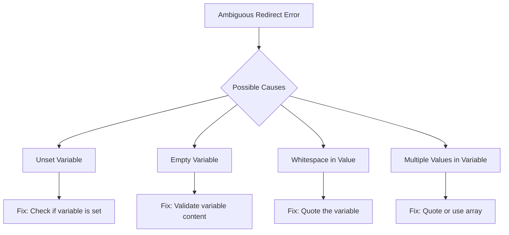

# How to Fix 'Ambiguous Redirect' Errors in Bash

Author: [nawazdhandala](https://www.github.com/nawazdhandala)

Tags: Bash, Shell Scripting, Debugging, Error Handling, DevOps

Description: Learn how to diagnose and fix the common 'ambiguous redirect' error in Bash scripts with practical examples and solutions.

---

The "ambiguous redirect" error is one of the most common and frustrating errors encountered when writing Bash scripts. This error occurs when Bash cannot determine where to redirect output or input.

## Understanding the Error

When you see an error message like:

```
bash: $filename: ambiguous redirect
```

It means Bash cannot determine the target of your redirection operation due to issues with variable expansion or whitespace in filenames.



## Common Causes and Solutions

### Cause 1: Unquoted Variable with Spaces

```bash
#!/bin/bash

# Problematic - variable contains spaces
filename="my log file.txt"
echo "Hello World" > $filename  # FAILS

# Fixed - quote the variable
echo "Hello World" > "$filename"  # WORKS
```

### Cause 2: Empty or Unset Variable

```bash
#!/bin/bash

# Problematic - variable is empty
echo "Data" > $output_file  # FAILS

# Fixed - set a default value
output_file="${output_file:-/tmp/default_output.txt}"
echo "Data" > "$output_file"  # WORKS

# Or check if variable is set
if [[ -n "$output_file" ]]; then
    echo "Data" > "$output_file"
else
    echo "Error: output_file is not set" >&2
    exit 1
fi
```

### Cause 3: Variable Contains Multiple Words

```bash
#!/bin/bash

# Problematic - multiple words
files="file1.txt file2.txt"
echo "content" > $files  # FAILS

# Fixed - use an array and loop
files=("file1.txt" "file2.txt")
for file in "${files[@]}"
do
    echo "content" > "$file"
done

# Or use tee for multiple files
echo "content" | tee file1.txt file2.txt > /dev/null
```

## Debugging Techniques

### Enable Debug Mode

```bash
#!/bin/bash

set -x  # Enable debug mode
filename="my file.txt"
echo "test" > $filename  # Shows expanded command
set +x  # Disable debug mode
```

### Validate Variables Before Use

```bash
#!/bin/bash

validate_redirect_target() {
    local target="$1"
    
    if [[ -z "$target" ]]; then
        echo "ERROR: Redirect target is empty" >&2
        return 1
    fi
    return 0
}

if validate_redirect_target "$output_file"; then
    echo "data" > "$output_file"
fi
```

## Safe Redirection Patterns

### Default Value Pattern

```bash
#!/bin/bash

log_file="${LOG_FILE:-/var/log/app.log}"
echo "Application started" >> "$log_file"
```

### Validation Pattern

```bash
#!/bin/bash

write_to_file() {
    local content="$1"
    local target="$2"

    if [[ -z "$target" ]]; then
        echo "Error: No target file specified" >&2
        return 1
    fi

    mkdir -p "$(dirname "$target")"
    echo "$content" > "$target"
}

write_to_file "Hello World" "$output_file"
```

## Quick Reference

| Problem | Solution |
|---------|----------|
| Spaces in filename | Quote the variable: `"$filename"` |
| Empty variable | Use default: `"${var:-default}"` |
| Unset variable | Check first: `[[ -n "$var" ]]` |
| Multiple words | Use array or loop |
| Command substitution | Quote: `"$(command)"` |

## Conclusion

The "ambiguous redirect" error is almost always caused by improper variable handling. Always quote your variables, validate before using, use default values, and enable `set -u` to catch unset variables early.
