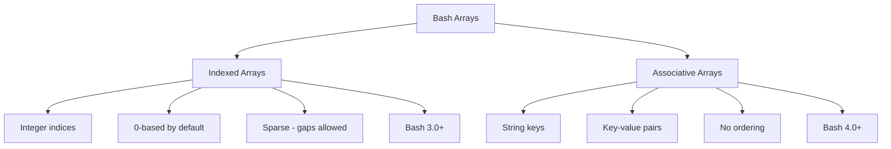
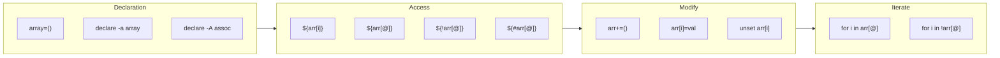

# How to Handle Arrays in Bash Scripts

Author: [nawazdhandala](https://www.github.com/nawazdhandala)

Tags: Bash, Shell Scripting, Arrays, Linux, DevOps, Automation, Data Structures

Description: A complete guide to working with indexed and associative arrays in Bash scripts, covering declaration, manipulation, iteration, and practical use cases.

---

> Arrays are essential data structures in Bash scripting that allow you to store and manipulate collections of values. While Bash arrays are not as feature-rich as arrays in other languages, they are powerful enough for most shell scripting tasks.

This guide covers both indexed arrays (Bash 3.0+) and associative arrays (Bash 4.0+), with practical examples for real-world use cases.

---

## Array Types in Bash



---

## Indexed Arrays

### Declaration and Initialization

```bash
#!/bin/bash
# Multiple ways to declare indexed arrays

# Method 1: Direct assignment with ()
fruits=("apple" "banana" "cherry" "date")

# Method 2: Declare explicitly
declare -a vegetables
vegetables=("carrot" "broccoli" "spinach")

# Method 3: Assign elements individually
colors[0]="red"
colors[1]="green"
colors[2]="blue"

# Method 4: Using indices (can be sparse)
sparse[0]="first"
sparse[5]="sixth"
sparse[10]="eleventh"

# Method 5: From command output
files=($(ls *.txt 2>/dev/null))

# Method 6: Using read command
IFS=',' read -ra csv_data <<< "value1,value2,value3"

# Method 7: Append to existing array
fruits+=("elderberry")
fruits+=("fig" "grape")

# Verify contents
echo "Fruits: ${fruits[@]}"
echo "Number of fruits: ${#fruits[@]}"
```

### Accessing Array Elements

```bash
#!/bin/bash
# Accessing elements in indexed arrays

fruits=("apple" "banana" "cherry" "date" "elderberry")

# Access single element by index
echo "First fruit: ${fruits[0]}"    # apple
echo "Third fruit: ${fruits[2]}"    # cherry

# Access last element
echo "Last fruit: ${fruits[-1]}"    # elderberry (Bash 4.3+)
echo "Last fruit: ${fruits[${#fruits[@]}-1]}"  # Works in older Bash

# Access all elements
echo "All fruits: ${fruits[@]}"     # apple banana cherry date elderberry
echo "All fruits: ${fruits[*]}"     # apple banana cherry date elderberry

# Difference between @ and * in quotes
# "@" preserves element boundaries
for fruit in "${fruits[@]}"; do
    echo "Fruit: $fruit"
done

# "*" joins all elements with first char of IFS
IFS=","
echo "CSV: ${fruits[*]}"  # apple,banana,cherry,date,elderberry

# Access range of elements (slicing)
echo "Elements 1-3: ${fruits[@]:1:3}"  # banana cherry date

# Access from index to end
echo "From index 2: ${fruits[@]:2}"    # cherry date elderberry

# Get array length
echo "Array length: ${#fruits[@]}"     # 5

# Get length of specific element
echo "Length of first: ${#fruits[0]}"  # 5 (apple)

# Get all indices
echo "Indices: ${!fruits[@]}"          # 0 1 2 3 4
```

### Modifying Arrays

```bash
#!/bin/bash
# Modifying indexed arrays

fruits=("apple" "banana" "cherry")

# Change an element
fruits[1]="blueberry"
echo "${fruits[@]}"  # apple blueberry cherry

# Append elements
fruits+=("date")
fruits+=("elderberry" "fig")
echo "${fruits[@]}"  # apple blueberry cherry date elderberry fig

# Insert at specific position (requires rebuilding)
insert_at() {
    local -n arr=$1
    local index=$2
    local value=$3
    arr=("${arr[@]:0:index}" "$value" "${arr[@]:index}")
}

numbers=(1 2 4 5)
insert_at numbers 2 3
echo "${numbers[@]}"  # 1 2 3 4 5

# Remove element by index
unset 'fruits[2]'
echo "${fruits[@]}"  # apple blueberry date elderberry fig
# Note: This leaves a gap, indices don't renumber

# Remove and reindex
fruits=("${fruits[@]}")  # Reindex after unset

# Remove by value
remove_value() {
    local -n arr=$1
    local value=$2
    local new_arr=()
    for item in "${arr[@]}"; do
        [[ "$item" != "$value" ]] && new_arr+=("$item")
    done
    arr=("${new_arr[@]}")
}

colors=("red" "green" "blue" "green" "yellow")
remove_value colors "green"
echo "${colors[@]}"  # red blue yellow

# Clear entire array
unset fruits
# Or
fruits=()
```

---

## Associative Arrays

### Declaration and Initialization

```bash
#!/bin/bash
# Associative arrays require Bash 4.0+
# Must be declared with -A

# Method 1: Declare and assign separately
declare -A user
user[name]="John"
user[email]="john@example.com"
user[role]="admin"

# Method 2: Declare and initialize together
declare -A config=(
    [host]="localhost"
    [port]="8080"
    [debug]="true"
)

# Method 3: Add elements one at a time
declare -A counts
counts[errors]=0
counts[warnings]=5
counts[info]=100

# Verify
echo "User name: ${user[name]}"
echo "Config host: ${config[host]}"
```

### Accessing Associative Arrays

```bash
#!/bin/bash
# Working with associative arrays

declare -A server=(
    [hostname]="web-server-01"
    [ip]="192.168.1.100"
    [port]="443"
    [status]="running"
)

# Access single element
echo "Hostname: ${server[hostname]}"
echo "IP: ${server[ip]}"

# Access all values
echo "All values: ${server[@]}"

# Access all keys
echo "All keys: ${!server[@]}"

# Get number of elements
echo "Element count: ${#server[@]}"

# Check if key exists
if [[ -v server[hostname] ]]; then
    echo "hostname key exists"
fi

# Alternative key existence check
if [[ ${server[nonexistent]+isset} ]]; then
    echo "Key exists"
else
    echo "Key does not exist"
fi

# Iterate over keys
for key in "${!server[@]}"; do
    echo "$key = ${server[$key]}"
done
```

### Modifying Associative Arrays

```bash
#!/bin/bash
# Modifying associative arrays

declare -A settings=(
    [theme]="dark"
    [language]="en"
    [notifications]="on"
)

# Update value
settings[theme]="light"

# Add new key
settings[font_size]="14"

# Remove key
unset 'settings[notifications]'

# Merge with another array (Bash doesn't have native merge)
merge_assoc() {
    local -n target=$1
    local -n source=$2
    for key in "${!source[@]}"; do
        target[$key]="${source[$key]}"
    done
}

declare -A defaults=(
    [timeout]="30"
    [retries]="3"
)

merge_assoc settings defaults
for key in "${!settings[@]}"; do
    echo "$key = ${settings[$key]}"
done

# Clear entire array
unset settings
# Or
declare -A settings=()
```

---

## Array Iteration

### Iterating Over Elements

```bash
#!/bin/bash
# Different ways to iterate over arrays

numbers=(10 20 30 40 50)

# Method 1: For loop over elements
echo "Method 1: Direct iteration"
for num in "${numbers[@]}"; do
    echo "Number: $num"
done

# Method 2: For loop with indices
echo "Method 2: Index-based iteration"
for i in "${!numbers[@]}"; do
    echo "Index $i: ${numbers[$i]}"
done

# Method 3: C-style for loop
echo "Method 3: C-style loop"
for ((i = 0; i < ${#numbers[@]}; i++)); do
    echo "Index $i: ${numbers[$i]}"
done

# Method 4: While loop with counter
echo "Method 4: While loop"
i=0
while [[ $i -lt ${#numbers[@]} ]]; do
    echo "Index $i: ${numbers[$i]}"
    ((i++))
done

# Iterate with modification
# Note: Modifying during iteration can be tricky
for i in "${!numbers[@]}"; do
    numbers[$i]=$((numbers[$i] * 2))
done
echo "Doubled: ${numbers[@]}"  # 20 40 60 80 100
```

### Iterating Over Associative Arrays

```bash
#!/bin/bash
# Iterating over associative arrays

declare -A inventory=(
    [apples]=50
    [oranges]=30
    [bananas]=45
    [grapes]=25
)

# Iterate over keys and values
echo "Inventory Report:"
echo "----------------"
for fruit in "${!inventory[@]}"; do
    printf "%-10s: %d\n" "$fruit" "${inventory[$fruit]}"
done

# Sort keys before iterating
echo -e "\nSorted Inventory:"
echo "----------------"
IFS=$'\n' sorted_keys=($(sort <<< "${!inventory[*]}"))
for fruit in "${sorted_keys[@]}"; do
    printf "%-10s: %d\n" "$fruit" "${inventory[$fruit]}"
done

# Calculate total
total=0
for count in "${inventory[@]}"; do
    ((total += count))
done
echo -e "\nTotal items: $total"
```

---

## Array Operations

### Searching and Filtering

```bash
#!/bin/bash
# Search and filter operations

numbers=(5 12 3 8 15 7 20 1 9)

# Check if element exists
contains() {
    local -n arr=$1
    local value=$2
    for item in "${arr[@]}"; do
        [[ "$item" == "$value" ]] && return 0
    done
    return 1
}

if contains numbers 8; then
    echo "8 is in the array"
fi

# Find index of element
index_of() {
    local -n arr=$1
    local value=$2
    for i in "${!arr[@]}"; do
        [[ "${arr[$i]}" == "$value" ]] && echo "$i" && return 0
    done
    echo "-1"
    return 1
}

idx=$(index_of numbers 15)
echo "Index of 15: $idx"  # 4

# Filter elements
filter_greater_than() {
    local -n arr=$1
    local threshold=$2
    local result=()
    for item in "${arr[@]}"; do
        ((item > threshold)) && result+=("$item")
    done
    echo "${result[@]}"
}

large_numbers=($(filter_greater_than numbers 10))
echo "Numbers > 10: ${large_numbers[@]}"  # 12 15 20

# Find min and max
find_min_max() {
    local -n arr=$1
    local min=${arr[0]}
    local max=${arr[0]}

    for item in "${arr[@]}"; do
        ((item < min)) && min=$item
        ((item > max)) && max=$item
    done

    echo "Min: $min, Max: $max"
}

find_min_max numbers
```

### Sorting Arrays

```bash
#!/bin/bash
# Sorting arrays

fruits=("banana" "apple" "cherry" "date" "apricot")

# Sort using external sort command
# For strings (alphabetically)
IFS=$'\n' sorted_fruits=($(sort <<< "${fruits[*]}"))
echo "Sorted: ${sorted_fruits[@]}"

# Reverse sort
IFS=$'\n' reverse_fruits=($(sort -r <<< "${fruits[*]}"))
echo "Reverse: ${reverse_fruits[@]}"

# Numeric sort
numbers=(10 5 25 1 15 100 50)
IFS=$'\n' sorted_nums=($(sort -n <<< "${numbers[*]}"))
echo "Sorted numbers: ${sorted_nums[@]}"

# Sort in place (using bubble sort - for learning purposes)
bubble_sort() {
    local -n arr=$1
    local n=${#arr[@]}

    for ((i = 0; i < n; i++)); do
        for ((j = 0; j < n - i - 1; j++)); do
            if [[ "${arr[$j]}" > "${arr[$((j+1))]}" ]]; then
                # Swap
                local temp="${arr[$j]}"
                arr[$j]="${arr[$((j+1))]}"
                arr[$((j+1))]="$temp"
            fi
        done
    done
}

words=("delta" "alpha" "gamma" "beta")
bubble_sort words
echo "Bubble sorted: ${words[@]}"
```

### Array Transformation

```bash
#!/bin/bash
# Transform array elements

numbers=(1 2 3 4 5)

# Map: Apply function to each element
map() {
    local -n arr=$1
    local func=$2
    local result=()

    for item in "${arr[@]}"; do
        result+=($($func "$item"))
    done

    echo "${result[@]}"
}

double() { echo $(($1 * 2)); }
square() { echo $(($1 * $1)); }

doubled=($(map numbers double))
echo "Doubled: ${doubled[@]}"  # 2 4 6 8 10

squared=($(map numbers square))
echo "Squared: ${squared[@]}"  # 1 4 9 16 25

# Reduce: Combine elements into single value
reduce() {
    local -n arr=$1
    local func=$2
    local accumulator=$3

    for item in "${arr[@]}"; do
        accumulator=$($func "$accumulator" "$item")
    done

    echo "$accumulator"
}

add() { echo $(($1 + $2)); }
multiply() { echo $(($1 * $2)); }

sum=$(reduce numbers add 0)
echo "Sum: $sum"  # 15

product=$(reduce numbers multiply 1)
echo "Product: $product"  # 120
```

---

## Practical Examples

### Configuration Parser

```bash
#!/bin/bash
# Parse configuration file into associative array

parse_config() {
    local config_file="$1"
    declare -gA CONFIG

    while IFS='=' read -r key value; do
        # Skip comments and empty lines
        [[ "$key" =~ ^[[:space:]]*# ]] && continue
        [[ -z "$key" ]] && continue

        # Trim whitespace
        key="${key#"${key%%[![:space:]]*}"}"
        key="${key%"${key##*[![:space:]]}"}"
        value="${value#"${value%%[![:space:]]*}"}"
        value="${value%"${value##*[![:space:]]}"}"

        # Remove quotes from value
        value="${value#\"}"
        value="${value%\"}"

        CONFIG["$key"]="$value"
    done < "$config_file"
}

# Example config file content:
# host = localhost
# port = 8080
# debug = true

# Usage:
# parse_config "/path/to/config.ini"
# echo "Host: ${CONFIG[host]}"

# Demo with heredoc
config_content='
host = localhost
port = 8080
debug = true
# This is a comment
name = "My Application"
'

parse_config <(echo "$config_content")
for key in "${!CONFIG[@]}"; do
    echo "$key = ${CONFIG[$key]}"
done
```

### Command Line Argument Parser

```bash
#!/bin/bash
# Parse command line arguments into arrays

declare -A OPTIONS
declare -a POSITIONAL

parse_args() {
    while [[ $# -gt 0 ]]; do
        case "$1" in
            --*=*)
                # --key=value format
                local key="${1#--}"
                key="${key%%=*}"
                local value="${1#*=}"
                OPTIONS["$key"]="$value"
                shift
                ;;
            --*)
                # --key value format
                local key="${1#--}"
                if [[ $# -gt 1 && ! "$2" =~ ^- ]]; then
                    OPTIONS["$key"]="$2"
                    shift 2
                else
                    OPTIONS["$key"]="true"
                    shift
                fi
                ;;
            -*)
                # Short options -k value
                local key="${1#-}"
                if [[ $# -gt 1 && ! "$2" =~ ^- ]]; then
                    OPTIONS["$key"]="$2"
                    shift 2
                else
                    OPTIONS["$key"]="true"
                    shift
                fi
                ;;
            *)
                # Positional argument
                POSITIONAL+=("$1")
                shift
                ;;
        esac
    done
}

# Example usage
parse_args --host=localhost --port 8080 -v --debug file1.txt file2.txt

echo "Options:"
for key in "${!OPTIONS[@]}"; do
    echo "  $key = ${OPTIONS[$key]}"
done

echo "Positional arguments:"
for arg in "${POSITIONAL[@]}"; do
    echo "  $arg"
done
```

### Log Analyzer

```bash
#!/bin/bash
# Analyze log file and count occurrences

analyze_logs() {
    local log_file="$1"
    declare -A level_counts
    declare -A ip_counts

    # Initialize counts
    level_counts=([ERROR]=0 [WARN]=0 [INFO]=0 [DEBUG]=0)

    while IFS= read -r line; do
        # Count log levels
        for level in ERROR WARN INFO DEBUG; do
            if [[ "$line" == *"[$level]"* ]]; then
                ((level_counts[$level]++))
                break
            fi
        done

        # Extract and count IP addresses
        if [[ "$line" =~ ([0-9]{1,3}\.[0-9]{1,3}\.[0-9]{1,3}\.[0-9]{1,3}) ]]; then
            local ip="${BASH_REMATCH[1]}"
            ((ip_counts[$ip]++))
        fi
    done < "$log_file"

    # Report
    echo "Log Level Summary:"
    echo "=================="
    for level in ERROR WARN INFO DEBUG; do
        printf "%-8s: %d\n" "$level" "${level_counts[$level]}"
    done

    echo -e "\nTop IP Addresses:"
    echo "================="
    for ip in "${!ip_counts[@]}"; do
        echo "${ip_counts[$ip]} $ip"
    done | sort -rn | head -5
}

# Demo with sample log
sample_log='
2026-01-24 10:00:01 [INFO] Request from 192.168.1.100
2026-01-24 10:00:02 [ERROR] Connection failed from 192.168.1.101
2026-01-24 10:00:03 [INFO] Request from 192.168.1.100
2026-01-24 10:00:04 [WARN] Slow response for 192.168.1.102
2026-01-24 10:00:05 [INFO] Request from 192.168.1.100
2026-01-24 10:00:06 [ERROR] Database timeout from 192.168.1.101
'

analyze_logs <(echo "$sample_log")
```

---

## Array Operations Diagram



---

## Best Practices

### 1. Always Quote Array Expansions

```bash
# WRONG - breaks on elements with spaces
for item in ${array[@]}; do
    echo "$item"
done

# CORRECT - preserves elements
for item in "${array[@]}"; do
    echo "$item"
done
```

### 2. Use Local Arrays in Functions

```bash
# Use local and nameref for function-local arrays
process_data() {
    local -a local_array=("$@")
    local -A local_assoc

    # Process...
}
```

### 3. Initialize Before Use

```bash
# Always initialize associative arrays
declare -A my_assoc=()

# Check if array is set before use
if [[ -v my_array[@] ]]; then
    echo "Array exists"
fi
```

### 4. Use Meaningful Names

```bash
# Bad
arr=(1 2 3)
a=([x]=1 [y]=2)

# Good
server_ports=(80 443 8080)
declare -A user_permissions=([admin]="rw" [guest]="r")
```

---

## Conclusion

Bash arrays provide essential capabilities for shell scripting:

- **Indexed arrays** are perfect for ordered lists and sequential data
- **Associative arrays** enable key-value storage for configuration and mappings
- Both types support iteration, modification, and slicing operations
- Always quote array expansions to handle elements with spaces
- Use `declare -a` and `declare -A` for explicit type declaration

Understanding arrays will make your shell scripts more powerful and maintainable.

---

*Need to monitor your automation scripts? [OneUptime](https://oneuptime.com) provides comprehensive monitoring and alerting for all your shell scripting workflows.*
