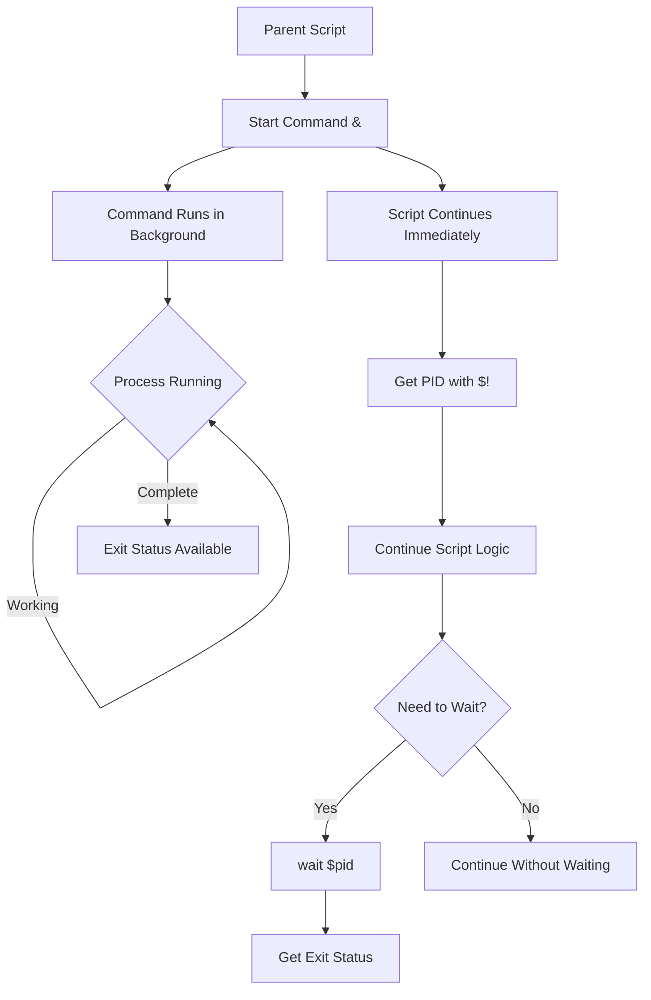
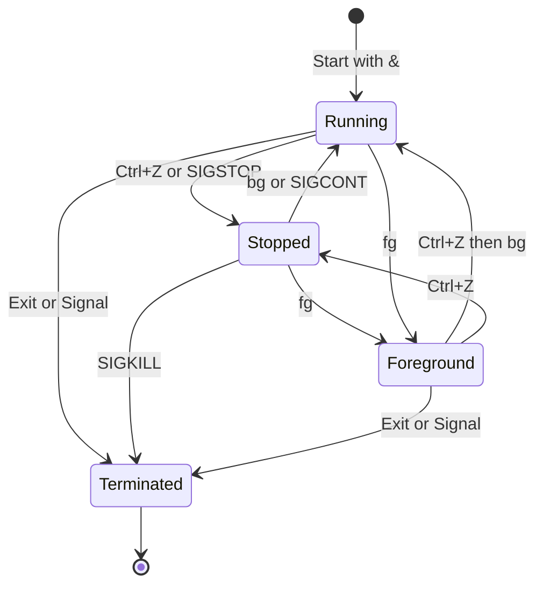
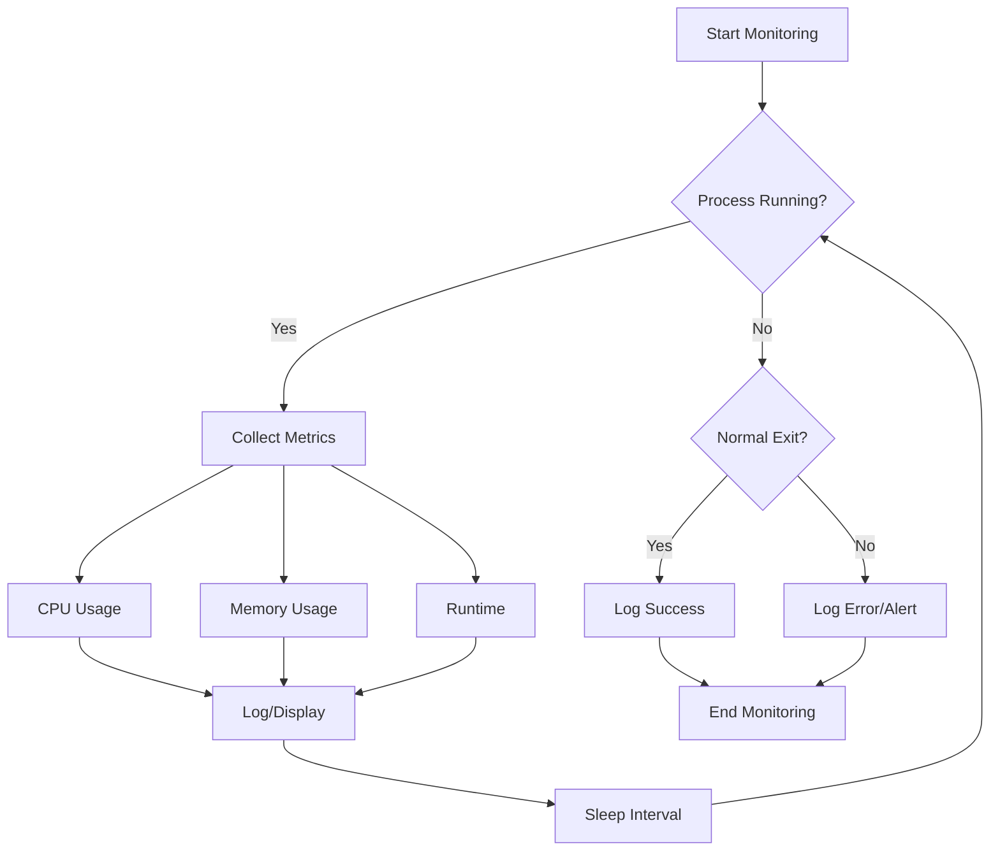
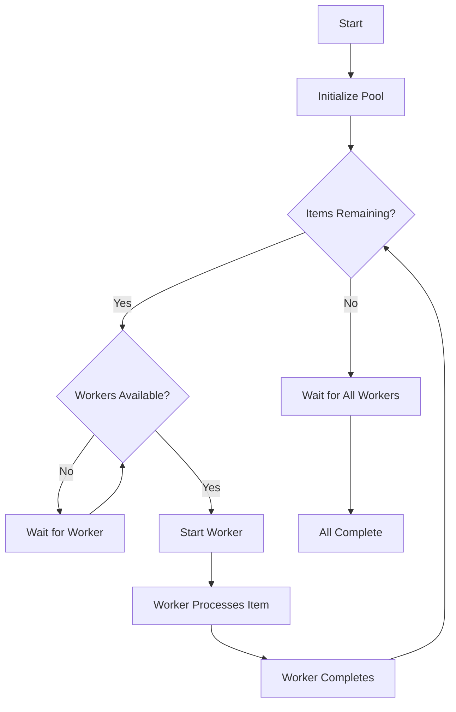
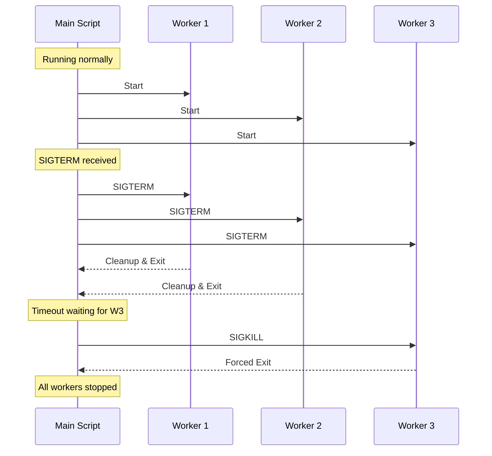
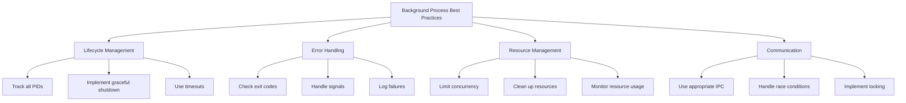

# How to Handle Background Processes in Bash

Author: [nawazdhandala](https://www.github.com/nawazdhandala)

Tags: Bash, Shell Scripting, Linux, Process Management, Concurrency, DevOps

Description: Learn how to effectively manage background processes in Bash scripts, including job control, process monitoring, and graceful termination.

---

Background processes are essential for building efficient Bash scripts that can perform multiple tasks concurrently. Whether you are running parallel jobs, managing daemons, or implementing worker pools, understanding how to control background processes is crucial. This guide covers everything you need to know about background process management in Bash.

---

## Table of Contents

1. Background Process Basics
2. Job Control Commands
3. Waiting for Processes
4. Process Monitoring
5. Parallel Execution Patterns
6. Process Communication
7. Graceful Shutdown
8. Best Practices

---

## 1. Background Process Basics

### Starting Background Processes

```bash
#!/bin/bash

# Run command in background with &
long_running_command &

# Get the PID of the last background process
pid=$!
echo "Started process with PID: $pid"

# Run multiple background processes
process1 &
pid1=$!

process2 &
pid2=$!

process3 &
pid3=$!

echo "Started PIDs: $pid1, $pid2, $pid3"
```

### Background Process Flow



### Subshells vs Background Processes

```bash
#!/bin/bash

# Subshell (parentheses) - runs synchronously
(
    echo "This runs in a subshell"
    sleep 1
    echo "Subshell complete"
)
echo "After subshell"

# Background process - runs asynchronously
{
    echo "This runs in background"
    sleep 1
    echo "Background complete"
} &
echo "After starting background process"

# Wait for background to complete
wait
```

---

## 2. Job Control Commands

### Basic Job Control

```bash
#!/bin/bash

# List current jobs
jobs

# List jobs with PIDs
jobs -l

# List only running jobs
jobs -r

# List only stopped jobs
jobs -s
```

### Managing Jobs

```bash
#!/bin/bash

# Start a job in background
sleep 100 &
job_pid=$!

# Bring job to foreground
fg %1  # By job number
fg %sleep  # By command name

# Send job to background (after Ctrl+Z)
bg %1

# Kill a job
kill %1

# Disown a job (remove from job table)
disown %1

# Disown and continue running after logout
disown -h %1
```

### Job States



### Disowning Processes

```bash
#!/bin/bash

# Run process that survives terminal close
run_daemon() {
    local cmd="$1"

    # Start in background
    $cmd &
    local pid=$!

    # Remove from job table
    disown $pid

    echo "Daemon started with PID: $pid"
    echo $pid > /var/run/mydaemon.pid
}

# Usage
run_daemon "python3 /opt/myapp/server.py"

# Alternative: nohup for terminal-independent execution
nohup long_running_command > /var/log/output.log 2>&1 &
```

---

## 3. Waiting for Processes

### Basic Wait

```bash
#!/bin/bash

# Wait for specific PID
long_command &
pid=$!
wait $pid
echo "Process $pid exited with status: $?"

# Wait for all background processes
command1 &
command2 &
command3 &
wait  # Waits for all
echo "All processes complete"
```

### Wait with Timeout

```bash
#!/bin/bash

# Wait with timeout (Bash 4.3+)
wait_with_timeout() {
    local pid=$1
    local timeout=$2
    local count=0

    while kill -0 "$pid" 2>/dev/null; do
        if [[ $count -ge $timeout ]]; then
            echo "Timeout waiting for PID $pid"
            return 1
        fi
        sleep 1
        count=$((count + 1))
    done

    wait "$pid"
    return $?
}

# Usage
slow_command &
pid=$!

if wait_with_timeout $pid 30; then
    echo "Command completed successfully"
else
    echo "Command timed out, killing..."
    kill $pid 2>/dev/null
fi
```

### Wait for Any Process

```bash
#!/bin/bash

# Wait for any one of multiple processes (Bash 4.3+)
command1 &
pid1=$!

command2 &
pid2=$!

command3 &
pid3=$!

# Wait for first to complete
wait -n
first_status=$?
echo "First process completed with status: $first_status"

# Wait for remaining
wait
echo "All processes complete"
```

### Collecting Exit Statuses

```bash
#!/bin/bash

# Track exit status of multiple processes
declare -A process_status

run_and_track() {
    local name=$1
    shift
    "$@" &
    process_status[$!]="$name"
}

run_and_track "download" curl -O http://example.com/file1
run_and_track "compile" make build
run_and_track "test" ./run_tests.sh

# Collect results
for pid in "${!process_status[@]}"; do
    wait $pid
    status=$?
    echo "${process_status[$pid]} (PID $pid) exited with: $status"
done
```

---

## 4. Process Monitoring

### Check If Process Is Running

```bash
#!/bin/bash

is_running() {
    local pid=$1
    kill -0 "$pid" 2>/dev/null
}

# Usage
long_command &
pid=$!

while is_running $pid; do
    echo "Process $pid is still running..."
    sleep 5
done

echo "Process $pid has finished"
```

### Monitor Process Resources

```bash
#!/bin/bash

monitor_process() {
    local pid=$1
    local interval="${2:-5}"

    echo "Monitoring PID $pid"
    echo "TIME       CPU%  MEM%  RSS(KB)"
    echo "---------- ----  ----  -------"

    while kill -0 "$pid" 2>/dev/null; do
        local stats
        stats=$(ps -p "$pid" -o %cpu,%mem,rss --no-headers 2>/dev/null)

        if [[ -n "$stats" ]]; then
            printf "%s  %s\n" "$(date +%H:%M:%S)" "$stats"
        fi

        sleep "$interval"
    done

    echo "Process $pid has terminated"
}

# Usage
heavy_computation &
monitor_process $! 2
```

### Process Monitoring Diagram



### Process Health Checks

```bash
#!/bin/bash

# Comprehensive process health check
check_process_health() {
    local pid=$1
    local max_cpu="${2:-90}"
    local max_mem="${3:-80}"

    if ! kill -0 "$pid" 2>/dev/null; then
        echo "CRITICAL: Process $pid is not running"
        return 2
    fi

    local stats
    stats=$(ps -p "$pid" -o %cpu,%mem --no-headers 2>/dev/null)

    read cpu mem <<< "$stats"
    cpu=${cpu%.*}  # Remove decimal
    mem=${mem%.*}

    local status="OK"
    local code=0

    if [[ $cpu -gt $max_cpu ]]; then
        status="WARNING: High CPU ($cpu%)"
        code=1
    fi

    if [[ $mem -gt $max_mem ]]; then
        status="WARNING: High Memory ($mem%)"
        code=1
    fi

    echo "$status - CPU: $cpu%, MEM: $mem%"
    return $code
}

# Usage
app_server &
pid=$!

while true; do
    check_process_health $pid 80 70
    sleep 10
done
```

---

## 5. Parallel Execution Patterns

### Simple Parallel Execution

```bash
#!/bin/bash

# Run multiple commands in parallel
parallel_exec() {
    local pids=()

    for cmd in "$@"; do
        eval "$cmd" &
        pids+=($!)
    done

    # Wait for all
    local failed=0
    for pid in "${pids[@]}"; do
        wait $pid || ((failed++))
    done

    return $failed
}

# Usage
parallel_exec \
    "sleep 2 && echo 'Task 1 done'" \
    "sleep 1 && echo 'Task 2 done'" \
    "sleep 3 && echo 'Task 3 done'"
```

### Worker Pool Pattern

```bash
#!/bin/bash

# Process items with limited concurrency
worker_pool() {
    local max_workers=$1
    shift
    local items=("$@")

    local running=0
    local pids=()

    for item in "${items[@]}"; do
        # Wait if at max workers
        while [[ $running -ge $max_workers ]]; do
            # Wait for any process to finish
            wait -n 2>/dev/null || true

            # Recount running processes
            running=0
            for pid in "${pids[@]}"; do
                if kill -0 "$pid" 2>/dev/null; then
                    ((running++))
                fi
            done
        done

        # Start new worker
        process_item "$item" &
        pids+=($!)
        ((running++))

        echo "Started processing: $item (running: $running)"
    done

    # Wait for remaining
    wait
    echo "All items processed"
}

process_item() {
    local item=$1
    echo "Processing: $item"
    sleep $((RANDOM % 5 + 1))  # Simulate work
    echo "Completed: $item"
}

# Usage
items=("item1" "item2" "item3" "item4" "item5" "item6" "item7" "item8")
worker_pool 3 "${items[@]}"
```

### Worker Pool Flow



### Pipeline Pattern

```bash
#!/bin/bash

# Producer-consumer pattern with named pipes
setup_pipeline() {
    local pipe="/tmp/pipeline_$$"
    mkfifo "$pipe"
    echo "$pipe"
}

producer() {
    local pipe=$1
    for i in {1..10}; do
        echo "item_$i" > "$pipe"
        sleep 0.5
    done
    echo "DONE" > "$pipe"
}

consumer() {
    local pipe=$1
    local id=$2

    while true; do
        read item < "$pipe"
        if [[ "$item" == "DONE" ]]; then
            echo "$item" > "$pipe"  # Pass to next consumer
            break
        fi
        echo "Consumer $id processing: $item"
        sleep 1
    done
}

# Usage
pipe=$(setup_pipeline)

# Start consumers
consumer "$pipe" 1 &
consumer "$pipe" 2 &

# Start producer
producer "$pipe"

wait
rm -f "$pipe"
```

---

## 6. Process Communication

### Using Files

```bash
#!/bin/bash

# Communicate via temporary file
COMM_FILE=$(mktemp)
trap "rm -f $COMM_FILE" EXIT

worker() {
    local id=$1
    local result=$((id * 10))
    echo "$id:$result" >> "$COMM_FILE"
}

# Start workers
for i in {1..5}; do
    worker $i &
done

wait

# Read results
echo "Results:"
while IFS=: read -r id result; do
    echo "  Worker $id produced: $result"
done < "$COMM_FILE"
```

### Using Named Pipes (FIFOs)

```bash
#!/bin/bash

# Bidirectional communication with named pipes
PIPE_TO_WORKER="/tmp/to_worker_$$"
PIPE_FROM_WORKER="/tmp/from_worker_$$"

mkfifo "$PIPE_TO_WORKER" "$PIPE_FROM_WORKER"
trap "rm -f $PIPE_TO_WORKER $PIPE_FROM_WORKER" EXIT

# Worker process
worker() {
    while read command < "$PIPE_TO_WORKER"; do
        case "$command" in
            QUIT)
                echo "BYE" > "$PIPE_FROM_WORKER"
                break
                ;;
            *)
                result=$((command * 2))
                echo "$result" > "$PIPE_FROM_WORKER"
                ;;
        esac
    done
}

# Start worker
worker &
worker_pid=$!

# Send commands
for num in 5 10 15; do
    echo "$num" > "$PIPE_TO_WORKER"
    read response < "$PIPE_FROM_WORKER"
    echo "$num * 2 = $response"
done

echo "QUIT" > "$PIPE_TO_WORKER"
wait $worker_pid
```

### Using Process Substitution

```bash
#!/bin/bash

# Process substitution for parallel input processing
process_logs() {
    paste \
        <(grep "ERROR" /var/log/app1.log | wc -l) \
        <(grep "ERROR" /var/log/app2.log | wc -l) \
        <(grep "ERROR" /var/log/app3.log | wc -l) \
    | while read app1 app2 app3; do
        echo "Error counts - App1: $app1, App2: $app2, App3: $app3"
    done
}
```

### Shared Memory with Files

```bash
#!/bin/bash

# Simple shared counter using file locking
COUNTER_FILE=$(mktemp)
echo "0" > "$COUNTER_FILE"
LOCK_FILE="${COUNTER_FILE}.lock"

increment_counter() {
    (
        flock -x 200
        local count=$(cat "$COUNTER_FILE")
        echo $((count + 1)) > "$COUNTER_FILE"
    ) 200>"$LOCK_FILE"
}

get_counter() {
    cat "$COUNTER_FILE"
}

# Multiple workers incrementing counter
for i in {1..10}; do
    (
        for j in {1..10}; do
            increment_counter
        done
    ) &
done

wait

echo "Final count: $(get_counter)"  # Should be 100
rm -f "$COUNTER_FILE" "$LOCK_FILE"
```

---

## 7. Graceful Shutdown

### Signal-Based Shutdown

```bash
#!/bin/bash

# Track background processes for cleanup
declare -a WORKER_PIDS=()
SHUTDOWN_REQUESTED=false

cleanup() {
    SHUTDOWN_REQUESTED=true
    echo "Shutting down..."

    # Send TERM to all workers
    for pid in "${WORKER_PIDS[@]}"; do
        if kill -0 "$pid" 2>/dev/null; then
            echo "Stopping worker PID: $pid"
            kill -TERM "$pid" 2>/dev/null
        fi
    done

    # Wait for graceful shutdown (with timeout)
    local timeout=10
    local count=0
    while [[ $count -lt $timeout ]]; do
        local running=0
        for pid in "${WORKER_PIDS[@]}"; do
            if kill -0 "$pid" 2>/dev/null; then
                ((running++))
            fi
        done

        if [[ $running -eq 0 ]]; then
            break
        fi

        sleep 1
        ((count++))
    done

    # Force kill remaining
    for pid in "${WORKER_PIDS[@]}"; do
        if kill -0 "$pid" 2>/dev/null; then
            echo "Force killing PID: $pid"
            kill -KILL "$pid" 2>/dev/null
        fi
    done

    wait
    echo "Shutdown complete"
}

trap cleanup SIGINT SIGTERM

# Worker that handles shutdown
worker() {
    local id=$1
    trap 'echo "Worker $id shutting down"; exit 0' SIGTERM

    while true; do
        echo "Worker $id working..."
        sleep 2
    done
}

# Start workers
for i in {1..3}; do
    worker $i &
    WORKER_PIDS+=($!)
done

echo "Started ${#WORKER_PIDS[@]} workers"
echo "Press Ctrl+C to stop"

# Main loop
while ! $SHUTDOWN_REQUESTED; do
    sleep 1
done
```

### Graceful Shutdown Flow



### Process Group Management

```bash
#!/bin/bash

# Use process groups for better control
start_process_group() {
    # Start new session/process group
    setsid bash -c '
        trap "kill 0" SIGTERM

        # Start child processes
        worker1 &
        worker2 &
        worker3 &

        wait
    ' &

    echo $!  # Return the session leader PID
}

stop_process_group() {
    local leader_pid=$1

    # Kill entire process group
    kill -TERM -$leader_pid 2>/dev/null

    # Wait for cleanup
    sleep 2

    # Force kill if needed
    kill -KILL -$leader_pid 2>/dev/null
}

# Usage
pgid=$(start_process_group)
echo "Started process group: $pgid"

# Later...
stop_process_group $pgid
```

---

## 8. Best Practices

### Complete Background Process Manager

```bash
#!/bin/bash

# Background Process Manager
# Provides robust process lifecycle management

declare -A MANAGED_PROCESSES
LOG_FILE="/var/log/process_manager.log"

log() {
    echo "[$(date '+%Y-%m-%d %H:%M:%S')] $*" | tee -a "$LOG_FILE"
}

# Start a managed process
start_process() {
    local name=$1
    shift
    local command="$@"

    if [[ -n "${MANAGED_PROCESSES[$name]}" ]]; then
        local existing_pid="${MANAGED_PROCESSES[$name]}"
        if kill -0 "$existing_pid" 2>/dev/null; then
            log "Process '$name' already running (PID: $existing_pid)"
            return 1
        fi
    fi

    # Start process
    $command &
    local pid=$!
    MANAGED_PROCESSES[$name]=$pid

    log "Started '$name' with PID: $pid"
    return 0
}

# Stop a managed process
stop_process() {
    local name=$1
    local timeout="${2:-10}"

    local pid="${MANAGED_PROCESSES[$name]}"
    if [[ -z "$pid" ]]; then
        log "Process '$name' not found"
        return 1
    fi

    if ! kill -0 "$pid" 2>/dev/null; then
        log "Process '$name' (PID: $pid) already stopped"
        unset MANAGED_PROCESSES[$name]
        return 0
    fi

    log "Stopping '$name' (PID: $pid)..."
    kill -TERM "$pid" 2>/dev/null

    # Wait for graceful shutdown
    local count=0
    while kill -0 "$pid" 2>/dev/null && [[ $count -lt $timeout ]]; do
        sleep 1
        ((count++))
    done

    if kill -0 "$pid" 2>/dev/null; then
        log "Force killing '$name' (PID: $pid)"
        kill -KILL "$pid" 2>/dev/null
    fi

    wait "$pid" 2>/dev/null
    unset MANAGED_PROCESSES[$name]
    log "Stopped '$name'"
    return 0
}

# Check process status
check_process() {
    local name=$1
    local pid="${MANAGED_PROCESSES[$name]}"

    if [[ -z "$pid" ]]; then
        echo "$name: not managed"
        return 1
    fi

    if kill -0 "$pid" 2>/dev/null; then
        local stats=$(ps -p "$pid" -o %cpu,%mem,etime --no-headers)
        echo "$name (PID $pid): running - $stats"
        return 0
    else
        echo "$name (PID $pid): stopped"
        return 1
    fi
}

# List all managed processes
list_processes() {
    echo "Managed Processes:"
    echo "=================="
    for name in "${!MANAGED_PROCESSES[@]}"; do
        check_process "$name"
    done
}

# Stop all processes
stop_all() {
    log "Stopping all managed processes..."
    for name in "${!MANAGED_PROCESSES[@]}"; do
        stop_process "$name"
    done
    log "All processes stopped"
}

# Restart a process
restart_process() {
    local name=$1
    shift

    stop_process "$name"
    sleep 1
    start_process "$name" "$@"
}

# Cleanup on exit
trap stop_all EXIT

# Example usage
if [[ "${BASH_SOURCE[0]}" == "${0}" ]]; then
    start_process "worker1" sleep 100
    start_process "worker2" sleep 100
    start_process "worker3" sleep 100

    list_processes

    echo "Press Enter to stop all..."
    read
fi
```

### Best Practices Summary



### Quick Reference Table

| Task | Command |
|------|---------|
| Start background | `command &` |
| Get last PID | `$!` |
| Wait for PID | `wait $pid` |
| Wait for all | `wait` |
| Wait for any | `wait -n` |
| Check if running | `kill -0 $pid` |
| Send signal | `kill -SIGNAL $pid` |
| Disown process | `disown $pid` |
| List jobs | `jobs -l` |
| Kill job | `kill %1` |

---

## Key Takeaways

1. **Always track PIDs** - Store background process PIDs for later management
2. **Use wait properly** - Collect exit statuses and prevent zombie processes
3. **Implement graceful shutdown** - Use signals and timeouts for clean termination
4. **Limit concurrency** - Use worker pools to prevent resource exhaustion
5. **Handle signals** - Set up traps to clean up background processes on script exit
6. **Choose appropriate IPC** - Use files, pipes, or other mechanisms based on needs
7. **Monitor process health** - Track CPU, memory, and runtime of long-running processes
8. **Test shutdown scenarios** - Verify cleanup works under various termination conditions

---

*Managing background processes in production? [OneUptime](https://oneuptime.com) provides comprehensive process monitoring that can alert you when your background jobs fail, hang, or consume excessive resources.*
