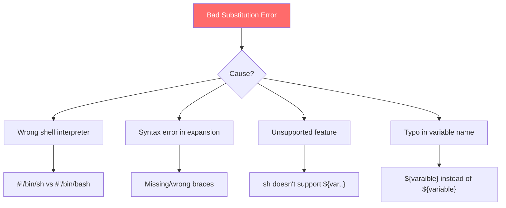
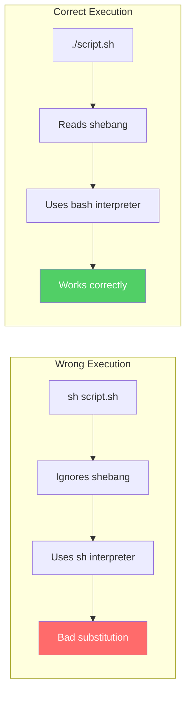
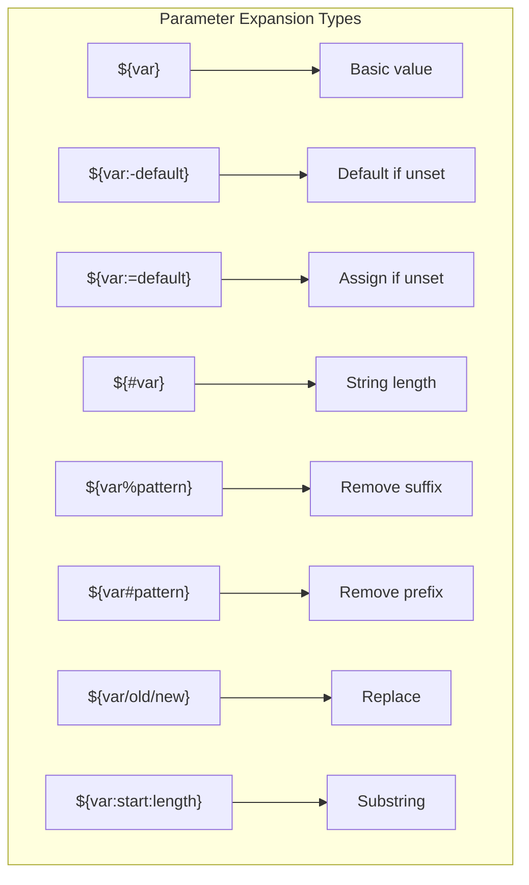

# How to Fix 'Bad Substitution' Errors in Bash

Author: [nawazdhandala](https://www.github.com/nawazdhandala)

Tags: Bash, Shell Scripting, Debugging, Error Handling, Linux, DevOps

Description: Learn how to diagnose and fix 'bad substitution' errors in Bash caused by incorrect variable expansion syntax, wrong shell interpreters, and unsupported features.

---

> The "bad substitution" error in Bash occurs when you use variable expansion syntax incorrectly or when features are not supported by your current shell. This guide covers all common causes and their solutions.

---

## Understanding the Error



The error message looks like this:

```bash
line 5: ${variable,,}: bad substitution
```

---

## Cause 1: Wrong Shell Interpreter

The most common cause is running a Bash script with `/bin/sh` instead of `/bin/bash`.

### The Problem

```bash
#!/bin/sh
# This script uses Bash-specific features but runs with sh

name="HELLO"
lower="${name,,}"  # Bash-specific lowercase conversion
echo "$lower"
```

Running this produces:

```
./script.sh: line 4: ${name,,}: bad substitution
```

### The Solution

Change the shebang to use Bash explicitly:

```bash
#!/bin/bash
# Now Bash-specific features work correctly

name="HELLO"
lower="${name,,}"  # Works in Bash
echo "$lower"      # Output: hello
```

### Verify Your Shell

```bash
#!/bin/bash
# Check which shell is running

echo "Shell: $SHELL"
echo "Bash version: ${BASH_VERSION:-Not Bash}"

# Check if running as Bash
if [[ -n "$BASH_VERSION" ]]; then
    echo "Running in Bash"
else
    echo "Not running in Bash"
fi
```

---

## Cause 2: Running Script with sh Explicitly

Even with the correct shebang, running `sh script.sh` forces the sh interpreter.



### The Fix

```bash
# WRONG - ignores shebang, uses sh
sh myscript.sh

# CORRECT - uses shebang interpreter
./myscript.sh

# CORRECT - explicitly use bash
bash myscript.sh
```

Make sure your script is executable:

```bash
chmod +x myscript.sh
./myscript.sh
```

---

## Cause 3: Syntax Errors in Parameter Expansion

### Missing Dollar Sign

```bash
#!/bin/bash

name="world"

# WRONG - missing $ inside braces
echo "Hello, {name}"   # Outputs: Hello, {name}

# CORRECT - include $ inside braces
echo "Hello, ${name}"  # Outputs: Hello, world
```

### Extra or Missing Braces

```bash
#!/bin/bash

filename="report.txt"

# WRONG - mismatched braces
echo "${filename"      # Bad substitution
echo "$filename}"      # Outputs: report.txt}

# CORRECT - balanced braces
echo "${filename}"     # Outputs: report.txt
```

### Incorrect Operator Placement

```bash
#!/bin/bash

text="Hello World"

# WRONG - space before operator
echo "${ text%% *}"    # Bad substitution

# CORRECT - no spaces inside braces
echo "${text%% *}"     # Outputs: Hello
```

---

## Cause 4: Unsupported Bash Features in sh

Many parameter expansion features are Bash-specific and not available in POSIX sh.

### Case Modification (Bash 4.0+)

```bash
#!/bin/bash
# These features require Bash 4.0 or later

name="Hello World"

# Lowercase conversion
echo "${name,,}"       # hello world (all lowercase)
echo "${name,}"        # hello World (first char lowercase)

# Uppercase conversion
echo "${name^^}"       # HELLO WORLD (all uppercase)
echo "${name^}"        # Hello World (first char uppercase)

# POSIX alternative for lowercase
echo "$name" | tr '[:upper:]' '[:lower:]'

# POSIX alternative for uppercase
echo "$name" | tr '[:lower:]' '[:upper:]'
```

### Array Operations (Bash-specific)

```bash
#!/bin/bash
# Arrays are not POSIX compliant

# Bash arrays
declare -a fruits=("apple" "banana" "cherry")

echo "${fruits[0]}"         # First element
echo "${fruits[@]}"         # All elements
echo "${#fruits[@]}"        # Array length
echo "${fruits[@]:1:2}"     # Slice: banana cherry

# These cause bad substitution in sh
```

### Substring Expansion

```bash
#!/bin/bash

string="Hello World"

# Substring extraction (Bash)
echo "${string:0:5}"    # Hello (first 5 chars)
echo "${string:6}"      # World (from position 6)
echo "${string: -5}"    # World (last 5 chars - note the space)

# Negative index (Bash 4.2+)
echo "${string: -5:3}"  # Wor (3 chars from -5 position)
```

---

## Cause 5: Indirect Variable Reference Errors

```bash
#!/bin/bash

# Direct variable
server_name="production"
production="prod.example.com"

# WRONG - This doesn't work as expected
echo "${$server_name}"  # Bad substitution

# CORRECT - Use indirect expansion
echo "${!server_name}"  # Outputs: prod.example.com

# ALTERNATIVE - Use eval (less safe)
eval "echo \$$server_name"
```

### Dynamic Variable Names

```bash
#!/bin/bash
# Safe way to use dynamic variable names

# Using nameref (Bash 4.3+)
declare -n ref="server_name"
server_name="myserver"
echo "$ref"  # Outputs: myserver

# Using indirect expansion
get_config() {
    local key="$1"
    local var_name="CONFIG_${key}"
    echo "${!var_name}"
}

CONFIG_HOST="localhost"
CONFIG_PORT="8080"

echo "Host: $(get_config HOST)"  # localhost
echo "Port: $(get_config PORT)"  # 8080
```

---

## Cause 6: Arithmetic Expansion Errors

```bash
#!/bin/bash

# WRONG - using ${} for arithmetic
count=5
echo "${count + 1}"    # Bad substitution

# CORRECT - use $(()) for arithmetic
echo "$((count + 1))"  # Outputs: 6

# CORRECT - increment variable
((count++))
echo "$count"          # Outputs: 6

# Using let
let "count = count + 1"
echo "$count"          # Outputs: 7
```

---

## Cause 7: Nested Expansion Errors

```bash
#!/bin/bash

filename="document.backup.txt"

# WRONG - nested ${} doesn't work
base="${${filename%.*}%.*}"  # Bad substitution

# CORRECT - use intermediate variable
temp="${filename%.*}"        # document.backup
base="${temp%.*}"            # document
echo "$base"

# CORRECT - use command substitution
base=$(basename "$filename" .txt | sed 's/\.backup$//')
echo "$base"
```

---

## Reference: Parameter Expansion Syntax

```bash
#!/bin/bash
# Complete parameter expansion reference

var="Hello World"
unset empty_var

# Basic expansion
echo "${var}"              # Hello World

# Default values
echo "${empty_var:-default}"   # default (use default if unset/empty)
echo "${empty_var:=default}"   # default (set to default if unset/empty)
echo "${empty_var:+alternate}" # (empty - var is unset)
echo "${var:+alternate}"       # alternate (var is set)
echo "${undefined:?error}"     # Exits with error

# String length
echo "${#var}"             # 11

# Substring removal
echo "${var#Hello }"       # World (remove shortest from start)
echo "${var##* }"          # World (remove longest from start)
echo "${var%World}"        # Hello  (remove shortest from end)
echo "${var%% *}"          # Hello (remove longest from end)

# Search and replace
echo "${var/World/Bash}"   # Hello Bash (replace first)
echo "${var//o/0}"         # Hell0 W0rld (replace all)
echo "${var/#Hello/Hi}"    # Hi World (replace at start)
echo "${var/%World/Bash}"  # Hello Bash (replace at end)

# Substring extraction
echo "${var:0:5}"          # Hello
echo "${var:6}"            # World
echo "${var: -5}"          # World (note space before -)

# Case modification (Bash 4+)
echo "${var^^}"            # HELLO WORLD
echo "${var,,}"            # hello world
echo "${var^}"             # Hello World (first char)
echo "${var,}"             # hello World (first char)
```



---

## Debugging Bad Substitution Errors

### Enable Debug Mode

```bash
#!/bin/bash
# Enable debugging to trace the error

set -x  # Print each command before execution

name="test"
result="${name,,}"  # This line will show in debug output

set +x  # Disable debugging
```

### Check Bash Version

```bash
#!/bin/bash
# Some features require specific Bash versions

echo "Bash version: $BASH_VERSION"

# Parse version numbers
bash_major="${BASH_VERSION%%.*}"
bash_minor="${BASH_VERSION#*.}"
bash_minor="${bash_minor%%.*}"

echo "Major: $bash_major, Minor: $bash_minor"

# Check for features
if ((bash_major >= 4)); then
    echo "Case modification supported"
    echo "${name,,}"
else
    echo "Using tr for lowercase"
    echo "$name" | tr '[:upper:]' '[:lower:]'
fi
```

### Portable Script Template

```bash
#!/bin/bash
# Portable script that checks for required features

# Require Bash
if [[ -z "$BASH_VERSION" ]]; then
    echo "Error: This script requires Bash" >&2
    exit 1
fi

# Require minimum version
min_version="4.0"
if [[ "${BASH_VERSION}" < "$min_version" ]]; then
    echo "Error: Bash $min_version or later required" >&2
    echo "Current version: $BASH_VERSION" >&2
    exit 1
fi

# Safe to use Bash 4+ features
name="HELLO"
echo "${name,,}"
```

---

## Common Fixes Quick Reference

| Error Pattern | Cause | Fix |
|--------------|-------|-----|
| `${var,,}` bad substitution | sh interpreter | Use `#!/bin/bash` |
| `${arr[@]}` bad substitution | sh doesn't support arrays | Use Bash or rewrite |
| `${$var}` bad substitution | Wrong indirect syntax | Use `${!var}` |
| `${ var}` bad substitution | Space in expansion | Remove space: `${var}` |
| `${var:0:5}` bad substitution | sh doesn't support substrings | Use `expr` or Bash |

---

## Summary

To fix "bad substitution" errors:

1. **Use the correct shebang** - `#!/bin/bash` for Bash features
2. **Run scripts correctly** - Use `./script.sh` or `bash script.sh`
3. **Check syntax carefully** - No spaces inside `${}`
4. **Verify feature support** - Some features need Bash 4.0+
5. **Use indirect expansion correctly** - `${!var}` not `${$var}`
6. **Test in target environment** - Different systems have different shells

When writing portable scripts, stick to POSIX-compliant syntax or explicitly require Bash with version checking.

---

*Monitoring your shell scripts in production? [OneUptime](https://oneuptime.com) provides real-time alerting when your automation fails.*

**Related Reading:**
- [Bash Parameter Expansion Guide](https://oneuptime.com/blog/post/2026-02-13-bash-parameter-expansion)
- [POSIX Shell Compatibility](https://oneuptime.com/blog/post/2026-02-13-posix-shell-compatibility)
