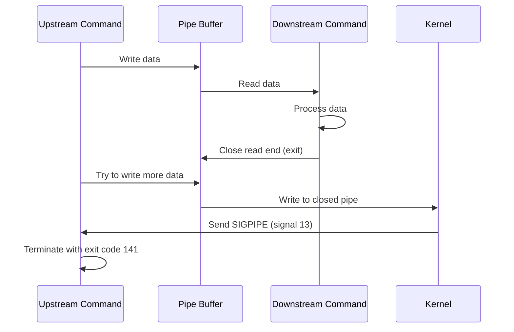
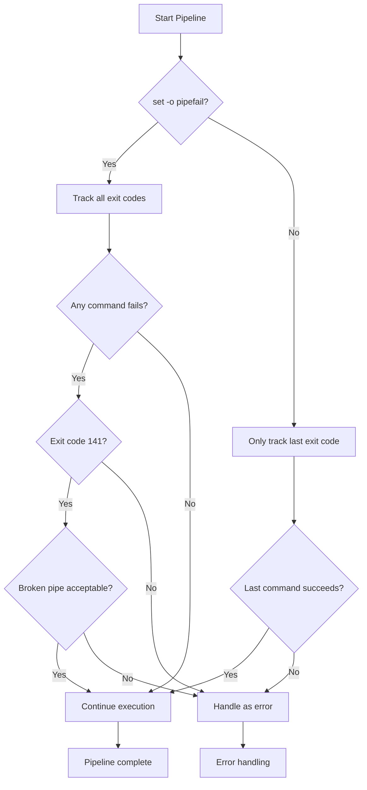

# How to Fix "Broken Pipe" Errors in Bash Pipelines

Author: [nawazdhandala](https://github.com/nawazdhandala)

Tags: Bash, Shell Scripting, Linux, Pipelines, Error Handling, SIGPIPE, Debugging

Description: Learn how to diagnose and handle broken pipe errors in Bash pipelines when downstream commands exit before upstream commands finish.

---

## Introduction

The "broken pipe" error occurs when a command tries to write to a pipe whose reading end has been closed. This commonly happens in shell pipelines when a downstream command exits before the upstream command finishes sending data. While often harmless, understanding this error helps you write more robust scripts and avoid unexpected behavior.

## Understanding Broken Pipe

### What Causes a Broken Pipe?

When you create a pipeline like `cmd1 | cmd2`, the shell connects the stdout of `cmd1` to the stdin of `cmd2`. If `cmd2` exits before `cmd1` finishes writing, `cmd1` receives a SIGPIPE signal and typically terminates with a "broken pipe" error.

```bash
#!/bin/bash

# Classic example: head exits after reading 10 lines
# The upstream command (yes) tries to keep writing
yes "hello" | head -n 10

# Behind the scenes:
# 1. yes starts writing "hello" repeatedly
# 2. head reads 10 lines and exits
# 3. yes tries to write to the closed pipe
# 4. Kernel sends SIGPIPE to yes
# 5. yes terminates (usually silently)
```

### Pipeline Signal Flow



## Common Scenarios

### Scenario 1: Using head with Long-Running Commands

```bash
#!/bin/bash

# This commonly triggers broken pipe
cat /var/log/syslog | head -n 5

# The error happens because:
# - cat reads the entire file
# - head only needs 5 lines then exits
# - cat tries to write remaining data to closed pipe

# Often you will not see the error because SIGPIPE kills cat silently
# But with set -o pipefail, the pipeline reports failure
```

### Scenario 2: grep with Early Exit

```bash
#!/bin/bash

# grep -m exits after finding N matches
find / -name "*.conf" 2>/dev/null | grep -m 5 "nginx"

# find keeps running and writing after grep exits
# This causes broken pipe but usually works as intended
```

### Scenario 3: Interactive Commands

```bash
#!/bin/bash

# Running a command that expects interactive input
# If the receiving command closes, you get broken pipe

echo "some data" | command_that_exits_early

# Or with process substitution
long_running_command > >(head -n 1)
```

## Detecting Broken Pipe Errors

### Exit Codes

```bash
#!/bin/bash

# SIGPIPE results in exit code 128 + 13 = 141
yes | head -n 1
echo "Exit code: ${PIPESTATUS[0]}"  # Shows 141

# Check for broken pipe in scripts
if [ "${PIPESTATUS[0]}" -eq 141 ]; then
    echo "Broken pipe occurred (expected)"
fi
```

### Using set -o pipefail

```bash
#!/bin/bash

# Without pipefail, only the last command's exit code matters
yes | head -n 1
echo "Exit code: $?"  # Shows 0 (from head)

# With pipefail, pipeline fails if any command fails
set -o pipefail
yes | head -n 1
echo "Exit code: $?"  # Shows 141 (from yes)
```

### Pipeline Status Array

```bash
#!/bin/bash

# PIPESTATUS array contains exit codes of all pipeline commands
cmd1 | cmd2 | cmd3
echo "Exit codes: ${PIPESTATUS[0]} ${PIPESTATUS[1]} ${PIPESTATUS[2]}"

# Example with broken pipe
yes | head -n 1 | cat
echo "First: ${PIPESTATUS[0]}"   # 141 (SIGPIPE)
echo "Second: ${PIPESTATUS[1]}"  # 0
echo "Third: ${PIPESTATUS[2]}"   # 0
```

## Handling Broken Pipe

### Method 1: Ignore SIGPIPE

```bash
#!/bin/bash

# Trap and ignore SIGPIPE
trap '' PIPE

# Now broken pipe will not terminate commands
yes | head -n 1
echo "Completed without signal"

# Reset trap
trap - PIPE
```

### Method 2: Suppress Error Messages

```bash
#!/bin/bash

# Redirect stderr to suppress error messages
yes 2>/dev/null | head -n 1

# Or use a wrapper function
quiet_pipe() {
    "$@" 2>&1 | grep -v "Broken pipe"
}
```

### Method 3: Check Exit Status Properly

```bash
#!/bin/bash

# Function to handle pipefail correctly
safe_pipeline() {
    local result
    set +o pipefail  # Temporarily disable

    result=$("$@")
    local exit_code=$?

    set -o pipefail  # Re-enable

    # Return result, ignoring broken pipe (141)
    echo "$result"

    if [ $exit_code -ne 0 ] && [ $exit_code -ne 141 ]; then
        return $exit_code
    fi
    return 0
}

# Usage
output=$(safe_pipeline bash -c 'yes | head -n 1')
```

### Method 4: Use Process Substitution

```bash
#!/bin/bash

# Process substitution can avoid some broken pipe issues
# Because it runs in a subshell

head -n 10 < <(yes "hello")

# This works because the subshell handles SIGPIPE
```

## Pipeline Error Handling Flow



## Best Practices

### Practice 1: Only Read What You Need

```bash
#!/bin/bash

# Instead of piping entire files, read only what is needed
# Bad: reads entire file then takes first 10 lines
cat hugefile.txt | head -n 10

# Better: head can read files directly
head -n 10 hugefile.txt

# For commands that must pipe, limit upstream output if possible
# Bad: generates infinite output
yes | head -n 1

# Better: generate only what is needed (when possible)
printf 'y\n'
```

### Practice 2: Use Appropriate Tools

```bash
#!/bin/bash

# Use tools that handle limited output gracefully

# Instead of cat | head
head -n 100 file.txt

# Instead of grep through entire file when you need first match
grep -m 1 "pattern" file.txt

# Use awk to exit early
awk '/pattern/ {print; exit}' file.txt

# Use sed to process and quit
sed -n '/pattern/p;q' file.txt
```

### Practice 3: Handle SIGPIPE in Long-Running Scripts

```bash
#!/bin/bash

# For scripts that process pipelines frequently
# Set up proper signal handling

cleanup() {
    # Cleanup code here
    exit 0
}

trap cleanup EXIT
trap '' PIPE  # Ignore SIGPIPE

# Main script logic
process_data() {
    while true; do
        generate_data | consumer_that_might_exit_early
        # Script continues even if consumer exits
    done
}
```

### Practice 4: Log Pipeline Failures

```bash
#!/bin/bash

# Function to run pipeline with proper error handling
run_pipeline() {
    local description="$1"
    shift

    # Run the pipeline
    eval "$@"

    # Check all exit codes
    local codes=("${PIPESTATUS[@]}")
    local failed=false

    for i in "${!codes[@]}"; do
        if [ "${codes[$i]}" -ne 0 ] && [ "${codes[$i]}" -ne 141 ]; then
            echo "ERROR: Pipeline '$description' failed at command $i with exit code ${codes[$i]}" >&2
            failed=true
        fi
    done

    if [ "$failed" = true ]; then
        return 1
    fi
    return 0
}

# Usage
run_pipeline "extract data" 'cat data.txt | grep "pattern" | head -n 10'
```

## Real-World Examples

### Example 1: Log Processing

```bash
#!/bin/bash

# Process large log files efficiently
# This avoids broken pipe by not reading entire files

process_recent_errors() {
    local logfile="$1"
    local count="${2:-10}"

    # Use tac to read from end, avoiding need to read entire file
    # tail with -n is more efficient than head in pipelines
    tac "$logfile" 2>/dev/null | grep -m "$count" "ERROR" | tac
}

# Alternative: use tail -f for continuous monitoring
# This naturally handles the pipeline
tail -f /var/log/app.log | grep --line-buffered "ERROR" | head -n 5
```

### Example 2: Data Pipeline with Checkpoints

```bash
#!/bin/bash

# Pipeline with proper error handling and checkpoints

set -o pipefail

process_data() {
    local input="$1"
    local checkpoint="/tmp/pipeline_checkpoint"

    # Stage 1: Extract
    if ! extract_data "$input" > "$checkpoint.stage1" 2>/dev/null; then
        echo "Extract stage failed" >&2
        return 1
    fi

    # Stage 2: Transform
    if ! transform_data < "$checkpoint.stage1" > "$checkpoint.stage2" 2>/dev/null; then
        echo "Transform stage failed" >&2
        return 1
    fi

    # Stage 3: Load (might exit early)
    # Ignore broken pipe here as it is expected
    load_data < "$checkpoint.stage2" 2>/dev/null || {
        local code=$?
        if [ $code -ne 141 ]; then
            echo "Load stage failed with code $code" >&2
            return 1
        fi
    }

    # Cleanup
    rm -f "$checkpoint".stage*
    return 0
}
```

### Example 3: Interactive Pipeline Handler

```bash
#!/bin/bash

# Handle pipelines in interactive scripts

interactive_search() {
    local pattern="$1"
    local file="$2"

    # Use a pager that handles SIGPIPE gracefully
    grep "$pattern" "$file" 2>/dev/null | {
        # Check if we are connected to a terminal
        if [ -t 1 ]; then
            less
        else
            cat
        fi
    } || {
        local code=$?
        # Ignore broken pipe from less (user quit early)
        if [ $code -eq 141 ]; then
            return 0
        fi
        return $code
    }
}
```

## Debugging Broken Pipe Issues

### Identify the Source

```bash
#!/bin/bash

# Enable trace mode to see where broken pipe occurs
set -x

# Run your pipeline
problematic_command | another_command | final_command

set +x
```

### Test Individual Commands

```bash
#!/bin/bash

# Test each pipeline stage separately

# Stage 1: Does the producer work?
producer_command > /tmp/stage1_output
echo "Stage 1 exit code: $?"

# Stage 2: Does the consumer work with the output?
cat /tmp/stage1_output | consumer_command > /tmp/stage2_output
echo "Stage 2 exit code: $?"

# Stage 3: Does the final command work?
cat /tmp/stage2_output | final_command
echo "Stage 3 exit code: $?"
```

### Monitor with strace

```bash
#!/bin/bash

# Use strace to see system calls and signals
strace -f -e trace=write,signal bash -c 'yes | head -n 1' 2>&1 | tail -20

# Look for:
# --- SIGPIPE {si_signo=SIGPIPE, ...} ---
# This confirms broken pipe signal
```

## Complete Example: Robust Pipeline Wrapper

```bash
#!/bin/bash

# A complete pipeline wrapper with proper error handling

# Configuration
IGNORE_SIGPIPE=true
LOG_FILE="/var/log/pipeline.log"

# Logging function
log() {
    echo "[$(date '+%Y-%m-%d %H:%M:%S')] $*" >> "$LOG_FILE"
}

# Pipeline execution function
execute_pipeline() {
    local name="$1"
    local pipeline="$2"
    local ignore_broken_pipe="${3:-$IGNORE_SIGPIPE}"

    log "Starting pipeline: $name"

    # Execute and capture all exit codes
    eval "$pipeline"
    local codes=("${PIPESTATUS[@]}")

    # Analyze results
    local success=true
    local details=""

    for i in "${!codes[@]}"; do
        local code="${codes[$i]}"
        details+="stage$i=$code "

        if [ "$code" -ne 0 ]; then
            if [ "$code" -eq 141 ] && [ "$ignore_broken_pipe" = true ]; then
                log "Stage $i: Broken pipe (ignored)"
            else
                success=false
                log "Stage $i: Failed with exit code $code"
            fi
        fi
    done

    if [ "$success" = true ]; then
        log "Pipeline '$name' completed successfully ($details)"
        return 0
    else
        log "Pipeline '$name' failed ($details)"
        return 1
    fi
}

# Example usage
main() {
    # Simple pipeline
    execute_pipeline "count_errors" \
        'grep "ERROR" /var/log/app.log | wc -l'

    # Pipeline that triggers broken pipe
    execute_pipeline "first_ten_lines" \
        'cat /var/log/syslog | head -n 10'

    # Pipeline with multiple stages
    execute_pipeline "process_data" \
        'cat data.txt | sort | uniq | head -n 100'
}

main "$@"
```

## Conclusion

Broken pipe errors are a normal part of pipeline operation in Bash. Understanding when and why they occur helps you write better scripts:

1. SIGPIPE occurs when writing to a closed pipe - this is expected behavior when downstream commands exit early
2. Exit code 141 (128 + 13) indicates a SIGPIPE termination
3. Use `${PIPESTATUS[@]}` to check exit codes of all pipeline commands
4. Handle broken pipe appropriately - sometimes it indicates success (like with `head`)
5. Use `set -o pipefail` carefully as it changes how pipeline success is determined
6. Design pipelines to minimize unnecessary data transfer

Key strategies for handling broken pipes:

- Trap SIGPIPE if you want to ignore it completely
- Check PIPESTATUS for fine-grained error handling
- Use tools that read directly from files when possible
- Consider if broken pipe is actually an error in your context

With these techniques, you can build robust pipelines that handle all edge cases gracefully.
