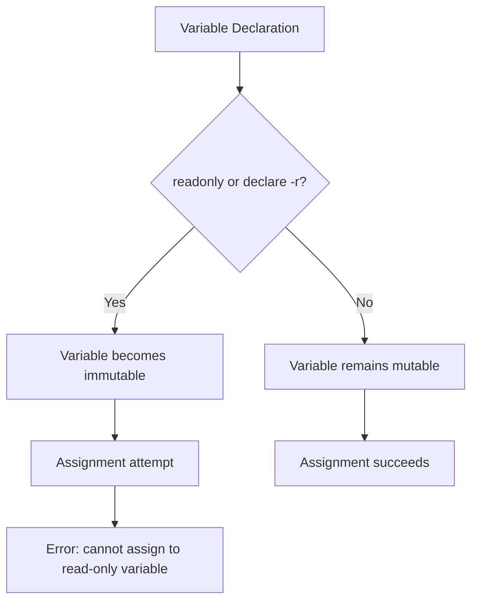
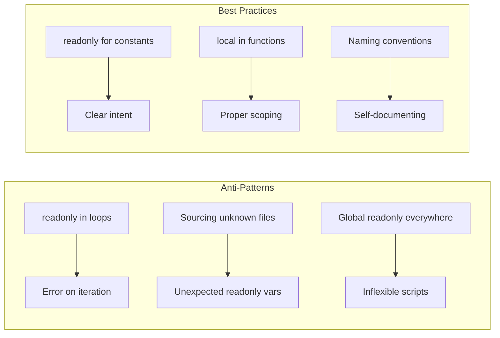

# How to Fix 'Cannot Assign to Read-Only' Errors

Author: [nawazdhandala](https://www.github.com/nawazdhandala)

Tags: Bash, Shell Scripting, Troubleshooting, Read-Only Variables, Linux, DevOps

Description: Learn how to diagnose and fix the 'cannot assign to read-only variable' error in Bash scripts, including best practices for variable declaration and scope management.

---

> The "cannot assign to read-only variable" error in Bash occurs when you attempt to modify a variable that has been declared as immutable. Understanding how to prevent and resolve this error is essential for writing robust shell scripts.

This guide covers the causes, diagnosis, and solutions for read-only variable errors in Bash scripting.

---

## Understanding Read-Only Variables



Read-only variables in Bash are created using either the `readonly` builtin or `declare -r`. Once a variable is marked as read-only, it cannot be modified or unset for the remainder of the shell session or script execution.

---

## Common Causes of Read-Only Errors

### 1. Explicit Read-Only Declaration

```bash
#!/bin/bash
# Explicitly declaring a variable as read-only

# Create a read-only variable
readonly CONFIG_PATH="/etc/myapp/config.yaml"

# Later in the script, attempting to change it
CONFIG_PATH="/tmp/config.yaml"  # Error: cannot assign to read-only variable
```

### 2. Using declare -r

```bash
#!/bin/bash
# Using declare with the -r flag

# Declare a read-only variable
declare -r DATABASE_HOST="localhost"

# This will fail
DATABASE_HOST="remote-server"  # Error: cannot assign to read-only variable
```

### 3. Sourcing Files with Read-Only Variables

```bash
#!/bin/bash
# config.sh - a configuration file
readonly APP_VERSION="1.0.0"

# main.sh - sources the config file
source config.sh

# Attempting to override the version
APP_VERSION="2.0.0"  # Error: cannot assign to read-only variable
```

### 4. Loop Variables Accidentally Made Read-Only

```bash
#!/bin/bash
# Accidentally making a loop variable read-only

for i in 1 2 3; do
    readonly i  # This is almost always a mistake
    echo "$i"
done
# Next iteration fails because i is now read-only
```

---

## Diagnosing Read-Only Variable Errors

### Check If a Variable is Read-Only

```bash
#!/bin/bash
# Check if a variable is read-only

# Method 1: Using declare -p
declare -p MY_VAR 2>/dev/null
# Output will include -r if read-only: declare -r MY_VAR="value"

# Method 2: Create a function to check
is_readonly() {
    local var_name="$1"
    # Attempt to get variable attributes
    local attrs
    attrs=$(declare -p "$var_name" 2>/dev/null)

    if [[ "$attrs" == *"declare -"*"r"* ]]; then
        echo "$var_name is read-only"
        return 0
    else
        echo "$var_name is writable"
        return 1
    fi
}

# Usage
readonly MY_CONFIG="test"
is_readonly MY_CONFIG  # Output: MY_CONFIG is read-only
```

### List All Read-Only Variables

```bash
#!/bin/bash
# List all read-only variables in the current shell

# Method 1: Using readonly builtin
echo "Read-only variables:"
readonly -p

# Method 2: Filter for specific variables
readonly -p | grep "MY_"

# Method 3: Parse into an array
mapfile -t readonly_vars < <(readonly -p | sed 's/declare -[a-z]* //')
for var in "${readonly_vars[@]}"; do
    echo "Found: $var"
done
```

---

## Solutions and Workarounds

### Solution 1: Use Conditional Assignment

```bash
#!/bin/bash
# Only assign if variable is not read-only

# Check before assignment
assign_if_writable() {
    local var_name="$1"
    local value="$2"

    # Check if variable is read-only
    if declare -p "$var_name" 2>/dev/null | grep -q 'declare -[a-z]*r'; then
        echo "Warning: $var_name is read-only, skipping assignment" >&2
        return 1
    fi

    # Safe to assign
    eval "$var_name='$value'"
    return 0
}

# Usage
MY_VAR="initial"
assign_if_writable MY_VAR "new value"  # Works

readonly MY_VAR
assign_if_writable MY_VAR "another value"  # Warns and skips
```

### Solution 2: Use Default Values Pattern

```bash
#!/bin/bash
# Use parameter expansion for defaults instead of readonly

# Instead of this problematic pattern:
# readonly DEFAULT_PORT=8080
# PORT=$DEFAULT_PORT
# PORT=9090  # Error if you try to reassign DEFAULT_PORT

# Use this pattern:
DEFAULT_PORT=8080
PORT="${PORT:-$DEFAULT_PORT}"  # Use PORT if set, otherwise default

# Now you can safely override
PORT=9090  # Works fine
echo "Using port: $PORT"
```

### Solution 3: Scope with Subshells

```bash
#!/bin/bash
# Use subshells to isolate read-only variables

# Main script sets a read-only variable
readonly GLOBAL_CONFIG="/etc/app/config"

# Need to use a different config temporarily
(
    # Inside subshell, GLOBAL_CONFIG is inherited but we can create a new one
    # Note: We cannot modify the inherited read-only variable
    # But we can use a different variable name
    LOCAL_CONFIG="/tmp/test-config"

    # Run tests with local config
    ./run_tests.sh --config "$LOCAL_CONFIG"
)

# Back in main shell, original read-only is still available
echo "Main config: $GLOBAL_CONFIG"
```

### Solution 4: Use Functions with Local Variables

```bash
#!/bin/bash
# Use local variables in functions to avoid read-only conflicts

readonly BASE_URL="https://api.example.com"

# Function that needs flexibility
make_request() {
    # Use local variable that shadows the global
    local url="${1:-$BASE_URL}"

    echo "Making request to: $url"
    curl -s "$url"
}

# Use default
make_request

# Override for this call only
make_request "https://staging.api.example.com"

# Global read-only is unchanged
echo "Base URL is still: $BASE_URL"
```

---

## Best Practices for Read-Only Variables

### 1. Use Naming Conventions

```bash
#!/bin/bash
# Use clear naming conventions for read-only variables

# Convention: UPPERCASE for constants/read-only
readonly DATABASE_NAME="production_db"
readonly MAX_RETRIES=3

# Convention: lowercase for mutable variables
current_retry=0
connection_status="disconnected"

# This makes it clear which variables should not be modified
```

### 2. Declare Read-Only at the Top

```bash
#!/bin/bash
# Declare all read-only variables at the top of your script

# Configuration constants - DO NOT MODIFY
readonly SCRIPT_VERSION="2.0.0"
readonly SCRIPT_DIR="$(cd "$(dirname "${BASH_SOURCE[0]}")" && pwd)"
readonly LOG_FILE="/var/log/myapp.log"
readonly CONFIG_DIR="/etc/myapp"

# Default values that CAN be overridden
DEFAULT_TIMEOUT=30
DEFAULT_RETRIES=3

# Runtime variables
timeout="${CUSTOM_TIMEOUT:-$DEFAULT_TIMEOUT}"
retries="${CUSTOM_RETRIES:-$DEFAULT_RETRIES}"

main() {
    echo "Script version: $SCRIPT_VERSION"
    echo "Using timeout: $timeout"
}

main "$@"
```

### 3. Document Read-Only Variables

```bash
#!/bin/bash
# Document why variables are read-only

# SCRIPT_DIR: Absolute path to script directory
# Read-only because: Must remain constant for relative path resolution
readonly SCRIPT_DIR="$(cd "$(dirname "${BASH_SOURCE[0]}")" && pwd)"

# API_ENDPOINT: Production API URL
# Read-only because: Prevents accidental modification that could cause data loss
readonly API_ENDPOINT="https://api.production.example.com"

# MAX_FILE_SIZE: Maximum upload size in bytes (100MB)
# Read-only because: Security constraint, should not be modified at runtime
readonly MAX_FILE_SIZE=$((100 * 1024 * 1024))
```

---

## Common Patterns and Anti-Patterns



### Anti-Pattern: Overusing Read-Only

```bash
#!/bin/bash
# ANTI-PATTERN: Making everything read-only

# Don't do this - it makes debugging difficult
readonly result=$(some_command)
readonly status=$?
readonly output=""

# If you need to check or modify these later, you cannot
```

### Better Pattern: Selective Read-Only

```bash
#!/bin/bash
# BETTER: Only use read-only for true constants

# True constants - safe to make read-only
readonly VERSION="1.0.0"
readonly SCRIPT_NAME="$(basename "$0")"

# Working variables - keep mutable
result=$(some_command)
status=$?
output=""

# Can modify as needed
if [[ $status -ne 0 ]]; then
    output="Error: command failed"
fi
```

---

## Debugging Read-Only Issues

```bash
#!/bin/bash
# Script to debug read-only variable issues

debug_readonly() {
    echo "=== Read-Only Variable Debug ===" >&2
    echo "" >&2

    # List all read-only variables
    echo "Current read-only variables:" >&2
    while IFS= read -r line; do
        # Extract variable name and value
        if [[ "$line" =~ declare\ -[a-z]*r[a-z]*\ ([A-Za-z_][A-Za-z0-9_]*)= ]]; then
            var_name="${BASH_REMATCH[1]}"
            echo "  - $var_name" >&2
        fi
    done < <(declare -p 2>/dev/null | grep 'declare -[a-z]*r')

    echo "" >&2
    echo "Total read-only variables: $(readonly -p | wc -l)" >&2
}

# Call this function when debugging
set -e
trap 'debug_readonly' ERR

# Your script logic here
readonly TEST="value"
TEST="new"  # This will trigger the debug output on error
```

---

## Summary

To avoid "cannot assign to read-only variable" errors:

1. **Check variable status** before assignment with `declare -p`
2. **Use naming conventions** to distinguish constants from variables
3. **Leverage local variables** in functions for flexibility
4. **Use subshells** when you need temporary overrides
5. **Document read-only variables** and their purpose
6. **Only use read-only** for true constants that should never change

---

*Managing shell scripts across your infrastructure? [OneUptime](https://oneuptime.com) provides monitoring and alerting to catch script failures before they impact your users.*

**Related Reading:**
- [How to Handle Script Debugging with set -x](https://oneuptime.com/blog/post/2026-01-24-bash-debugging-set-x/view)
- [How to Write Portable Shell Scripts](https://oneuptime.com/blog/post/2026-01-24-portable-shell-scripts/view)
