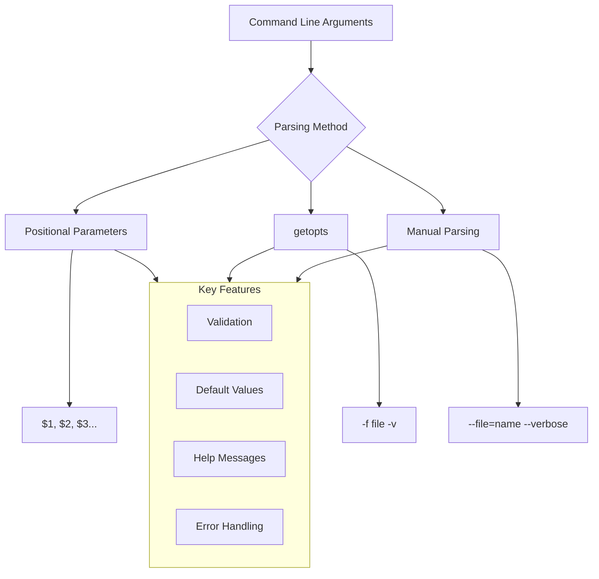
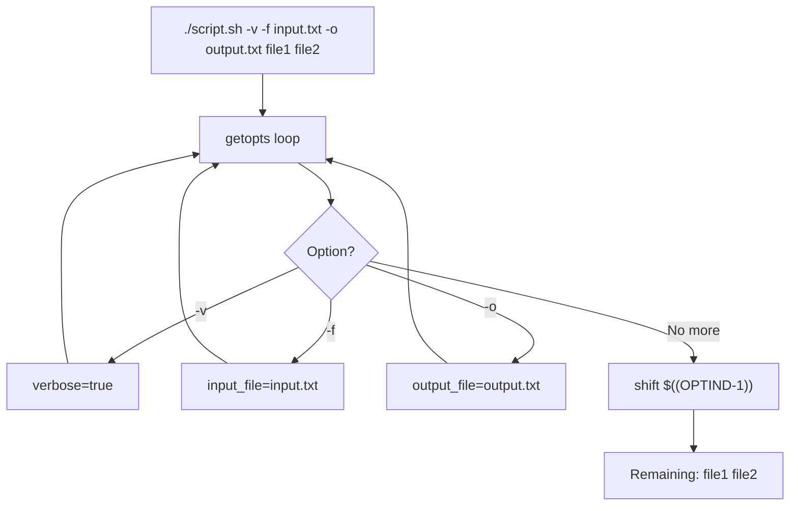
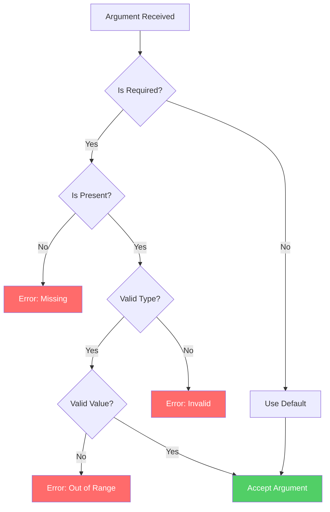

# How to Handle Command Line Arguments in Bash

Author: [nawazdhandala](https://www.github.com/nawazdhandala)

Tags: Bash, Shell Scripting, Command Line, Arguments, getopts, Linux, DevOps

Description: A comprehensive guide to parsing and handling command line arguments in Bash scripts using positional parameters, getopts, and manual parsing techniques.

---

> Command line arguments make scripts flexible and reusable. This guide covers everything from basic positional parameters to advanced argument parsing with validation and help messages.

---

## Argument Handling Overview



---

## Positional Parameters

The simplest way to access command line arguments.

### Basic Positional Parameters

```bash
#!/bin/bash
# Accessing positional parameters

# Script name
echo "Script name: $0"

# Individual arguments
echo "First argument: $1"
echo "Second argument: $2"
echo "Third argument: $3"

# Number of arguments
echo "Number of arguments: $#"

# All arguments as separate words
echo "All arguments (\$@): $@"

# All arguments as single string
echo "All arguments (\$*): $*"

# Last argument
echo "Last argument: ${!#}"

# Process ID
echo "Script PID: $$"

# Exit status of last command
echo "Last exit status: $?"
```

### Difference Between $@ and $*

```bash
#!/bin/bash
# Understanding $@ vs $*

demo_args() {
    echo "Using \$@:"
    for arg in "$@"; do
        echo "  Arg: '$arg'"
    done

    echo "Using \$*:"
    for arg in "$*"; do
        echo "  Arg: '$arg'"
    done
}

# Call with: ./script.sh "hello world" foo bar
# $@ preserves argument boundaries
# $* combines all arguments into one string
demo_args "$@"
```

Output when called with `./script.sh "hello world" foo bar`:

```
Using $@:
  Arg: 'hello world'
  Arg: 'foo'
  Arg: 'bar'
Using $*:
  Arg: 'hello world foo bar'
```

### Shifting Arguments

```bash
#!/bin/bash
# Using shift to process arguments

echo "Total arguments: $#"

while [[ $# -gt 0 ]]; do
    echo "Processing: $1"
    shift  # Remove first argument, shift others down
done

echo "Remaining arguments: $#"
```

---

## Using getopts for Short Options

The `getopts` builtin handles short options like `-f`, `-v`, `-o output`.

### Basic getopts Usage

```bash
#!/bin/bash
# Basic getopts example

usage() {
    echo "Usage: $0 [-v] [-f file] [-o output] [-h]"
    echo "  -v          Enable verbose mode"
    echo "  -f file     Input file"
    echo "  -o output   Output file"
    echo "  -h          Show this help"
    exit 1
}

# Default values
verbose=false
input_file=""
output_file=""

# Parse options
# The colon after a letter means it requires an argument
while getopts "vf:o:h" opt; do
    case $opt in
        v)
            verbose=true
            ;;
        f)
            input_file="$OPTARG"
            ;;
        o)
            output_file="$OPTARG"
            ;;
        h)
            usage
            ;;
        \?)
            echo "Invalid option: -$OPTARG" >&2
            usage
            ;;
        :)
            echo "Option -$OPTARG requires an argument" >&2
            usage
            ;;
    esac
done

# Remove parsed options from argument list
shift $((OPTIND - 1))

# Remaining arguments (non-option)
echo "Verbose: $verbose"
echo "Input file: $input_file"
echo "Output file: $output_file"
echo "Remaining args: $@"
```



### Combined Short Options

```bash
#!/bin/bash
# getopts handles combined options: -vf file is same as -v -f file

while getopts "vf:o:" opt; do
    case $opt in
        v) echo "Verbose enabled" ;;
        f) echo "File: $OPTARG" ;;
        o) echo "Output: $OPTARG" ;;
    esac
done

# All these are equivalent:
# ./script.sh -v -f input.txt
# ./script.sh -vf input.txt
# ./script.sh -fv input.txt  # Note: won't work, -f needs argument
```

---

## Manual Parsing for Long Options

For GNU-style long options like `--verbose` and `--file=name`.

### Basic Long Option Parsing

```bash
#!/bin/bash
# Manual parsing for long options

usage() {
    cat << EOF
Usage: $0 [OPTIONS] [FILES...]

Options:
    -v, --verbose       Enable verbose output
    -f, --file FILE     Specify input file
    -o, --output FILE   Specify output file
    -n, --dry-run       Show what would be done
    -h, --help          Show this help message

Examples:
    $0 --verbose --file input.txt
    $0 -v -f input.txt -o output.txt
EOF
    exit "${1:-0}"
}

# Default values
verbose=false
dry_run=false
input_file=""
output_file=""
files=()

# Parse arguments
while [[ $# -gt 0 ]]; do
    case $1 in
        -v|--verbose)
            verbose=true
            shift
            ;;
        -n|--dry-run)
            dry_run=true
            shift
            ;;
        -f|--file)
            if [[ -z "$2" ]] || [[ "$2" == -* ]]; then
                echo "Error: --file requires an argument" >&2
                usage 1
            fi
            input_file="$2"
            shift 2
            ;;
        --file=*)
            input_file="${1#*=}"
            shift
            ;;
        -o|--output)
            if [[ -z "$2" ]] || [[ "$2" == -* ]]; then
                echo "Error: --output requires an argument" >&2
                usage 1
            fi
            output_file="$2"
            shift 2
            ;;
        --output=*)
            output_file="${1#*=}"
            shift
            ;;
        -h|--help)
            usage 0
            ;;
        --)
            # End of options
            shift
            files+=("$@")
            break
            ;;
        -*)
            echo "Error: Unknown option: $1" >&2
            usage 1
            ;;
        *)
            # Non-option argument
            files+=("$1")
            shift
            ;;
    esac
done

# Display parsed values
echo "Verbose: $verbose"
echo "Dry run: $dry_run"
echo "Input file: $input_file"
echo "Output file: $output_file"
echo "Files: ${files[*]}"
```

### Handling --option=value Syntax

```bash
#!/bin/bash
# Parse --option=value format

parse_option_value() {
    local arg="$1"

    # Extract option name (everything before =)
    local option="${arg%%=*}"

    # Extract value (everything after =)
    local value="${arg#*=}"

    echo "Option: $option"
    echo "Value: $value"
}

# Examples
parse_option_value "--config=/etc/app.conf"
# Output:
# Option: --config
# Value: /etc/app.conf

parse_option_value "--name=John Doe"
# Output:
# Option: --name
# Value: John Doe
```

---

## Argument Validation

Always validate arguments before using them.

### Required Arguments

```bash
#!/bin/bash
# Validating required arguments

config_file=""
output_dir=""

while [[ $# -gt 0 ]]; do
    case $1 in
        -c|--config)
            config_file="$2"
            shift 2
            ;;
        -o|--output)
            output_dir="$2"
            shift 2
            ;;
        *)
            shift
            ;;
    esac
done

# Check required arguments
errors=()

if [[ -z "$config_file" ]]; then
    errors+=("--config is required")
fi

if [[ -z "$output_dir" ]]; then
    errors+=("--output is required")
fi

# Display all errors
if [[ ${#errors[@]} -gt 0 ]]; then
    echo "Error: Missing required arguments:" >&2
    for error in "${errors[@]}"; do
        echo "  - $error" >&2
    done
    exit 1
fi

echo "Config: $config_file"
echo "Output: $output_dir"
```

### Type Validation

```bash
#!/bin/bash
# Validate argument types

validate_integer() {
    local value="$1"
    local name="$2"

    if ! [[ "$value" =~ ^[0-9]+$ ]]; then
        echo "Error: $name must be a positive integer, got: $value" >&2
        return 1
    fi
    return 0
}

validate_file() {
    local file="$1"
    local name="$2"

    if [[ ! -f "$file" ]]; then
        echo "Error: $name file does not exist: $file" >&2
        return 1
    fi

    if [[ ! -r "$file" ]]; then
        echo "Error: $name file is not readable: $file" >&2
        return 1
    fi

    return 0
}

validate_directory() {
    local dir="$1"
    local name="$2"
    local create="${3:-false}"

    if [[ ! -d "$dir" ]]; then
        if [[ "$create" == "true" ]]; then
            mkdir -p "$dir" || {
                echo "Error: Cannot create $name directory: $dir" >&2
                return 1
            }
        else
            echo "Error: $name directory does not exist: $dir" >&2
            return 1
        fi
    fi

    return 0
}

# Usage
count="$1"
input="$2"
output="$3"

validate_integer "$count" "count" || exit 1
validate_file "$input" "input" || exit 1
validate_directory "$output" "output" true || exit 1

echo "All validations passed"
```



---

## Complete Script Template

A production-ready template with all features.

```bash
#!/bin/bash
#
# Script: process_data.sh
# Description: Process data files with various options
# Author: Your Name
# Version: 1.0.0
#

set -euo pipefail

# Script constants
readonly SCRIPT_NAME=$(basename "$0")
readonly SCRIPT_DIR=$(cd "$(dirname "$0")" && pwd)
readonly VERSION="1.0.0"

# Default values
VERBOSE=false
DRY_RUN=false
CONFIG_FILE=""
OUTPUT_DIR="./output"
LOG_LEVEL="info"
MAX_WORKERS=4

# Color codes for output
readonly RED='\033[0;31m'
readonly GREEN='\033[0;32m'
readonly YELLOW='\033[0;33m'
readonly NC='\033[0m'  # No Color

# Logging functions
log_info() {
    echo -e "${GREEN}[INFO]${NC} $*"
}

log_warn() {
    echo -e "${YELLOW}[WARN]${NC} $*" >&2
}

log_error() {
    echo -e "${RED}[ERROR]${NC} $*" >&2
}

log_debug() {
    if [[ "$VERBOSE" == "true" ]]; then
        echo -e "[DEBUG] $*"
    fi
}

# Help message
usage() {
    cat << EOF
$SCRIPT_NAME v$VERSION - Process data files

USAGE:
    $SCRIPT_NAME [OPTIONS] FILE [FILE...]

OPTIONS:
    -c, --config FILE       Configuration file (required)
    -o, --output DIR        Output directory (default: ./output)
    -w, --workers NUM       Number of parallel workers (default: 4)
    -l, --log-level LEVEL   Log level: debug, info, warn, error (default: info)

    -v, --verbose           Enable verbose output
    -n, --dry-run           Show what would be done without making changes

    -h, --help              Show this help message
    --version               Show version information

EXAMPLES:
    $SCRIPT_NAME -c config.yaml data/*.csv
    $SCRIPT_NAME --config=config.yaml --output=/tmp/results file.csv
    $SCRIPT_NAME -v -n -c config.yaml *.txt

For more information, see: https://example.com/docs
EOF
}

# Version info
show_version() {
    echo "$SCRIPT_NAME version $VERSION"
}

# Validation functions
validate_args() {
    local errors=()

    # Check required arguments
    if [[ -z "$CONFIG_FILE" ]]; then
        errors+=("Configuration file is required (--config)")
    elif [[ ! -f "$CONFIG_FILE" ]]; then
        errors+=("Configuration file not found: $CONFIG_FILE")
    fi

    # Check files provided
    if [[ ${#FILES[@]} -eq 0 ]]; then
        errors+=("At least one input file is required")
    fi

    # Validate each input file
    for file in "${FILES[@]}"; do
        if [[ ! -f "$file" ]]; then
            errors+=("Input file not found: $file")
        fi
    done

    # Validate numeric arguments
    if ! [[ "$MAX_WORKERS" =~ ^[1-9][0-9]*$ ]]; then
        errors+=("Workers must be a positive integer: $MAX_WORKERS")
    fi

    # Validate log level
    case "$LOG_LEVEL" in
        debug|info|warn|error) ;;
        *) errors+=("Invalid log level: $LOG_LEVEL") ;;
    esac

    # Report errors
    if [[ ${#errors[@]} -gt 0 ]]; then
        log_error "Validation failed:"
        for error in "${errors[@]}"; do
            echo "  - $error" >&2
        done
        echo "" >&2
        echo "Use '$SCRIPT_NAME --help' for usage information" >&2
        exit 1
    fi
}

# Parse command line arguments
parse_args() {
    FILES=()

    while [[ $# -gt 0 ]]; do
        case $1 in
            -c|--config)
                CONFIG_FILE="$2"
                shift 2
                ;;
            --config=*)
                CONFIG_FILE="${1#*=}"
                shift
                ;;
            -o|--output)
                OUTPUT_DIR="$2"
                shift 2
                ;;
            --output=*)
                OUTPUT_DIR="${1#*=}"
                shift
                ;;
            -w|--workers)
                MAX_WORKERS="$2"
                shift 2
                ;;
            --workers=*)
                MAX_WORKERS="${1#*=}"
                shift
                ;;
            -l|--log-level)
                LOG_LEVEL="$2"
                shift 2
                ;;
            --log-level=*)
                LOG_LEVEL="${1#*=}"
                shift
                ;;
            -v|--verbose)
                VERBOSE=true
                shift
                ;;
            -n|--dry-run)
                DRY_RUN=true
                shift
                ;;
            -h|--help)
                usage
                exit 0
                ;;
            --version)
                show_version
                exit 0
                ;;
            --)
                shift
                FILES+=("$@")
                break
                ;;
            -*)
                log_error "Unknown option: $1"
                echo "Use '$SCRIPT_NAME --help' for usage" >&2
                exit 1
                ;;
            *)
                FILES+=("$1")
                shift
                ;;
        esac
    done
}

# Main processing function
process_files() {
    log_info "Starting processing with ${#FILES[@]} files"
    log_debug "Config: $CONFIG_FILE"
    log_debug "Output: $OUTPUT_DIR"
    log_debug "Workers: $MAX_WORKERS"

    # Create output directory
    if [[ "$DRY_RUN" == "true" ]]; then
        log_info "[DRY-RUN] Would create directory: $OUTPUT_DIR"
    else
        mkdir -p "$OUTPUT_DIR"
    fi

    # Process each file
    for file in "${FILES[@]}"; do
        log_info "Processing: $file"

        if [[ "$DRY_RUN" == "true" ]]; then
            log_info "[DRY-RUN] Would process: $file"
        else
            # Add your processing logic here
            log_debug "Processing $file..."
        fi
    done

    log_info "Processing complete"
}

# Main entry point
main() {
    parse_args "$@"
    validate_args
    process_files
}

# Run main function with all arguments
main "$@"
```

---

## Special Cases

### Handling Arguments with Spaces

```bash
#!/bin/bash
# Always quote variables to handle spaces

process_files() {
    for file in "$@"; do
        echo "Processing: '$file'"
        # Use quotes when using the variable
        if [[ -f "$file" ]]; then
            wc -l "$file"
        fi
    done
}

# Call with quoted arguments
process_files "file with spaces.txt" "another file.txt"
```

### Handling Arguments Starting with Dash

```bash
#!/bin/bash
# Use -- to separate options from arguments

# Without --: "-myfile.txt" would be parsed as an option
rm -myfile.txt      # Error: invalid option

# With --: Everything after is treated as a filename
rm -- -myfile.txt   # Correctly deletes file named "-myfile.txt"

# In your scripts
while [[ $# -gt 0 ]]; do
    case $1 in
        --)
            shift
            # All remaining args are files
            files=("$@")
            break
            ;;
        -*)
            # Handle options
            ;;
        *)
            files+=("$1")
            shift
            ;;
    esac
done
```

### Interactive Argument Prompts

```bash
#!/bin/bash
# Prompt for missing arguments interactively

get_input() {
    local prompt="$1"
    local var_name="$2"
    local default="${3:-}"
    local value

    if [[ -n "$default" ]]; then
        read -p "$prompt [$default]: " value
        value="${value:-$default}"
    else
        read -p "$prompt: " value
    fi

    printf -v "$var_name" '%s' "$value"
}

# Only prompt if not provided via command line
if [[ -z "$input_file" ]]; then
    if [[ -t 0 ]]; then  # Check if running interactively
        get_input "Enter input file" input_file "default.txt"
    else
        echo "Error: --input is required in non-interactive mode" >&2
        exit 1
    fi
fi

echo "Using input file: $input_file"
```

---

## Summary

Effective command line argument handling requires:

1. **Choose the right parsing method** - getopts for simple scripts, manual for long options
2. **Provide clear help messages** - Document all options and show examples
3. **Validate all inputs** - Check types, ranges, and required arguments
4. **Use sensible defaults** - Make scripts usable without specifying every option
5. **Handle edge cases** - Spaces in arguments, dashes in filenames, empty values

---

*Building CLI tools that need monitoring? [OneUptime](https://oneuptime.com) helps you track script execution and alert on failures.*

**Related Reading:**
- [Bash Script Best Practices](https://oneuptime.com/blog/post/2026-02-13-bash-best-practices)
- [Building Robust Shell Scripts](https://oneuptime.com/blog/post/2026-01-24-portable-shell-scripts)
