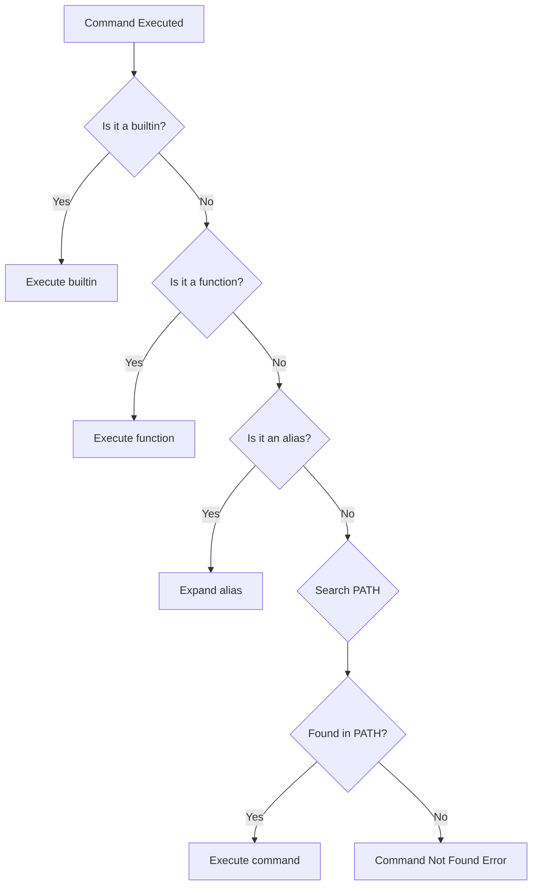
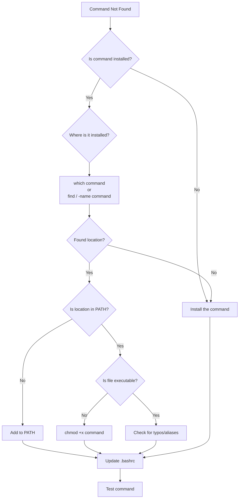
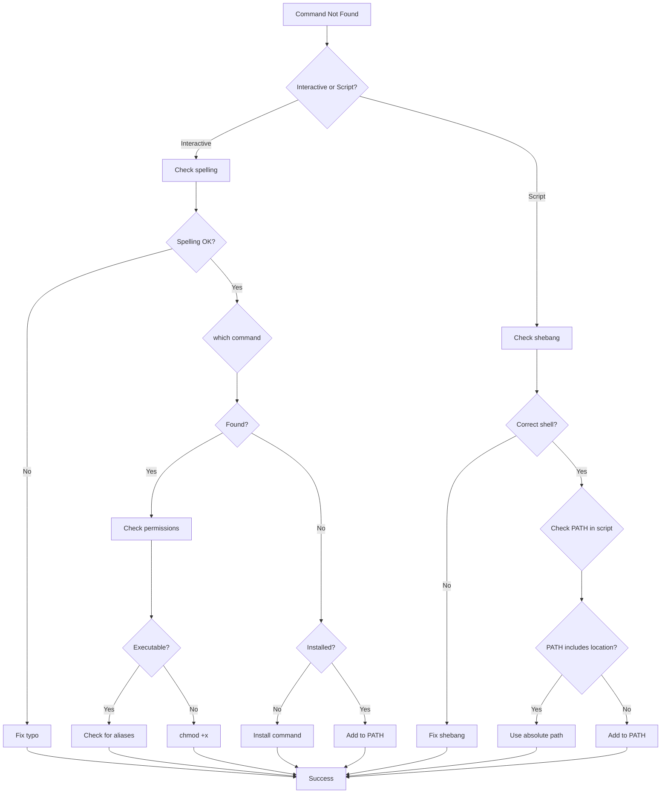

# How to Fix 'Command Not Found' Errors in Bash Scripts

Author: [nawazdhandala](https://www.github.com/nawazdhandala)

Tags: Bash, Shell Scripting, Debugging, Linux, DevOps, PATH, Troubleshooting

Description: Learn how to diagnose and fix 'command not found' errors in Bash scripts, including PATH issues, missing dependencies, and environment configuration problems.

---

> The "command not found" error is one of the most common issues when running Bash scripts. While it seems straightforward, the causes can range from simple typos to complex environment configuration problems. This guide will help you systematically diagnose and resolve these errors.

Understanding why commands are not found and how to fix them is essential for reliable shell scripting.

---

## Understanding the Error

When Bash cannot locate a command, you see:

```
bash: command_name: command not found
```

Or in scripts:

```
./script.sh: line 5: command_name: command not found
```



---

## Common Causes and Solutions

### 1. Command Not Installed

The most basic cause is that the command simply is not installed.

```bash
#!/bin/bash
# Check if a command exists before using it

# Method 1: Using command -v (POSIX compliant)
if command -v docker &> /dev/null; then
    echo "Docker is installed"
    docker --version
else
    echo "Error: Docker is not installed"
    echo "Install with: sudo apt install docker.io"
    exit 1
fi

# Method 2: Using which (less portable)
if which python3 &> /dev/null; then
    echo "Python3 is installed"
else
    echo "Python3 not found"
fi

# Method 3: Using type (bash builtin)
if type -P node &> /dev/null; then
    echo "Node.js is installed"
else
    echo "Node.js not found"
fi

# Check multiple commands at once
required_commands=("git" "curl" "jq" "docker")

for cmd in "${required_commands[@]}"; do
    if ! command -v "$cmd" &> /dev/null; then
        echo "Error: Required command '$cmd' is not installed"
        exit 1
    fi
done

echo "All required commands are available"
```

### 2. PATH Environment Variable Issues

The most common cause of "command not found" is the command not being in PATH.

```bash
#!/bin/bash
# Diagnose and fix PATH issues

# View current PATH
echo "Current PATH:"
echo "$PATH" | tr ':' '\n'

# Check if a directory is in PATH
check_in_path() {
    local dir="$1"
    if [[ ":$PATH:" == *":$dir:"* ]]; then
        echo "$dir is in PATH"
        return 0
    else
        echo "$dir is NOT in PATH"
        return 1
    fi
}

check_in_path "/usr/local/bin"
check_in_path "$HOME/.local/bin"

# Find where a command is located
find_command() {
    local cmd="$1"

    # Check if it exists anywhere on the system
    local locations=$(find /usr /opt "$HOME" -name "$cmd" -type f 2>/dev/null)

    if [[ -n "$locations" ]]; then
        echo "Found $cmd at:"
        echo "$locations"
    else
        echo "$cmd not found on system"
    fi
}

# Add directory to PATH for current session
export PATH="$PATH:/new/directory"

# Add directory to PATH permanently
# Add to ~/.bashrc or ~/.bash_profile:
# export PATH="$PATH:$HOME/.local/bin"
```

### 3. Scripts Running with Different PATH

When scripts run via cron, systemd, or as different users, they may have a different PATH.

```bash
#!/bin/bash
# Script that works regardless of PATH

# Method 1: Use absolute paths
/usr/bin/python3 --version
/usr/local/bin/node --version

# Method 2: Set PATH explicitly at script start
export PATH="/usr/local/bin:/usr/bin:/bin:/usr/local/sbin:/usr/sbin:/sbin"

# Method 3: Source user profile
source "$HOME/.bashrc" 2>/dev/null || source "$HOME/.profile" 2>/dev/null

# Method 4: Define command paths as variables
PYTHON="/usr/bin/python3"
NODE="/usr/local/bin/node"
DOCKER="/usr/bin/docker"

"$PYTHON" --version
"$NODE" --version
"$DOCKER" --version

# Method 5: Find command dynamically
find_command_path() {
    local cmd="$1"
    local common_paths=("/usr/local/bin" "/usr/bin" "/bin" "/opt/bin")

    for path in "${common_paths[@]}"; do
        if [[ -x "$path/$cmd" ]]; then
            echo "$path/$cmd"
            return 0
        fi
    done

    return 1
}

KUBECTL=$(find_command_path "kubectl") || {
    echo "Error: kubectl not found"
    exit 1
}

"$KUBECTL" version --client
```

### 4. Cron Job PATH Issues

Cron runs with a minimal PATH, causing many "command not found" errors.

```bash
#!/bin/bash
# Script designed to run in cron

# Set comprehensive PATH at the beginning
PATH="/usr/local/bin:/usr/bin:/bin:/usr/sbin:/sbin"
PATH="$PATH:$HOME/.local/bin:$HOME/bin"
export PATH

# Log the environment for debugging
log_file="/var/log/my_cron_script.log"

{
    echo "=== Script started at $(date) ==="
    echo "PATH: $PATH"
    echo "USER: $(whoami)"
    echo "PWD: $(pwd)"
    echo "HOME: $HOME"

    # Your actual script logic here
    if command -v docker &> /dev/null; then
        docker ps
    else
        echo "ERROR: docker not found"
    fi

    echo "=== Script completed at $(date) ==="
} >> "$log_file" 2>&1
```

Crontab entry:

```
# Set PATH in crontab directly
PATH=/usr/local/bin:/usr/bin:/bin

# Or use full path in cron command
0 * * * * /usr/local/bin/my_script.sh
```

---

## Diagnosing PATH Problems

### Step-by-Step Diagnosis



### Diagnostic Script

```bash
#!/bin/bash
# Comprehensive command diagnosis tool

diagnose_command() {
    local cmd="$1"

    echo "=== Diagnosing: $cmd ==="
    echo

    # Check if it is a builtin
    if type -t "$cmd" 2>/dev/null | grep -q "builtin"; then
        echo "[OK] '$cmd' is a shell builtin"
        return 0
    fi

    # Check if it is a function
    if type -t "$cmd" 2>/dev/null | grep -q "function"; then
        echo "[OK] '$cmd' is a shell function"
        type "$cmd"
        return 0
    fi

    # Check if it is an alias
    if type -t "$cmd" 2>/dev/null | grep -q "alias"; then
        echo "[OK] '$cmd' is an alias"
        alias "$cmd" 2>/dev/null
        return 0
    fi

    # Check if command is in PATH
    local cmd_path
    cmd_path=$(command -v "$cmd" 2>/dev/null)

    if [[ -n "$cmd_path" ]]; then
        echo "[OK] Found in PATH: $cmd_path"
        ls -la "$cmd_path"
        file "$cmd_path"
        return 0
    fi

    echo "[ERROR] '$cmd' not found in PATH"
    echo
    echo "Current PATH directories:"
    echo "$PATH" | tr ':' '\n' | while read -r dir; do
        if [[ -d "$dir" ]]; then
            echo "  [exists] $dir"
        else
            echo "  [missing] $dir"
        fi
    done

    echo
    echo "Searching for '$cmd' on system..."

    # Search common locations
    local found=false
    local search_paths=(
        "/usr/local/bin"
        "/usr/bin"
        "/bin"
        "/usr/local/sbin"
        "/usr/sbin"
        "/sbin"
        "/opt"
        "$HOME/.local/bin"
        "$HOME/bin"
        "/snap/bin"
    )

    for search_path in "${search_paths[@]}"; do
        if [[ -x "$search_path/$cmd" ]]; then
            echo "  Found: $search_path/$cmd"
            found=true
        fi
    done

    if [[ "$found" == "false" ]]; then
        echo "  Not found in common locations"
        echo
        echo "Suggestions:"
        echo "  1. Install the command using your package manager"
        echo "  2. Check if the command name is spelled correctly"
        echo "  3. Use 'apt search $cmd' or 'yum search $cmd' to find packages"
    else
        echo
        echo "To fix, add the directory to your PATH:"
        echo "  export PATH=\"\$PATH:/path/to/directory\""
        echo "  Add this line to ~/.bashrc for permanent fix"
    fi

    return 1
}

# Run diagnosis
if [[ $# -eq 0 ]]; then
    echo "Usage: $0 <command_name>"
    exit 1
fi

diagnose_command "$1"
```

---

## Fixing Specific Scenarios

### Python Command Not Found

```bash
#!/bin/bash
# Handle Python version differences

# Problem: 'python' command not found (Python 3 systems)
# Solution 1: Use python3 explicitly
python3 --version

# Solution 2: Create alias in script
if ! command -v python &> /dev/null; then
    if command -v python3 &> /dev/null; then
        alias python=python3
        shopt -s expand_aliases
    fi
fi

# Solution 3: Use env with fallback
PYTHON=$(command -v python3 || command -v python)
if [[ -z "$PYTHON" ]]; then
    echo "Error: Python not found"
    exit 1
fi

"$PYTHON" --version

# Solution 4: Create symlink (system-wide fix)
# sudo ln -s /usr/bin/python3 /usr/bin/python
```

### Node.js and npm Not Found

```bash
#!/bin/bash
# Handle Node.js installation via nvm

# nvm installs Node in non-standard location
# Load nvm if available
export NVM_DIR="$HOME/.nvm"
[ -s "$NVM_DIR/nvm.sh" ] && source "$NVM_DIR/nvm.sh"

# Or use absolute path
NODE_PATH="$HOME/.nvm/versions/node/$(ls "$HOME/.nvm/versions/node" | tail -1)/bin"
export PATH="$PATH:$NODE_PATH"

# Verify
node --version
npm --version
```

### Docker Command Not Found

```bash
#!/bin/bash
# Docker troubleshooting

# Check if Docker is installed
if ! command -v docker &> /dev/null; then
    echo "Docker is not installed"
    echo "Install with:"
    echo "  Ubuntu: sudo apt install docker.io"
    echo "  CentOS: sudo yum install docker"
    exit 1
fi

# Check if Docker daemon is running
if ! docker info &> /dev/null; then
    echo "Docker daemon is not running"
    echo "Start with: sudo systemctl start docker"
    exit 1
fi

# Check if user is in docker group
if ! groups | grep -q docker; then
    echo "User is not in docker group"
    echo "Add with: sudo usermod -aG docker $USER"
    echo "Then log out and back in"
    exit 1
fi

docker --version
```

### kubectl Not Found

```bash
#!/bin/bash
# Handle kubectl in different installations

# Common kubectl locations
KUBECTL_PATHS=(
    "/usr/local/bin/kubectl"
    "/usr/bin/kubectl"
    "$HOME/.local/bin/kubectl"
    "/snap/bin/kubectl"
    "$HOME/bin/kubectl"
)

# Find kubectl
KUBECTL=""
for path in "${KUBECTL_PATHS[@]}"; do
    if [[ -x "$path" ]]; then
        KUBECTL="$path"
        break
    fi
done

if [[ -z "$KUBECTL" ]]; then
    # Check if it is available via command
    KUBECTL=$(command -v kubectl 2>/dev/null)
fi

if [[ -z "$KUBECTL" ]]; then
    echo "kubectl not found"
    echo "Install from: https://kubernetes.io/docs/tasks/tools/"
    exit 1
fi

"$KUBECTL" version --client
```

---

## Prevention Strategies

### 1. Add Dependency Checks to Scripts

```bash
#!/bin/bash
# Template for scripts with dependency checking

# Define required commands
REQUIRED_COMMANDS=(
    "curl"
    "jq"
    "docker"
)

# Optional commands with alternatives
declare -A OPTIONAL_COMMANDS=(
    [editor]="vim:nano:vi"
    [pager]="less:more:cat"
)

# Check required commands
check_dependencies() {
    local missing=()

    for cmd in "${REQUIRED_COMMANDS[@]}"; do
        if ! command -v "$cmd" &> /dev/null; then
            missing+=("$cmd")
        fi
    done

    if [[ ${#missing[@]} -gt 0 ]]; then
        echo "Error: Missing required commands:"
        for cmd in "${missing[@]}"; do
            echo "  - $cmd"
        done
        echo
        echo "Please install missing commands and try again."
        exit 1
    fi

    echo "All required dependencies are available."
}

# Find first available alternative
find_alternative() {
    local alternatives="$1"
    IFS=':' read -ra cmds <<< "$alternatives"

    for cmd in "${cmds[@]}"; do
        if command -v "$cmd" &> /dev/null; then
            echo "$cmd"
            return 0
        fi
    done

    return 1
}

# Set up optional commands
setup_optional() {
    for key in "${!OPTIONAL_COMMANDS[@]}"; do
        local cmd
        cmd=$(find_alternative "${OPTIONAL_COMMANDS[$key]}")
        if [[ -n "$cmd" ]]; then
            declare -g "$key"="$cmd"
            echo "Using $cmd for $key"
        else
            echo "Warning: No $key available"
        fi
    done
}

# Run checks
check_dependencies
setup_optional
```

### 2. Use Wrapper Functions

```bash
#!/bin/bash
# Wrapper functions that handle missing commands gracefully

safe_docker() {
    if command -v docker &> /dev/null; then
        docker "$@"
    else
        echo "Error: docker is not available" >&2
        return 1
    fi
}

safe_kubectl() {
    local kubectl_cmd
    kubectl_cmd=$(command -v kubectl || command -v kubectl.exe || echo "")

    if [[ -n "$kubectl_cmd" ]]; then
        "$kubectl_cmd" "$@"
    else
        echo "Error: kubectl is not available" >&2
        return 1
    fi
}

# Usage
safe_docker ps
safe_kubectl get pods
```

### 3. Portable PATH Setup

```bash
#!/bin/bash
# Portable PATH setup for scripts

setup_path() {
    # Standard system paths
    local standard_paths=(
        "/usr/local/bin"
        "/usr/bin"
        "/bin"
        "/usr/local/sbin"
        "/usr/sbin"
        "/sbin"
    )

    # User paths
    local user_paths=(
        "$HOME/.local/bin"
        "$HOME/bin"
        "$HOME/.cargo/bin"
        "$HOME/go/bin"
    )

    # Application paths
    local app_paths=(
        "/opt/bin"
        "/snap/bin"
    )

    # Build PATH
    local new_path=""

    for path in "${standard_paths[@]}" "${user_paths[@]}" "${app_paths[@]}"; do
        if [[ -d "$path" ]]; then
            new_path="$new_path:$path"
        fi
    done

    # Remove leading colon and export
    export PATH="${new_path#:}"

    echo "PATH configured with ${#standard_paths[@]} standard + ${#user_paths[@]} user + ${#app_paths[@]} app directories"
}

setup_path
```

---

## Troubleshooting Flowchart



---

## Quick Reference

| Scenario | Solution |
|----------|----------|
| Command not installed | Install via package manager |
| Not in PATH | Add directory to PATH in ~/.bashrc |
| Cron job fails | Set full PATH in script or crontab |
| Works for root, not user | Check permissions and user PATH |
| Different Python version | Use python3 explicitly |
| nvm/rvm commands missing | Source the initialization script |
| Permission denied | Check file permissions with ls -la |
| Works in terminal, not script | Check script shebang and PATH |

---

## Conclusion

The "command not found" error in Bash scripts usually stems from:

- **Missing installation** - The command is not installed on the system
- **PATH issues** - The command exists but its directory is not in PATH
- **Environment differences** - Scripts run with different PATH than interactive shells
- **Permission problems** - The file exists but is not executable

Key strategies for prevention:

1. Always check for required commands at script start
2. Use absolute paths for critical commands
3. Set PATH explicitly in scripts that run via cron or systemd
4. Document dependencies in your scripts
5. Use wrapper functions for graceful error handling

With these techniques, you can create robust scripts that handle missing commands gracefully.

---

*Need to monitor your scripts and automation? [OneUptime](https://oneuptime.com) provides comprehensive monitoring and alerting for all your DevOps workflows.*
