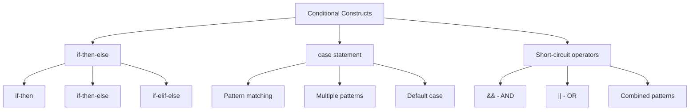
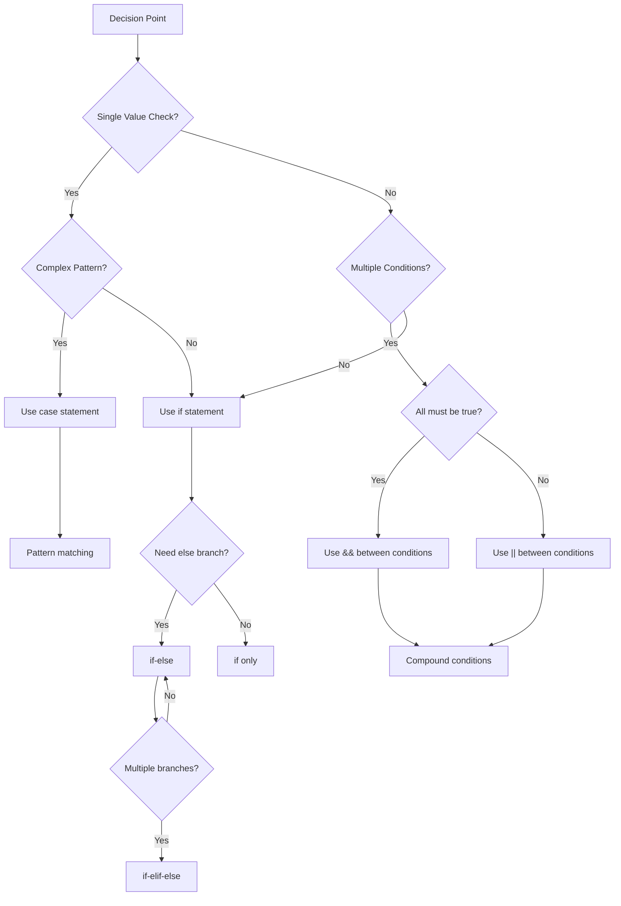

# How to Handle Conditional Statements in Bash

Author: [nawazdhandala](https://www.github.com/nawazdhandala)

Tags: Bash, Shell Scripting, Conditionals, Linux, DevOps, Automation, Control Flow

Description: A comprehensive guide to conditional statements in Bash covering if-else, case statements, test operators, and advanced conditional patterns for robust shell scripting.

---

> Conditional statements are the foundation of decision-making in shell scripts. Understanding how to properly use if-else statements, case expressions, and test operators is essential for writing robust and maintainable Bash scripts.

This guide covers all aspects of Bash conditionals, from basic syntax to advanced patterns used in production scripts.

---

## Conditional Constructs Overview



---

## The if Statement

### Basic Syntax

```bash
#!/bin/bash
# Basic if statement syntax

# Form 1: Single line with semicolons
if [ condition ]; then command; fi

# Form 2: Multi-line (preferred for readability)
if [ condition ]; then
    command1
    command2
fi

# Form 3: with newline before then
if [ condition ]
then
    command
fi

# Example: Check if a variable equals a value
name="Alice"

if [ "$name" = "Alice" ]; then
    echo "Hello, Alice!"
fi
```

### if-else Statement

```bash
#!/bin/bash
# if-else examples

age=25

# Basic if-else
if [ "$age" -ge 18 ]; then
    echo "You are an adult"
else
    echo "You are a minor"
fi

# Check file existence
config_file="/etc/myapp/config.conf"

if [ -f "$config_file" ]; then
    echo "Loading configuration from $config_file"
    source "$config_file"
else
    echo "Config file not found, using defaults"
    use_defaults=true
fi
```

### if-elif-else Statement

```bash
#!/bin/bash
# Multiple condition checking with elif

score=75

if [ "$score" -ge 90 ]; then
    grade="A"
elif [ "$score" -ge 80 ]; then
    grade="B"
elif [ "$score" -ge 70 ]; then
    grade="C"
elif [ "$score" -ge 60 ]; then
    grade="D"
else
    grade="F"
fi

echo "Score: $score, Grade: $grade"

# HTTP status code handling
http_status=404

if [ "$http_status" -eq 200 ]; then
    echo "Success"
elif [ "$http_status" -ge 300 ] && [ "$http_status" -lt 400 ]; then
    echo "Redirect"
elif [ "$http_status" -ge 400 ] && [ "$http_status" -lt 500 ]; then
    echo "Client error"
elif [ "$http_status" -ge 500 ]; then
    echo "Server error"
else
    echo "Unknown status"
fi
```

---

## Test Operators

### File Test Operators

```bash
#!/bin/bash
# File test operators

file="/path/to/file"
dir="/path/to/dir"

# File existence tests
[ -e "$file" ]   # True if file exists (any type)
[ -f "$file" ]   # True if regular file exists
[ -d "$dir" ]    # True if directory exists
[ -L "$file" ]   # True if symbolic link
[ -p "$file" ]   # True if named pipe (FIFO)
[ -S "$file" ]   # True if socket
[ -b "$file" ]   # True if block device
[ -c "$file" ]   # True if character device

# File permission tests
[ -r "$file" ]   # True if readable
[ -w "$file" ]   # True if writable
[ -x "$file" ]   # True if executable

# File property tests
[ -s "$file" ]   # True if file exists and is not empty
[ -O "$file" ]   # True if owned by current user
[ -G "$file" ]   # True if owned by current group

# File comparison tests
[ "$file1" -nt "$file2" ]  # True if file1 is newer than file2
[ "$file1" -ot "$file2" ]  # True if file1 is older than file2
[ "$file1" -ef "$file2" ]  # True if files are same inode (hard link)

# Practical example: Setup script
setup_app() {
    local config_dir="/etc/myapp"
    local log_dir="/var/log/myapp"
    local binary="/usr/local/bin/myapp"

    # Check config directory
    if [ ! -d "$config_dir" ]; then
        echo "Creating config directory..."
        mkdir -p "$config_dir"
    fi

    # Check log directory with write permission
    if [ -d "$log_dir" ] && [ -w "$log_dir" ]; then
        echo "Log directory is ready"
    else
        echo "Error: Cannot write to log directory"
        return 1
    fi

    # Check binary is executable
    if [ -x "$binary" ]; then
        echo "Binary is ready to run"
    else
        echo "Error: Binary not executable"
        return 1
    fi
}
```

### String Test Operators

```bash
#!/bin/bash
# String test operators

str1="hello"
str2="world"
empty=""

# String comparison
[ "$str1" = "$str2" ]    # True if strings are equal
[ "$str1" != "$str2" ]   # True if strings are not equal
[ "$str1" \< "$str2" ]   # True if str1 sorts before str2 (lexicographic)
[ "$str1" \> "$str2" ]   # True if str1 sorts after str2

# String tests
[ -z "$empty" ]          # True if string is empty (zero length)
[ -n "$str1" ]           # True if string is not empty

# Using [[ ]] for string comparison (Bash specific, preferred)
[[ "$str1" == "$str2" ]]   # String equality
[[ "$str1" != "$str2" ]]   # String inequality
[[ "$str1" < "$str2" ]]    # Lexicographic less than (no escaping needed)
[[ "$str1" > "$str2" ]]    # Lexicographic greater than

# Pattern matching with [[ ]]
[[ "$str1" == h* ]]        # True if str1 starts with 'h'
[[ "$str1" == *lo ]]       # True if str1 ends with 'lo'
[[ "$str1" == *ell* ]]     # True if str1 contains 'ell'

# Regex matching with =~
email="user@example.com"
if [[ "$email" =~ ^[A-Za-z0-9._%+-]+@[A-Za-z0-9.-]+\.[A-Za-z]{2,}$ ]]; then
    echo "Valid email format"
fi

# Practical example: Validate user input
validate_username() {
    local username="$1"

    # Check if empty
    if [ -z "$username" ]; then
        echo "Error: Username cannot be empty"
        return 1
    fi

    # Check length
    if [ ${#username} -lt 3 ]; then
        echo "Error: Username must be at least 3 characters"
        return 1
    fi

    # Check format (alphanumeric and underscore only)
    if [[ ! "$username" =~ ^[a-zA-Z][a-zA-Z0-9_]*$ ]]; then
        echo "Error: Username must start with letter and contain only alphanumeric characters"
        return 1
    fi

    echo "Username is valid"
    return 0
}
```

### Numeric Test Operators

```bash
#!/bin/bash
# Numeric comparison operators

num1=10
num2=20

# Integer comparison (use with [ ] or [[ ]])
[ "$num1" -eq "$num2" ]   # Equal
[ "$num1" -ne "$num2" ]   # Not equal
[ "$num1" -lt "$num2" ]   # Less than
[ "$num1" -le "$num2" ]   # Less than or equal
[ "$num1" -gt "$num2" ]   # Greater than
[ "$num1" -ge "$num2" ]   # Greater than or equal

# Arithmetic comparison with (( )) - Bash specific
(( num1 == num2 ))        # Equal
(( num1 != num2 ))        # Not equal
(( num1 < num2 ))         # Less than
(( num1 <= num2 ))        # Less than or equal
(( num1 > num2 ))         # Greater than
(( num1 >= num2 ))        # Greater than or equal

# Practical example: Check system resources
check_disk_space() {
    local threshold=90
    local usage

    usage=$(df / | awk 'NR==2 {print $5}' | tr -d '%')

    if (( usage >= threshold )); then
        echo "Warning: Disk usage is at ${usage}%"
        return 1
    else
        echo "Disk usage is at ${usage}% (OK)"
        return 0
    fi
}

check_memory() {
    local min_free_mb=500
    local free_mb

    free_mb=$(free -m | awk '/^Mem:/ {print $4}')

    if [ "$free_mb" -lt "$min_free_mb" ]; then
        echo "Warning: Low memory (${free_mb}MB free)"
        return 1
    fi

    echo "Memory OK (${free_mb}MB free)"
    return 0
}
```

---

## Compound Conditions

### Logical Operators

```bash
#!/bin/bash
# Combining conditions with logical operators

# Using [ ] with -a (AND) and -o (OR) - POSIX but deprecated
[ condition1 -a condition2 ]   # AND
[ condition1 -o condition2 ]   # OR

# Preferred: Separate tests with && and ||
[ condition1 ] && [ condition2 ]   # AND
[ condition1 ] || [ condition2 ]   # OR

# Using [[ ]] with && and || inside
[[ condition1 && condition2 ]]     # AND
[[ condition1 || condition2 ]]     # OR

# Negation
[ ! condition ]                    # NOT
[[ ! condition ]]                  # NOT

# Complex conditions
age=25
country="USA"
status="active"

if [[ "$age" -ge 18 && "$country" == "USA" && "$status" == "active" ]]; then
    echo "Eligible voter"
fi

# Grouping with parentheses
if [[ ( "$age" -ge 18 && "$age" -lt 65 ) || "$status" == "exempt" ]]; then
    echo "Standard eligibility"
fi

# Practical example: Pre-flight checks
run_preflight_checks() {
    local errors=0

    # Check multiple conditions
    if [[ ! -f "config.yaml" ]]; then
        echo "Error: config.yaml not found"
        ((errors++))
    fi

    if [[ ! -d "logs" || ! -w "logs" ]]; then
        echo "Error: logs directory missing or not writable"
        ((errors++))
    fi

    if ! command -v docker &> /dev/null; then
        echo "Error: docker not installed"
        ((errors++))
    fi

    # Return based on errors
    if [[ $errors -eq 0 ]]; then
        echo "All preflight checks passed"
        return 0
    else
        echo "$errors error(s) found"
        return 1
    fi
}
```

---

## The case Statement

### Basic Syntax

```bash
#!/bin/bash
# case statement for pattern matching

case "$variable" in
    pattern1)
        commands
        ;;
    pattern2)
        commands
        ;;
    *)
        default_commands
        ;;
esac
```

### Pattern Matching Examples

```bash
#!/bin/bash
# Various case statement patterns

# Simple value matching
read -p "Enter yes or no: " answer

case "$answer" in
    yes|y|Y|Yes|YES)
        echo "You said yes"
        ;;
    no|n|N|No|NO)
        echo "You said no"
        ;;
    *)
        echo "Invalid response"
        ;;
esac

# File extension handling
process_file() {
    local filename="$1"

    case "$filename" in
        *.tar.gz|*.tgz)
            echo "Extracting gzipped tarball..."
            tar -xzf "$filename"
            ;;
        *.tar.bz2|*.tbz2)
            echo "Extracting bzipped tarball..."
            tar -xjf "$filename"
            ;;
        *.zip)
            echo "Extracting zip archive..."
            unzip "$filename"
            ;;
        *.tar)
            echo "Extracting tarball..."
            tar -xf "$filename"
            ;;
        *.gz)
            echo "Decompressing gzip file..."
            gunzip "$filename"
            ;;
        *)
            echo "Unknown file type: $filename"
            return 1
            ;;
    esac
}

# Command line argument parsing
parse_args() {
    while [[ $# -gt 0 ]]; do
        case "$1" in
            -h|--help)
                show_help
                exit 0
                ;;
            -v|--verbose)
                VERBOSE=true
                shift
                ;;
            -o|--output)
                OUTPUT_FILE="$2"
                shift 2
                ;;
            --output=*)
                OUTPUT_FILE="${1#*=}"
                shift
                ;;
            -*)
                echo "Unknown option: $1"
                exit 1
                ;;
            *)
                POSITIONAL+=("$1")
                shift
                ;;
        esac
    done
}
```

### Advanced case Patterns

```bash
#!/bin/bash
# Advanced case statement features

# Character class patterns
classify_char() {
    local char="$1"

    case "$char" in
        [a-z])
            echo "Lowercase letter"
            ;;
        [A-Z])
            echo "Uppercase letter"
            ;;
        [0-9])
            echo "Digit"
            ;;
        [[:space:]])
            echo "Whitespace"
            ;;
        [[:punct:]])
            echo "Punctuation"
            ;;
        *)
            echo "Other character"
            ;;
    esac
}

# HTTP method routing
handle_request() {
    local method="$1"
    local path="$2"

    case "$method" in
        GET)
            case "$path" in
                /api/users)
                    list_users
                    ;;
                /api/users/*)
                    get_user "${path#/api/users/}"
                    ;;
                *)
                    echo "404 Not Found"
                    ;;
            esac
            ;;
        POST)
            case "$path" in
                /api/users)
                    create_user
                    ;;
                *)
                    echo "404 Not Found"
                    ;;
            esac
            ;;
        DELETE)
            case "$path" in
                /api/users/*)
                    delete_user "${path#/api/users/}"
                    ;;
                *)
                    echo "404 Not Found"
                    ;;
            esac
            ;;
        *)
            echo "405 Method Not Allowed"
            ;;
    esac
}

# Fall-through with ;&  and continue with ;;&  (Bash 4.0+)
test_fallthrough() {
    local value="$1"

    case "$value" in
        start)
            echo "Starting..."
            ;& # Fall through to next case
        running)
            echo "Running..."
            ;& # Fall through
        finish)
            echo "Finishing..."
            ;;
    esac
}

# Continue testing with ;;&
test_multiple_matches() {
    local str="abc123"

    case "$str" in
        *[0-9]*)
            echo "Contains digits"
            ;;& # Continue testing other patterns
        *[a-z]*)
            echo "Contains lowercase"
            ;;& # Continue testing
        *[A-Z]*)
            echo "Contains uppercase"
            ;;& # Continue testing
        *)
            echo "Done checking"
            ;;
    esac
}
```

---

## Short-Circuit Evaluation

### Using && and ||

```bash
#!/bin/bash
# Short-circuit conditional execution

# && - Execute second command only if first succeeds
[ -f "file.txt" ] && echo "File exists"

# || - Execute second command only if first fails
[ -f "file.txt" ] || echo "File does not exist"

# Combined pattern: command && success_action || failure_action
[ -f "file.txt" ] && cat "file.txt" || echo "Cannot read file"

# Practical examples

# Create directory if it does not exist
[ -d "logs" ] || mkdir -p "logs"

# Run command only if dependency exists
command -v docker &>/dev/null && docker ps

# Set default value
EDITOR="${EDITOR:-vim}"  # Parameter expansion alternative
[ -z "$EDITOR" ] && EDITOR="vim"

# Chain multiple conditions
[ -f "config.yaml" ] && [ -r "config.yaml" ] && source_config

# Guard clause pattern
run_deployment() {
    # Early exit on failures
    [ -f "deploy.sh" ] || { echo "deploy.sh not found"; return 1; }
    [ -x "deploy.sh" ] || { echo "deploy.sh not executable"; return 1; }
    command -v kubectl &>/dev/null || { echo "kubectl required"; return 1; }

    # All checks passed
    ./deploy.sh
}
```

### Conditional Assignment

```bash
#!/bin/bash
# Conditional variable assignment

# Assign default if unset or empty
name="${name:-default_name}"

# Assign default only if unset
name="${name-default_name}"

# Assign and set default if unset or empty
: "${name:=default_name}"

# Error if unset or empty
: "${REQUIRED_VAR:?Error: REQUIRED_VAR must be set}"

# Practical configuration pattern
configure_app() {
    # Required variables (error if not set)
    : "${DATABASE_URL:?DATABASE_URL must be set}"
    : "${API_KEY:?API_KEY must be set}"

    # Optional with defaults
    export HOST="${HOST:-0.0.0.0}"
    export PORT="${PORT:-8080}"
    export LOG_LEVEL="${LOG_LEVEL:-info}"
    export MAX_CONNECTIONS="${MAX_CONNECTIONS:-100}"

    echo "Configuration:"
    echo "  Host: $HOST"
    echo "  Port: $PORT"
    echo "  Log Level: $LOG_LEVEL"
    echo "  Max Connections: $MAX_CONNECTIONS"
}
```

---

## Decision Flow Diagram



---

## Best Practices

### 1. Always Quote Variables

```bash
#!/bin/bash
# Quoting prevents word splitting and glob expansion

filename="my file.txt"

# WRONG - breaks on spaces
if [ -f $filename ]; then
    echo "Found"
fi

# CORRECT - handles spaces
if [ -f "$filename" ]; then
    echo "Found"
fi

# Even better - use [[ ]] which handles unquoted variables
if [[ -f $filename ]]; then
    echo "Found"
fi
```

### 2. Use [[ ]] Over [ ] When Possible

```bash
#!/bin/bash
# [[ ]] advantages over [ ]

# No word splitting, safe without quotes
var="hello world"
[[ -n $var ]]  # Safe
# [ -n $var ]  # Breaks!

# Pattern matching built-in
[[ "$str" == pattern* ]]

# Regex support
[[ "$str" =~ regex ]]

# Logical operators inside
[[ $a -gt 0 && $b -lt 10 ]]

# No need to escape < >
[[ "$a" < "$b" ]]
```

### 3. Use Meaningful Exit Codes

```bash
#!/bin/bash
# Consistent exit code handling

# Define exit codes
readonly EXIT_SUCCESS=0
readonly EXIT_ERROR=1
readonly EXIT_INVALID_ARGS=2
readonly EXIT_NOT_FOUND=3
readonly EXIT_PERMISSION_DENIED=4

process_file() {
    local file="$1"

    if [[ -z "$file" ]]; then
        echo "Error: No file specified" >&2
        return $EXIT_INVALID_ARGS
    fi

    if [[ ! -f "$file" ]]; then
        echo "Error: File not found: $file" >&2
        return $EXIT_NOT_FOUND
    fi

    if [[ ! -r "$file" ]]; then
        echo "Error: Permission denied: $file" >&2
        return $EXIT_PERMISSION_DENIED
    fi

    # Process file...
    return $EXIT_SUCCESS
}
```

### 4. Structure Complex Conditions Clearly

```bash
#!/bin/bash
# Break complex conditions into readable parts

# Hard to read
if [[ -f "$config" && -r "$config" && $(stat -c %s "$config") -gt 0 && ! $(grep -q "disabled" "$config") ]]; then
    load_config
fi

# Better - use helper functions
is_valid_config() {
    local config="$1"

    # File exists and is readable
    [[ -f "$config" && -r "$config" ]] || return 1

    # File is not empty
    [[ -s "$config" ]] || return 1

    # Config is not disabled
    ! grep -q "disabled" "$config"
}

if is_valid_config "$config"; then
    load_config
fi
```

---

## Common Patterns

### Guard Clauses

```bash
#!/bin/bash
# Early return pattern for cleaner code

process_data() {
    local input="$1"

    # Guard clauses - check preconditions first
    [[ -n "$input" ]] || { echo "Error: No input"; return 1; }
    [[ -f "$input" ]] || { echo "Error: File not found"; return 1; }
    [[ -r "$input" ]] || { echo "Error: Cannot read file"; return 1; }

    # Main logic (only reached if all checks pass)
    echo "Processing $input..."
    cat "$input" | process_lines
}
```

### Feature Flags

```bash
#!/bin/bash
# Toggle features based on conditions

# Feature flag variables
ENABLE_LOGGING="${ENABLE_LOGGING:-true}"
ENABLE_METRICS="${ENABLE_METRICS:-false}"
DEBUG_MODE="${DEBUG_MODE:-false}"

log_message() {
    [[ "$ENABLE_LOGGING" == "true" ]] && echo "[LOG] $*"
}

debug_message() {
    [[ "$DEBUG_MODE" == "true" ]] && echo "[DEBUG] $*" >&2
}

send_metrics() {
    [[ "$ENABLE_METRICS" == "true" ]] || return 0
    # Send metrics...
}
```

### Environment Detection

```bash
#!/bin/bash
# Detect and adapt to environment

detect_environment() {
    # Check OS
    case "$(uname -s)" in
        Linux*)
            OS="linux"
            PACKAGE_MANAGER="apt"
            ;;
        Darwin*)
            OS="macos"
            PACKAGE_MANAGER="brew"
            ;;
        CYGWIN*|MINGW*|MSYS*)
            OS="windows"
            PACKAGE_MANAGER="choco"
            ;;
        *)
            OS="unknown"
            ;;
    esac

    # Check if running in container
    if [[ -f "/.dockerenv" ]] || grep -q docker /proc/1/cgroup 2>/dev/null; then
        IN_CONTAINER=true
    else
        IN_CONTAINER=false
    fi

    # Check if running in CI
    if [[ -n "$CI" || -n "$GITHUB_ACTIONS" || -n "$JENKINS_URL" ]]; then
        IN_CI=true
    else
        IN_CI=false
    fi

    echo "OS: $OS"
    echo "Package Manager: $PACKAGE_MANAGER"
    echo "In Container: $IN_CONTAINER"
    echo "In CI: $IN_CI"
}
```

---

## Conclusion

Mastering conditional statements in Bash enables you to write robust, maintainable scripts. Key takeaways:

- Use `[[ ]]` over `[ ]` for better features and safety
- Always quote variables in conditions
- Use `case` statements for multiple pattern matching
- Leverage short-circuit evaluation for concise code
- Structure complex conditions with helper functions
- Use consistent exit codes for error handling

Understanding these patterns will make your shell scripts more reliable and easier to maintain.

---

*Need to monitor your automation scripts? [OneUptime](https://oneuptime.com) provides comprehensive monitoring and alerting for all your shell scripting workflows.*
