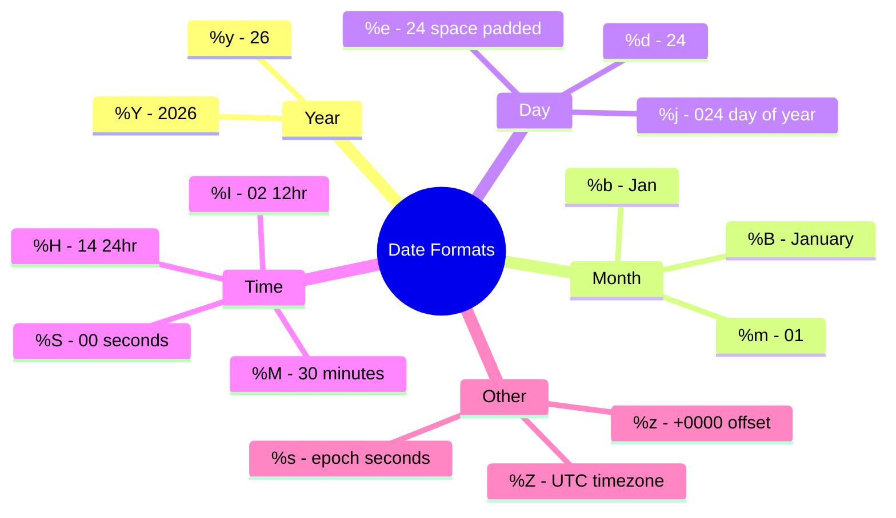
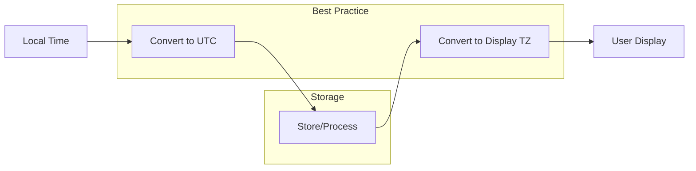

# How to Handle Date and Time Operations in Bash

Author: [nawazdhandala](https://www.github.com/nawazdhandala)

Tags: Bash, Shell Scripting, Date, Time, Linux, DevOps, Automation

Description: Learn how to work with dates and times in Bash scripts, including formatting, parsing, arithmetic, timezone handling, and common patterns for log analysis and scheduling.

---

Date and time operations are essential for log processing, scheduling, file management, and reporting. Bash provides powerful tools for handling temporal data, but the syntax can be tricky. This guide covers everything you need to know.

## The date Command Basics

```bash
# Current date and time
date
# Output: Fri Jan 24 14:30:00 UTC 2026

# Current timestamp (seconds since epoch)
date +%s
# Output: 1769347800

# Custom format
date "+%Y-%m-%d %H:%M:%S"
# Output: 2026-01-24 14:30:00
```

## Date Format Specifiers



### Common Format Strings

```bash
#!/bin/bash

# ISO 8601 format (recommended for logs and data)
date "+%Y-%m-%dT%H:%M:%S%z"
# Output: 2026-01-24T14:30:00+0000

# Log file timestamp
date "+%Y%m%d_%H%M%S"
# Output: 20260124_143000

# Human readable
date "+%A, %B %d, %Y at %I:%M %p"
# Output: Friday, January 24, 2026 at 02:30 PM

# File-safe timestamp (no colons)
date "+%Y-%m-%d_%H-%M-%S"
# Output: 2026-01-24_14-30-00

# Week information
date "+Week %V of %Y"
# Output: Week 04 of 2026

# Compact date
date "+%Y%m%d"
# Output: 20260124
```

## Date Arithmetic

### Relative Dates

```bash
#!/bin/bash

# Yesterday
date -d "yesterday" "+%Y-%m-%d"
# Output: 2026-01-23

# Tomorrow
date -d "tomorrow" "+%Y-%m-%d"
# Output: 2026-01-25

# 7 days ago
date -d "7 days ago" "+%Y-%m-%d"
# Output: 2026-01-17

# 2 weeks from now
date -d "2 weeks" "+%Y-%m-%d"
# Output: 2026-02-07

# Last Monday
date -d "last monday" "+%Y-%m-%d"

# Next Friday
date -d "next friday" "+%Y-%m-%d"

# First day of current month
date -d "$(date +%Y-%m-01)" "+%Y-%m-%d"

# Last day of current month
date -d "$(date +%Y-%m-01) +1 month -1 day" "+%Y-%m-%d"
```

### Arithmetic with Specific Dates

```bash
#!/bin/bash

# Start from a specific date
base_date="2026-01-15"

# Add 10 days
date -d "$base_date +10 days" "+%Y-%m-%d"
# Output: 2026-01-25

# Subtract 1 month
date -d "$base_date -1 month" "+%Y-%m-%d"
# Output: 2025-12-15

# Add 2 hours and 30 minutes
date -d "$base_date 14:00:00 +2 hours +30 minutes" "+%Y-%m-%d %H:%M:%S"
# Output: 2026-01-15 16:30:00

# Complex arithmetic
date -d "$base_date +1 year -2 months +15 days" "+%Y-%m-%d"
```

### Calculating Time Differences

```bash
#!/bin/bash

# Calculate difference between two dates
date1="2026-01-01"
date2="2026-01-24"

# Convert to epoch seconds
epoch1=$(date -d "$date1" +%s)
epoch2=$(date -d "$date2" +%s)

# Calculate difference in seconds
diff_seconds=$((epoch2 - epoch1))

# Convert to days
diff_days=$((diff_seconds / 86400))
echo "Days between: $diff_days"
# Output: Days between: 23

# Calculate hours, minutes, seconds
hours=$((diff_seconds / 3600))
minutes=$(((diff_seconds % 3600) / 60))
seconds=$((diff_seconds % 60))
echo "Difference: ${hours}h ${minutes}m ${seconds}s"
```

### Duration Formatting Function

```bash
#!/bin/bash

# Convert seconds to human-readable duration
format_duration() {
    local seconds=$1
    local days=$((seconds / 86400))
    local hours=$(((seconds % 86400) / 3600))
    local minutes=$(((seconds % 3600) / 60))
    local secs=$((seconds % 60))

    local result=""
    [[ $days -gt 0 ]] && result="${days}d "
    [[ $hours -gt 0 ]] && result="${result}${hours}h "
    [[ $minutes -gt 0 ]] && result="${result}${minutes}m "
    [[ $secs -gt 0 || -z "$result" ]] && result="${result}${secs}s"

    echo "${result% }"
}

# Usage
duration_seconds=90061
echo "Duration: $(format_duration $duration_seconds)"
# Output: Duration: 1d 1h 1m 1s
```

## Working with Timestamps

### Parse Timestamps from Logs

```bash
#!/bin/bash

# Extract and parse timestamps from log lines
parse_log_timestamp() {
    local log_line="$1"

    # Common log format: [2026-01-24 14:30:00]
    if [[ $log_line =~ \[([0-9]{4}-[0-9]{2}-[0-9]{2}\ [0-9]{2}:[0-9]{2}:[0-9]{2})\] ]]; then
        echo "${BASH_REMATCH[1]}"
    fi
}

# Convert log timestamp to epoch
log_timestamp="2026-01-24 14:30:00"
epoch=$(date -d "$log_timestamp" +%s)
echo "Epoch: $epoch"
```

### Generate Timestamps for Filenames

```bash
#!/bin/bash

# Create timestamped backup
create_backup() {
    local source_file="$1"
    local timestamp=$(date "+%Y%m%d_%H%M%S")
    local backup_file="${source_file}.${timestamp}.bak"

    cp "$source_file" "$backup_file"
    echo "Created backup: $backup_file"
}

# Create timestamped log file
LOG_FILE="/var/log/app_$(date +%Y%m%d).log"

# Rotate logs with timestamp
rotate_log() {
    local log_file="$1"
    local timestamp=$(date "+%Y%m%d_%H%M%S")

    if [[ -f "$log_file" ]]; then
        mv "$log_file" "${log_file}.${timestamp}"
        gzip "${log_file}.${timestamp}"
    fi
}
```

## Timezone Handling

### Display Different Timezones

```bash
#!/bin/bash

# Current time in different zones
echo "UTC:        $(TZ='UTC' date '+%Y-%m-%d %H:%M:%S %Z')"
echo "New York:   $(TZ='America/New_York' date '+%Y-%m-%d %H:%M:%S %Z')"
echo "London:     $(TZ='Europe/London' date '+%Y-%m-%d %H:%M:%S %Z')"
echo "Tokyo:      $(TZ='Asia/Tokyo' date '+%Y-%m-%d %H:%M:%S %Z')"
echo "Sydney:     $(TZ='Australia/Sydney' date '+%Y-%m-%d %H:%M:%S %Z')"
```

### Convert Between Timezones

```bash
#!/bin/bash

convert_timezone() {
    local datetime="$1"
    local from_tz="$2"
    local to_tz="$3"

    # Parse in source timezone, output in target timezone
    TZ="$to_tz" date -d "TZ=\"$from_tz\" $datetime" "+%Y-%m-%d %H:%M:%S %Z"
}

# Convert New York time to Tokyo time
ny_time="2026-01-24 09:00:00"
tokyo_time=$(convert_timezone "$ny_time" "America/New_York" "Asia/Tokyo")
echo "NY: $ny_time -> Tokyo: $tokyo_time"
# Output: NY: 2026-01-24 09:00:00 -> Tokyo: 2026-01-24 23:00:00 JST
```

### List Available Timezones

```bash
#!/bin/bash

# List all available timezones
timedatectl list-timezones

# Or on systems without timedatectl
ls /usr/share/zoneinfo/

# Search for specific timezone
timedatectl list-timezones | grep -i "new_york"
```

## Time Flow Diagram



## Common Date Operations

### Check if Date is Valid

```bash
#!/bin/bash

is_valid_date() {
    local date_str="$1"

    # Try to parse the date
    if date -d "$date_str" &>/dev/null; then
        return 0
    else
        return 1
    fi
}

# Usage
if is_valid_date "2026-02-30"; then
    echo "Valid date"
else
    echo "Invalid date"  # This will print
fi
```

### Get Day of Week

```bash
#!/bin/bash

# Get day of week (0=Sunday, 6=Saturday)
day_num=$(date +%w)

# Get day name
day_name=$(date +%A)

# Check if weekend
is_weekend() {
    local day=$(date -d "$1" +%w)
    [[ $day -eq 0 || $day -eq 6 ]]
}

if is_weekend "2026-01-25"; then
    echo "It's the weekend!"
fi
```

### Get Week Number

```bash
#!/bin/bash

# ISO week number
week_num=$(date +%V)
echo "ISO Week: $week_num"

# Get all dates in current week
get_week_dates() {
    local date="${1:-today}"
    local day_of_week=$(date -d "$date" +%u)  # 1=Monday, 7=Sunday
    local monday=$(date -d "$date -$((day_of_week - 1)) days" +%Y-%m-%d)

    for i in {0..6}; do
        date -d "$monday +$i days" +%Y-%m-%d
    done
}

echo "This week's dates:"
get_week_dates
```

### Get Month Boundaries

```bash
#!/bin/bash

# First day of month
first_day=$(date -d "$(date +%Y-%m-01)" +%Y-%m-%d)

# Last day of month
last_day=$(date -d "$(date +%Y-%m-01) +1 month -1 day" +%Y-%m-%d)

# Days in month
days_in_month=$(date -d "$(date +%Y-%m-01) +1 month -1 day" +%d)

echo "First: $first_day, Last: $last_day, Days: $days_in_month"

# Get all days in a month
get_month_days() {
    local year_month="${1:-$(date +%Y-%m)}"
    local first="${year_month}-01"
    local days=$(date -d "$first +1 month -1 day" +%d)

    for ((d=1; d<=days; d++)); do
        printf "%s-%02d\n" "$year_month" "$d"
    done
}
```

## Practical Examples

### Example 1: Log Rotation Script

```bash
#!/bin/bash

LOG_DIR="/var/log/myapp"
MAX_AGE_DAYS=30

rotate_logs() {
    local current_date=$(date +%Y%m%d)

    # Find and compress logs older than 1 day
    find "$LOG_DIR" -name "*.log" -mtime +0 -exec gzip {} \;

    # Delete compressed logs older than MAX_AGE_DAYS
    find "$LOG_DIR" -name "*.gz" -mtime +$MAX_AGE_DAYS -delete

    echo "$(date '+%Y-%m-%d %H:%M:%S') - Log rotation completed" >> "$LOG_DIR/rotation.log"
}

rotate_logs
```

### Example 2: Time-Based Execution

```bash
#!/bin/bash

# Run different actions based on time of day
current_hour=$(date +%H)

case $current_hour in
    0[0-5])
        echo "Running nightly maintenance..."
        ;;
    0[6-9]|1[0-1])
        echo "Running morning reports..."
        ;;
    1[2-7])
        echo "Running afternoon tasks..."
        ;;
    *)
        echo "Running evening cleanup..."
        ;;
esac
```

### Example 3: Business Day Calculator

```bash
#!/bin/bash

# Check if a date is a business day (Mon-Fri)
is_business_day() {
    local date="$1"
    local day_of_week=$(date -d "$date" +%u)
    [[ $day_of_week -le 5 ]]
}

# Get next business day
next_business_day() {
    local date="${1:-today}"
    local next=$(date -d "$date +1 day" +%Y-%m-%d)

    while ! is_business_day "$next"; do
        next=$(date -d "$next +1 day" +%Y-%m-%d)
    done

    echo "$next"
}

# Add N business days
add_business_days() {
    local date="$1"
    local days="$2"
    local current="$date"

    while [[ $days -gt 0 ]]; do
        current=$(date -d "$current +1 day" +%Y-%m-%d)
        if is_business_day "$current"; then
            ((days--))
        fi
    done

    echo "$current"
}

# Usage
echo "Today: $(date +%Y-%m-%d)"
echo "Next business day: $(next_business_day)"
echo "5 business days from now: $(add_business_days "$(date +%Y-%m-%d)" 5)"
```

### Example 4: Elapsed Time Tracker

```bash
#!/bin/bash

# Track script execution time
track_time() {
    local start_time=$(date +%s.%N)

    # Run the command
    "$@"
    local exit_code=$?

    local end_time=$(date +%s.%N)
    local elapsed=$(echo "$end_time - $start_time" | bc)

    printf "Command: %s\n" "$*"
    printf "Exit code: %d\n" "$exit_code"
    printf "Elapsed time: %.3f seconds\n" "$elapsed"

    return $exit_code
}

# Usage
track_time sleep 2
track_time find /tmp -name "*.log"
```

### Example 5: Date Range Iterator

```bash
#!/bin/bash

# Iterate over a date range
iterate_dates() {
    local start_date="$1"
    local end_date="$2"
    local current="$start_date"

    while [[ "$current" < "$end_date" ]] || [[ "$current" == "$end_date" ]]; do
        echo "$current"
        current=$(date -d "$current +1 day" +%Y-%m-%d)
    done
}

# Process logs for each day in range
process_date_range() {
    local start="$1"
    local end="$2"

    for date in $(iterate_dates "$start" "$end"); do
        echo "Processing data for $date..."
        # Your processing logic here
    done
}

# Usage
process_date_range "2026-01-01" "2026-01-07"
```

### Example 6: Countdown Timer

```bash
#!/bin/bash

countdown() {
    local target_date="$1"
    local target_epoch=$(date -d "$target_date" +%s)
    local now=$(date +%s)
    local remaining=$((target_epoch - now))

    if [[ $remaining -lt 0 ]]; then
        echo "Target date has passed!"
        return 1
    fi

    local days=$((remaining / 86400))
    local hours=$(((remaining % 86400) / 3600))
    local minutes=$(((remaining % 3600) / 60))
    local seconds=$((remaining % 60))

    printf "Time until %s:\n" "$target_date"
    printf "%d days, %d hours, %d minutes, %d seconds\n" \
        "$days" "$hours" "$minutes" "$seconds"
}

# Usage
countdown "2026-12-31 23:59:59"
```

## macOS Compatibility

macOS uses BSD date which has different syntax. Here are the equivalents:

```bash
#!/bin/bash

# Detect OS
if [[ "$(uname)" == "Darwin" ]]; then
    # macOS (BSD date)

    # Current timestamp
    date +%s

    # Specific format
    date "+%Y-%m-%d"

    # Date arithmetic (different syntax!)
    date -v+1d "+%Y-%m-%d"          # Tomorrow
    date -v-7d "+%Y-%m-%d"          # 7 days ago
    date -v+1m "+%Y-%m-%d"          # 1 month from now

    # Parse specific date
    date -j -f "%Y-%m-%d" "2026-01-24" "+%s"

else
    # Linux (GNU date)

    # Date arithmetic
    date -d "tomorrow" "+%Y-%m-%d"
    date -d "7 days ago" "+%Y-%m-%d"
    date -d "+1 month" "+%Y-%m-%d"

    # Parse specific date
    date -d "2026-01-24" "+%s"
fi
```

### Cross-Platform Date Function

```bash
#!/bin/bash

# Cross-platform date arithmetic
date_add_days() {
    local base_date="$1"
    local days="$2"

    if [[ "$(uname)" == "Darwin" ]]; then
        # macOS
        date -j -v+"${days}d" -f "%Y-%m-%d" "$base_date" "+%Y-%m-%d"
    else
        # Linux
        date -d "$base_date +$days days" "+%Y-%m-%d"
    fi
}

# Usage works on both platforms
tomorrow=$(date_add_days "$(date +%Y-%m-%d)" 1)
echo "Tomorrow: $tomorrow"
```

## Quick Reference

| Operation | Linux (GNU date) | macOS (BSD date) |
|-----------|------------------|------------------|
| Current epoch | `date +%s` | `date +%s` |
| Tomorrow | `date -d "tomorrow"` | `date -v+1d` |
| 7 days ago | `date -d "7 days ago"` | `date -v-7d` |
| Parse date | `date -d "2026-01-24"` | `date -j -f "%Y-%m-%d" "2026-01-24"` |
| Add month | `date -d "+1 month"` | `date -v+1m` |

## Key Takeaways

1. **Use ISO 8601 format** (`%Y-%m-%dT%H:%M:%S%z`) for machine-readable dates
2. **Store timestamps in UTC** and convert for display
3. **Validate dates before processing** to avoid errors
4. **Use epoch seconds for arithmetic** when calculating differences
5. **Be aware of platform differences** between GNU and BSD date
6. **Create wrapper functions** for frequently used operations
7. **Handle timezone conversions explicitly** to avoid confusion

---

Date and time operations in Bash are powerful once you understand the format specifiers and arithmetic syntax. Whether you are rotating logs, generating reports, or processing time-series data, these techniques will help you write robust scripts that handle temporal data correctly across different scenarios and platforms.
