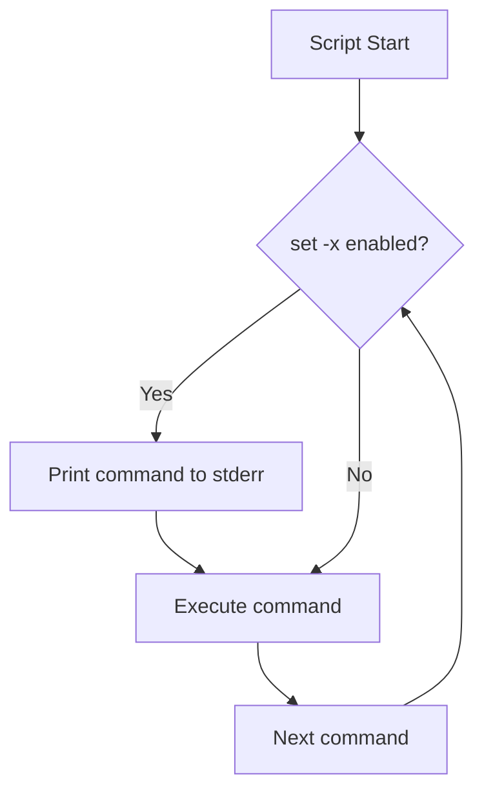
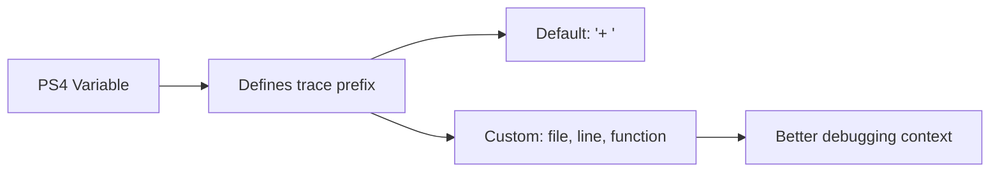

# How to Handle Script Debugging with set -x

Author: [nawazdhandala](https://www.github.com/nawazdhandala)

Tags: Bash, Shell Scripting, Debugging, set -x, Linux, DevOps, Troubleshooting

Description: Learn how to use set -x and other Bash debugging techniques to trace script execution, identify issues, and build more reliable shell scripts.

---

> Debugging shell scripts can be challenging because errors often manifest as unexpected behavior rather than clear error messages. The `set -x` option enables trace mode, showing each command before it executes. This guide covers comprehensive debugging techniques for Bash scripts.

Mastering these debugging tools will save you hours of troubleshooting and help you write more reliable scripts.

---

## Understanding set -x



### Basic Usage

```bash
#!/bin/bash
# Enable debug mode with set -x

# Method 1: Enable at script start
set -x

echo "This command will be traced"
name="world"
echo "Hello, $name"

# Method 2: Enable from command line
# bash -x script.sh

# Method 3: Enable in shebang
#!/bin/bash -x
```

Output with `set -x`:

```
+ echo 'This command will be traced'
This command will be traced
+ name=world
+ echo 'Hello, world'
Hello, world
```

---

## Controlling Debug Output

### Toggle Debugging On and Off

```bash
#!/bin/bash
# Selectively enable debugging

echo "This is not traced"

# Enable tracing for specific section
set -x
complex_calculation() {
    local result=$((10 * 20 + 5))
    echo "$result"
}
result=$(complex_calculation)
set +x  # Disable tracing

echo "Result: $result (this line not traced)"

# Pattern: Debug only on failure
run_with_debug_on_failure() {
    local cmd="$1"

    # First try without debug
    if ! eval "$cmd" 2>/dev/null; then
        echo "Command failed, running with debug:" >&2
        set -x
        eval "$cmd"
        local exit_code=$?
        set +x
        return $exit_code
    fi
}

run_with_debug_on_failure "ls /nonexistent"
```

### Environment Variable Control

```bash
#!/bin/bash
# Control debugging via environment variable

# Enable debug if DEBUG environment variable is set
if [[ -n "${DEBUG:-}" ]]; then
    set -x
fi

# Or more granular control
debug_level="${DEBUG_LEVEL:-0}"

case "$debug_level" in
    0) ;;  # No debugging
    1) set -x ;;  # Basic trace
    2) set -x; PS4='+ ${BASH_SOURCE}:${LINENO}: ' ;;  # With file and line
    *) set -xv ;;  # Maximum verbosity
esac

# Usage:
# DEBUG=1 ./script.sh
# DEBUG_LEVEL=2 ./script.sh
```

---

## Customizing Debug Output with PS4



### Custom PS4 Examples

```bash
#!/bin/bash
# Customize trace output prefix

# Default PS4 is '+ '
# Customize for more information

# Show line numbers
PS4='+ Line ${LINENO}: '
set -x
echo "test"
# Output: + Line 8: echo test

# Show timestamp
PS4='+ [$(date +%H:%M:%S)] '
set -x
echo "test"
# Output: + [14:32:15] echo test

# Show function name and line number
PS4='+ ${FUNCNAME[0]:-main}():${LINENO}: '
set -x
my_function() {
    echo "inside function"
}
my_function
# Output: + my_function():12: echo 'inside function'

# Full context: script, function, line
PS4='+ ${BASH_SOURCE##*/}:${FUNCNAME[0]:-main}:${LINENO}: '

# Colorized output (useful for complex scripts)
PS4='\033[0;33m+ ${BASH_SOURCE##*/}:${LINENO}:\033[0m '
```

### Production-Ready PS4

```bash
#!/bin/bash
# Comprehensive debug prefix

# Define color codes
RED='\033[0;31m'
GREEN='\033[0;32m'
YELLOW='\033[0;33m'
NC='\033[0m'  # No Color

# Build informative PS4
export PS4='
${YELLOW}+${NC} [${GREEN}$(date +%Y-%m-%d\ %H:%M:%S)${NC}]
   ${RED}${BASH_SOURCE##*/}${NC}:${YELLOW}${LINENO}${NC}
   ${GREEN}${FUNCNAME[0]:-main}()${NC}: '

# Simpler single-line version
export PS4='+ $(date +%T) ${BASH_SOURCE##*/}:${LINENO} ${FUNCNAME[0]:-main}(): '
```

---

## Comprehensive Debug Options

### All Set Options for Debugging

```bash
#!/bin/bash
# Complete set of debugging options

# -x : Print commands before execution (xtrace)
set -x

# -v : Print shell input lines (verbose)
set -v

# -e : Exit on error
set -e

# -u : Error on undefined variables
set -u

# -o pipefail : Fail pipeline on any command failure
set -o pipefail

# Combined for strict debugging
set -euxo pipefail

# Common combinations
set -x      # Basic tracing
set -xv     # Trace + verbose (see raw script lines too)
set -xe     # Trace + exit on error
set -xeu    # Trace + exit on error + undefined var check

# Turn off options with +
set +x      # Disable trace
set +e      # Disable exit on error
```

### Understanding -v vs -x

```bash
#!/bin/bash
# Difference between -v and -x

# -v shows the raw script lines as read
# -x shows commands after expansion

name="World"

set -v
echo "Hello, $name"
set +v

# -v output:
# echo "Hello, $name"

set -x
echo "Hello, $name"
set +x

# -x output:
# + echo 'Hello, World'

# Combined shows both
set -xv
echo "Hello, $name"
set +xv
# Output:
# echo "Hello, $name"
# + echo 'Hello, World'
```

---

## Practical Debugging Patterns

### Debug Function Wrapper

```bash
#!/bin/bash
# Reusable debug wrapper

# Debug logging function
debug() {
    if [[ "${DEBUG:-0}" == "1" ]]; then
        echo "[DEBUG] $*" >&2
    fi
}

# Trace function execution
trace_function() {
    local func_name="$1"
    shift

    debug "Entering: $func_name($*)"
    local start_time=$SECONDS

    # Call the function
    "$func_name" "$@"
    local result=$?

    local duration=$((SECONDS - start_time))
    debug "Exiting: $func_name (took ${duration}s, returned $result)"

    return $result
}

# Example function
process_data() {
    local input="$1"
    sleep 1  # Simulate work
    echo "Processed: $input"
    return 0
}

# Usage
DEBUG=1 trace_function process_data "my-input"
```

### Conditional Debugging by Section

```bash
#!/bin/bash
# Debug specific sections of your script

# Debug flags for different sections
DEBUG_INIT="${DEBUG_INIT:-0}"
DEBUG_PROCESS="${DEBUG_PROCESS:-0}"
DEBUG_CLEANUP="${DEBUG_CLEANUP:-0}"

# Initialization section
if [[ "$DEBUG_INIT" == "1" ]]; then set -x; fi
echo "Initializing..."
config_file="/etc/myapp/config"
log_dir="/var/log/myapp"
if [[ "$DEBUG_INIT" == "1" ]]; then set +x; fi

# Processing section
if [[ "$DEBUG_PROCESS" == "1" ]]; then set -x; fi
echo "Processing..."
# Complex processing logic here
if [[ "$DEBUG_PROCESS" == "1" ]]; then set +x; fi

# Cleanup section
if [[ "$DEBUG_CLEANUP" == "1" ]]; then set -x; fi
echo "Cleaning up..."
if [[ "$DEBUG_CLEANUP" == "1" ]]; then set +x; fi

# Usage:
# DEBUG_PROCESS=1 ./script.sh
```

### Debug Output to File

```bash
#!/bin/bash
# Redirect debug output to file while keeping stdout clean

DEBUG_LOG="${DEBUG_LOG:-/tmp/debug.log}"

# Method 1: Redirect stderr to file
exec 2>"$DEBUG_LOG"
set -x
echo "This goes to stdout"
echo "Debug trace goes to $DEBUG_LOG" >&2
set +x

# Method 2: Use BASH_XTRACEFD (Bash 4.1+)
exec 5>"$DEBUG_LOG"
BASH_XTRACEFD=5
set -x
echo "This goes to stdout"
# Trace output goes to fd 5 (debug log)
set +x
exec 5>&-

# Method 3: Tee debug output
debug_with_log() {
    local log_file="$1"
    shift

    # Run with trace, capture trace to log
    bash -x "$@" 2>"$log_file"
}

# Method 4: Dual output (screen and file)
enable_debug_logging() {
    local log_file="$1"
    exec 2> >(tee -a "$log_file" >&2)
    set -x
}
```

---

## Debugging Specific Issues

### Debugging Variable Expansion

```bash
#!/bin/bash
# Debug variable expansion issues

# Show all variable expansions
set -x

# Common issue: Empty variables
name=""
echo "Hello, $name"  # Trace shows: + echo 'Hello, '

# Debug with explicit checks
debug_var() {
    local var_name="$1"
    local var_value="${!var_name}"

    echo "Variable: $var_name"
    echo "  Value: '$var_value'"
    echo "  Length: ${#var_value}"
    echo "  Empty: $([[ -z "$var_value" ]] && echo yes || echo no)"
}

name="test"
debug_var name

# Debug array expansions
arr=(one two three)
set -x
echo "${arr[@]}"       # + echo one two three
echo "${arr[*]}"       # + echo 'one two three'
echo "${#arr[@]}"      # + echo 3
set +x
```

### Debugging Command Substitution

```bash
#!/bin/bash
# Debug command substitution

set -x

# Command substitution is traced
result=$(echo "hello" | tr 'a-z' 'A-Z')
# Trace shows:
# ++ echo hello
# ++ tr a-z A-Z
# + result=HELLO

# Nested substitution
outer=$(echo "inner: $(date +%s)")
# Shows full nesting

set +x

# Debug failed command substitution
debug_cmd_sub() {
    local cmd="$1"

    echo "Executing: $cmd" >&2

    # Capture both output and exit code
    local output
    local exit_code

    output=$(eval "$cmd" 2>&1)
    exit_code=$?

    echo "Output: $output" >&2
    echo "Exit code: $exit_code" >&2

    if [[ $exit_code -ne 0 ]]; then
        echo "Command failed!" >&2
        return 1
    fi

    echo "$output"
}

result=$(debug_cmd_sub "ls /nonexistent")
```

### Debugging Pipelines

```bash
#!/bin/bash
# Debug pipeline issues

# Enable pipefail to catch failures
set -o pipefail

# Trace shows each pipeline component
set -x
echo "hello world" | grep "hello" | wc -c
set +x

# Debug: Check each pipeline stage
debug_pipeline() {
    echo "Stage 1:" >&2
    echo "hello world" | tee /dev/stderr | \
    { echo "Stage 2:" >&2; grep "hello" | tee /dev/stderr; } | \
    { echo "Stage 3:" >&2; wc -c; }
}

# Check PIPESTATUS for individual exit codes
echo "hello" | grep "x" | wc -c
echo "PIPESTATUS: ${PIPESTATUS[*]}"
# Output: PIPESTATUS: 0 1 0
# grep failed (exit 1) but pipeline continued
```

---

## Trap-Based Debugging

```bash
#!/bin/bash
# Use traps for debugging

# DEBUG trap: runs before each command
trap 'echo "About to run: $BASH_COMMAND"' DEBUG

echo "hello"
x=$((1 + 2))
echo "x = $x"

trap - DEBUG  # Remove trap

# ERR trap: runs when command fails
trap 'echo "Error on line $LINENO: $BASH_COMMAND"' ERR
set -e

echo "This works"
false  # This triggers ERR trap
echo "This never runs"

# EXIT trap: always runs
trap 'echo "Script exiting with code $?"' EXIT

# Comprehensive debug trap
setup_debug_trap() {
    trap '
        echo "
=== DEBUG ===
Command: $BASH_COMMAND
Line: $LINENO
Function: ${FUNCNAME[0]:-main}
Exit code of last command: $?
============="
    ' DEBUG
}

# Call to enable
# setup_debug_trap
```

---

## Interactive Debugging

```bash
#!/bin/bash
# Interactive debugging techniques

# Pause for inspection
debug_pause() {
    local message="${1:-Press Enter to continue...}"
    echo "$message" >&2
    read -r
}

# Interactive variable inspection
inspect() {
    echo "=== Variable Inspector ===" >&2
    echo "Enter variable name (or 'q' to quit):" >&2

    while read -rp "> " var_name; do
        [[ "$var_name" == "q" ]] && break

        if [[ -v "$var_name" ]]; then
            echo "$var_name = '${!var_name}'" >&2
        else
            echo "Variable not set: $var_name" >&2
        fi
    done
}

# Step-through execution
step_mode() {
    trap '
        echo "Line $LINENO: $BASH_COMMAND"
        read -rp "[Enter to continue, s to skip, q to quit] " response
        case "$response" in
            s) return 1 ;;
            q) exit 0 ;;
        esac
    ' DEBUG
}

# Usage example
main() {
    echo "Starting..."

    if [[ "${STEP:-0}" == "1" ]]; then
        step_mode
    fi

    x=1
    y=2
    z=$((x + y))

    debug_pause "About to print result"
    echo "Result: $z"
}

main
```

---

## Summary

Key debugging techniques:

| Technique | Command | Use Case |
|-----------|---------|----------|
| Basic trace | `set -x` | See commands as they execute |
| Verbose | `set -v` | See raw script lines |
| Custom prefix | `PS4='...'` | Add context to trace |
| Trace to file | `BASH_XTRACEFD=N` | Keep stdout clean |
| Debug trap | `trap '...' DEBUG` | Run code before each command |
| Selective debug | `set -x` / `set +x` | Debug specific sections |

Best practices:
1. Use `set -euo pipefail` for safer scripts
2. Customize PS4 to include file, line, and function
3. Use environment variables to control debug levels
4. Redirect debug output to files in production
5. Combine with trap for comprehensive debugging

---

*Monitoring scripts in production? [OneUptime](https://oneuptime.com) can track your script executions and alert you when they fail or run longer than expected.*

**Related Reading:**
- [How to Fix "Redirection" Errors in Bash](https://oneuptime.com/blog/post/2026-01-24-bash-redirection-errors/view)
- [How to Write Portable Shell Scripts](https://oneuptime.com/blog/post/2026-01-24-portable-shell-scripts/view)
