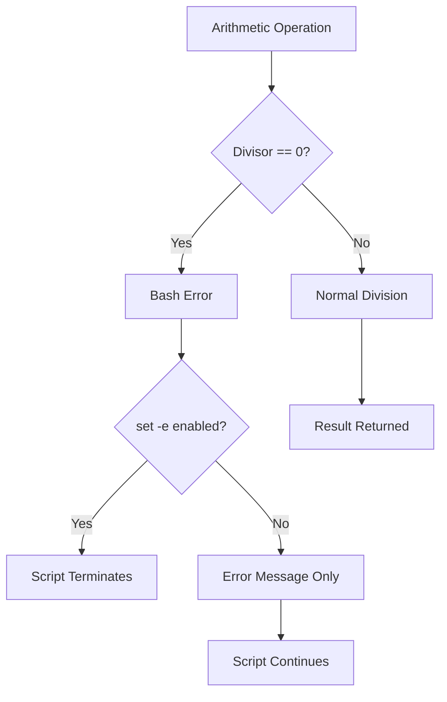
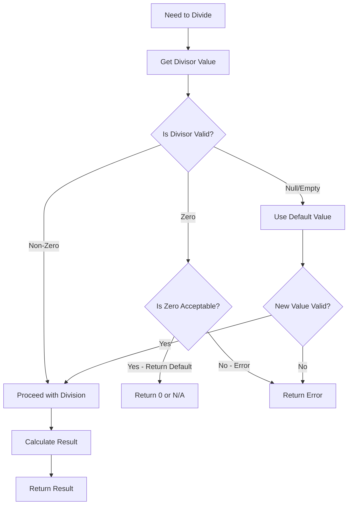
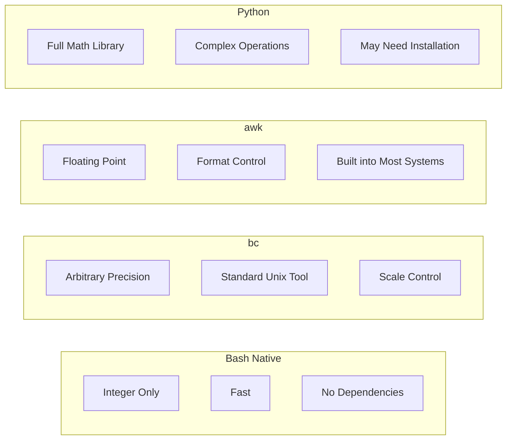
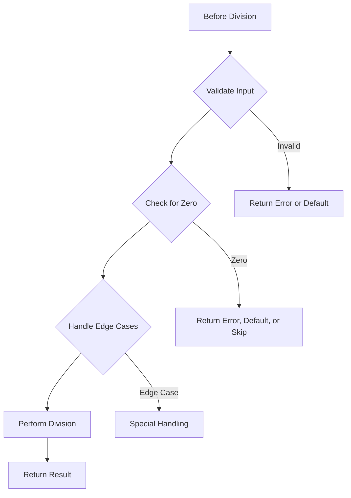

# How to Fix 'Division by Zero' Errors in Bash

Author: [nawazdhandala](https://www.github.com/nawazdhandala)

Tags: Bash, Shell Scripting, Linux, Arithmetic, Error Handling, Debugging

Description: Learn how to prevent, catch, and handle division by zero errors in Bash scripts with practical examples and defensive coding techniques.

---

Division by zero errors in Bash can crash your scripts unexpectedly. Unlike some programming languages that return infinity or NaN, Bash treats division by zero as a fatal error. This guide shows you how to prevent, detect, and handle these errors effectively.

---

## Table of Contents

1. Understanding Division by Zero in Bash
2. When Division by Zero Occurs
3. Prevention Techniques
4. Safe Division Functions
5. Handling Floating-Point Division
6. Error Recovery Strategies
7. Real-World Examples
8. Best Practices

---

## 1. Understanding Division by Zero in Bash

Bash uses integer arithmetic by default. When you attempt to divide by zero, Bash generates an error and may terminate your script.

```bash
#!/bin/bash

# This will cause an error
result=$((10 / 0))
echo "Result: $result"  # Never reached
```

Output:
```
bash: 10 / 0: division by zero (error token is "0")
```



### Error Behavior with set -e

```bash
#!/bin/bash
set -e  # Exit on error

echo "Before division"
result=$((10 / 0))  # Script exits here
echo "After division"  # Never executed
```

### Error Behavior without set -e

```bash
#!/bin/bash
# No set -e

echo "Before division"
result=$((10 / 0))  # Error message printed, but script continues
echo "After division"  # This DOES execute
echo "Result is: $result"  # Result is empty/undefined
```

---

## 2. When Division by Zero Occurs

### Direct Division

```bash
#!/bin/bash

# Obvious case
x=10
y=0
result=$((x / y))  # Error!

# Less obvious: modulo also fails
remainder=$((x % y))  # Error!
```

### Dynamic Values

```bash
#!/bin/bash

# Value from user input
read -p "Enter divisor: " divisor
result=$((100 / divisor))  # Error if user enters 0

# Value from command output
file_count=$(find /empty/dir -type f | wc -l)  # Could be 0
average=$((total_size / file_count))  # Error!

# Value from configuration
divisor="${CONFIG_DIVISOR:-0}"  # Default is 0!
result=$((100 / divisor))  # Error!
```

### Computed Values

```bash
#!/bin/bash

# Result of subtraction becomes zero
a=5
b=5
divisor=$((a - b))  # divisor = 0
result=$((100 / divisor))  # Error!

# Counter that decrements to zero
counter=3
while [[ $counter -ge 0 ]]; do
    result=$((100 / counter))  # Error when counter reaches 0!
    counter=$((counter - 1))
done
```

### Array and Loop Contexts

```bash
#!/bin/bash

# Empty array
items=()
count=${#items[@]}  # count = 0
average=$((total / count))  # Error!

# Loop variable at zero
for ((i=5; i>=0; i--)); do
    value=$((100 / i))  # Error when i=0
    echo "$value"
done
```

---

## 3. Prevention Techniques

### Check Before Dividing

```bash
#!/bin/bash

safe_divide() {
    local dividend=$1
    local divisor=$2

    if [[ $divisor -eq 0 ]]; then
        echo "Error: Division by zero" >&2
        return 1
    fi

    echo $((dividend / divisor))
}

# Usage
result=$(safe_divide 100 5)
echo "100 / 5 = $result"

result=$(safe_divide 100 0)  # Returns error, result is empty
if [[ $? -ne 0 ]]; then
    echo "Division failed"
fi
```

### Use Default Values

```bash
#!/bin/bash

# Provide default if divisor could be zero
divisor="${input_divisor:-1}"  # Default to 1 if empty

# Better: explicitly check and set
divisor=${input_divisor}
if [[ -z "$divisor" ]] || [[ "$divisor" -eq 0 ]]; then
    divisor=1
    echo "Warning: Using default divisor of 1" >&2
fi

result=$((100 / divisor))
```

### Conditional Division

```bash
#!/bin/bash

# Only divide if safe
calculate_average() {
    local total=$1
    local count=$2

    if [[ $count -gt 0 ]]; then
        echo $((total / count))
    else
        echo "0"  # Or return error, or return "N/A"
    fi
}

# Usage
files_total=1000
files_count=0  # Empty directory

average=$(calculate_average $files_total $files_count)
echo "Average file size: $average"
```

### Prevention Flow



---

## 4. Safe Division Functions

### Integer Division

```bash
#!/bin/bash

# Safe integer division with multiple options
safe_divide_int() {
    local dividend=$1
    local divisor=$2
    local on_zero="${3:-error}"  # error, zero, or a default value

    # Validate inputs are integers
    if ! [[ "$dividend" =~ ^-?[0-9]+$ ]]; then
        echo "Error: Invalid dividend: $dividend" >&2
        return 1
    fi

    if ! [[ "$divisor" =~ ^-?[0-9]+$ ]]; then
        echo "Error: Invalid divisor: $divisor" >&2
        return 1
    fi

    # Check for division by zero
    if [[ "$divisor" -eq 0 ]]; then
        case "$on_zero" in
            error)
                echo "Error: Division by zero" >&2
                return 1
                ;;
            zero)
                echo "0"
                return 0
                ;;
            *)
                echo "$on_zero"
                return 0
                ;;
        esac
    fi

    echo $((dividend / divisor))
}

# Usage examples
safe_divide_int 100 5          # Returns: 20
safe_divide_int 100 0          # Returns error
safe_divide_int 100 0 zero     # Returns: 0
safe_divide_int 100 0 -1       # Returns: -1
```

### With Remainder

```bash
#!/bin/bash

# Division with quotient and remainder
safe_divmod() {
    local dividend=$1
    local divisor=$2

    if [[ "$divisor" -eq 0 ]]; then
        echo "Error: Division by zero" >&2
        return 1
    fi

    local quotient=$((dividend / divisor))
    local remainder=$((dividend % divisor))

    echo "$quotient $remainder"
}

# Usage
read quotient remainder <<< $(safe_divmod 17 5)
echo "17 / 5 = $quotient remainder $remainder"  # 3 remainder 2
```

### Percentage Calculation

```bash
#!/bin/bash

# Calculate percentage safely
calculate_percentage() {
    local part=$1
    local total=$2
    local precision="${3:-0}"  # Decimal places

    if [[ "$total" -eq 0 ]]; then
        echo "0"
        return 0
    fi

    if [[ "$precision" -eq 0 ]]; then
        # Integer percentage
        echo $((part * 100 / total))
    else
        # Use bc for decimal precision
        echo "scale=$precision; $part * 100 / $total" | bc
    fi
}

# Usage
used=750
total=1000
percent=$(calculate_percentage $used $total)
echo "Usage: $percent%"  # 75%

# With empty total
total=0
percent=$(calculate_percentage $used $total)
echo "Usage: $percent%"  # 0%
```

---

## 5. Handling Floating-Point Division

Bash only supports integer arithmetic. For floating-point division, use external tools.

### Using bc

```bash
#!/bin/bash

# bc for arbitrary precision
safe_divide_bc() {
    local dividend=$1
    local divisor=$2
    local scale="${3:-2}"  # Decimal places

    if [[ $(echo "$divisor == 0" | bc) -eq 1 ]]; then
        echo "Error: Division by zero" >&2
        return 1
    fi

    echo "scale=$scale; $dividend / $divisor" | bc
}

# Usage
result=$(safe_divide_bc 10 3 4)
echo "10 / 3 = $result"  # 3.3333
```

### Using awk

```bash
#!/bin/bash

# awk for floating point
safe_divide_awk() {
    local dividend=$1
    local divisor=$2
    local format="${3:-%.2f}"  # printf format

    awk -v d="$dividend" -v div="$divisor" -v fmt="$format" '
    BEGIN {
        if (div == 0) {
            print "Error: Division by zero" > "/dev/stderr"
            exit 1
        }
        printf fmt "\n", d / div
    }'
}

# Usage
result=$(safe_divide_awk 10 3)
echo "10 / 3 = $result"  # 3.33

result=$(safe_divide_awk 10 3 "%.6f")
echo "10 / 3 = $result"  # 3.333333
```

### Using Python

```bash
#!/bin/bash

# Python for complex calculations
safe_divide_python() {
    local dividend=$1
    local divisor=$2

    python3 -c "
try:
    result = $dividend / $divisor
    print(f'{result:.4f}')
except ZeroDivisionError:
    import sys
    print('Error: Division by zero', file=sys.stderr)
    sys.exit(1)
"
}

# Usage
result=$(safe_divide_python 10 3)
echo "Result: $result"  # 3.3333
```

### Comparison of Methods



---

## 6. Error Recovery Strategies

### Try-Catch Pattern

```bash
#!/bin/bash

# Bash does not have try-catch, but we can simulate it
try_divide() {
    local dividend=$1
    local divisor=$2

    # Attempt division in subshell to catch error
    local result
    result=$(
        set -e
        echo $((dividend / divisor))
    ) 2>/dev/null

    if [[ $? -eq 0 ]]; then
        echo "$result"
        return 0
    else
        return 1
    fi
}

# Usage with error handling
if result=$(try_divide 100 0); then
    echo "Result: $result"
else
    echo "Division failed, using fallback"
    result=0
fi
```

### Error Handler Function

```bash
#!/bin/bash

# Global error handler
handle_math_error() {
    local operation=$1
    local error_msg=$2

    echo "Math Error in '$operation': $error_msg" >&2

    # Log error
    echo "$(date): Math error - $operation - $error_msg" >> /var/log/script_errors.log

    # Return safe default
    echo "0"
}

# Safe division with error handling
divide_with_handler() {
    local dividend=$1
    local divisor=$2

    if [[ "$divisor" -eq 0 ]]; then
        handle_math_error "$dividend / $divisor" "Division by zero"
        return 1
    fi

    echo $((dividend / divisor))
}
```

### Validation Pipeline

```bash
#!/bin/bash

# Chain of validation
validate_and_divide() {
    local dividend=$1
    local divisor=$2

    # Step 1: Check if inputs exist
    if [[ -z "$dividend" ]] || [[ -z "$divisor" ]]; then
        echo "Error: Missing operand" >&2
        return 1
    fi

    # Step 2: Check if inputs are numeric
    if ! [[ "$dividend" =~ ^-?[0-9]+$ ]]; then
        echo "Error: Dividend is not a number: $dividend" >&2
        return 1
    fi

    if ! [[ "$divisor" =~ ^-?[0-9]+$ ]]; then
        echo "Error: Divisor is not a number: $divisor" >&2
        return 1
    fi

    # Step 3: Check for division by zero
    if [[ "$divisor" -eq 0 ]]; then
        echo "Error: Division by zero" >&2
        return 1
    fi

    # Step 4: Perform division
    echo $((dividend / divisor))
}

# Usage
result=$(validate_and_divide "100" "5") && echo "Result: $result"
result=$(validate_and_divide "100" "0") || echo "Using default: 0"
result=$(validate_and_divide "100" "abc") || echo "Invalid input"
```

---

## 7. Real-World Examples

### Calculating Averages

```bash
#!/bin/bash

# Calculate average of values in a file
calculate_average() {
    local file=$1
    local sum=0
    local count=0

    while IFS= read -r value; do
        # Skip empty lines and non-numeric values
        if [[ "$value" =~ ^-?[0-9]+$ ]]; then
            sum=$((sum + value))
            count=$((count + 1))
        fi
    done < "$file"

    if [[ $count -eq 0 ]]; then
        echo "No valid values found" >&2
        echo "0"
        return 1
    fi

    echo $((sum / count))
}

# Usage
echo -e "10\n20\n30" > /tmp/values.txt
average=$(calculate_average /tmp/values.txt)
echo "Average: $average"

# Empty file
> /tmp/empty.txt
average=$(calculate_average /tmp/empty.txt)
echo "Average of empty file: $average"
```

### Disk Usage Percentage

```bash
#!/bin/bash

# Calculate disk usage percentage safely
get_disk_usage_percent() {
    local mount_point="${1:-/}"

    # Get disk info
    local df_output
    df_output=$(df -k "$mount_point" 2>/dev/null | tail -1)

    if [[ -z "$df_output" ]]; then
        echo "Error: Cannot get disk info for $mount_point" >&2
        return 1
    fi

    local total used
    read -r _ total used _ <<< "$df_output"

    if [[ "$total" -eq 0 ]]; then
        echo "Error: Total disk space is zero" >&2
        echo "0"
        return 1
    fi

    # Calculate percentage (multiply first to avoid integer truncation)
    local percent=$((used * 100 / total))
    echo "$percent"
}

# Usage
percent=$(get_disk_usage_percent "/")
echo "Disk usage: $percent%"
```

### Rate Calculation

```bash
#!/bin/bash

# Calculate rate over time
calculate_rate() {
    local count=$1
    local seconds=$2
    local unit="${3:-per second}"

    if [[ "$seconds" -eq 0 ]]; then
        if [[ "$count" -eq 0 ]]; then
            echo "0 $unit"
        else
            echo "Infinite (zero time elapsed)" >&2
            return 1
        fi
        return 0
    fi

    local rate=$((count / seconds))
    echo "$rate $unit"
}

# Measure script execution rate
start_time=$(date +%s)
processed=0

for i in {1..100}; do
    # Simulate processing
    sleep 0.01
    processed=$((processed + 1))
done

end_time=$(date +%s)
elapsed=$((end_time - start_time))

rate=$(calculate_rate $processed $elapsed "items/second")
echo "Processing rate: $rate"
```

### Load Balancing Distribution

```bash
#!/bin/bash

# Distribute items across workers
distribute_items() {
    local total_items=$1
    local num_workers=$2

    if [[ "$num_workers" -eq 0 ]]; then
        echo "Error: Cannot distribute to zero workers" >&2
        return 1
    fi

    local items_per_worker=$((total_items / num_workers))
    local remainder=$((total_items % num_workers))

    echo "Distribution for $total_items items across $num_workers workers:"
    for ((i=1; i<=num_workers; i++)); do
        local worker_items=$items_per_worker
        # Distribute remainder to first workers
        if [[ $i -le $remainder ]]; then
            worker_items=$((worker_items + 1))
        fi
        echo "  Worker $i: $worker_items items"
    done
}

# Usage
distribute_items 100 3
# Worker 1: 34 items
# Worker 2: 33 items
# Worker 3: 33 items

distribute_items 100 0  # Error
```

---

## 8. Best Practices

### Defensive Coding Checklist



### Complete Safe Math Library

```bash
#!/bin/bash

# Safe math library for Bash scripts
# Source this file in your scripts: source safe_math.sh

# Configuration
SAFE_MATH_ON_ERROR="${SAFE_MATH_ON_ERROR:-error}"  # error, zero, or default value
SAFE_MATH_PRECISION="${SAFE_MATH_PRECISION:-2}"

# Validate numeric input
is_integer() {
    [[ "$1" =~ ^-?[0-9]+$ ]]
}

is_number() {
    [[ "$1" =~ ^-?[0-9]+\.?[0-9]*$ ]]
}

# Safe integer division
safe_div() {
    local dividend=$1
    local divisor=$2
    local on_error="${3:-$SAFE_MATH_ON_ERROR}"

    if ! is_integer "$dividend" || ! is_integer "$divisor"; then
        echo "Error: Non-integer operand" >&2
        return 1
    fi

    if [[ "$divisor" -eq 0 ]]; then
        case "$on_error" in
            error)
                echo "Error: Division by zero" >&2
                return 1
                ;;
            zero) echo "0" ;;
            *) echo "$on_error" ;;
        esac
        return 0
    fi

    echo $((dividend / divisor))
}

# Safe modulo
safe_mod() {
    local dividend=$1
    local divisor=$2
    local on_error="${3:-$SAFE_MATH_ON_ERROR}"

    if ! is_integer "$dividend" || ! is_integer "$divisor"; then
        echo "Error: Non-integer operand" >&2
        return 1
    fi

    if [[ "$divisor" -eq 0 ]]; then
        case "$on_error" in
            error)
                echo "Error: Modulo by zero" >&2
                return 1
                ;;
            *) echo "0" ;;
        esac
        return 0
    fi

    echo $((dividend % divisor))
}

# Safe floating-point division (requires bc)
safe_fdiv() {
    local dividend=$1
    local divisor=$2
    local precision="${3:-$SAFE_MATH_PRECISION}"

    if ! is_number "$dividend" || ! is_number "$divisor"; then
        echo "Error: Non-numeric operand" >&2
        return 1
    fi

    if [[ $(echo "$divisor == 0" | bc -l) -eq 1 ]]; then
        echo "Error: Division by zero" >&2
        return 1
    fi

    echo "scale=$precision; $dividend / $divisor" | bc
}

# Safe percentage
safe_percent() {
    local part=$1
    local total=$2
    local precision="${3:-0}"

    if [[ "$total" -eq 0 ]]; then
        echo "0"
        return 0
    fi

    if [[ "$precision" -eq 0 ]]; then
        echo $((part * 100 / total))
    else
        echo "scale=$precision; $part * 100 / $total" | bc
    fi
}

# Safe average
safe_average() {
    local sum=0
    local count=0

    for value in "$@"; do
        if is_integer "$value"; then
            sum=$((sum + value))
            count=$((count + 1))
        fi
    done

    if [[ $count -eq 0 ]]; then
        echo "0"
        return 0
    fi

    echo $((sum / count))
}
```

### Usage Example

```bash
#!/bin/bash
source /path/to/safe_math.sh

# Integer division
result=$(safe_div 100 3)
echo "100 / 3 = $result"  # 33

# Division by zero handling
result=$(safe_div 100 0 zero)
echo "100 / 0 = $result"  # 0

# Floating point
result=$(safe_fdiv 10 3 4)
echo "10 / 3 = $result"  # 3.3333

# Percentage
percent=$(safe_percent 75 200)
echo "75 of 200 = $percent%"  # 37%

# Average
avg=$(safe_average 10 20 30 40 50)
echo "Average: $avg"  # 30
```

---

## Quick Reference

```bash
# Check before dividing
[[ $divisor -ne 0 ]] && result=$((dividend / divisor))

# Provide default if zero
divisor=${divisor:-1}

# Safe division function
safe_div() { [[ $2 -eq 0 ]] && echo 0 || echo $(($1 / $2)); }

# Floating point with bc
echo "scale=2; 10 / 3" | bc

# Floating point with awk
awk 'BEGIN { printf "%.2f\n", 10/3 }'

# Validate numeric input
[[ "$var" =~ ^-?[0-9]+$ ]] || echo "Not a number"
```

---

## Key Takeaways

1. **Always validate before dividing** - Check that the divisor is not zero before performing division
2. **Use default values** - When zero is possible, have a sensible default ready
3. **Choose appropriate error handling** - Return error, zero, or a default based on context
4. **Use bc or awk for floating point** - Bash only supports integer arithmetic natively
5. **Create reusable safe functions** - Build a library of validated math operations
6. **Handle empty arrays and counts** - Division by array length is a common source of errors
7. **Test edge cases** - Test with zero, negative numbers, and empty values
8. **Log errors for debugging** - When division fails, log the operands for investigation

---

*Building scripts that handle critical calculations? [OneUptime](https://oneuptime.com) provides monitoring and alerting to help you catch unexpected errors in your automation pipelines before they cause problems.*
