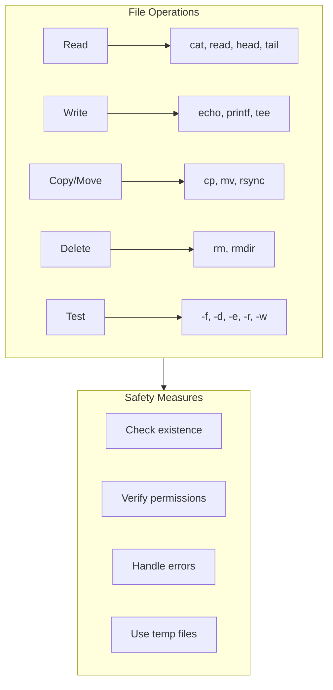
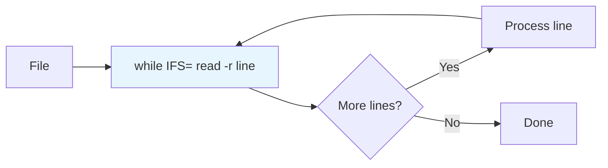
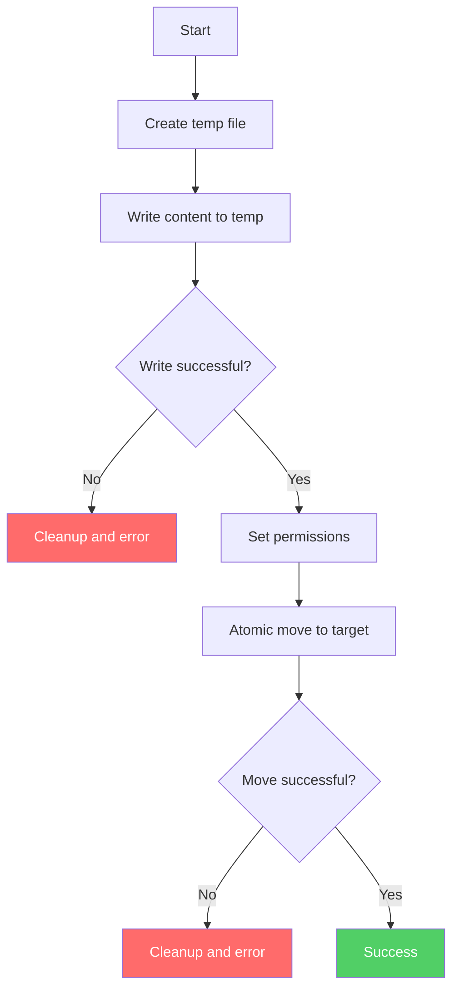
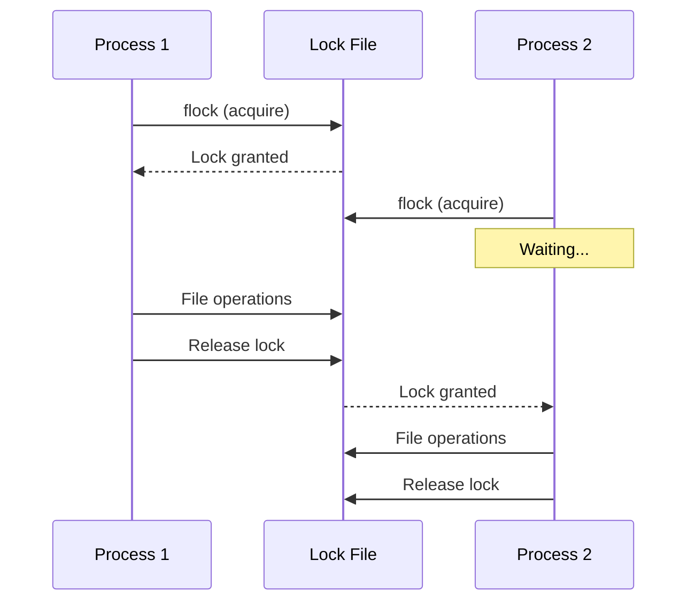

# How to Handle File Operations in Bash Scripts

Author: [nawazdhandala](https://www.github.com/nawazdhandala)

Tags: Bash, Shell Scripting, File Operations, Linux, DevOps, Automation

Description: A comprehensive guide to reading, writing, copying, moving, and managing files safely in Bash scripts with proper error handling.

---

> File operations are fundamental to shell scripting. Whether you are processing logs, managing configurations, or automating backups, understanding how to handle files safely and efficiently is essential. This guide covers all common file operations with best practices.

---

## File Operation Overview



---

## Checking File Existence and Properties

Before performing operations, always verify that files exist and have appropriate permissions.

### File Test Operators

```bash
#!/bin/bash
# Comprehensive file testing

file="/path/to/file.txt"
dir="/path/to/directory"

# Existence tests
if [[ -e "$file" ]]; then
    echo "File exists"
fi

if [[ -f "$file" ]]; then
    echo "Is a regular file"
fi

if [[ -d "$dir" ]]; then
    echo "Is a directory"
fi

if [[ -L "$file" ]]; then
    echo "Is a symbolic link"
fi

# Permission tests
if [[ -r "$file" ]]; then
    echo "File is readable"
fi

if [[ -w "$file" ]]; then
    echo "File is writable"
fi

if [[ -x "$file" ]]; then
    echo "File is executable"
fi

# Size tests
if [[ -s "$file" ]]; then
    echo "File has content (not empty)"
fi

# Comparison tests
if [[ "$file1" -nt "$file2" ]]; then
    echo "file1 is newer than file2"
fi

if [[ "$file1" -ot "$file2" ]]; then
    echo "file1 is older than file2"
fi
```

### Complete File Check Function

```bash
#!/bin/bash
# Reusable file validation function

validate_file() {
    local file="$1"
    local mode="${2:-r}"  # Default to read mode

    # Check if file path provided
    if [[ -z "$file" ]]; then
        echo "Error: No file path provided" >&2
        return 1
    fi

    # Check existence
    if [[ ! -e "$file" ]]; then
        echo "Error: File does not exist: $file" >&2
        return 1
    fi

    # Check if regular file
    if [[ ! -f "$file" ]]; then
        echo "Error: Not a regular file: $file" >&2
        return 1
    fi

    # Check permissions based on mode
    case "$mode" in
        r)
            if [[ ! -r "$file" ]]; then
                echo "Error: File not readable: $file" >&2
                return 1
            fi
            ;;
        w)
            if [[ ! -w "$file" ]]; then
                echo "Error: File not writable: $file" >&2
                return 1
            fi
            ;;
        rw)
            if [[ ! -r "$file" ]] || [[ ! -w "$file" ]]; then
                echo "Error: File not readable/writable: $file" >&2
                return 1
            fi
            ;;
    esac

    return 0
}

# Usage
validate_file "/etc/passwd" "r" && echo "File is valid for reading"
```

---

## Reading Files

### Reading Entire File

```bash
#!/bin/bash
# Different ways to read files

file="/path/to/file.txt"

# Method 1: Using cat (loads entire file into memory)
content=$(cat "$file")
echo "$content"

# Method 2: Using command substitution with redirection
content=$(<"$file")
echo "$content"

# Method 3: Using read with here-string
while IFS= read -r line; do
    echo "Line: $line"
done < "$file"
```

### Reading Line by Line

```bash
#!/bin/bash
# Safe line-by-line reading

process_file() {
    local file="$1"
    local line_number=0

    # Check file exists
    if [[ ! -f "$file" ]]; then
        echo "Error: File not found: $file" >&2
        return 1
    fi

    # Read line by line
    # IFS= prevents leading/trailing whitespace trimming
    # -r prevents backslash interpretation
    while IFS= read -r line || [[ -n "$line" ]]; do
        ((line_number++))
        echo "[$line_number] $line"
    done < "$file"
}

process_file "/etc/hosts"
```



### Reading Specific Parts of Files

```bash
#!/bin/bash
# Reading portions of files

file="/var/log/syslog"

# First N lines
head -n 10 "$file"

# Last N lines
tail -n 10 "$file"

# Lines between N and M
sed -n '10,20p' "$file"

# Specific line number
sed -n '15p' "$file"

# Read into array
mapfile -t lines < "$file"
echo "Total lines: ${#lines[@]}"
echo "First line: ${lines[0]}"
echo "Last line: ${lines[-1]}"
```

### Reading Delimited Data

```bash
#!/bin/bash
# Parsing CSV and delimited files

# CSV file processing
process_csv() {
    local csv_file="$1"

    while IFS=',' read -r col1 col2 col3 col4; do
        # Skip header line
        [[ "$col1" == "id" ]] && continue

        echo "ID: $col1, Name: $col2, Email: $col3, Status: $col4"
    done < "$csv_file"
}

# Process /etc/passwd
parse_passwd() {
    while IFS=':' read -r username password uid gid gecos home shell; do
        echo "User: $username, UID: $uid, Shell: $shell"
    done < /etc/passwd
}

# Tab-separated values
process_tsv() {
    local tsv_file="$1"

    while IFS=$'\t' read -r field1 field2 field3; do
        echo "Fields: $field1 | $field2 | $field3"
    done < "$tsv_file"
}
```

---

## Writing Files

### Basic Writing Methods

```bash
#!/bin/bash
# Different ways to write to files

output_file="/tmp/output.txt"

# Method 1: Overwrite with echo
echo "Hello, World!" > "$output_file"

# Method 2: Append with echo
echo "Another line" >> "$output_file"

# Method 3: Using printf (better formatting control)
printf "Name: %s\nAge: %d\n" "John" 30 > "$output_file"

# Method 4: Here document for multi-line content
cat > "$output_file" << 'EOF'
This is line 1
This is line 2
Variables are NOT expanded with 'EOF'
EOF

# Method 5: Here document with variable expansion
name="Alice"
cat > "$output_file" << EOF
Hello, $name!
Today is $(date)
EOF

# Method 6: Using tee (writes to file and stdout)
echo "Logged message" | tee "$output_file"

# Method 7: Append with tee
echo "Appended message" | tee -a "$output_file"
```

### Safe File Writing with Temp Files

```bash
#!/bin/bash
# Safe file writing using temporary files

safe_write() {
    local target_file="$1"
    local content="$2"

    # Create temporary file in same directory
    # This ensures atomic move operation works
    local temp_file
    temp_file=$(mktemp "${target_file}.XXXXXX")

    # Ensure cleanup on exit
    trap "rm -f '$temp_file'" EXIT

    # Write content to temp file
    if ! echo "$content" > "$temp_file"; then
        echo "Error: Failed to write to temp file" >&2
        rm -f "$temp_file"
        return 1
    fi

    # Set same permissions as original (if exists)
    if [[ -f "$target_file" ]]; then
        chmod --reference="$target_file" "$temp_file" 2>/dev/null
    fi

    # Atomic move to target
    if ! mv "$temp_file" "$target_file"; then
        echo "Error: Failed to move temp file to target" >&2
        rm -f "$temp_file"
        return 1
    fi

    trap - EXIT
    return 0
}

# Usage
safe_write "/tmp/config.txt" "setting=value"
```



### Writing Arrays and Structured Data

```bash
#!/bin/bash
# Writing arrays and structured data

# Write array to file (one element per line)
declare -a items=("apple" "banana" "cherry" "date")

printf '%s\n' "${items[@]}" > /tmp/fruits.txt

# Write associative array as key=value
declare -A config=(
    ["host"]="localhost"
    ["port"]="8080"
    ["debug"]="true"
)

for key in "${!config[@]}"; do
    echo "$key=${config[$key]}"
done > /tmp/config.ini

# Generate JSON output
generate_json() {
    local name="$1"
    local version="$2"
    local enabled="$3"

    cat << EOF
{
    "name": "$name",
    "version": "$version",
    "enabled": $enabled
}
EOF
}

generate_json "myapp" "1.0.0" "true" > /tmp/app.json
```

---

## Copying and Moving Files

### Basic Copy Operations

```bash
#!/bin/bash
# File copying operations

source_file="/path/to/source.txt"
dest_file="/path/to/dest.txt"
backup_dir="/path/to/backup"

# Simple copy
cp "$source_file" "$dest_file"

# Copy with backup
cp --backup=numbered "$source_file" "$dest_file"

# Preserve attributes (permissions, timestamps)
cp -p "$source_file" "$dest_file"

# Copy directory recursively
cp -r /source/dir /dest/dir

# Copy with progress (for large files)
rsync -ah --progress "$source_file" "$dest_file"

# Copy only if source is newer
cp -u "$source_file" "$dest_file"
```

### Safe Copy Function

```bash
#!/bin/bash
# Safe copy with verification

safe_copy() {
    local src="$1"
    local dest="$2"
    local verify="${3:-true}"

    # Validate source
    if [[ ! -f "$src" ]]; then
        echo "Error: Source file does not exist: $src" >&2
        return 1
    fi

    if [[ ! -r "$src" ]]; then
        echo "Error: Source file not readable: $src" >&2
        return 1
    fi

    # Create destination directory if needed
    local dest_dir
    dest_dir=$(dirname "$dest")
    if [[ ! -d "$dest_dir" ]]; then
        mkdir -p "$dest_dir" || {
            echo "Error: Cannot create destination directory" >&2
            return 1
        }
    fi

    # Perform copy
    if ! cp -p "$src" "$dest"; then
        echo "Error: Copy failed" >&2
        return 1
    fi

    # Verify copy with checksum
    if [[ "$verify" == "true" ]]; then
        local src_hash dest_hash
        src_hash=$(md5sum "$src" | cut -d' ' -f1)
        dest_hash=$(md5sum "$dest" | cut -d' ' -f1)

        if [[ "$src_hash" != "$dest_hash" ]]; then
            echo "Error: Copy verification failed - checksums differ" >&2
            rm -f "$dest"
            return 1
        fi
        echo "Copy verified successfully"
    fi

    return 0
}

# Usage
safe_copy "/etc/hosts" "/tmp/hosts_backup" true
```

### Moving and Renaming Files

```bash
#!/bin/bash
# Moving and renaming operations

# Simple move
mv /path/to/source.txt /path/to/dest.txt

# Move with backup
mv --backup=numbered source.txt dest.txt

# Move only if source is newer
mv -u source.txt dest.txt

# Rename multiple files with pattern
rename_files() {
    local dir="$1"
    local pattern="$2"
    local replacement="$3"

    for file in "$dir"/*"$pattern"*; do
        if [[ -f "$file" ]]; then
            local newname="${file//$pattern/$replacement}"
            mv "$file" "$newname"
            echo "Renamed: $file -> $newname"
        fi
    done
}

# Example: Rename all .txt to .bak
rename_files "/tmp" ".txt" ".bak"
```

---

## Deleting Files Safely

### Safe Delete Patterns

```bash
#!/bin/bash
# Safe file deletion practices

# DANGEROUS: Never do this
# rm -rf $dir/*  # If $dir is empty, this becomes rm -rf /*

# SAFE: Always quote and verify
dir="/tmp/myapp"

if [[ -d "$dir" ]] && [[ "$dir" != "/" ]]; then
    rm -rf "$dir"/*
fi

# SAFER: Use explicit paths
safe_delete() {
    local target="$1"

    # Prevent dangerous deletions
    case "$target" in
        /|/bin|/boot|/dev|/etc|/home|/lib*|/opt|/root|/sbin|/sys|/usr|/var)
            echo "Error: Refusing to delete system directory: $target" >&2
            return 1
            ;;
    esac

    # Verify target exists
    if [[ ! -e "$target" ]]; then
        echo "Warning: Target does not exist: $target" >&2
        return 0
    fi

    # Delete with confirmation in interactive mode
    if [[ -t 0 ]]; then
        read -p "Delete $target? (y/N) " -n 1 -r
        echo
        if [[ ! $REPLY =~ ^[Yy]$ ]]; then
            echo "Cancelled"
            return 0
        fi
    fi

    rm -rf "$target"
}
```

### Using Trash Instead of Delete

```bash
#!/bin/bash
# Move to trash instead of permanent delete

trash() {
    local trash_dir="${HOME}/.local/share/Trash/files"
    local trash_info="${HOME}/.local/share/Trash/info"

    # Create trash directories if needed
    mkdir -p "$trash_dir" "$trash_info"

    for file in "$@"; do
        if [[ ! -e "$file" ]]; then
            echo "Warning: File not found: $file" >&2
            continue
        fi

        local basename
        basename=$(basename "$file")
        local timestamp
        timestamp=$(date +%Y%m%d%H%M%S)
        local trash_name="${basename}.${timestamp}"

        # Move to trash
        mv "$file" "$trash_dir/$trash_name"

        # Create info file (freedesktop.org standard)
        cat > "$trash_info/$trash_name.trashinfo" << EOF
[Trash Info]
Path=$(realpath "$file")
DeletionDate=$(date +%Y-%m-%dT%H:%M:%S)
EOF

        echo "Trashed: $file"
    done
}

# Usage
trash /tmp/old_file.txt
```

---

## Working with Directories

```bash
#!/bin/bash
# Directory operations

# Create directory with parents
mkdir -p /path/to/deep/directory

# Create with specific permissions
mkdir -m 755 /path/to/dir

# Create temporary directory
temp_dir=$(mktemp -d)
echo "Created temp dir: $temp_dir"
trap "rm -rf '$temp_dir'" EXIT

# Process files in directory
process_directory() {
    local dir="$1"
    local pattern="${2:-*}"

    if [[ ! -d "$dir" ]]; then
        echo "Error: Not a directory: $dir" >&2
        return 1
    fi

    # Use nullglob to handle empty directories
    shopt -s nullglob

    for file in "$dir"/$pattern; do
        if [[ -f "$file" ]]; then
            echo "Processing: $file"
            # Add your processing logic here
        fi
    done

    shopt -u nullglob
}

# Find and process files recursively
find_and_process() {
    local dir="$1"
    local pattern="$2"

    while IFS= read -r -d '' file; do
        echo "Found: $file"
    done < <(find "$dir" -name "$pattern" -type f -print0)
}
```

---

## File Locking

Prevent concurrent access to files in multi-process scenarios.

```bash
#!/bin/bash
# File locking for concurrent access

# Method 1: Using flock
locked_operation() {
    local lockfile="/tmp/myapp.lock"
    local datafile="/tmp/myapp.data"

    # Create lock file descriptor
    exec 200>"$lockfile"

    # Acquire exclusive lock (wait if necessary)
    if ! flock -w 10 200; then
        echo "Error: Could not acquire lock within 10 seconds" >&2
        return 1
    fi

    # Critical section - only one process at a time
    echo "Lock acquired, performing operation..."

    # Your file operations here
    echo "$(date): Operation by $$" >> "$datafile"

    # Lock is automatically released when script exits
    # or when file descriptor is closed

    echo "Operation complete"
}

# Method 2: Using mkdir (atomic operation)
lock_with_mkdir() {
    local lockdir="/tmp/myapp.lock.d"
    local max_attempts=10
    local attempt=0

    while ! mkdir "$lockdir" 2>/dev/null; do
        ((attempt++))
        if ((attempt >= max_attempts)); then
            echo "Error: Could not acquire lock" >&2
            return 1
        fi
        echo "Waiting for lock..."
        sleep 1
    done

    # Ensure cleanup
    trap "rmdir '$lockdir'" EXIT

    # Critical section
    echo "Lock acquired"

    # Your operations here

    # Release lock
    rmdir "$lockdir"
    trap - EXIT
}
```



---

## Error Handling Pattern

```bash
#!/bin/bash
# Comprehensive file operation with error handling

set -euo pipefail

process_file() {
    local input_file="$1"
    local output_file="$2"
    local backup_file="${output_file}.bak"

    # Validate input
    if [[ ! -f "$input_file" ]]; then
        echo "Error: Input file not found: $input_file" >&2
        return 1
    fi

    # Create backup of existing output
    if [[ -f "$output_file" ]]; then
        cp "$output_file" "$backup_file" || {
            echo "Error: Failed to create backup" >&2
            return 1
        }
    fi

    # Create temp file for atomic write
    local temp_file
    temp_file=$(mktemp) || {
        echo "Error: Failed to create temp file" >&2
        return 1
    }

    # Cleanup function
    cleanup() {
        rm -f "$temp_file"
        # Restore backup on failure
        if [[ $1 -ne 0 ]] && [[ -f "$backup_file" ]]; then
            mv "$backup_file" "$output_file" 2>/dev/null
        fi
    }
    trap 'cleanup $?' EXIT

    # Process file
    while IFS= read -r line; do
        # Transform line (example: uppercase)
        echo "${line^^}" >> "$temp_file"
    done < "$input_file"

    # Atomic move to output
    mv "$temp_file" "$output_file" || {
        echo "Error: Failed to write output file" >&2
        return 1
    }

    # Remove backup on success
    rm -f "$backup_file"

    trap - EXIT
    echo "Successfully processed $input_file -> $output_file"
    return 0
}

# Usage
process_file "/tmp/input.txt" "/tmp/output.txt"
```

---

## Summary

Safe file operations in Bash require:

1. **Always validate** - Check file existence and permissions before operations
2. **Quote variables** - Prevent word splitting and globbing issues
3. **Use temp files** - Write to temporary files and move atomically
4. **Handle errors** - Check return codes and provide meaningful messages
5. **Implement locking** - Prevent race conditions in concurrent scenarios
6. **Clean up** - Use trap to ensure temporary files are removed

---

*Need to monitor your file processing scripts? [OneUptime](https://oneuptime.com) provides real-time monitoring and alerting for your automation workflows.*

**Related Reading:**
- [Bash Error Handling Best Practices](https://oneuptime.com/blog/post/bash-error-handling)
- [Automating Backup Scripts](https://oneuptime.com/blog/post/backup-automation)
