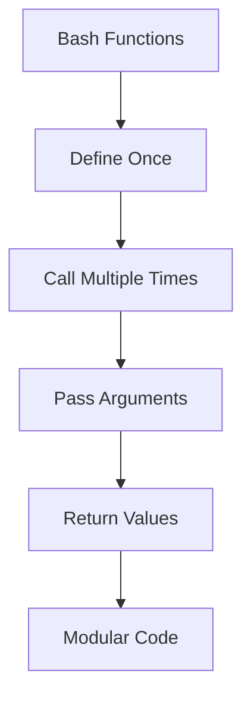
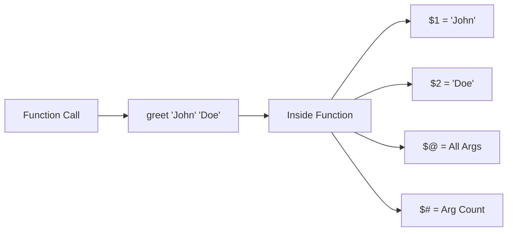
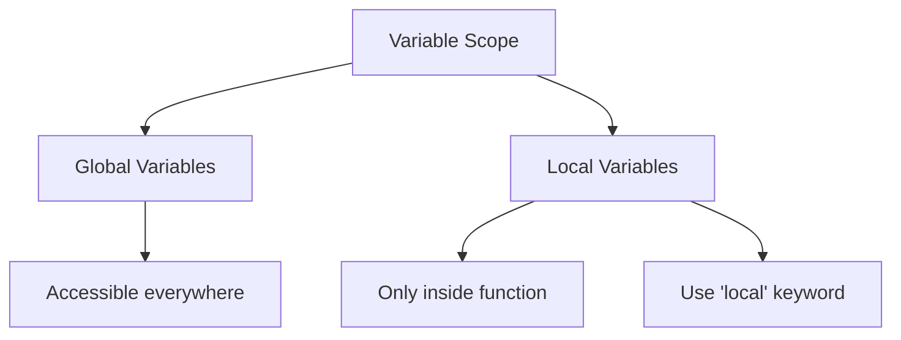

# How to Handle Functions in Bash Scripts

Author: [nawazdhandala](https://www.github.com/nawazdhandala)

Tags: Bash, Shell Scripting, Functions, DevOps, Automation

Description: Master the art of writing reusable, maintainable functions in Bash scripts with practical examples and best practices.

---

Functions are essential for writing clean, maintainable, and reusable Bash scripts. They allow you to encapsulate logic, avoid code duplication, and make your scripts easier to test and debug.

## Function Basics



### Function Syntax

```bash
#!/bin/bash

# Syntax 1: Using the function keyword
function greet {
    echo "Hello, World!"
}

# Syntax 2: Using parentheses (POSIX compatible)
greet() {
    echo "Hello, World!"
}

# Call the function
greet
```

## Function Arguments

Functions accept arguments accessed via positional parameters.



### Accessing Arguments

```bash
#!/bin/bash

greet_user() {
    local name="$1"      # First argument
    local title="$2"     # Second argument
    echo "Hello, $title $name!"
}

greet_user "Smith" "Dr."
# Output: Hello, Dr. Smith!
```

### Default Argument Values

```bash
#!/bin/bash

create_user() {
    local username="${1:-guest}"
    local shell="${2:-/bin/bash}"
    local home_dir="${3:-/home/$username}"

    echo "Creating user: $username"
    echo "  Shell: $shell"
    echo "  Home: $home_dir"
}

create_user                    # Uses all defaults
create_user "john"             # Custom username
create_user "jane" "/bin/zsh"  # Custom username and shell
```

## Return Values

### Exit Status (Return Code)

```bash
#!/bin/bash

is_valid_email() {
    local email="$1"
    if [[ "$email" =~ ^[A-Za-z0-9._%+-]+@[A-Za-z0-9.-]+\.[A-Za-z]{2,}$ ]]; then
        return 0  # Success
    else
        return 1  # Failure
    fi
}

if is_valid_email "user@example.com"; then
    echo "Valid email"
fi
```

### Capturing Output

```bash
#!/bin/bash

get_timestamp() {
    date '+%Y-%m-%d %H:%M:%S'
}

calculate_sum() {
    local a="$1"
    local b="$2"
    echo $((a + b))
}

timestamp=$(get_timestamp)
result=$(calculate_sum 10 20)
```

## Variable Scope



### Local Variables

```bash
#!/bin/bash

global_var="I am global"

my_function() {
    local local_var="I am local"
    local global_var="Modified inside function"

    echo "Inside: local_var=$local_var, global_var=$global_var"
}

echo "Before: global_var=$global_var"
my_function
echo "After: global_var=$global_var"  # Still "I am global"
```

## Error Handling in Functions

```bash
#!/bin/bash

backup_database() {
    local db_name="$1"
    local backup_dir="$2"

    # Input validation
    if [[ -z "$db_name" ]]; then
        echo "Error: Database name is required" >&2
        return 1
    fi

    if [[ -z "$backup_dir" ]]; then
        backup_dir="/tmp/backups"
    fi

    mkdir -p "$backup_dir" || return 2
    
    local backup_file="$backup_dir/${db_name}_$(date +%Y%m%d_%H%M%S).sql"
    echo "Backing up to $backup_file..."
    
    # Simulated backup
    echo "-- Backup of $db_name" > "$backup_file" || return 3
    
    echo "$backup_file"
    return 0
}

if backup_file=$(backup_database "myapp" "/var/backups"); then
    echo "Success: $backup_file"
else
    echo "Backup failed with code: $?"
fi
```

## Practical Examples

### Service Health Checker

```bash
#!/bin/bash

check_http() {
    local url="$1"
    local timeout="${2:-5}"
    curl -sf -o /dev/null --connect-timeout "$timeout" "$url"
}

check_service() {
    local name="$1"
    local url="$2"

    echo -n "Checking $name... "
    if check_http "$url"; then
        echo "OK"
        return 0
    else
        echo "FAILED"
        return 1
    fi
}

run_health_checks() {
    local failed=0
    check_service "Web Server" "http://localhost:80" || ((failed++))
    check_service "API" "http://localhost:8080/health" || ((failed++))

    if [[ $failed -eq 0 ]]; then
        echo "All services healthy!"
    else
        echo "$failed service(s) failed"
    fi
}

run_health_checks
```

## Best Practices

1. **Always use `local`** for function variables
2. **Quote all variable expansions**
3. **Validate input** at the beginning of functions
4. **Use meaningful return codes**
5. **Document functions** with comments
6. **Keep functions focused** on a single task
7. **Use descriptive names**

## Conclusion

Functions are the building blocks of well-structured Bash scripts. Use local variables, validate inputs, handle errors properly, and keep your functions focused and well-documented.
