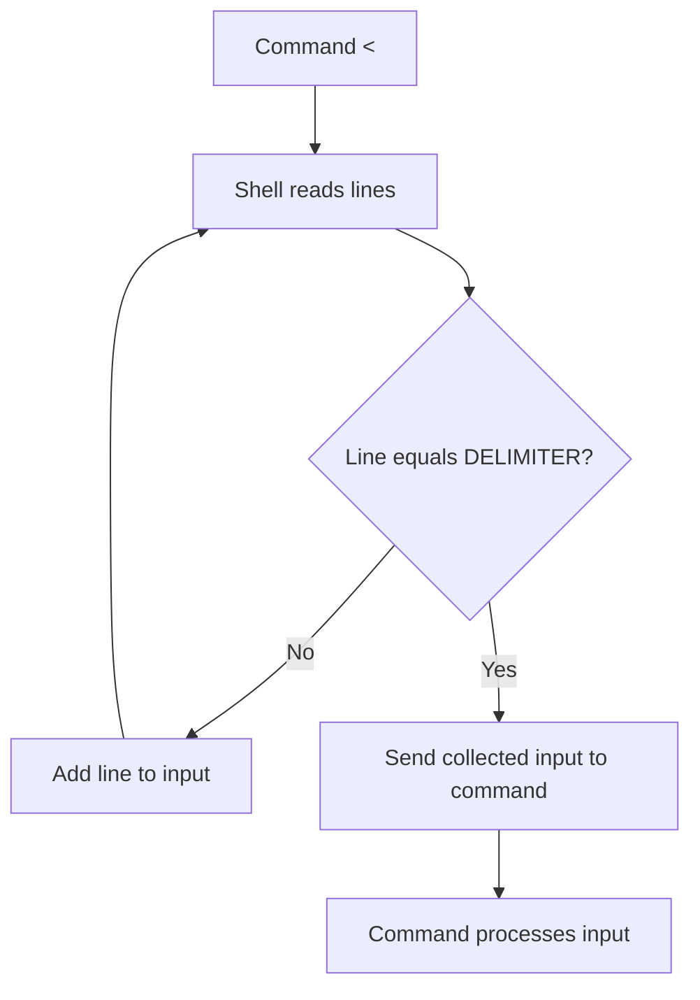
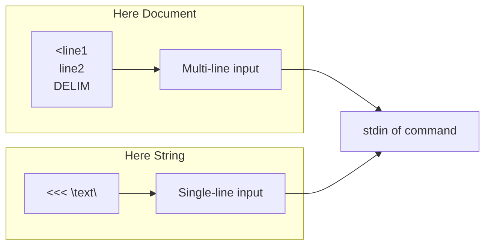

# How to Handle Here Documents in Bash

Author: [nawazdhandala](https://github.com/nawazdhandala)

Tags: Bash, Shell Scripting, Linux, Here Documents, Heredoc, Input Redirection, Text Processing

Description: Master Bash here documents to embed multi-line text, configuration templates, and complex input directly in your shell scripts.

---

## Introduction

Here documents (heredocs) are a powerful Bash feature that allows you to embed multi-line text directly in your scripts. They provide a clean way to include configuration files, SQL queries, email templates, and any other multi-line content without external files. Understanding heredocs is essential for writing maintainable shell scripts.

## Basic Syntax

### Standard Here Document

A here document starts with `<<` followed by a delimiter, includes your content, and ends with the delimiter on its own line.

```bash
#!/bin/bash

# Basic heredoc syntax
cat <<EOF
This is line 1
This is line 2
This is line 3
EOF

# The delimiter can be any word (EOF is conventional)
cat <<MYDELIMITER
Hello, World!
MYDELIMITER

# Output:
# This is line 1
# This is line 2
# This is line 3
```

### Here Document Flow



## Quoting and Expansion

### With Variable Expansion (Unquoted Delimiter)

```bash
#!/bin/bash

name="Alice"
date_today=$(date +%Y-%m-%d)

# Variables are expanded when delimiter is unquoted
cat <<EOF
Hello, $name!
Today's date is: $date_today
Your home directory is: $HOME
Command output: $(whoami)
EOF

# Output:
# Hello, Alice!
# Today's date is: 2024-01-15
# Your home directory is: /home/alice
# Command output: alice
```

### Without Variable Expansion (Quoted Delimiter)

```bash
#!/bin/bash

name="Alice"

# Single or double quotes prevent expansion
cat <<'EOF'
Hello, $name!
Variables like $HOME are not expanded
Commands like $(whoami) are not executed
EOF

# Output (literal):
# Hello, $name!
# Variables like $HOME are not expanded
# Commands like $(whoami) are not executed

# Double quotes work the same way
cat <<"LITERAL"
No expansion here: $name
LITERAL
```

### Selective Expansion

```bash
#!/bin/bash

server="production"
port=8080

# Mix literal and expanded content using escape
cat <<EOF
Server: $server
Port: $port
Literal dollar sign: \$variable
Escaped backtick: \`command\`
EOF

# Output:
# Server: production
# Port: 8080
# Literal dollar sign: $variable
# Escaped backtick: `command`
```

## Indentation Handling

### Tab-Stripped Here Documents

Use `<<-` to strip leading tabs (not spaces) from the content.

```bash
#!/bin/bash

# Standard heredoc preserves all indentation
if true; then
    cat <<EOF
    This line has spaces
EOF
fi

# Tab-stripped heredoc with <<-
if true; then
	cat <<-EOF
	This line had tabs (now stripped)
	Indented content
	EOF
fi

# Note: The content lines must use TABS, not spaces
# The delimiter line can also be indented with tabs
```

### Practical Indentation Example

```bash
#!/bin/bash

process_user() {
    local username="$1"

    # Using <<- allows the heredoc to be indented with the code
	cat <<-EOF
	User Report
	-----------
	Username: $username
	Home: /home/$username
	Shell: /bin/bash
	EOF
}

process_user "alice"
```

## Redirecting Here Documents

### To a File

```bash
#!/bin/bash

# Write heredoc to a file
cat <<EOF > config.txt
database_host=localhost
database_port=5432
database_name=myapp
EOF

# Append to a file
cat <<EOF >> config.txt
log_level=info
EOF

# Using tee for both display and file
cat <<EOF | tee config.txt
server_name=webserver1
server_port=80
EOF
```

### To a Command

```bash
#!/bin/bash

# Pass heredoc to any command that reads stdin
mysql -u root -p <<EOF
CREATE DATABASE myapp;
USE myapp;
CREATE TABLE users (
    id INT PRIMARY KEY AUTO_INCREMENT,
    name VARCHAR(100)
);
EOF

# Send email with heredoc
mail -s "Report" admin@example.com <<EOF
Daily Report
------------
Status: All systems operational
Date: $(date)
EOF

# SSH with heredoc
ssh user@server <<EOF
cd /var/log
tail -100 app.log
exit
EOF
```

## Here Strings

Here strings (`<<<`) provide a simpler syntax for single-line input.

```bash
#!/bin/bash

# Here string syntax
cat <<< "This is a here string"

# With variable
message="Hello, World!"
cat <<< "$message"

# Pass to commands
grep "pattern" <<< "Check this text for a pattern"

# Read into variable
read -r var <<< "value"
echo "$var"

# Split string into array
IFS=',' read -ra parts <<< "a,b,c,d"
echo "${parts[1]}"  # Output: b
```

### Here Document vs Here String



## Practical Applications

### Configuration File Generation

```bash
#!/bin/bash

# Generate nginx configuration
generate_nginx_config() {
    local domain="$1"
    local port="$2"
    local root_dir="$3"

    cat <<EOF
server {
    listen 80;
    server_name $domain;
    root $root_dir;

    location / {
        proxy_pass http://127.0.0.1:$port;
        proxy_set_header Host \$host;
        proxy_set_header X-Real-IP \$remote_addr;
    }

    location /static {
        alias $root_dir/static;
        expires 30d;
    }

    error_log /var/log/nginx/${domain}_error.log;
    access_log /var/log/nginx/${domain}_access.log;
}
EOF
}

# Usage
generate_nginx_config "example.com" "3000" "/var/www/example" > /etc/nginx/sites-available/example
```

### SQL Script Execution

```bash
#!/bin/bash

# Database setup script
setup_database() {
    local db_name="$1"
    local db_user="$2"
    local db_pass="$3"

    mysql -u root -p <<EOF
-- Create database
CREATE DATABASE IF NOT EXISTS $db_name;

-- Create user
CREATE USER IF NOT EXISTS '$db_user'@'localhost' IDENTIFIED BY '$db_pass';

-- Grant privileges
GRANT ALL PRIVILEGES ON $db_name.* TO '$db_user'@'localhost';
FLUSH PRIVILEGES;

-- Switch to database
USE $db_name;

-- Create tables
CREATE TABLE IF NOT EXISTS users (
    id INT AUTO_INCREMENT PRIMARY KEY,
    username VARCHAR(50) NOT NULL UNIQUE,
    email VARCHAR(100) NOT NULL,
    created_at TIMESTAMP DEFAULT CURRENT_TIMESTAMP
);

CREATE TABLE IF NOT EXISTS sessions (
    id VARCHAR(64) PRIMARY KEY,
    user_id INT NOT NULL,
    expires_at TIMESTAMP NOT NULL,
    FOREIGN KEY (user_id) REFERENCES users(id)
);
EOF
}

setup_database "myapp" "appuser" "secretpassword"
```

### Script Templates

```bash
#!/bin/bash

# Generate a new script from template
create_script() {
    local script_name="$1"
    local description="$2"

    cat <<'TEMPLATE' > "$script_name"
#!/bin/bash

# Description: SCRIPT_DESCRIPTION
# Author: $(whoami)
# Date: $(date +%Y-%m-%d)

set -euo pipefail

# Configuration
readonly SCRIPT_DIR="$(cd "$(dirname "${BASH_SOURCE[0]}")" && pwd)"
readonly SCRIPT_NAME="$(basename "$0")"

# Logging functions
log_info() { echo "[INFO] $*"; }
log_error() { echo "[ERROR] $*" >&2; }

# Main function
main() {
    log_info "Starting $SCRIPT_NAME"

    # Your code here

    log_info "Completed successfully"
}

main "$@"
TEMPLATE

    # Replace placeholder with actual description
    sed -i "s/SCRIPT_DESCRIPTION/$description/" "$script_name"
    chmod +x "$script_name"

    echo "Created script: $script_name"
}

create_script "backup.sh" "Automated backup script"
```

### Multi-Line Variable Assignment

```bash
#!/bin/bash

# Assign heredoc to variable
message=$(cat <<EOF
Dear Customer,

Thank you for your order #12345.
Your package will arrive within 3-5 business days.

Best regards,
The Support Team
EOF
)

echo "$message"

# Alternative syntax (Bash 4+)
read -r -d '' template <<'EOF' || true
{
    "name": "John Doe",
    "email": "john@example.com",
    "active": true
}
EOF

echo "$template"
```

## Advanced Techniques

### Nested Here Documents

```bash
#!/bin/bash

# Generate a script that contains a heredoc
cat <<'OUTER' > generated_script.sh
#!/bin/bash
cat <<EOF
This is content from the generated script
Current date: $(date)
EOF
OUTER

# The inner heredoc is preserved literally because OUTER is quoted
chmod +x generated_script.sh
./generated_script.sh
```

### Here Documents with Functions

```bash
#!/bin/bash

# Function that returns a heredoc
get_config() {
    local env="$1"

    case "$env" in
        development)
            cat <<EOF
DEBUG=true
LOG_LEVEL=debug
DATABASE_URL=localhost:5432
EOF
            ;;
        production)
            cat <<EOF
DEBUG=false
LOG_LEVEL=error
DATABASE_URL=db.example.com:5432
EOF
            ;;
    esac
}

# Use the function
config=$(get_config "development")
echo "$config"

# Or pipe to another command
get_config "production" | while IFS='=' read -r key value; do
    export "$key=$value"
done
```

### Processing Here Documents

```bash
#!/bin/bash

# Filter heredoc content
cat <<EOF | grep -v "^#" | sort
# This is a comment
banana
apple
# Another comment
cherry
EOF

# Transform with sed
cat <<EOF | sed 's/old/new/g'
This old text has old values
Replace old with new
EOF

# Parse structured data
cat <<EOF | while IFS=':' read -r name value; do
    echo "Name: $name, Value: $value"
done
username:alice
email:alice@example.com
role:admin
EOF
```

## Common Patterns

### Pattern 1: Conditional Content

```bash
#!/bin/bash

generate_config() {
    local enable_ssl="${1:-false}"
    local port="${2:-80}"

    cat <<EOF
server {
    listen $port;
    server_name example.com;
EOF

    if [ "$enable_ssl" = "true" ]; then
        cat <<EOF
    ssl_certificate /etc/ssl/cert.pem;
    ssl_certificate_key /etc/ssl/key.pem;
    ssl_protocols TLSv1.2 TLSv1.3;
EOF
    fi

    cat <<EOF
    location / {
        root /var/www/html;
    }
}
EOF
}

generate_config "true" "443"
```

### Pattern 2: Template with Placeholders

```bash
#!/bin/bash

# Template with custom placeholders
render_template() {
    local template="$1"
    shift

    # Process key=value arguments
    while [ $# -gt 0 ]; do
        local key="${1%%=*}"
        local value="${1#*=}"
        template="${template//\{\{$key\}\}/$value}"
        shift
    done

    echo "$template"
}

# Define template
template=$(cat <<'EOF'
Hello {{NAME}},

Your order {{ORDER_ID}} has been shipped.
Estimated delivery: {{DELIVERY_DATE}}

Thanks,
{{COMPANY}}
EOF
)

# Render with values
render_template "$template" \
    NAME="John" \
    ORDER_ID="12345" \
    DELIVERY_DATE="2024-01-20" \
    COMPANY="ACME Inc."
```

### Pattern 3: Interactive Input Simulation

```bash
#!/bin/bash

# Automate interactive commands
automate_setup() {
    # Simulate user input for an interactive installer
    ./installer.sh <<EOF
yes
/opt/application
admin
password123
password123
EOF
}

# For commands that need specific timing
expect_alternative() {
    {
        sleep 1
        echo "username"
        sleep 1
        echo "password"
    } | ./interactive_command
}
```

## Error Handling

### Validate Heredoc Content

```bash
#!/bin/bash

# Validate JSON heredoc
validate_json() {
    local json
    json=$(cat <<EOF
{
    "name": "$1",
    "value": $2
}
EOF
)

    if echo "$json" | python3 -m json.tool > /dev/null 2>&1; then
        echo "$json"
        return 0
    else
        echo "Invalid JSON generated" >&2
        return 1
    fi
}

validate_json "test" "123"
```

### Handle Special Characters

```bash
#!/bin/bash

# Escape special characters in heredocs
username='$admin'
password='p@ss`word'

# With quoted delimiter, content is literal
cat <<'EOF' > script.sh
# This handles special chars literally
USERNAME='$admin'
PASSWORD='p@ss`word'
EOF

# With unquoted delimiter, escape special chars
cat <<EOF > script2.sh
# Variables are expanded, so escape them
USERNAME='\$admin'
PASSWORD='p@ss\`word'
EOF
```

## Complete Example: Deployment Script Generator

```bash
#!/bin/bash

# Generate a complete deployment script using heredocs

set -euo pipefail

generate_deployment_script() {
    local app_name="$1"
    local deploy_dir="$2"
    local git_repo="$3"
    local branch="${4:-main}"

    cat <<SCRIPT
#!/bin/bash

# Deployment script for $app_name
# Generated: $(date)
# Repository: $git_repo
# Branch: $branch

set -euo pipefail

readonly APP_NAME="$app_name"
readonly DEPLOY_DIR="$deploy_dir"
readonly GIT_REPO="$git_repo"
readonly BRANCH="$branch"
readonly BACKUP_DIR="/var/backups/\$APP_NAME"
readonly LOG_FILE="/var/log/\$APP_NAME/deploy.log"

log() {
    echo "[\$(date '+%Y-%m-%d %H:%M:%S')] \$*" | tee -a "\$LOG_FILE"
}

backup_current() {
    log "Creating backup..."
    if [ -d "\$DEPLOY_DIR" ]; then
        local backup_name="\${APP_NAME}_\$(date +%Y%m%d_%H%M%S)"
        mkdir -p "\$BACKUP_DIR"
        tar -czf "\$BACKUP_DIR/\$backup_name.tar.gz" -C "\$(dirname \$DEPLOY_DIR)" "\$(basename \$DEPLOY_DIR)"
        log "Backup created: \$BACKUP_DIR/\$backup_name.tar.gz"
    fi
}

deploy() {
    log "Starting deployment of \$APP_NAME"

    # Create deploy directory if needed
    mkdir -p "\$DEPLOY_DIR"
    cd "\$DEPLOY_DIR"

    # Clone or pull
    if [ -d ".git" ]; then
        log "Pulling latest changes..."
        git fetch origin
        git checkout "\$BRANCH"
        git pull origin "\$BRANCH"
    else
        log "Cloning repository..."
        git clone -b "\$BRANCH" "\$GIT_REPO" .
    fi

    # Install dependencies
    if [ -f "package.json" ]; then
        log "Installing Node.js dependencies..."
        npm ci --production
    elif [ -f "requirements.txt" ]; then
        log "Installing Python dependencies..."
        pip install -r requirements.txt
    fi

    # Run migrations if available
    if [ -f "migrate.sh" ]; then
        log "Running migrations..."
        ./migrate.sh
    fi

    # Restart service
    log "Restarting service..."
    systemctl restart "\$APP_NAME" || true

    log "Deployment completed successfully"
}

rollback() {
    local backup_file="\$1"
    log "Rolling back to \$backup_file"

    rm -rf "\$DEPLOY_DIR"
    mkdir -p "\$DEPLOY_DIR"
    tar -xzf "\$backup_file" -C "\$(dirname \$DEPLOY_DIR)"

    systemctl restart "\$APP_NAME" || true
    log "Rollback completed"
}

main() {
    case "\${1:-deploy}" in
        deploy)
            backup_current
            deploy
            ;;
        rollback)
            if [ -z "\${2:-}" ]; then
                echo "Usage: \$0 rollback <backup_file>"
                exit 1
            fi
            rollback "\$2"
            ;;
        *)
            echo "Usage: \$0 {deploy|rollback <backup_file>}"
            exit 1
            ;;
    esac
}

main "\$@"
SCRIPT
}

# Generate the script
generate_deployment_script \
    "myapp" \
    "/var/www/myapp" \
    "git@github.com:user/myapp.git" \
    "main" > deploy_myapp.sh

chmod +x deploy_myapp.sh
echo "Generated: deploy_myapp.sh"
```

## Conclusion

Here documents are an essential Bash feature for embedding multi-line text in scripts. Key points to remember:

1. Use `<<EOF` for standard heredocs with variable expansion
2. Use `<<'EOF'` (quoted delimiter) to prevent all expansion
3. Use `<<-EOF` to strip leading tabs for cleaner code indentation
4. Use `<<<` for single-line input (here strings)
5. Escape characters with backslash when you need selective expansion

Common use cases include:

- Generating configuration files
- Embedding SQL queries
- Creating script templates
- Simulating interactive input
- Building multi-line strings

Mastering here documents will make your Bash scripts cleaner, more maintainable, and more powerful.
