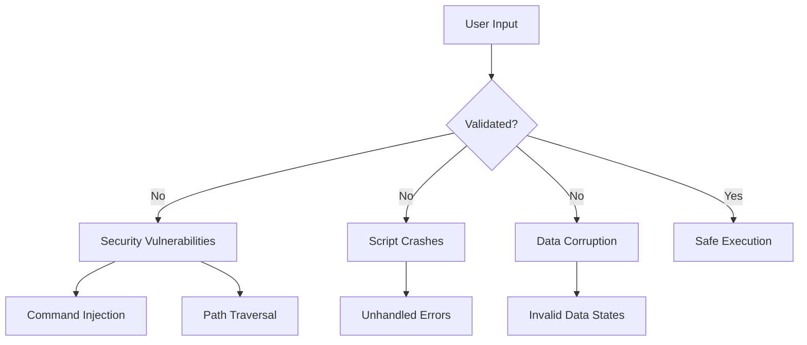
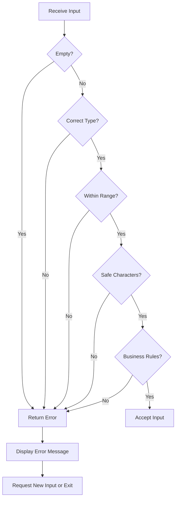
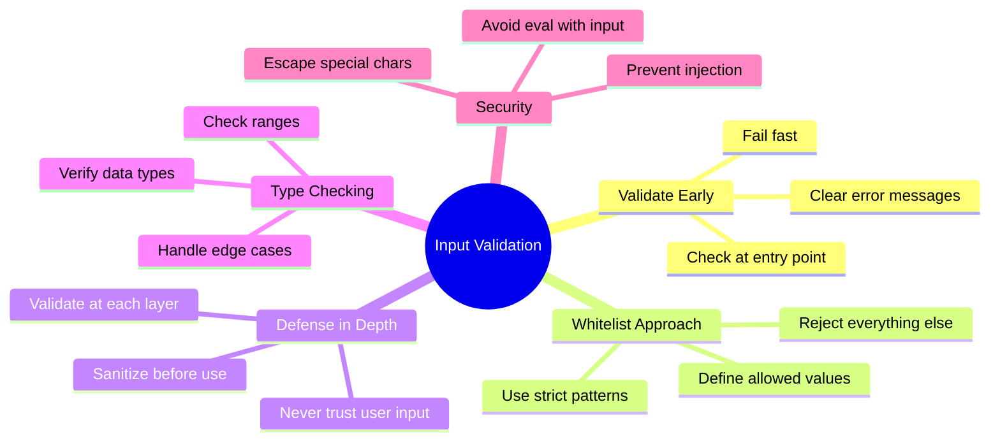

# How to Handle Input Validation in Bash Scripts

Author: [nawazdhandala](https://www.github.com/nawazdhandala)

Tags: Bash, Shell Scripting, Input Validation, Security, DevOps, Linux

Description: Learn how to validate user input, command-line arguments, and file inputs in Bash scripts to prevent errors, security vulnerabilities, and unexpected behavior.

---

Input validation is one of the most critical aspects of writing robust Bash scripts. Without proper validation, your scripts become vulnerable to errors, injection attacks, and unpredictable behavior. This guide covers practical techniques for validating all types of input in Bash.

## Why Input Validation Matters



## Validating Command-Line Arguments

### Check Argument Count

```bash
#!/bin/bash

# Require exactly 2 arguments
if [[ $# -ne 2 ]]; then
    echo "Usage: $0 <source_file> <destination_file>" >&2
    exit 1
fi

source_file="$1"
dest_file="$2"
```

### Validate Required Arguments

```bash
#!/bin/bash

# Function to display usage
usage() {
    cat << EOF
Usage: $0 [OPTIONS] <filename>

Options:
    -v, --verbose    Enable verbose output
    -d, --dry-run    Show what would be done without making changes
    -h, --help       Display this help message

Arguments:
    filename         The file to process (required)
EOF
    exit 1
}

# Parse options
verbose=false
dry_run=false

while [[ $# -gt 0 ]]; do
    case "$1" in
        -v|--verbose)
            verbose=true
            shift
            ;;
        -d|--dry-run)
            dry_run=true
            shift
            ;;
        -h|--help)
            usage
            ;;
        -*)
            echo "Error: Unknown option: $1" >&2
            usage
            ;;
        *)
            # First non-option argument is the filename
            filename="$1"
            shift
            ;;
    esac
done

# Validate required argument
if [[ -z "$filename" ]]; then
    echo "Error: filename is required" >&2
    usage
fi
```

## Validating String Input

### Check for Empty Strings

```bash
#!/bin/bash

read -p "Enter your name: " name

# Method 1: Using -z (check if string is empty)
if [[ -z "$name" ]]; then
    echo "Error: Name cannot be empty" >&2
    exit 1
fi

# Method 2: Using -n (check if string is non-empty)
if [[ -n "$name" ]]; then
    echo "Hello, $name!"
fi
```

### Validate String Length

```bash
#!/bin/bash

read -p "Enter username (3-20 characters): " username

# Check minimum length
if [[ ${#username} -lt 3 ]]; then
    echo "Error: Username must be at least 3 characters" >&2
    exit 1
fi

# Check maximum length
if [[ ${#username} -gt 20 ]]; then
    echo "Error: Username cannot exceed 20 characters" >&2
    exit 1
fi

echo "Username '$username' is valid"
```

### Validate Against Patterns (Regex)

```bash
#!/bin/bash

# Validate email address
validate_email() {
    local email="$1"
    # Basic email regex pattern
    local pattern='^[a-zA-Z0-9._%+-]+@[a-zA-Z0-9.-]+\.[a-zA-Z]{2,}$'

    if [[ $email =~ $pattern ]]; then
        return 0
    else
        return 1
    fi
}

read -p "Enter email address: " email

if validate_email "$email"; then
    echo "Valid email: $email"
else
    echo "Error: Invalid email format" >&2
    exit 1
fi
```

### Validate Alphanumeric Input

```bash
#!/bin/bash

# Only allow alphanumeric characters and underscores
validate_identifier() {
    local input="$1"

    # Check if input matches pattern: starts with letter, contains only
    # letters, numbers, and underscores
    if [[ $input =~ ^[a-zA-Z][a-zA-Z0-9_]*$ ]]; then
        return 0
    else
        return 1
    fi
}

read -p "Enter variable name: " var_name

if validate_identifier "$var_name"; then
    echo "Valid identifier: $var_name"
else
    echo "Error: Invalid identifier. Must start with a letter and contain only letters, numbers, and underscores." >&2
    exit 1
fi
```

## Validating Numeric Input

### Check if Input is an Integer

```bash
#!/bin/bash

# Method 1: Using regex
is_integer() {
    local input="$1"
    # Matches optional minus sign followed by one or more digits
    [[ $input =~ ^-?[0-9]+$ ]]
}

# Method 2: Using arithmetic evaluation
is_integer_v2() {
    local input="$1"
    # Try to perform arithmetic - fails if not a number
    [[ "$input" == "$((input))" ]] 2>/dev/null
}

read -p "Enter a number: " num

if is_integer "$num"; then
    echo "$num is a valid integer"
else
    echo "Error: '$num' is not a valid integer" >&2
    exit 1
fi
```

### Validate Number Range

```bash
#!/bin/bash

validate_port() {
    local port="$1"

    # Check if it's a number
    if ! [[ $port =~ ^[0-9]+$ ]]; then
        echo "Error: Port must be a number" >&2
        return 1
    fi

    # Check range (valid ports: 1-65535)
    if [[ $port -lt 1 || $port -gt 65535 ]]; then
        echo "Error: Port must be between 1 and 65535" >&2
        return 1
    fi

    return 0
}

read -p "Enter port number: " port

if validate_port "$port"; then
    echo "Using port: $port"
fi
```

### Validate Floating-Point Numbers

```bash
#!/bin/bash

is_float() {
    local input="$1"
    # Matches optional minus, digits, optional decimal point with more digits
    [[ $input =~ ^-?[0-9]*\.?[0-9]+$ ]]
}

read -p "Enter a decimal number: " decimal

if is_float "$decimal"; then
    echo "$decimal is a valid number"
else
    echo "Error: Invalid decimal number" >&2
    exit 1
fi
```

## Validating File and Path Input

### Check File Existence and Type

```bash
#!/bin/bash

validate_file() {
    local filepath="$1"

    # Check if file exists
    if [[ ! -e "$filepath" ]]; then
        echo "Error: '$filepath' does not exist" >&2
        return 1
    fi

    # Check if it's a regular file (not directory)
    if [[ ! -f "$filepath" ]]; then
        echo "Error: '$filepath' is not a regular file" >&2
        return 1
    fi

    # Check if file is readable
    if [[ ! -r "$filepath" ]]; then
        echo "Error: '$filepath' is not readable" >&2
        return 1
    fi

    return 0
}

if validate_file "$1"; then
    echo "Processing file: $1"
    # Process the file...
fi
```

### Prevent Path Traversal Attacks

```bash
#!/bin/bash

# Safe path validation - prevent directory traversal
validate_safe_path() {
    local base_dir="$1"
    local user_path="$2"

    # Resolve to absolute path
    local resolved_path
    resolved_path=$(realpath -m "$base_dir/$user_path" 2>/dev/null)

    # Check if the resolved path is within the base directory
    if [[ "$resolved_path" != "$base_dir"* ]]; then
        echo "Error: Path traversal detected" >&2
        return 1
    fi

    echo "$resolved_path"
    return 0
}

BASE_DIR="/var/www/uploads"
user_input="../../../etc/passwd"  # Malicious input

if safe_path=$(validate_safe_path "$BASE_DIR" "$user_input"); then
    echo "Safe to access: $safe_path"
else
    echo "Access denied"
    exit 1
fi
```

### Validate Directory Paths

```bash
#!/bin/bash

validate_directory() {
    local dirpath="$1"
    local create_if_missing="${2:-false}"

    if [[ -d "$dirpath" ]]; then
        # Directory exists, check if writable
        if [[ ! -w "$dirpath" ]]; then
            echo "Error: Directory '$dirpath' is not writable" >&2
            return 1
        fi
        return 0
    fi

    if [[ "$create_if_missing" == "true" ]]; then
        if mkdir -p "$dirpath" 2>/dev/null; then
            echo "Created directory: $dirpath"
            return 0
        else
            echo "Error: Cannot create directory '$dirpath'" >&2
            return 1
        fi
    fi

    echo "Error: Directory '$dirpath' does not exist" >&2
    return 1
}

# Usage
validate_directory "/tmp/myapp/logs" "true"
```

## Validating Date and Time Input

```bash
#!/bin/bash

validate_date() {
    local date_str="$1"
    local format="${2:-%Y-%m-%d}"

    # Try to parse the date
    if date -d "$date_str" +"$format" &>/dev/null; then
        return 0
    else
        return 1
    fi
}

validate_date_format() {
    local date_str="$1"

    # Check format: YYYY-MM-DD
    if [[ ! $date_str =~ ^[0-9]{4}-[0-9]{2}-[0-9]{2}$ ]]; then
        echo "Error: Date must be in YYYY-MM-DD format" >&2
        return 1
    fi

    # Validate the actual date
    if ! date -d "$date_str" &>/dev/null; then
        echo "Error: Invalid date" >&2
        return 1
    fi

    return 0
}

read -p "Enter date (YYYY-MM-DD): " input_date

if validate_date_format "$input_date"; then
    echo "Valid date: $input_date"
fi
```

## Input Validation Flow



## Sanitizing Input

### Remove Dangerous Characters

```bash
#!/bin/bash

sanitize_input() {
    local input="$1"

    # Remove shell metacharacters
    # This removes: ; & | ` $ ( ) { } [ ] < > \ ! # * ? ~
    local sanitized
    sanitized=$(echo "$input" | tr -d ';|&`$(){}[]<>\\!#*?~')

    echo "$sanitized"
}

# Safer approach: only allow specific characters
sanitize_strict() {
    local input="$1"

    # Only keep alphanumeric, spaces, and basic punctuation
    local sanitized
    sanitized=$(echo "$input" | tr -cd 'a-zA-Z0-9 .,_-')

    echo "$sanitized"
}

user_input='; rm -rf /'  # Malicious input
safe_input=$(sanitize_strict "$user_input")
echo "Sanitized: '$safe_input'"  # Output: "rm rf"
```

### Escape Special Characters for Safe Use

```bash
#!/bin/bash

# Escape input for use in SQL (basic example)
escape_sql() {
    local input="$1"
    # Escape single quotes by doubling them
    echo "${input//\'/\'\'}"
}

# Escape input for use in shell commands
escape_shell() {
    local input="$1"
    # Use printf %q for proper shell escaping
    printf '%q' "$input"
}

# Example usage
user_input="O'Reilly; DROP TABLE users;--"
escaped=$(escape_sql "$user_input")
echo "Escaped SQL: $escaped"
```

## Creating a Reusable Validation Library

```bash
#!/bin/bash
# validation_lib.sh - Reusable input validation functions

# Check if string is empty
is_empty() {
    [[ -z "$1" ]]
}

# Check if string is not empty
is_not_empty() {
    [[ -n "$1" ]]
}

# Check if value is an integer
is_integer() {
    [[ "$1" =~ ^-?[0-9]+$ ]]
}

# Check if value is a positive integer
is_positive_integer() {
    [[ "$1" =~ ^[0-9]+$ ]] && [[ "$1" -gt 0 ]]
}

# Check if value is within range
is_in_range() {
    local value="$1"
    local min="$2"
    local max="$3"

    is_integer "$value" && [[ "$value" -ge "$min" ]] && [[ "$value" -le "$max" ]]
}

# Check if string matches pattern
matches_pattern() {
    local value="$1"
    local pattern="$2"

    [[ "$value" =~ $pattern ]]
}

# Validate email format
is_valid_email() {
    local pattern='^[a-zA-Z0-9._%+-]+@[a-zA-Z0-9.-]+\.[a-zA-Z]{2,}$'
    [[ "$1" =~ $pattern ]]
}

# Validate URL format
is_valid_url() {
    local pattern='^https?://[a-zA-Z0-9.-]+(/[a-zA-Z0-9./_-]*)?$'
    [[ "$1" =~ $pattern ]]
}

# Validate IP address
is_valid_ip() {
    local ip="$1"
    local pattern='^([0-9]{1,3}\.){3}[0-9]{1,3}$'

    if [[ ! $ip =~ $pattern ]]; then
        return 1
    fi

    # Check each octet is 0-255
    IFS='.' read -ra octets <<< "$ip"
    for octet in "${octets[@]}"; do
        if [[ $octet -gt 255 ]]; then
            return 1
        fi
    done

    return 0
}

# Check if file exists and is readable
is_readable_file() {
    [[ -f "$1" ]] && [[ -r "$1" ]]
}

# Check if directory exists and is writable
is_writable_dir() {
    [[ -d "$1" ]] && [[ -w "$1" ]]
}

# Require a value or exit with error
require() {
    local value="$1"
    local name="$2"
    local message="${3:-$name is required}"

    if is_empty "$value"; then
        echo "Error: $message" >&2
        exit 1
    fi
}

# Require integer or exit with error
require_integer() {
    local value="$1"
    local name="$2"

    require "$value" "$name"

    if ! is_integer "$value"; then
        echo "Error: $name must be an integer" >&2
        exit 1
    fi
}
```

### Using the Validation Library

```bash
#!/bin/bash

# Source the validation library
source /path/to/validation_lib.sh

# Parse and validate arguments
main() {
    local email="$1"
    local port="$2"
    local config_file="$3"

    # Validate email
    require "$email" "email"
    if ! is_valid_email "$email"; then
        echo "Error: Invalid email format" >&2
        exit 1
    fi

    # Validate port
    require_integer "$port" "port"
    if ! is_in_range "$port" 1 65535; then
        echo "Error: Port must be between 1 and 65535" >&2
        exit 1
    fi

    # Validate config file
    require "$config_file" "config_file"
    if ! is_readable_file "$config_file"; then
        echo "Error: Config file not found or not readable" >&2
        exit 1
    fi

    echo "All validations passed!"
    echo "Email: $email"
    echo "Port: $port"
    echo "Config: $config_file"
}

main "$@"
```

## Interactive Input with Validation Loop

```bash
#!/bin/bash

# Prompt user until valid input is received
prompt_until_valid() {
    local prompt="$1"
    local validator="$2"
    local error_msg="$3"
    local result

    while true; do
        read -p "$prompt" result

        if $validator "$result"; then
            echo "$result"
            return 0
        else
            echo "$error_msg" >&2
        fi
    done
}

# Example validators
is_yes_or_no() {
    [[ "$1" =~ ^[YyNn]$ ]]
}

# Usage
answer=$(prompt_until_valid "Continue? (y/n): " is_yes_or_no "Please enter y or n")
echo "You answered: $answer"
```

## Best Practices Summary



## Key Takeaways

1. **Always validate input** - Never assume input is safe or correctly formatted
2. **Use whitelist validation** - Define what is allowed rather than trying to block bad input
3. **Validate early, fail fast** - Check input at the entry point of your script
4. **Provide clear error messages** - Help users understand what went wrong and how to fix it
5. **Use consistent patterns** - Create reusable validation functions for common checks
6. **Consider security implications** - Input validation is your first line of defense against attacks
7. **Test edge cases** - Empty strings, special characters, boundary values, and unexpected formats

---

Proper input validation transforms fragile scripts into robust, secure tools. By implementing these techniques, you protect your scripts from errors, your systems from attacks, and your users from confusing failures. Start with basic checks and progressively add more sophisticated validation as your scripts grow in complexity.
