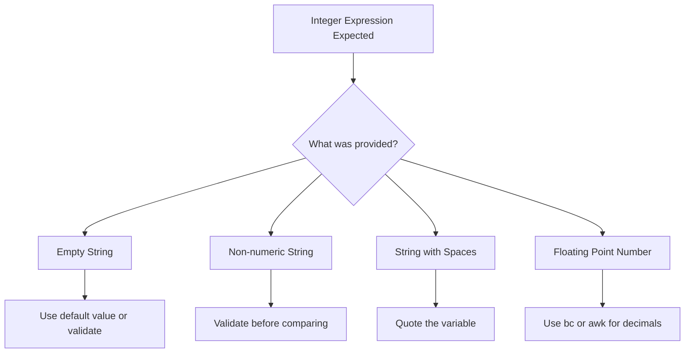

# How to Fix 'Integer Expression Expected' Errors

Author: [nawazdhandala](https://www.github.com/nawazdhandala)

Tags: Bash, Shell Scripting, Debugging, Error Handling, DevOps

Description: Learn how to diagnose and resolve the common 'integer expression expected' error in Bash scripts with practical solutions.

---

The "integer expression expected" error is a common issue in Bash scripts that occurs when you try to perform arithmetic comparisons with non-integer values.

## Understanding the Error

When you see an error like:

```
bash: [: abc: integer expression expected
bash: [: : integer expression expected
```

It means Bash expected a number but received something else - a string, an empty value, or a number with spaces.



## Common Causes and Solutions

### Cause 1: Empty Variable

```bash
#!/bin/bash

# Problematic - count is empty
count=""
if [ $count -gt 0 ]; then  # FAILS
    echo "Count is positive"
fi

# Fixed - provide a default value
if [ "${count:-0}" -gt 0 ]; then
    echo "Count is positive"
fi

# Or use arithmetic expansion (treats empty as 0)
if (( count > 0 )); then
    echo "Count is positive"
fi
```

### Cause 2: Non-Numeric String

```bash
#!/bin/bash

is_integer() {
    [[ "$1" =~ ^-?[0-9]+$ ]]
}

value="hello"

if is_integer "$value"; then
    if [ "$value" -eq 100 ]; then
        echo "Value is 100"
    fi
else
    echo "Error: '$value' is not a valid integer" >&2
fi
```

### Cause 3: Variable with Whitespace

```bash
#!/bin/bash

count="  42  "

# Fixed - trim whitespace
count=$(echo "$count" | tr -d ' ')
if [ "$count" -gt 0 ]; then
    echo "Positive"
fi

# Or use arithmetic expansion (handles whitespace)
count="  42  "
if (( count > 0 )); then
    echo "Positive"
fi
```

### Cause 4: Floating Point Numbers

```bash
#!/bin/bash

value="3.14"

# Use bc for floating-point comparison
if (( $(echo "$value > 3" | bc -l) )); then
    echo "Greater than 3"
fi

# Or use awk
if awk "BEGIN {exit !($value > 3)}"; then
    echo "Greater than 3"
fi

# Extract integer part
int_value=${value%.*}
if [ "$int_value" -gt 3 ]; then
    echo "Integer part is greater than 3"
fi
```

## Best Practices

### Use Arithmetic Expansion

```bash
#!/bin/bash

count=10

# Using (( )) - cleaner syntax, handles empty as 0
if (( count > 5 )); then
    echo "Greater than 5"
fi

# Arithmetic operations
(( count++ ))
(( total = count * 2 ))
```

### Use Default Values

```bash
#!/bin/bash

count="${count:-0}"
: "${retries:=3}"

if [ "$count" -gt 0 ]; then
    echo "Count: $count"
fi
```

### Create Helper Functions

```bash
#!/bin/bash

int_gt() {
    local a="${1:-0}"
    local b="${2:-0}"
    
    a="${a// /}"
    b="${b// /}"
    
    [[ "$a" =~ ^-?[0-9]+$ ]] || a=0
    [[ "$b" =~ ^-?[0-9]+$ ]] || b=0
    
    (( a > b ))
}

if int_gt "$count" 10; then
    echo "Count is greater than 10"
fi
```

## Practical Example: User Input Validation

```bash
#!/bin/bash

read -p "Enter your age: " age

if [[ -z "$age" ]]; then
    echo "Error: Age cannot be empty" >&2
    exit 1
fi

if [[ ! "$age" =~ ^[0-9]+$ ]]; then
    echo "Error: Age must be a positive integer" >&2
    exit 1
fi

if (( age < 0 || age > 150 )); then
    echo "Error: Age must be between 0 and 150" >&2
    exit 1
fi

echo "Your age is $age"
```

## Comparison Operators Reference

| Test Bracket | Arithmetic Expansion |
|--------------|---------------------|
| `[ "$a" -eq "$b" ]` | `(( a == b ))` |
| `[ "$a" -ne "$b" ]` | `(( a != b ))` |
| `[ "$a" -gt "$b" ]` | `(( a > b ))` |
| `[ "$a" -ge "$b" ]` | `(( a >= b ))` |
| `[ "$a" -lt "$b" ]` | `(( a < b ))` |
| `[ "$a" -le "$b" ]` | `(( a <= b ))` |

## Conclusion

Avoid the "integer expression expected" error by:

1. **Validating** variables before numeric comparisons
2. **Using default values** with `${var:-default}` syntax
3. **Preferring arithmetic expansion** `(( ))` over test brackets
4. **Quoting variables** when using test brackets
5. **Using `bc` or `awk`** for floating-point numbers
