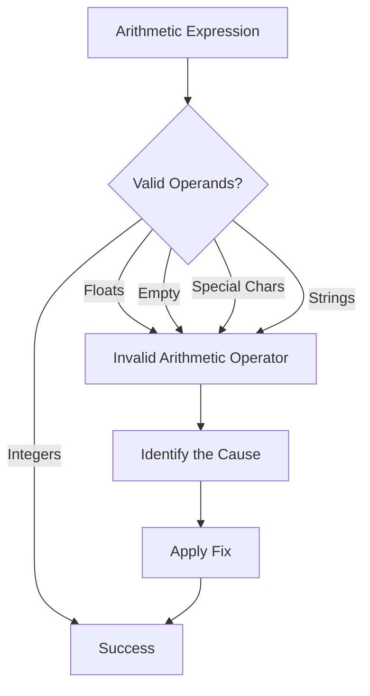
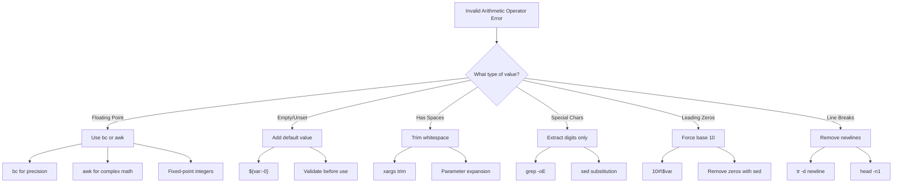

# How to Fix 'Invalid Arithmetic Operator' Errors

Author: [nawazdhandala](https://www.github.com/nawazdhandala)

Tags: Bash, Shell Scripting, Troubleshooting, Debugging, Linux, Arithmetic

Description: Learn how to diagnose and fix the 'invalid arithmetic operator' error in Bash scripts, including common causes like floating-point numbers, empty variables, and special characters.

---

The "invalid arithmetic operator" error in Bash is one of the most common errors when performing calculations. This guide explains why it happens and how to fix it in every scenario.

## Understanding the Error



Bash arithmetic only supports integers. When you try to use floating-point numbers, empty variables, or strings, you get this error.

## Common Error Examples

```bash
# Example 1: Floating-point number
$ echo $((3.14 * 2))
bash: 3.14 * 2: syntax error: invalid arithmetic operator (error token is ".14 * 2")

# Example 2: Empty variable
$ unset value
$ echo $((value + 1))
# Sometimes works (empty becomes 0), but can fail in expressions

# Example 3: Variable with spaces
$ value="10 20"
$ echo $((value + 1))
bash: 10 20 + 1: syntax error in expression (error token is "20 + 1")

# Example 4: String value
$ value="hello"
$ echo $((value + 1))
bash: hello: syntax error: invalid arithmetic operator
```

## Cause 1: Floating-Point Numbers

Bash arithmetic only handles integers. Any decimal point triggers the error.

### The Problem

```bash
#!/bin/bash

price=19.99
quantity=3

# This fails
total=$((price * quantity))
# Error: invalid arithmetic operator (error token is ".99 * quantity")
```

### Solution: Use bc for Floating-Point Math

```bash
#!/bin/bash

price=19.99
quantity=3

# Use bc (basic calculator) for floating-point arithmetic
total=$(echo "$price * $quantity" | bc)
echo "Total: $total"  # Output: Total: 59.97

# For more precision, use scale
result=$(echo "scale=2; 10 / 3" | bc)
echo "Result: $result"  # Output: Result: 3.33
```

### Solution: Use awk for Calculations

```bash
#!/bin/bash

price=19.99
quantity=3

# Use awk for floating-point math
total=$(awk "BEGIN {printf \"%.2f\", $price * $quantity}")
echo "Total: $total"  # Output: Total: 59.97

# More complex calculation
result=$(awk "BEGIN {print sqrt($price) + log($quantity)}")
echo "Result: $result"
```

### Solution: Use Integer Math with Fixed Point

```bash
#!/bin/bash

# Store prices as cents (integers)
price_cents=1999  # $19.99
quantity=3

# Calculate in cents
total_cents=$((price_cents * quantity))

# Convert back to dollars for display
dollars=$((total_cents / 100))
cents=$((total_cents % 100))
printf "Total: \$%d.%02d\n" "$dollars" "$cents"  # Output: Total: $59.97
```

## Cause 2: Empty or Unset Variables

Empty variables in arithmetic expressions can cause problems.

### The Problem

```bash
#!/bin/bash

# Variable not set
echo $((count + 1))
# May work (count becomes 0) but is unreliable

# Variable is empty string
count=""
result=$((count + 1))
# May cause issues depending on context
```

### Solution: Use Default Values

```bash
#!/bin/bash

# Set default value if variable is empty or unset
count="${count:-0}"
result=$((count + 1))
echo "Result: $result"

# Or use default directly in arithmetic
result=$((${count:-0} + 1))
echo "Result: $result"
```

### Solution: Validate Before Use

```bash
#!/bin/bash

validate_number() {
    local value="$1"
    local name="$2"

    # Check if empty
    if [[ -z "$value" ]]; then
        echo "Error: $name is empty" >&2
        return 1
    fi

    # Check if integer
    if ! [[ "$value" =~ ^-?[0-9]+$ ]]; then
        echo "Error: $name must be an integer, got '$value'" >&2
        return 1
    fi

    return 0
}

# Usage
read -p "Enter a number: " user_input

if validate_number "$user_input" "input"; then
    result=$((user_input * 2))
    echo "Result: $result"
fi
```

## Cause 3: Variables Containing Spaces

Spaces in variable values break arithmetic parsing.

### The Problem

```bash
#!/bin/bash

# Variable with leading/trailing spaces
value=" 42 "
result=$((value + 1))
# Error: syntax error in expression

# Variable from command output with extra whitespace
value=$(echo "  100  ")
result=$((value + 1))
# Error
```

### Solution: Trim Whitespace

```bash
#!/bin/bash

# Method 1: Using xargs
value=" 42 "
value=$(echo "$value" | xargs)
result=$((value + 1))
echo "Result: $result"  # Output: Result: 43

# Method 2: Using parameter expansion
value=" 42 "
value="${value#"${value%%[![:space:]]*}"}"  # Remove leading whitespace
value="${value%"${value##*[![:space:]]}"}"  # Remove trailing whitespace
result=$((value + 1))
echo "Result: $result"

# Method 3: Using tr
value=" 42 "
value=$(echo "$value" | tr -d '[:space:]')
result=$((value + 1))
echo "Result: $result"
```

### Solution: Use Bash Read for Parsing

```bash
#!/bin/bash

# Read strips whitespace automatically
value=" 42 "
read -r cleaned <<< "$value"
result=$((cleaned + 1))
echo "Result: $result"  # Output: Result: 43
```

## Cause 4: Special Characters in Variables

Characters like `@`, `#`, `!`, or punctuation cause errors.

### The Problem

```bash
#!/bin/bash

# Variable from file or user input with special chars
value="100$"
result=$((value + 1))
# Error: invalid arithmetic operator

value="50%"
result=$((value + 1))
# Error
```

### Solution: Extract Numbers Only

```bash
#!/bin/bash

# Extract only digits (and optional minus sign)
extract_number() {
    local input="$1"
    echo "$input" | grep -oE '^-?[0-9]+'
}

value="$100.00"
clean_value=$(extract_number "$value")
if [[ -n "$clean_value" ]]; then
    result=$((clean_value + 1))
    echo "Result: $result"  # Output: Result: 101
fi

# Using sed
value="50%"
clean_value=$(echo "$value" | sed 's/[^0-9-]//g')
result=$((clean_value + 1))
echo "Result: $result"  # Output: Result: 51
```

## Cause 5: Octal Number Interpretation

Numbers with leading zeros are treated as octal.

### The Problem

```bash
#!/bin/bash

# Leading zero means octal
value="08"
result=$((value + 1))
# Error: value too great for base (error token is "08")
# (8 is not valid in octal, which only uses 0-7)

value="010"
result=$((value + 1))
# No error, but result is 9 (not 11) because 010 octal = 8 decimal
```

### Solution: Remove Leading Zeros

```bash
#!/bin/bash

# Remove leading zeros
remove_leading_zeros() {
    local value="$1"
    # Remove leading zeros but keep at least one digit
    echo "$value" | sed 's/^0*//' | sed 's/^$/0/'
}

value="08"
clean_value=$(remove_leading_zeros "$value")
result=$((clean_value + 1))
echo "Result: $result"  # Output: Result: 9

# Using parameter expansion
value="007"
clean_value=$((10#$value))  # Force base 10 interpretation
result=$((clean_value + 1))
echo "Result: $result"  # Output: Result: 8
```

### Force Base 10 Interpretation

```bash
#!/bin/bash

# Force base 10 with 10# prefix
value="08"
result=$((10#$value + 1))
echo "Result: $result"  # Output: Result: 9

value="010"
result=$((10#$value + 1))
echo "Result: $result"  # Output: Result: 11 (not 9)
```

## Cause 6: Variables with Line Breaks

Newlines in variables break arithmetic.

### The Problem

```bash
#!/bin/bash

# Multi-line output
value=$(cat << 'EOF'
42
EOF
)
result=$((value + 1))
# May fail depending on trailing newline
```

### Solution: Handle Line Breaks

```bash
#!/bin/bash

# Remove all newlines
value=$(cat << 'EOF'
42
EOF
)
value=$(echo "$value" | tr -d '\n')
result=$((value + 1))
echo "Result: $result"

# Or use head to get first line only
output=$(some_command)
value=$(echo "$output" | head -n1)
result=$((value + 1))
```

## Debugging Arithmetic Errors

### Diagnostic Function

```bash
#!/bin/bash

debug_arithmetic() {
    local var_name="$1"
    local var_value="${!var_name}"

    echo "=== Debugging variable: $var_name ===" >&2
    echo "Raw value: '$var_value'" >&2
    echo "Length: ${#var_value}" >&2
    echo "Hex dump:" >&2
    echo -n "$var_value" | xxd >&2

    # Check for common issues
    if [[ -z "$var_value" ]]; then
        echo "Issue: Variable is empty" >&2
    elif [[ "$var_value" =~ \. ]]; then
        echo "Issue: Contains decimal point (floating-point)" >&2
    elif [[ "$var_value" =~ [^0-9-] ]]; then
        echo "Issue: Contains non-numeric characters" >&2
    elif [[ "$var_value" =~ ^0[0-9] ]]; then
        echo "Issue: Leading zero (may be interpreted as octal)" >&2
    elif [[ "$var_value" =~ [[:space:]] ]]; then
        echo "Issue: Contains whitespace" >&2
    else
        echo "Value appears to be a valid integer" >&2
    fi
}

# Usage
value="3.14"
debug_arithmetic value
```

### Safe Arithmetic Function

```bash
#!/bin/bash

safe_arithmetic() {
    local expression="$@"
    local cleaned_expression

    # Replace each variable with its cleaned value
    cleaned_expression="$expression"

    # Try to evaluate
    if result=$(eval "echo \$(($cleaned_expression))" 2>&1); then
        echo "$result"
        return 0
    else
        echo "Arithmetic error: $result" >&2
        return 1
    fi
}

# Better approach: validate each operand
safe_add() {
    local a="$1"
    local b="$2"

    # Clean and validate
    a=$(echo "$a" | tr -d '[:space:]')
    b=$(echo "$b" | tr -d '[:space:]')

    if ! [[ "$a" =~ ^-?[0-9]+$ ]]; then
        echo "Error: '$a' is not a valid integer" >&2
        return 1
    fi

    if ! [[ "$b" =~ ^-?[0-9]+$ ]]; then
        echo "Error: '$b' is not a valid integer" >&2
        return 1
    fi

    echo $((a + b))
}

# Usage
result=$(safe_add "10" "20")
echo "Result: $result"  # Output: Result: 30
```

## Error Flow and Resolution



## Complete Example: Robust Calculator

```bash
#!/bin/bash

# A calculator that handles all common input issues

calculate() {
    local operation="$1"
    local operand1="$2"
    local operand2="$3"

    # Clean operands
    clean_number() {
        local num="$1"
        # Remove whitespace
        num=$(echo "$num" | tr -d '[:space:]')
        # Check for empty
        if [[ -z "$num" ]]; then
            echo "0"
            return
        fi
        # Check for floating point - use bc
        if [[ "$num" =~ \. ]]; then
            echo "float:$num"
            return
        fi
        # Remove leading zeros and force base 10
        if [[ "$num" =~ ^0+[0-9] ]]; then
            num=$((10#$num))
        fi
        # Extract integer part only
        num=$(echo "$num" | grep -oE '^-?[0-9]+' || echo "0")
        echo "$num"
    }

    operand1=$(clean_number "$operand1")
    operand2=$(clean_number "$operand2")

    # Check if we need floating-point math
    use_float=false
    if [[ "$operand1" == float:* ]] || [[ "$operand2" == float:* ]]; then
        use_float=true
        operand1="${operand1#float:}"
        operand2="${operand2#float:}"
    fi

    # Perform operation
    if [[ "$use_float" == true ]]; then
        case "$operation" in
            add|+)      echo "scale=2; $operand1 + $operand2" | bc ;;
            subtract|-) echo "scale=2; $operand1 - $operand2" | bc ;;
            multiply|*) echo "scale=2; $operand1 * $operand2" | bc ;;
            divide|/)
                if [[ "$operand2" == "0" ]]; then
                    echo "Error: Division by zero" >&2
                    return 1
                fi
                echo "scale=2; $operand1 / $operand2" | bc
                ;;
            *)
                echo "Unknown operation: $operation" >&2
                return 1
                ;;
        esac
    else
        case "$operation" in
            add|+)      echo $((operand1 + operand2)) ;;
            subtract|-) echo $((operand1 - operand2)) ;;
            multiply|*) echo $((operand1 * operand2)) ;;
            divide|/)
                if [[ "$operand2" -eq 0 ]]; then
                    echo "Error: Division by zero" >&2
                    return 1
                fi
                echo $((operand1 / operand2))
                ;;
            modulo|%)   echo $((operand1 % operand2)) ;;
            *)
                echo "Unknown operation: $operation" >&2
                return 1
                ;;
        esac
    fi
}

# Test cases
echo "Integer addition: $(calculate add 10 20)"
echo "Float addition: $(calculate add 10.5 20.3)"
echo "With spaces: $(calculate add "  42  " "  8  ")"
echo "With leading zeros: $(calculate add 007 003)"
echo "With special chars: $(calculate add '$100' '50%')"
```

## Quick Reference

| Error Cause | Solution |
|-------------|----------|
| Floating-point number | Use `bc` or `awk` |
| Empty variable | Use `${var:-0}` default |
| Whitespace in value | Use `xargs` or `tr -d` |
| Special characters | Extract with `grep -oE` |
| Leading zeros (octal) | Use `10#$var` |
| Line breaks | Use `tr -d '\n'` |

## Key Takeaways

1. **Bash arithmetic only supports integers** - Use `bc` or `awk` for floating-point math
2. **Always validate input** - Check that values are valid integers before arithmetic
3. **Set default values** - Use `${var:-0}` to handle empty variables
4. **Watch for leading zeros** - Use `10#$var` to force decimal interpretation
5. **Trim whitespace** - Clean input before performing calculations
6. **Test with edge cases** - Empty strings, special characters, and unexpected formats

---

The "invalid arithmetic operator" error always comes down to Bash receiving something other than an integer. By understanding the common causes and applying the appropriate fixes, you can write robust scripts that handle numeric operations reliably, regardless of where the input comes from.
