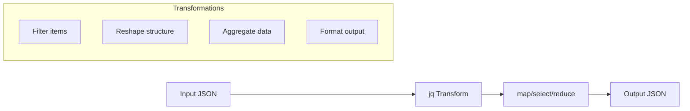

# How to Handle JSON Parsing in Bash with jq

Author: [nawazdhandala](https://www.github.com/nawazdhandala)

Tags: Bash, Shell Scripting, jq, JSON, API, DevOps, Automation

Description: Learn how to parse, query, and manipulate JSON data in Bash scripts using jq, from basic extraction to complex transformations.

---

> JSON has become the standard format for API responses, configuration files, and data interchange. While Bash is not designed for JSON parsing, the `jq` utility provides powerful JSON processing capabilities that integrate seamlessly with shell scripts.

This guide covers practical jq usage patterns for common DevOps and scripting scenarios.

---

## Installing jq

```bash
#!/bin/bash
# Install jq on various systems

# Debian/Ubuntu
sudo apt-get update && sudo apt-get install -y jq

# RHEL/CentOS/Fedora
sudo dnf install -y jq

# macOS with Homebrew
brew install jq

# Alpine Linux
apk add jq

# Verify installation
jq --version
```

---

## Basic jq Operations

```mermaid
flowchart TD
    A[JSON Input] --> B[jq Filter]
    B --> C{Filter Type}
    C -->|Identity| D[. - Return as-is]
    C -->|Field Access| E[.field - Get value]
    C -->|Array Index| F[.[0] - Get element]
    C -->|Pipe| G[.foo | .bar - Chain filters]
    D --> H[Output]
    E --> H
    F --> H
    G --> H
```

### Extracting Simple Values

```bash
#!/bin/bash
# Basic JSON field extraction

# Sample JSON
json='{"name": "server-01", "status": "running", "cpu": 45.2}'

# Extract a single field
name=$(echo "$json" | jq -r '.name')
echo "Server name: $name"  # Output: server-01

# Extract multiple fields
echo "$json" | jq -r '.name, .status'
# Output:
# server-01
# running

# Extract nested values
nested='{"server": {"name": "db-01", "config": {"port": 5432}}}'
port=$(echo "$nested" | jq -r '.server.config.port')
echo "Port: $port"  # Output: 5432
```

### Working with Arrays

```bash
#!/bin/bash
# Array operations with jq

# Sample array
servers='[
    {"name": "web-01", "status": "running"},
    {"name": "web-02", "status": "stopped"},
    {"name": "db-01", "status": "running"}
]'

# Get first element
first=$(echo "$servers" | jq '.[0]')
echo "First server: $first"

# Get all names
echo "$servers" | jq -r '.[].name'
# Output:
# web-01
# web-02
# db-01

# Get array length
count=$(echo "$servers" | jq 'length')
echo "Server count: $count"  # Output: 3

# Filter array elements
running=$(echo "$servers" | jq '[.[] | select(.status == "running")]')
echo "Running servers: $running"
```

---

## Practical API Response Handling

### Parsing API Responses

```bash
#!/bin/bash
# Parse API responses with error handling

# Function to safely parse JSON from API
parse_api_response() {
    local url="$1"
    local response
    local http_code

    # Make request and capture response with HTTP code
    response=$(curl -s -w "\n%{http_code}" "$url")
    http_code=$(echo "$response" | tail -n1)
    json_body=$(echo "$response" | sed '$d')

    # Check HTTP status
    if [[ "$http_code" -ne 200 ]]; then
        echo "Error: API returned HTTP $http_code" >&2
        return 1
    fi

    # Validate JSON
    if ! echo "$json_body" | jq empty 2>/dev/null; then
        echo "Error: Invalid JSON response" >&2
        return 1
    fi

    echo "$json_body"
}

# Example: Parse GitHub API response
get_repo_info() {
    local owner="$1"
    local repo="$2"
    local api_url="https://api.github.com/repos/${owner}/${repo}"

    response=$(parse_api_response "$api_url") || return 1

    # Extract relevant fields
    echo "Repository: $(echo "$response" | jq -r '.full_name')"
    echo "Stars: $(echo "$response" | jq -r '.stargazers_count')"
    echo "Language: $(echo "$response" | jq -r '.language')"
    echo "Open Issues: $(echo "$response" | jq -r '.open_issues_count')"
}

# Usage
get_repo_info "torvalds" "linux"
```

### Handling Paginated Responses

```bash
#!/bin/bash
# Handle paginated API responses

fetch_all_pages() {
    local base_url="$1"
    local all_items="[]"
    local page=1
    local per_page=100

    while true; do
        echo "Fetching page $page..." >&2

        # Fetch current page
        response=$(curl -s "${base_url}?page=${page}&per_page=${per_page}")

        # Check if response is empty array
        item_count=$(echo "$response" | jq 'length')

        if [[ "$item_count" -eq 0 ]]; then
            break
        fi

        # Merge with all items
        all_items=$(echo "$all_items $response" | jq -s 'add')

        # Check if we got fewer items than requested (last page)
        if [[ "$item_count" -lt "$per_page" ]]; then
            break
        fi

        ((page++))
    done

    echo "$all_items"
}

# Usage
# all_repos=$(fetch_all_pages "https://api.github.com/users/octocat/repos")
# echo "$all_repos" | jq 'length'
```

---

## Data Transformation



### Filtering and Mapping

```bash
#!/bin/bash
# Filter and transform JSON data

# Sample data - list of services
services='[
    {"name": "api", "port": 8080, "healthy": true, "response_time": 45},
    {"name": "database", "port": 5432, "healthy": true, "response_time": 12},
    {"name": "cache", "port": 6379, "healthy": false, "response_time": null},
    {"name": "queue", "port": 5672, "healthy": true, "response_time": 23}
]'

# Filter unhealthy services
echo "Unhealthy services:"
echo "$services" | jq '[.[] | select(.healthy == false)]'

# Filter by response time threshold
echo "Slow services (>30ms):"
echo "$services" | jq '[.[] | select(.response_time != null and .response_time > 30)]'

# Transform structure - create name:port map
echo "Service ports:"
echo "$services" | jq 'map({(.name): .port}) | add'
# Output: {"api": 8080, "database": 5432, "cache": 6379, "queue": 5672}

# Create summary
echo "Service summary:"
echo "$services" | jq '{
    total: length,
    healthy: [.[] | select(.healthy == true)] | length,
    unhealthy: [.[] | select(.healthy == false)] | length,
    avg_response: [.[] | select(.response_time != null) | .response_time] | add / length
}'
```

### Reshaping JSON Structure

```bash
#!/bin/bash
# Reshape JSON from one format to another

# Input format (from monitoring API)
input='[
    {"timestamp": "2024-01-15T10:00:00Z", "metric": "cpu", "value": 45.2, "host": "server-01"},
    {"timestamp": "2024-01-15T10:00:00Z", "metric": "memory", "value": 72.1, "host": "server-01"},
    {"timestamp": "2024-01-15T10:00:00Z", "metric": "cpu", "value": 38.5, "host": "server-02"},
    {"timestamp": "2024-01-15T10:00:00Z", "metric": "memory", "value": 65.3, "host": "server-02"}
]'

# Transform to grouped by host format
echo "Grouped by host:"
echo "$input" | jq 'group_by(.host) | map({
    host: .[0].host,
    metrics: map({(.metric): .value}) | add,
    timestamp: .[0].timestamp
})'
# Output:
# [
#   {"host": "server-01", "metrics": {"cpu": 45.2, "memory": 72.1}, "timestamp": "..."},
#   {"host": "server-02", "metrics": {"cpu": 38.5, "memory": 65.3}, "timestamp": "..."}
# ]

# Transform to Prometheus-style format
echo "Prometheus style:"
echo "$input" | jq -r '.[] | "\(.metric){host=\"\(.host)\"} \(.value)"'
# Output:
# cpu{host="server-01"} 45.2
# memory{host="server-01"} 72.1
# cpu{host="server-02"} 38.5
# memory{host="server-02"} 65.3
```

---

## Building JSON in Bash

### Creating JSON from Variables

```bash
#!/bin/bash
# Build JSON objects from Bash variables

# Variables to include
hostname=$(hostname)
timestamp=$(date -u +"%Y-%m-%dT%H:%M:%SZ")
cpu_usage=45.2
memory_usage=72.1
disk_usage=58.3

# Method 1: Using jq -n with --arg
json=$(jq -n \
    --arg host "$hostname" \
    --arg ts "$timestamp" \
    --argjson cpu "$cpu_usage" \
    --argjson mem "$memory_usage" \
    --argjson disk "$disk_usage" \
    '{
        hostname: $host,
        timestamp: $ts,
        metrics: {
            cpu: $cpu,
            memory: $mem,
            disk: $disk
        }
    }')

echo "$json"

# Method 2: Building from arrays
services=("api" "database" "cache")
ports=(8080 5432 6379)

json=$(jq -n \
    --argjson services "$(printf '%s\n' "${services[@]}" | jq -R . | jq -s .)" \
    --argjson ports "$(printf '%s\n' "${ports[@]}" | jq -R 'tonumber' | jq -s .)" \
    '[range(0; $services | length)] | map({
        name: $services[.],
        port: $ports[.]
    })')

echo "$json"
```

### Updating Existing JSON

```bash
#!/bin/bash
# Modify existing JSON files

config_file="/tmp/config.json"

# Initial config
cat > "$config_file" << 'EOF'
{
    "database": {
        "host": "localhost",
        "port": 5432,
        "name": "myapp"
    },
    "cache": {
        "enabled": false,
        "ttl": 300
    },
    "logging": {
        "level": "info"
    }
}
EOF

# Update single value
jq '.database.host = "db.example.com"' "$config_file" > "${config_file}.tmp" \
    && mv "${config_file}.tmp" "$config_file"

# Update multiple values
jq '.cache.enabled = true | .cache.ttl = 600' "$config_file" > "${config_file}.tmp" \
    && mv "${config_file}.tmp" "$config_file"

# Add new field
jq '.monitoring = {"enabled": true, "interval": 30}' "$config_file" > "${config_file}.tmp" \
    && mv "${config_file}.tmp" "$config_file"

# Conditional update
jq 'if .cache.enabled then .cache.ttl = 900 else . end' "$config_file" > "${config_file}.tmp" \
    && mv "${config_file}.tmp" "$config_file"

# Delete field
jq 'del(.logging.level)' "$config_file" > "${config_file}.tmp" \
    && mv "${config_file}.tmp" "$config_file"

echo "Updated config:"
cat "$config_file" | jq .
```

---

## Error Handling and Validation

```bash
#!/bin/bash
# Robust JSON error handling

# Validate JSON syntax
validate_json() {
    local input="$1"

    if echo "$input" | jq empty 2>/dev/null; then
        return 0
    else
        echo "Invalid JSON" >&2
        return 1
    fi
}

# Safe field extraction with defaults
safe_get() {
    local json="$1"
    local path="$2"
    local default="${3:-null}"

    result=$(echo "$json" | jq -r "$path // \"$default\"" 2>/dev/null)

    if [[ $? -ne 0 ]] || [[ "$result" == "null" ]]; then
        echo "$default"
    else
        echo "$result"
    fi
}

# Example usage
json='{"name": "test", "config": {"port": 8080}}'

# Safe extraction
name=$(safe_get "$json" '.name' 'unknown')
port=$(safe_get "$json" '.config.port' '3000')
missing=$(safe_get "$json" '.missing.field' 'default_value')

echo "Name: $name"          # test
echo "Port: $port"          # 8080
echo "Missing: $missing"    # default_value

# Validate required fields
validate_required() {
    local json="$1"
    shift
    local fields=("$@")

    for field in "${fields[@]}"; do
        value=$(echo "$json" | jq -r "$field" 2>/dev/null)
        if [[ -z "$value" ]] || [[ "$value" == "null" ]]; then
            echo "Missing required field: $field" >&2
            return 1
        fi
    done

    return 0
}

# Check required fields
if validate_required "$json" '.name' '.config.port'; then
    echo "All required fields present"
fi
```

---

## Iteration Patterns

```bash
#!/bin/bash
# Iterate over JSON arrays and objects

servers='[
    {"name": "web-01", "ip": "10.0.1.10", "role": "web"},
    {"name": "web-02", "ip": "10.0.1.11", "role": "web"},
    {"name": "db-01", "ip": "10.0.2.10", "role": "database"}
]'

# Method 1: Using jq -c for compact output
echo "Method 1: Compact iteration"
echo "$servers" | jq -c '.[]' | while read -r server; do
    name=$(echo "$server" | jq -r '.name')
    ip=$(echo "$server" | jq -r '.ip')
    echo "Pinging $name at $ip..."
    # ping -c 1 "$ip" > /dev/null 2>&1 && echo "  OK" || echo "  FAILED"
done

# Method 2: Using index-based iteration
echo ""
echo "Method 2: Index-based iteration"
count=$(echo "$servers" | jq 'length')
for ((i=0; i<count; i++)); do
    name=$(echo "$servers" | jq -r ".[$i].name")
    role=$(echo "$servers" | jq -r ".[$i].role")
    echo "Server $((i+1)): $name ($role)"
done

# Method 3: Using arrays (handles spaces in values)
echo ""
echo "Method 3: Array-based iteration"
mapfile -t names < <(echo "$servers" | jq -r '.[].name')
mapfile -t ips < <(echo "$servers" | jq -r '.[].ip')

for i in "${!names[@]}"; do
    echo "Configuring ${names[$i]} (${ips[$i]})"
done

# Iterate over object keys
config='{"api": {"port": 8080}, "web": {"port": 80}, "admin": {"port": 9000}}'

echo ""
echo "Object key iteration:"
echo "$config" | jq -r 'keys[]' | while read -r key; do
    port=$(echo "$config" | jq -r ".${key}.port")
    echo "Service: $key, Port: $port"
done
```

---

## Advanced jq Patterns

### Using Variables in jq

```bash
#!/bin/bash
# Pass shell variables to jq filters

target_status="running"
min_cpu=20

servers='[
    {"name": "web-01", "status": "running", "cpu": 45},
    {"name": "web-02", "status": "stopped", "cpu": 0},
    {"name": "db-01", "status": "running", "cpu": 15}
]'

# Using --arg for strings
echo "Servers with status '$target_status':"
echo "$servers" | jq --arg status "$target_status" \
    '[.[] | select(.status == $status)]'

# Using --argjson for numbers
echo ""
echo "Servers with CPU > $min_cpu:"
echo "$servers" | jq --argjson min "$min_cpu" \
    '[.[] | select(.cpu > $min)]'

# Combining multiple variables
echo ""
echo "Running servers with CPU > $min_cpu:"
echo "$servers" | jq \
    --arg status "$target_status" \
    --argjson min "$min_cpu" \
    '[.[] | select(.status == $status and .cpu > $min)]'
```

### Custom Functions in jq

```bash
#!/bin/bash
# Define and use custom jq functions

data='[
    {"name": "service-a", "response_ms": 150},
    {"name": "service-b", "response_ms": 45},
    {"name": "service-c", "response_ms": 320}
]'

# Define a function to categorize response times
echo "$data" | jq '
    # Define custom function
    def categorize_latency:
        if . < 100 then "fast"
        elif . < 200 then "normal"
        else "slow"
        end;

    # Apply function
    map({
        name: .name,
        response_ms: .response_ms,
        category: (.response_ms | categorize_latency)
    })
'

# Function with parameters
echo "$data" | jq '
    # Function with threshold parameter
    def is_slow($threshold):
        .response_ms > $threshold;

    # Filter slow services
    [.[] | select(is_slow(100))]
'
```

---

## Performance Tips

```bash
#!/bin/bash
# jq performance optimization

large_file="/tmp/large.json"

# Tip 1: Use -c for compact output when piping
echo "$data" | jq -c '.[]' | while read -r line; do
    # Process line
    :
done

# Tip 2: Combine multiple operations in one jq call
# Instead of:
# name=$(echo "$json" | jq -r '.name')
# port=$(echo "$json" | jq -r '.port')
# status=$(echo "$json" | jq -r '.status')

# Do this:
read -r name port status < <(echo '{"name":"test","port":8080,"status":"ok"}' | \
    jq -r '[.name, .port, .status] | @tsv')
echo "Name: $name, Port: $port, Status: $status"

# Tip 3: Stream large files instead of loading entirely
# For very large JSON arrays, use --stream
# jq --stream 'select(.[0][1] == "name")' "$large_file"

# Tip 4: Use slurp (-s) to combine multiple JSON objects
# echo '{"a":1}' '{"b":2}' | jq -s 'add'
# Output: {"a": 1, "b": 2}
```

---

## Summary

Key jq patterns for Bash scripting:

| Operation | Command |
|-----------|---------|
| Extract field | `jq '.field'` |
| Extract raw string | `jq -r '.field'` |
| Filter array | `jq '[.[] \| select(.key == "value")]'` |
| Transform | `jq 'map({new_key: .old_key})'` |
| Build JSON | `jq -n --arg key "$var" '{key: $key}'` |
| Update JSON | `jq '.field = "new_value"'` |
| Iterate | `jq -c '.[]' \| while read -r item; do ... done` |

---

*Building automation that handles JSON APIs? [OneUptime](https://oneuptime.com) can monitor your API endpoints and alert you when JSON responses are malformed or contain errors.*

**Related Reading:**
- [How to Fix "Redirection" Errors in Bash](https://oneuptime.com/blog/post/2026-01-24-bash-redirection-errors/view)
- [How to Handle Script Debugging with set -x](https://oneuptime.com/blog/post/2026-01-24-bash-debugging-set-x/view)
