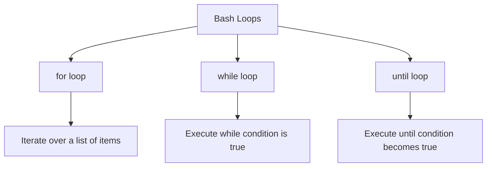
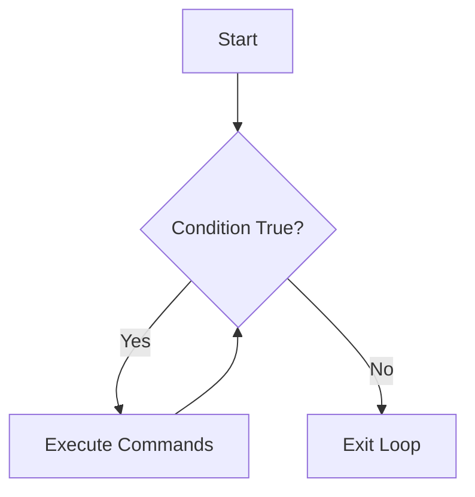
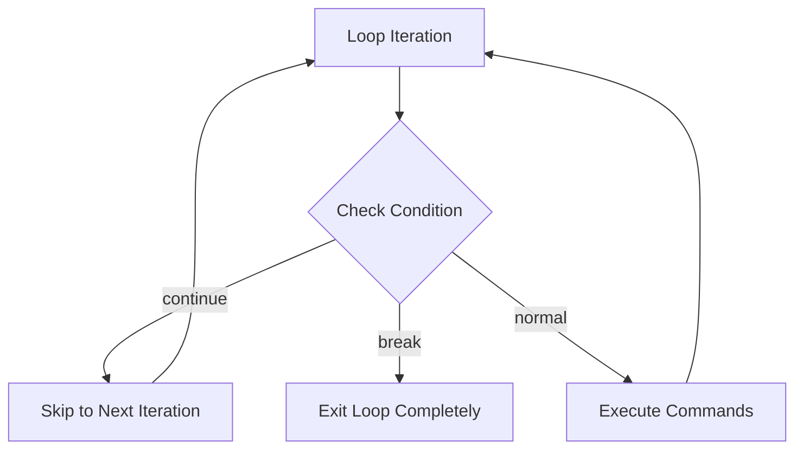

# How to Handle Loops in Bash Scripts

Author: [nawazdhandala](https://www.github.com/nawazdhandala)

Tags: Bash, Shell Scripting, Loops, DevOps, Automation

Description: A comprehensive guide to mastering for, while, and until loops in Bash scripts with practical examples and best practices.

---

Loops are fundamental building blocks in Bash scripting that allow you to automate repetitive tasks. Whether you are processing files, iterating over arrays, or running commands multiple times, understanding how to use loops effectively will make your scripts more powerful and efficient.

## Types of Loops in Bash

Bash provides three main types of loops, each suited for different use cases:



## The for Loop

The `for` loop is the most commonly used loop in Bash. It iterates over a list of items and executes commands for each item.

### Basic Syntax

```bash
# Basic for loop syntax
for variable in list
do
    # Commands to execute for each item
    command1
    command2
done
```

### Iterating Over a List of Values

```bash
#!/bin/bash

# Loop through a list of fruits
for fruit in apple banana orange grape
do
    echo "I like $fruit"
done

# Output:
# I like apple
# I like banana
# I like orange
# I like grape
```

### C-Style for Loop

Bash also supports C-style for loops, which are useful when you need a counter:

```bash
#!/bin/bash

# C-style for loop with counter
for ((i = 1; i <= 5; i++))
do
    echo "Iteration number: $i"
done
```

### Iterating Over Arrays

```bash
#!/bin/bash

# Define an array of servers
servers=("web01" "web02" "db01" "cache01")

# Loop through the array
for server in "${servers[@]}"
do
    echo "Checking status of: $server"
done
```

## The while Loop

The `while` loop executes commands as long as a condition remains true.



### Counter-Based while Loop

```bash
#!/bin/bash

# Initialize counter
count=1

# Loop while count is less than or equal to 5
while [ $count -le 5 ]
do
    echo "Count is: $count"
    # Increment the counter
    ((count++))
done
```

### Reading a File Line by Line

```bash
#!/bin/bash

# Read a file line by line - the safest method
while IFS= read -r line
do
    # Skip empty lines
    if [[ -n "$line" ]]; then
        echo "Line: $line"
    fi
done < "input.txt"
```

## The until Loop

The `until` loop is the opposite of `while`. It executes commands until a condition becomes true.

```bash
#!/bin/bash

# Wait until a background job completes
./long_running_job.sh &
job_pid=$!

echo "Started job with PID: $job_pid"

until ! ps -p $job_pid > /dev/null 2>&1
do
    echo "Job still running..."
    sleep 5
done

echo "Job completed!"
```

## Loop Control Statements

Bash provides two statements to control loop execution: `break` and `continue`.



### Using break and continue

```bash
#!/bin/bash

# Using break - exit loop early
for file in /var/log/*
do
    if [[ -f "$file" ]]; then
        size=$(stat -f%z "$file" 2>/dev/null || stat -c%s "$file" 2>/dev/null)
        if [[ $size -gt 1048576 ]]; then
            echo "Found large file: $file"
            break  # Exit the loop
        fi
    fi
done

# Using continue - skip to next iteration
for file in /home/user/*
do
    filename=$(basename "$file")
    if [[ "$filename" == .* ]]; then
        continue  # Skip hidden files
    fi
    echo "Processing: $filename"
done
```

## Best Practices

1. **Always quote variables** to handle filenames with spaces correctly
2. **Use `[[ ]]` instead of `[ ]`** for more reliable conditional expressions
3. **Avoid parsing `ls` output** - use glob patterns instead
4. **Use `read -r`** to prevent backslash interpretation
5. **Check for empty results** when using glob patterns

```bash
#!/bin/bash

# Example of robust loop with best practices
shopt -s nullglob  # Make glob return empty if no matches

for file in /data/*.csv
do
    if [[ -f "$file" ]]; then
        echo "Processing: $file"
    fi
done
```

## Conclusion

Mastering loops in Bash scripts is essential for automating tasks efficiently. The `for` loop is ideal for iterating over lists and files, the `while` loop is perfect for condition-based repetition, and the `until` loop is useful when you want to repeat until a condition becomes true.
