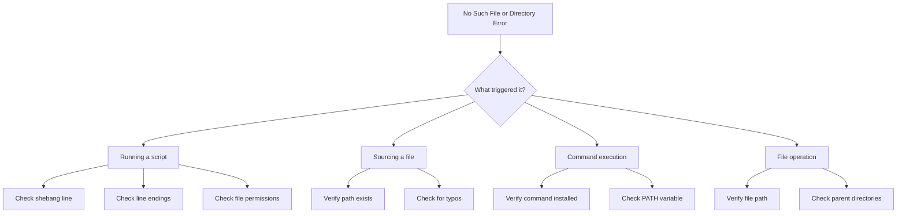
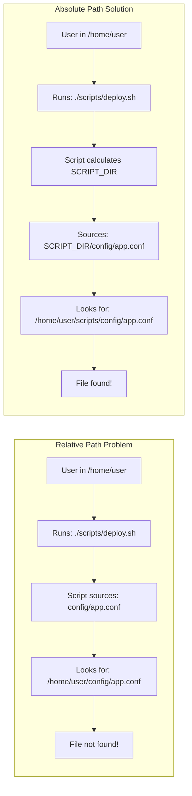
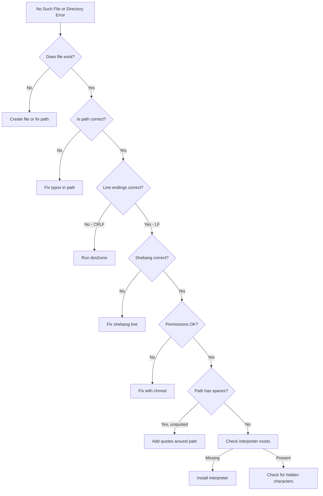

# How to Fix "No Such File or Directory" Script Errors

Author: [nawazdhandala](https://www.github.com/nawazdhandala)

Tags: Bash, Shell Scripting, Linux, Debugging, Error Handling, DevOps

Description: Learn how to diagnose and fix the common "No such file or directory" errors in Bash scripts, including path issues, line endings, and permission problems.

---

The "No such file or directory" error is one of the most common and frustrating errors you will encounter when working with Bash scripts. This error can occur even when the file clearly exists, making it difficult to diagnose. This guide covers all the causes and solutions for this error.

---

## Table of Contents

1. Understanding the Error
2. Common Causes and Solutions
3. Path-Related Issues
4. Line Ending Problems (CRLF vs LF)
5. Shebang Line Issues
6. Permission and Execution Problems
7. Debugging Techniques
8. Prevention Best Practices

---

## 1. Understanding the Error

The "No such file or directory" error appears in several forms:

```bash
# When running a script
bash: ./script.sh: No such file or directory

# When sourcing a file
bash: /path/to/file: No such file or directory

# When the interpreter is not found
/bin/bash^M: bad interpreter: No such file or directory

# When a command is not found
command: No such file or directory
```



---

## 2. Common Causes and Solutions

### Cause 1: File Does Not Exist

The simplest cause is that the file genuinely does not exist.

```bash
#!/bin/bash

# BAD: Assuming file exists
source /etc/myapp/config.sh

# GOOD: Check if file exists first
CONFIG_FILE="/etc/myapp/config.sh"
if [[ -f "$CONFIG_FILE" ]]; then
    source "$CONFIG_FILE"
else
    echo "Error: Configuration file not found: $CONFIG_FILE" >&2
    exit 1
fi
```

### Cause 2: Typos in File Path

```bash
#!/bin/bash

# BAD: Common typos
cat /etc/paswd          # Missing 's'
ls /home/usr/documents  # Should be 'user' not 'usr'

# GOOD: Use tab completion and verify paths
# Also use variables to avoid repeating paths
CONFIG_DIR="/etc/myapp"
echo "Config directory: $CONFIG_DIR"
ls "$CONFIG_DIR"
```

### Cause 3: Missing Parent Directory

```bash
#!/bin/bash

# BAD: Parent directory might not exist
touch /var/log/myapp/debug.log

# GOOD: Create parent directories first
LOG_DIR="/var/log/myapp"
mkdir -p "$LOG_DIR"
touch "$LOG_DIR/debug.log"
```

---

## 3. Path-Related Issues

### Relative vs Absolute Paths

```bash
#!/bin/bash

# BAD: Relative paths break when script runs from different directories
source config/settings.sh
./helpers/process.sh

# GOOD: Use script directory as base
SCRIPT_DIR="$(cd "$(dirname "${BASH_SOURCE[0]}")" && pwd)"
source "$SCRIPT_DIR/config/settings.sh"
"$SCRIPT_DIR/helpers/process.sh"
```



### Handling Spaces in Paths

```bash
#!/bin/bash

# BAD: Unquoted variables break with spaces
FILE=/path/to/my file.txt
cat $FILE  # Tries to cat '/path/to/my' and 'file.txt' separately

# GOOD: Always quote variables
FILE="/path/to/my file.txt"
cat "$FILE"  # Correctly handles the space

# GOOD: Use arrays for multiple files
FILES=(
    "/path/to/file one.txt"
    "/path/to/file two.txt"
)
for file in "${FILES[@]}"; do
    cat "$file"
done
```

### Handling Special Characters

```bash
#!/bin/bash

# Files might contain special characters
# Use proper quoting and escaping

# List files safely
find /data -name "*.log" -print0 | while IFS= read -r -d '' file; do
    echo "Processing: $file"
    # Process file safely even with special characters
    wc -l "$file"
done
```

### Environment Variable Paths

```bash
#!/bin/bash

# BAD: Assuming environment variable is set
cd $PROJECT_ROOT/src

# GOOD: Verify and provide defaults
PROJECT_ROOT="${PROJECT_ROOT:-/opt/myproject}"
if [[ ! -d "$PROJECT_ROOT" ]]; then
    echo "Error: PROJECT_ROOT directory does not exist: $PROJECT_ROOT" >&2
    exit 1
fi
cd "$PROJECT_ROOT/src"
```

---

## 4. Line Ending Problems (CRLF vs LF)

Windows uses CRLF (Carriage Return + Line Feed) while Unix uses LF only. This causes the infamous "bad interpreter" error.

### Detecting the Problem

```bash
# Check for Windows line endings
file script.sh
# Output: script.sh: Bash script, ASCII text executable, with CRLF line terminators

# View line endings with cat
cat -A script.sh
# Windows: #!/bin/bash^M$
# Unix:    #!/bin/bash$

# Check with hexdump
hexdump -C script.sh | head -2
# Look for '0d 0a' (CRLF) vs just '0a' (LF)
```

### Fixing Line Endings

```bash
# Method 1: Using dos2unix
dos2unix script.sh

# Method 2: Using sed
sed -i 's/\r$//' script.sh

# Method 3: Using tr
tr -d '\r' < script.sh > script_fixed.sh
mv script_fixed.sh script.sh

# Method 4: Using Vim
# Open file in vim, then run:
# :set ff=unix
# :wq
```

### Preventing Line Ending Issues

```bash
# Configure Git to handle line endings
git config --global core.autocrlf input  # On Linux/Mac
git config --global core.autocrlf true   # On Windows

# Create .gitattributes in your repository
cat > .gitattributes << 'EOF'
# Set default behavior for all files
* text=auto

# Force shell scripts to use LF
*.sh text eol=lf
*.bash text eol=lf

# Force batch files to use CRLF
*.bat text eol=crlf
*.cmd text eol=crlf
EOF
```

---

## 5. Shebang Line Issues

### Invalid Interpreter Path

```bash
# BAD: Interpreter does not exist at this path
#!/usr/local/bin/bash  # Might not exist on all systems

# GOOD: Use env for portability
#!/usr/bin/env bash

# The env command searches PATH for bash
# Works across different Unix systems
```

### Shebang with Arguments

```bash
# Some systems have issues with multiple arguments in shebang
#!/usr/bin/env bash -e  # May not work on all systems

# GOOD: Set options inside the script
#!/usr/bin/env bash
set -e  # Exit on error
set -u  # Error on undefined variables
set -o pipefail  # Pipeline fails on any command failure
```

### Checking Interpreter Availability

```bash
#!/usr/bin/env bash

# Script that checks for required interpreters
check_interpreter() {
    local interpreter="$1"
    if ! command -v "$interpreter" &> /dev/null; then
        echo "Error: Required interpreter not found: $interpreter" >&2
        echo "Please install it and try again." >&2
        return 1
    fi
    return 0
}

# Check for Python before running Python script
check_interpreter python3 || exit 1
python3 /path/to/script.py
```

---

## 6. Permission and Execution Problems

### File Not Executable

```bash
# Check current permissions
ls -la script.sh
# -rw-r--r-- means not executable

# Make file executable
chmod +x script.sh

# Or run with explicit interpreter
bash script.sh
```

### Directory Permissions

```bash
#!/bin/bash

# Cannot access file if parent directory lacks execute permission
# Directory needs 'x' permission to traverse into it

# Check directory permissions
check_path_permissions() {
    local path="$1"
    local current=""

    # Split path and check each component
    IFS='/' read -ra PARTS <<< "$path"
    for part in "${PARTS[@]}"; do
        [[ -z "$part" ]] && continue
        current="$current/$part"

        if [[ -e "$current" ]]; then
            if [[ -d "$current" ]] && [[ ! -x "$current" ]]; then
                echo "Error: No execute permission on directory: $current" >&2
                return 1
            fi
            if [[ -f "$current" ]] && [[ ! -r "$current" ]]; then
                echo "Error: No read permission on file: $current" >&2
                return 1
            fi
        else
            echo "Error: Path component does not exist: $current" >&2
            return 1
        fi
    done
    return 0
}

# Usage
check_path_permissions "/var/log/myapp/debug.log"
```

---

## 7. Debugging Techniques

### Verbose Script Execution

```bash
#!/bin/bash

# Enable debugging
set -x  # Print each command before execution

# Your script code here
CONFIG_FILE="/etc/myapp/config.sh"
source "$CONFIG_FILE"

# Disable debugging
set +x
```

### Path Verification Function

```bash
#!/bin/bash

# Function to verify a path exists and is accessible
verify_path() {
    local path="$1"
    local type="${2:-file}"  # file, directory, or any

    echo "Verifying path: $path"

    # Check if path exists
    if [[ ! -e "$path" ]]; then
        echo "  ERROR: Path does not exist" >&2

        # Check parent directories
        local parent
        parent="$(dirname "$path")"
        while [[ "$parent" != "/" ]]; do
            if [[ ! -e "$parent" ]]; then
                echo "  Missing parent: $parent" >&2
            fi
            parent="$(dirname "$parent")"
        done
        return 1
    fi

    # Check type
    case "$type" in
        file)
            if [[ ! -f "$path" ]]; then
                echo "  ERROR: Path exists but is not a regular file" >&2
                return 1
            fi
            ;;
        directory)
            if [[ ! -d "$path" ]]; then
                echo "  ERROR: Path exists but is not a directory" >&2
                return 1
            fi
            ;;
    esac

    # Check readability
    if [[ ! -r "$path" ]]; then
        echo "  ERROR: Path exists but is not readable" >&2
        return 1
    fi

    echo "  OK: Path is valid and accessible"
    return 0
}

# Usage
verify_path "/etc/myapp/config.sh" "file"
verify_path "/var/log/myapp" "directory"
```

### Debugging Flowchart



### Checking for Hidden Characters

```bash
#!/bin/bash

# Function to check for hidden or unusual characters
check_hidden_chars() {
    local file="$1"

    echo "Checking file: $file"

    # Check for BOM (Byte Order Mark)
    if head -c 3 "$file" | grep -q $'\xef\xbb\xbf'; then
        echo "  WARNING: File has UTF-8 BOM"
        echo "  Fix with: sed -i '1s/^\xEF\xBB\xBF//' $file"
    fi

    # Check for carriage returns
    if grep -q $'\r' "$file"; then
        echo "  WARNING: File has Windows line endings (CRLF)"
        echo "  Fix with: dos2unix $file"
    fi

    # Check for null bytes
    if grep -q $'\x00' "$file"; then
        echo "  WARNING: File contains null bytes"
        echo "  This may indicate a binary file"
    fi

    # Check first line (shebang)
    local first_line
    first_line=$(head -n 1 "$file")
    if [[ "$first_line" =~ ^#! ]]; then
        local interpreter
        interpreter=$(echo "$first_line" | sed 's/^#!//' | awk '{print $1}')
        if [[ ! -x "$interpreter" ]] && [[ "$interpreter" != "/usr/bin/env" ]]; then
            echo "  WARNING: Interpreter not found or not executable: $interpreter"
        fi
    fi
}

check_hidden_chars "$1"
```

---

## 8. Prevention Best Practices

### Robust Script Template

```bash
#!/usr/bin/env bash
#
# Script: example.sh
# Description: Template for robust bash scripts
# Author: Your Name
#

# Strict mode
set -euo pipefail
IFS=$'\n\t'

# Script directory (works even with symlinks)
SCRIPT_DIR="$(cd "$(dirname "$(readlink -f "${BASH_SOURCE[0]}")")" && pwd)"

# Logging function
log() {
    echo "[$(date '+%Y-%m-%d %H:%M:%S')] $*" >&2
}

# Error handler
error_exit() {
    log "ERROR: $1"
    exit "${2:-1}"
}

# Check if file exists and is readable
require_file() {
    local file="$1"
    local description="${2:-file}"

    if [[ ! -f "$file" ]]; then
        error_exit "Required $description not found: $file"
    fi

    if [[ ! -r "$file" ]]; then
        error_exit "Required $description not readable: $file"
    fi
}

# Check if directory exists
require_directory() {
    local dir="$1"
    local description="${2:-directory}"

    if [[ ! -d "$dir" ]]; then
        error_exit "Required $description not found: $dir"
    fi
}

# Check if command exists
require_command() {
    local cmd="$1"
    if ! command -v "$cmd" &> /dev/null; then
        error_exit "Required command not found: $cmd"
    fi
}

# Main function
main() {
    log "Starting script from: $SCRIPT_DIR"

    # Check requirements
    require_file "$SCRIPT_DIR/config.sh" "configuration file"
    require_directory "/var/log" "log directory"
    require_command "curl"

    # Source configuration
    source "$SCRIPT_DIR/config.sh"

    # Your script logic here
    log "Script completed successfully"
}

# Run main function
main "$@"
```

### Safe File Operations

```bash
#!/usr/bin/env bash

# Safe function to read a file
safe_read_file() {
    local file="$1"

    if [[ ! -f "$file" ]]; then
        echo "Error: File not found: $file" >&2
        return 1
    fi

    if [[ ! -r "$file" ]]; then
        echo "Error: File not readable: $file" >&2
        return 1
    fi

    cat "$file"
}

# Safe function to write a file
safe_write_file() {
    local file="$1"
    local content="$2"
    local dir

    dir="$(dirname "$file")"

    # Create parent directory if needed
    if [[ ! -d "$dir" ]]; then
        mkdir -p "$dir" || {
            echo "Error: Cannot create directory: $dir" >&2
            return 1
        }
    fi

    # Check if we can write
    if [[ -e "$file" ]] && [[ ! -w "$file" ]]; then
        echo "Error: File not writable: $file" >&2
        return 1
    fi

    echo "$content" > "$file"
}

# Safe function to source a file
safe_source() {
    local file="$1"

    if [[ ! -f "$file" ]]; then
        echo "Error: Cannot source - file not found: $file" >&2
        return 1
    fi

    if [[ ! -r "$file" ]]; then
        echo "Error: Cannot source - file not readable: $file" >&2
        return 1
    fi

    # shellcheck source=/dev/null
    source "$file"
}
```

---

## Quick Reference

| Error Message | Likely Cause | Solution |
|---------------|--------------|----------|
| `No such file or directory` | File missing | Verify file exists |
| `bad interpreter` | Wrong line endings | Run `dos2unix` |
| `command not found` | Missing from PATH | Install or fix PATH |
| `Permission denied` | Not executable | Run `chmod +x` |
| `Is a directory` | Expected file, got dir | Fix the path |

### Common Fixes

```bash
# Fix line endings
dos2unix script.sh

# Make executable
chmod +x script.sh

# Use portable shebang
#!/usr/bin/env bash

# Always quote variables
cat "$filename"

# Get script directory
SCRIPT_DIR="$(cd "$(dirname "${BASH_SOURCE[0]}")" && pwd)"

# Check before using
[[ -f "$file" ]] && source "$file"
```

---

## Key Takeaways

1. **Always quote variables** - Prevents word splitting issues with spaces and special characters
2. **Use absolute paths or calculate script directory** - Relative paths break when running from different locations
3. **Check for Windows line endings** - CRLF causes the cryptic "bad interpreter" error
4. **Use portable shebang** - `#!/usr/bin/env bash` works across different systems
5. **Verify files exist before using** - Defensive programming prevents runtime errors
6. **Check permissions on files and parent directories** - Both read and execute permissions matter
7. **Enable strict mode** - `set -euo pipefail` catches errors early
8. **Use debugging tools** - `set -x`, `file`, and `cat -A` help diagnose issues

---

*Need to monitor your shell scripts and automation workflows? [OneUptime](https://oneuptime.com) provides comprehensive monitoring solutions that help you track script execution, catch failures early, and maintain reliable automation pipelines.*
