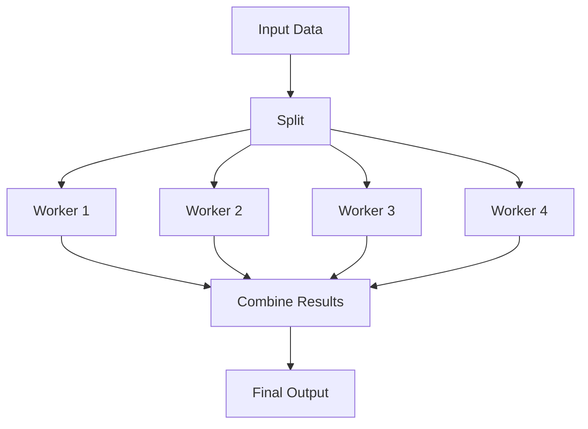
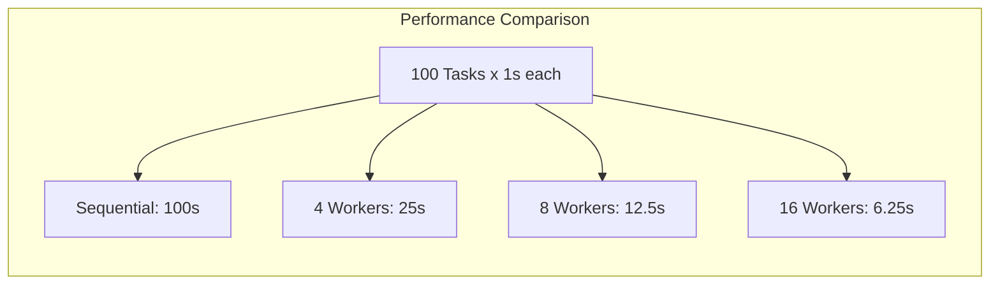

# How to Handle Parallel Execution in Bash

Author: [nawazdhandala](https://www.github.com/nawazdhandala)

Tags: Bash, Shell Scripting, Parallel Processing, Performance, DevOps, Linux, Concurrency

Description: Learn how to execute commands in parallel in Bash scripts using background processes, xargs, GNU parallel, and job control to dramatically improve performance.

---

Sequential execution is simple but slow. When you have independent tasks that can run simultaneously, parallel execution can reduce your script's runtime from hours to minutes. This guide covers every technique for parallelizing Bash scripts.

## Why Parallel Execution Matters


In the sequential approach, 4 tasks taking 3 seconds each complete in 12 seconds. Running them in parallel, they complete in just 3 seconds.

## Method 1: Background Processes with &

The simplest way to run commands in parallel is using the `&` operator.

### Basic Background Execution

```bash
#!/bin/bash

# Run three commands in parallel
./process_file1.sh &
./process_file2.sh &
./process_file3.sh &

# Wait for all background jobs to complete
wait

echo "All tasks completed"
```

### Capturing Process IDs

```bash
#!/bin/bash

# Start background processes and capture PIDs
./task1.sh &
pid1=$!

./task2.sh &
pid2=$!

./task3.sh &
pid3=$!

echo "Started tasks with PIDs: $pid1, $pid2, $pid3"

# Wait for specific processes
wait $pid1
echo "Task 1 completed"

wait $pid2
echo "Task 2 completed"

wait $pid3
echo "Task 3 completed"
```

### Handling Exit Codes from Background Processes

```bash
#!/bin/bash

# Array to store PIDs
declare -a pids

# Start background tasks
for i in {1..5}; do
    (
        # Simulate work
        sleep $((RANDOM % 3))
        # Random exit code for demo
        exit $((RANDOM % 2))
    ) &
    pids+=($!)
done

# Wait for each process and check exit code
failed=0
for pid in "${pids[@]}"; do
    if wait "$pid"; then
        echo "Process $pid succeeded"
    else
        echo "Process $pid failed"
        ((failed++))
    fi
done

echo "Total failed: $failed"
exit $((failed > 0 ? 1 : 0))
```

## Method 2: Limiting Concurrent Jobs

Running too many parallel processes can overwhelm your system. Here's how to limit concurrency.

### Using a Job Counter

```bash
#!/bin/bash

MAX_JOBS=4

# Function to limit parallel jobs
run_with_limit() {
    # Wait if we have too many jobs running
    while [[ $(jobs -r | wc -l) -ge $MAX_JOBS ]]; do
        sleep 0.1
    done

    # Run the command in background
    "$@" &
}

# Process files with limited parallelism
for file in /data/*.txt; do
    run_with_limit process_file "$file"
done

# Wait for remaining jobs
wait
echo "All files processed"
```

### Using a Semaphore Pattern

```bash
#!/bin/bash

MAX_PARALLEL=4
FIFO="/tmp/parallel_fifo_$$"

# Create FIFO for job control
mkfifo "$FIFO"
exec 3<>"$FIFO"
rm "$FIFO"

# Initialize semaphore with MAX_PARALLEL tokens
for ((i=0; i<MAX_PARALLEL; i++)); do
    echo >&3
done

process_with_semaphore() {
    local item="$1"

    # Acquire semaphore (blocks if none available)
    read -u 3

    {
        # Do the actual work
        echo "Processing: $item"
        sleep 2  # Simulate work

        # Release semaphore
        echo >&3
    } &
}

# Process items
for item in {1..20}; do
    process_with_semaphore "$item"
done

# Wait for all jobs
wait
exec 3>&-

echo "All items processed"
```

## Method 3: Using xargs for Parallel Execution

`xargs -P` provides built-in parallel execution support.

### Basic Parallel xargs

```bash
#!/bin/bash

# Process files in parallel (4 at a time)
find /data -name "*.log" | xargs -P 4 -I {} gzip {}

# Parallel with multiple arguments per command
echo -e "file1\nfile2\nfile3\nfile4" | xargs -P 4 -n 1 process_file
```

### xargs with Complex Commands

```bash
#!/bin/bash

# Using xargs with a shell command
find . -name "*.jpg" | xargs -P 4 -I {} sh -c '
    filename="{}"
    output="${filename%.jpg}_thumb.jpg"
    convert "$filename" -resize 100x100 "$output"
    echo "Created thumbnail: $output"
'
```

### xargs with Function Export

```bash
#!/bin/bash

# Define the processing function
process_item() {
    local item="$1"
    echo "Processing $item on PID $$"
    sleep 1
    echo "Finished $item"
}

# Export the function for xargs
export -f process_item

# Run in parallel
echo -e "apple\nbanana\ncherry\ndate" | xargs -P 4 -I {} bash -c 'process_item "{}"'
```

## Method 4: GNU Parallel

GNU Parallel is the most powerful tool for parallel execution in Bash.

### Installing GNU Parallel

```bash
# Debian/Ubuntu
sudo apt-get install parallel

# macOS with Homebrew
brew install parallel

# RHEL/CentOS
sudo yum install parallel
```

### Basic GNU Parallel Usage

```bash
#!/bin/bash

# Process files in parallel
parallel gzip ::: *.txt

# With explicit job count
parallel -j 4 process_file ::: file1 file2 file3 file4

# Read from stdin
find . -name "*.log" | parallel -j 8 compress_log {}
```

### GNU Parallel with Progress and Logging

```bash
#!/bin/bash

# Show progress bar
find /data -name "*.csv" | parallel --bar -j 4 process_csv {}

# Log results to file
parallel --joblog /tmp/parallel.log -j 4 ./process.sh ::: {1..100}

# Resume from failed jobs
parallel --resume --joblog /tmp/parallel.log -j 4 ./process.sh ::: {1..100}
```

### Distributing Work Across Servers

```bash
#!/bin/bash

# Define remote servers
SERVERS="server1 server2 server3 server4"

# Distribute work across servers via SSH
parallel -S $SERVERS -j 2 ./remote_task.sh ::: {1..20}

# With specific user
parallel -S user@server1,user@server2 process_data ::: data_*.csv
```

## Method 5: Process Substitution for Parallel Pipelines

```bash
#!/bin/bash

# Run multiple pipelines in parallel
paste <(sort file1.txt) <(sort file2.txt) > combined.txt

# Compare outputs from parallel processes
diff <(curl -s http://server1/api | jq .) \
     <(curl -s http://server2/api | jq .)
```

## Parallel Execution Patterns

### Pattern 1: Map-Reduce



```bash
#!/bin/bash

INPUT_FILE="large_data.txt"
NUM_WORKERS=4
TEMP_DIR=$(mktemp -d)

# Split input file
split -n l/$NUM_WORKERS "$INPUT_FILE" "$TEMP_DIR/chunk_"

# Process chunks in parallel
process_chunk() {
    local chunk="$1"
    local output="${chunk}.result"

    # Process the chunk (example: count words)
    wc -w "$chunk" > "$output"
}

export -f process_chunk

# Map phase: process chunks in parallel
find "$TEMP_DIR" -name "chunk_*" ! -name "*.result" | \
    parallel -j $NUM_WORKERS process_chunk {}

# Reduce phase: combine results
total=0
for result in "$TEMP_DIR"/*.result; do
    count=$(cat "$result")
    total=$((total + count))
done

echo "Total word count: $total"

# Cleanup
rm -rf "$TEMP_DIR"
```

### Pattern 2: Producer-Consumer Queue

```bash
#!/bin/bash

QUEUE_FILE="/tmp/work_queue_$$"
RESULTS_FILE="/tmp/results_$$"
NUM_WORKERS=4

# Create queue file
> "$QUEUE_FILE"
> "$RESULTS_FILE"

# Producer: add items to queue
producer() {
    for i in {1..100}; do
        echo "task_$i" >> "$QUEUE_FILE"
    done

    # Add termination signals for each worker
    for ((i=0; i<NUM_WORKERS; i++)); do
        echo "DONE" >> "$QUEUE_FILE"
    done
}

# Consumer: process items from queue
consumer() {
    local worker_id=$1

    while true; do
        # Atomically read and remove a line from queue
        local task
        task=$(sed -n '1p' "$QUEUE_FILE" 2>/dev/null)
        sed -i '1d' "$QUEUE_FILE" 2>/dev/null

        if [[ "$task" == "DONE" ]] || [[ -z "$task" ]]; then
            break
        fi

        # Process the task
        echo "Worker $worker_id processing $task"
        sleep 0.1  # Simulate work
        echo "$task: completed by worker $worker_id" >> "$RESULTS_FILE"
    done
}

# Start producer
producer &
sleep 0.1  # Let producer fill queue

# Start consumers
for ((i=1; i<=NUM_WORKERS; i++)); do
    consumer $i &
done

# Wait for all workers
wait

echo "Results:"
cat "$RESULTS_FILE"

# Cleanup
rm -f "$QUEUE_FILE" "$RESULTS_FILE"
```

### Pattern 3: Pipeline Parallelism

```bash
#!/bin/bash

# Set up named pipes for pipeline stages
PIPE1="/tmp/pipe1_$$"
PIPE2="/tmp/pipe2_$$"

mkfifo "$PIPE1" "$PIPE2"

# Stage 1: Read and filter
stage1() {
    while read -r line; do
        if [[ -n "$line" ]]; then
            echo "$line"
        fi
    done < /data/input.txt > "$PIPE1"
}

# Stage 2: Transform
stage2() {
    while read -r line; do
        echo "${line^^}"  # Convert to uppercase
    done < "$PIPE1" > "$PIPE2"
}

# Stage 3: Write output
stage3() {
    while read -r line; do
        echo "$(date '+%Y-%m-%d %H:%M:%S'): $line"
    done < "$PIPE2" > /data/output.txt
}

# Run pipeline stages in parallel
stage1 &
stage2 &
stage3 &

wait

# Cleanup
rm -f "$PIPE1" "$PIPE2"
```

## Handling Errors in Parallel Execution

### Collect All Errors

```bash
#!/bin/bash

TEMP_DIR=$(mktemp -d)
ERROR_FILE="$TEMP_DIR/errors.txt"

run_task() {
    local task_id=$1
    local error_file=$2

    # Simulate task that might fail
    if ! ./process_task.sh "$task_id"; then
        echo "Task $task_id failed" >> "$error_file"
        return 1
    fi
    return 0
}

export -f run_task

# Run tasks in parallel
seq 1 20 | parallel -j 4 run_task {} "$ERROR_FILE"

# Check for errors
if [[ -s "$ERROR_FILE" ]]; then
    echo "Some tasks failed:"
    cat "$ERROR_FILE"
    exit 1
fi

echo "All tasks completed successfully"
rm -rf "$TEMP_DIR"
```

### Fail Fast Pattern

```bash
#!/bin/bash

# Stop all jobs if any one fails
run_with_fail_fast() {
    local -a pids=()
    local failed=false

    # Start all background jobs
    for cmd in "$@"; do
        eval "$cmd" &
        pids+=($!)
    done

    # Monitor jobs
    for pid in "${pids[@]}"; do
        if ! wait "$pid"; then
            failed=true
            # Kill remaining jobs
            for p in "${pids[@]}"; do
                kill "$p" 2>/dev/null
            done
            break
        fi
    done

    if $failed; then
        echo "A job failed, stopped all remaining jobs"
        return 1
    fi

    return 0
}

# Usage
run_with_fail_fast \
    "./task1.sh" \
    "./task2.sh" \
    "./task3.sh"
```

## Resource Management

### CPU-Aware Parallelism

```bash
#!/bin/bash

# Detect number of CPU cores
get_cpu_count() {
    if [[ -f /proc/cpuinfo ]]; then
        grep -c ^processor /proc/cpuinfo
    elif command -v sysctl &>/dev/null; then
        sysctl -n hw.ncpu
    else
        echo 1
    fi
}

NUM_CPUS=$(get_cpu_count)
# Use N-1 cores to leave headroom
MAX_JOBS=$((NUM_CPUS > 1 ? NUM_CPUS - 1 : 1))

echo "Running with $MAX_JOBS parallel jobs"

find . -name "*.log" | parallel -j "$MAX_JOBS" gzip {}
```

### Memory-Aware Parallelism

```bash
#!/bin/bash

# Estimate memory per job and limit accordingly
TOTAL_MEM_MB=$(free -m | awk '/^Mem:/{print $2}')
MEM_PER_JOB_MB=500
RESERVED_MEM_MB=2000

AVAILABLE_MEM=$((TOTAL_MEM_MB - RESERVED_MEM_MB))
MAX_JOBS=$((AVAILABLE_MEM / MEM_PER_JOB_MB))
MAX_JOBS=$((MAX_JOBS > 0 ? MAX_JOBS : 1))

echo "System has ${TOTAL_MEM_MB}MB RAM"
echo "Allowing $MAX_JOBS parallel jobs (${MEM_PER_JOB_MB}MB each)"

parallel -j "$MAX_JOBS" ./memory_intensive_task.sh ::: {1..50}
```

## Practical Examples

### Example 1: Parallel Image Processing

```bash
#!/bin/bash

INPUT_DIR="/photos/raw"
OUTPUT_DIR="/photos/processed"
MAX_JOBS=8

mkdir -p "$OUTPUT_DIR"

process_image() {
    local input="$1"
    local output_dir="$2"
    local filename=$(basename "$input")
    local output="$output_dir/${filename%.*}_processed.jpg"

    # Resize and optimize
    convert "$input" \
        -resize "1920x1080>" \
        -quality 85 \
        -strip \
        "$output"

    echo "Processed: $filename"
}

export -f process_image

# Process all images in parallel
find "$INPUT_DIR" -type f \( -name "*.jpg" -o -name "*.png" \) | \
    parallel -j "$MAX_JOBS" process_image {} "$OUTPUT_DIR"

echo "All images processed"
```

### Example 2: Parallel Log Analysis

```bash
#!/bin/bash

LOG_DIR="/var/log/app"
PATTERN="ERROR|WARN"
RESULTS_DIR="/tmp/analysis_$$"

mkdir -p "$RESULTS_DIR"

analyze_log() {
    local log_file="$1"
    local results_dir="$2"
    local basename=$(basename "$log_file")
    local result_file="$results_dir/${basename}.analysis"

    # Count error types
    {
        echo "=== $basename ==="
        echo "Errors: $(grep -c 'ERROR' "$log_file")"
        echo "Warnings: $(grep -c 'WARN' "$log_file")"
        echo "Top error messages:"
        grep 'ERROR' "$log_file" | \
            sed 's/.*ERROR//' | \
            sort | uniq -c | sort -rn | head -5
    } > "$result_file"
}

export -f analyze_log

# Analyze all logs in parallel
find "$LOG_DIR" -name "*.log" -mtime -7 | \
    parallel -j 4 analyze_log {} "$RESULTS_DIR"

# Combine results
echo "=== Combined Analysis ==="
cat "$RESULTS_DIR"/*.analysis

rm -rf "$RESULTS_DIR"
```

### Example 3: Parallel API Requests

```bash
#!/bin/bash

API_BASE="https://api.example.com"
MAX_CONCURRENT=10
OUTPUT_DIR="/tmp/api_results"

mkdir -p "$OUTPUT_DIR"

fetch_resource() {
    local id="$1"
    local output_dir="$2"
    local output_file="$output_dir/resource_$id.json"

    # Make API request with retry
    local max_retries=3
    local retry=0

    while [[ $retry -lt $max_retries ]]; do
        if curl -sf "$API_BASE/resources/$id" > "$output_file"; then
            echo "Fetched resource $id"
            return 0
        fi
        ((retry++))
        sleep 1
    done

    echo "Failed to fetch resource $id" >&2
    return 1
}

export -f fetch_resource
export API_BASE

# Fetch resources 1-100 in parallel
seq 1 100 | parallel -j "$MAX_CONCURRENT" fetch_resource {} "$OUTPUT_DIR"

echo "Fetched $(ls "$OUTPUT_DIR" | wc -l) resources"
```

## Performance Comparison



## Best Practices

1. **Choose the right level of parallelism** - Too few workers waste potential; too many cause resource contention
2. **Handle errors gracefully** - Collect errors from parallel processes; decide on fail-fast vs. collect-all strategies
3. **Consider resource limits** - CPU, memory, file descriptors, and network connections all have limits
4. **Use appropriate tools** - Background jobs for simple cases, GNU Parallel for complex scenarios
5. **Test with realistic data** - Parallel performance varies with actual workload characteristics
6. **Add progress indicators** - Long-running parallel jobs should report progress
7. **Clean up resources** - Remove temporary files and kill orphaned processes on exit

## Quick Reference

| Method | Best For | Syntax |
|--------|----------|--------|
| Background `&` | Simple cases | `cmd &; wait` |
| `xargs -P` | File processing | `find \| xargs -P 4` |
| GNU Parallel | Complex workflows | `parallel -j 8` |
| Semaphore | Rate limiting | FIFO-based control |
| Process substitution | Pipeline parallelism | `diff <(cmd1) <(cmd2)` |

---

Parallel execution transforms slow scripts into efficient tools. Start with simple background processes for basic parallelism, move to `xargs -P` for file processing, and use GNU Parallel when you need advanced features like progress reporting, error handling, and distributed execution. Always consider your system's resource limits and implement proper error handling to build reliable parallel scripts.
