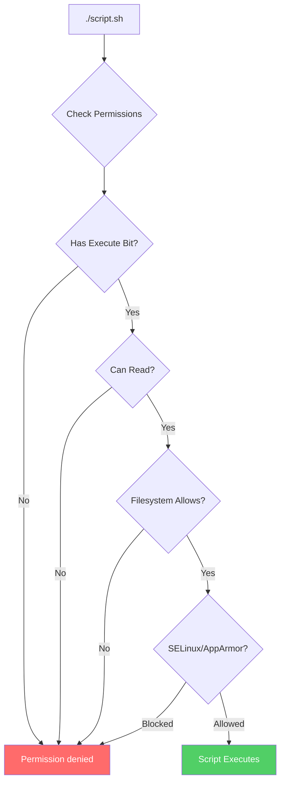
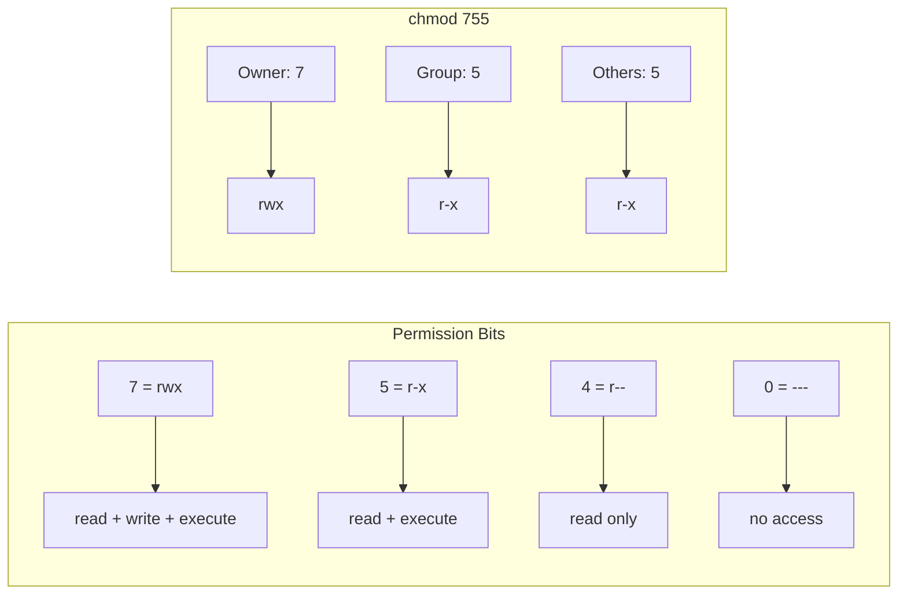
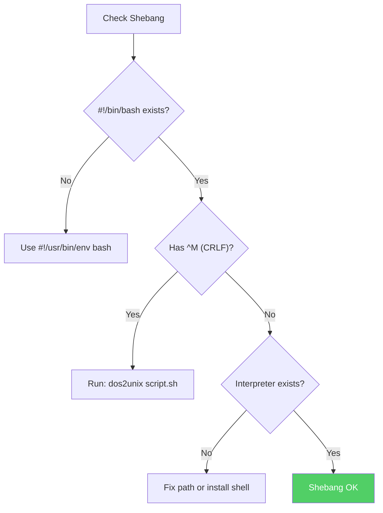

# How to Fix 'Permission Denied' Script Execution Errors

Author: [nawazdhandala](https://www.github.com/nawazdhandala)

Tags: Bash, Shell Scripting, Permissions, Linux, DevOps, Troubleshooting

Description: Learn how to diagnose and fix 'Permission denied' errors when running Bash scripts, including file permissions, execute bits, and filesystem restrictions.

---

> The "Permission denied" error when running scripts is one of the most common issues for developers and system administrators. This guide covers all causes and solutions for script execution permission problems.

---

## Understanding the Error



The error typically looks like:

```bash
$ ./myscript.sh
-bash: ./myscript.sh: Permission denied
```

---

## Cause 1: Missing Execute Permission

The most common cause is that the script file lacks the execute permission bit.

### Diagnosing the Problem

```bash
# Check current permissions
ls -la myscript.sh
# Output: -rw-r--r-- 1 user group 1234 Jan 24 10:00 myscript.sh
#         No 'x' in permissions = cannot execute

# Check if file is executable
test -x myscript.sh && echo "Executable" || echo "Not executable"
```

### Solution: Add Execute Permission

```bash
# Add execute permission for owner only
chmod u+x myscript.sh

# Add execute permission for everyone
chmod +x myscript.sh

# Add execute permission with specific mode
chmod 755 myscript.sh  # rwxr-xr-x
chmod 700 myscript.sh  # rwx------ (owner only)

# Verify the change
ls -la myscript.sh
# Output: -rwxr-xr-x 1 user group 1234 Jan 24 10:00 myscript.sh
```

### Understanding Permission Bits

```bash
#!/bin/bash
# Permission reference

# Permission structure: rwxrwxrwx
#                       |  |  |
#                       |  |  +-- Others (world)
#                       |  +----- Group
#                       +-------- Owner (user)

# Numeric values:
# r = 4 (read)
# w = 2 (write)
# x = 1 (execute)

# Common permission combinations:
# 755 = rwxr-xr-x  Owner: full, Group/Others: read+execute
# 700 = rwx------  Owner only: full access
# 644 = rw-r--r--  Owner: read+write, Others: read only
# 777 = rwxrwxrwx  Everyone: full access (rarely appropriate)
```



---

## Cause 2: Running Without Execute Permission

Sometimes you need to run a script without changing its permissions.

### Alternative Execution Methods

```bash
# Method 1: Use the interpreter directly
bash myscript.sh
sh myscript.sh
/bin/bash myscript.sh

# Method 2: Source the script (runs in current shell)
source myscript.sh
. myscript.sh

# Method 3: Use env to find the interpreter
env bash myscript.sh

# Method 4: Read and pipe to interpreter
cat myscript.sh | bash
bash < myscript.sh
```

### When to Use Each Method

```bash
#!/bin/bash
# Comparison of execution methods

# Direct execution (requires +x permission)
./script.sh
# - Runs in a new subshell
# - Script must be executable
# - Honors shebang line

# Interpreter invocation (no +x needed)
bash script.sh
# - Runs in a new subshell
# - Ignores shebang line
# - Uses specified interpreter

# Sourcing (no +x needed)
source script.sh
# - Runs in CURRENT shell
# - Variables persist after script ends
# - Changes to environment affect current session
# - Useful for loading functions/variables
```

---

## Cause 3: Wrong Owner or Group

You might not have permission because you are not the file owner or in the correct group.

### Diagnosing Ownership Issues

```bash
# Check file ownership
ls -la myscript.sh
# Output: -rwxr-x--- 1 root staff 1234 Jan 24 10:00 myscript.sh
#                     ^--- Owner: root
#                          ^--- Group: staff

# Check your user and groups
whoami
groups

# Check if you're in the file's group
id
```

### Solution: Change Ownership or Groups

```bash
# Change file owner (requires root)
sudo chown $USER myscript.sh

# Change file group
sudo chgrp mygroup myscript.sh

# Change both owner and group
sudo chown $USER:$USER myscript.sh

# Add yourself to a group (requires logout/login)
sudo usermod -aG staff $USER

# Alternative: Copy file to change ownership
cp myscript.sh /tmp/myscript.sh
# The copy will be owned by you
```

---

## Cause 4: Filesystem Mount Options

Some filesystems are mounted with `noexec` option, preventing any script execution.

### Diagnosing Mount Issues

```bash
# Check mount options for the filesystem
mount | grep $(df . --output=source | tail -1)

# Look for 'noexec' in the output
# Example: /dev/sdb1 on /media/usb type ext4 (rw,noexec,nosuid)

# Check specific mount point
findmnt -T .

# Check if filesystem allows execution
touch /tmp/test.sh
echo '#!/bin/bash' > /tmp/test.sh
echo 'echo "works"' >> /tmp/test.sh
chmod +x /tmp/test.sh
/tmp/test.sh  # Test execution
```

### Solution: Remount with exec

```bash
# Remount filesystem with exec permission (requires root)
sudo mount -o remount,exec /media/usb

# Or modify /etc/fstab for permanent change
# Change: /dev/sdb1 /media/usb ext4 noexec 0 0
# To:     /dev/sdb1 /media/usb ext4 defaults 0 0

# Alternative: Copy script to executable location
cp myscript.sh /tmp/
chmod +x /tmp/myscript.sh
/tmp/myscript.sh
```

### Common Noexec Locations

```bash
#!/bin/bash
# These locations often have noexec by default

# /tmp - On some security-hardened systems
# /var/tmp - Temporary files
# /home - On some multi-user systems
# USB drives and external media
# Network mounts (NFS with noexec)
# Container volumes

# Check all mounts for noexec
mount | grep noexec
```

---

## Cause 5: SELinux or AppArmor Restrictions

Security modules may block script execution even with correct file permissions.

### Diagnosing SELinux Issues

```bash
# Check if SELinux is enabled
getenforce
# Output: Enforcing, Permissive, or Disabled

# Check SELinux denials in audit log
sudo ausearch -m avc -ts recent

# Check file's SELinux context
ls -Z myscript.sh
# Output: -rwxr-xr-x. user user unconfined_u:object_r:user_home_t:s0 myscript.sh

# Check for SELinux blocking
sudo grep "denied" /var/log/audit/audit.log | tail -10
```

### Solution: Fix SELinux Context

```bash
# Restore default SELinux context
sudo restorecon -v myscript.sh

# Set script to be executable type
sudo chcon -t bin_t myscript.sh

# Or use unconfined type
sudo chcon -t unconfined_exec_t myscript.sh

# Temporarily set SELinux to permissive (for testing)
sudo setenforce 0

# Create custom SELinux policy if needed
# audit2allow can help generate policies
sudo ausearch -m avc | audit2allow -M mypolicy
sudo semodule -i mypolicy.pp
```

### Diagnosing AppArmor Issues

```bash
# Check AppArmor status
sudo aa-status

# Check for denials
sudo dmesg | grep -i apparmor

# Put profile in complain mode
sudo aa-complain /path/to/profile

# Disable specific profile
sudo aa-disable /path/to/profile
```

---

## Cause 6: ACL (Access Control Lists) Restrictions

Extended ACLs might restrict access beyond basic permissions.

### Diagnosing ACL Issues

```bash
# Check for ACLs (+ at end of permissions)
ls -la myscript.sh
# Output: -rwxr-xr-x+ 1 user group 1234 ...
#                   ^ Plus sign indicates ACLs

# View ACLs
getfacl myscript.sh
# Output:
# # file: myscript.sh
# # owner: user
# # group: group
# user::rwx
# user:otheruser:--- # This user has no access
# group::r-x
# mask::r-x
# other::r-x
```

### Solution: Modify ACLs

```bash
# Add execute permission for a specific user
setfacl -m u:username:rx myscript.sh

# Add execute permission for a group
setfacl -m g:groupname:rx myscript.sh

# Remove all ACLs (revert to basic permissions)
setfacl -b myscript.sh

# Copy ACLs from another file
getfacl reference.sh | setfacl --set-file=- myscript.sh
```

---

## Cause 7: Script Interpreter Issues

The shebang line might point to a non-existent or non-executable interpreter.

### Diagnosing Shebang Issues

```bash
# Check the shebang line
head -1 myscript.sh
# Output: #!/usr/bin/bash

# Verify the interpreter exists
which bash
ls -la /usr/bin/bash

# Check if interpreter is executable
test -x /usr/bin/bash && echo "OK" || echo "Not executable"

# Common shebang issues:
# #!/usr/bin/bash     # bash might be at /bin/bash
# #!/bin/bash^M       # Windows line endings
# #! /bin/bash        # Space might cause issues on some systems
```

### Solution: Fix Shebang Line

```bash
# Use env for portability
#!/usr/bin/env bash

# Or use the correct path
#!/bin/bash

# Fix Windows line endings
sed -i 's/\r$//' myscript.sh
# Or
dos2unix myscript.sh

# Verify the fix
head -1 myscript.sh | cat -v
# Should not show ^M at end of line
```



---

## Cause 8: Immutable File Attribute

The file might have the immutable attribute set, preventing any modifications including execution setup.

### Diagnosing Immutable Files

```bash
# Check for extended attributes
lsattr myscript.sh
# Output: ----i--------e-- myscript.sh
#             ^ 'i' means immutable

# Files with immutable attribute cannot be:
# - Modified
# - Deleted
# - Renamed
# - Hard linked
```

### Solution: Remove Immutable Attribute

```bash
# Remove immutable attribute (requires root)
sudo chattr -i myscript.sh

# Verify the change
lsattr myscript.sh

# Now you can modify permissions
chmod +x myscript.sh
```

---

## Complete Troubleshooting Script

```bash
#!/bin/bash
# diagnose_permission.sh - Diagnose script permission issues

set -euo pipefail

RED='\033[0;31m'
GREEN='\033[0;32m'
YELLOW='\033[0;33m'
NC='\033[0m'

check_passed() {
    echo -e "${GREEN}[PASS]${NC} $1"
}

check_failed() {
    echo -e "${RED}[FAIL]${NC} $1"
}

check_warn() {
    echo -e "${YELLOW}[WARN]${NC} $1"
}

diagnose_script() {
    local script="$1"

    echo "Diagnosing: $script"
    echo "=========================================="

    # Check if file exists
    if [[ ! -e "$script" ]]; then
        check_failed "File does not exist"
        return 1
    fi
    check_passed "File exists"

    # Check if it's a regular file
    if [[ ! -f "$script" ]]; then
        check_failed "Not a regular file"
        return 1
    fi
    check_passed "Is a regular file"

    # Check read permission
    if [[ ! -r "$script" ]]; then
        check_failed "Cannot read file (no read permission)"
    else
        check_passed "File is readable"
    fi

    # Check execute permission
    if [[ ! -x "$script" ]]; then
        check_failed "No execute permission"
        echo "  Fix: chmod +x $script"
    else
        check_passed "Has execute permission"
    fi

    # Show permissions
    echo ""
    echo "File permissions:"
    ls -la "$script"

    # Check ownership
    echo ""
    echo "Current user: $(whoami)"
    echo "User groups: $(groups)"

    # Check for ACLs
    if ls -la "$script" | grep -q '+'; then
        echo ""
        echo "ACLs detected:"
        getfacl "$script" 2>/dev/null || echo "  Cannot read ACLs"
    fi

    # Check SELinux context
    if command -v getenforce &>/dev/null; then
        echo ""
        echo "SELinux status: $(getenforce)"
        if [[ "$(getenforce)" != "Disabled" ]]; then
            echo "SELinux context:"
            ls -Z "$script"
        fi
    fi

    # Check filesystem mount options
    echo ""
    echo "Filesystem mount options:"
    local mount_point
    mount_point=$(df "$script" --output=target | tail -1)
    mount | grep " $mount_point " || echo "  Could not determine mount options"

    # Check for immutable attribute
    if command -v lsattr &>/dev/null; then
        echo ""
        echo "Extended attributes:"
        lsattr "$script" 2>/dev/null || echo "  Cannot read attributes"
    fi

    # Check shebang
    echo ""
    echo "Shebang line:"
    local shebang
    shebang=$(head -1 "$script")
    echo "  $shebang"

    # Extract interpreter path
    if [[ "$shebang" =~ ^#! ]]; then
        local interpreter
        interpreter=$(echo "$shebang" | sed 's/^#!//' | awk '{print $1}')

        if [[ "$interpreter" == "/usr/bin/env" ]]; then
            interpreter=$(echo "$shebang" | awk '{print $2}')
            interpreter=$(which "$interpreter" 2>/dev/null || echo "$interpreter")
        fi

        if [[ -x "$interpreter" ]]; then
            check_passed "Interpreter exists and is executable: $interpreter"
        else
            check_failed "Interpreter not found or not executable: $interpreter"
        fi

        # Check for Windows line endings
        if head -1 "$script" | grep -q $'\r'; then
            check_failed "Windows line endings detected (CRLF)"
            echo "  Fix: dos2unix $script"
        fi
    else
        check_warn "No shebang line found"
    fi

    echo ""
    echo "=========================================="
    echo "Recommended fixes:"

    if [[ ! -x "$script" ]]; then
        echo "1. chmod +x $script"
    fi

    echo "Alternative execution methods:"
    echo "  bash $script"
    echo "  source $script"
}

# Main
if [[ $# -eq 0 ]]; then
    echo "Usage: $0 <script>"
    exit 1
fi

diagnose_script "$1"
```

---

## Quick Reference

| Error | Likely Cause | Solution |
|-------|--------------|----------|
| Permission denied | No execute bit | `chmod +x script.sh` |
| Permission denied (noexec) | Filesystem restriction | Copy to /tmp or remount |
| Permission denied (owner) | Wrong ownership | `chown` or run as owner |
| Permission denied (SELinux) | Security context | `restorecon` or `chcon` |
| bad interpreter | Shebang path wrong | Fix path or use `env` |
| bad interpreter: No such file | CRLF line endings | `dos2unix script.sh` |

---

## Summary

To fix "Permission denied" errors:

1. **Check execute permission** - Most common issue, fix with `chmod +x`
2. **Verify ownership** - Ensure you own the file or are in the right group
3. **Check filesystem** - Some mounts have `noexec` option
4. **Review security modules** - SELinux or AppArmor may block execution
5. **Inspect ACLs** - Extended permissions might restrict access
6. **Validate shebang** - Interpreter must exist and be executable
7. **Fix line endings** - Windows CRLF causes issues on Linux

When in doubt, use `bash script.sh` to bypass execute permission requirements.

---

*Monitoring your scripts in production? [OneUptime](https://oneuptime.com) provides real-time alerting when your automation encounters permission or execution failures.*

**Related Reading:**
- [Linux File Permissions Guide](https://oneuptime.com/blog/post/2026-02-06-debug-collector-file-permissions-linux)
- [SELinux Troubleshooting](https://oneuptime.com/blog/post/2026-02-13-selinux-troubleshooting)
