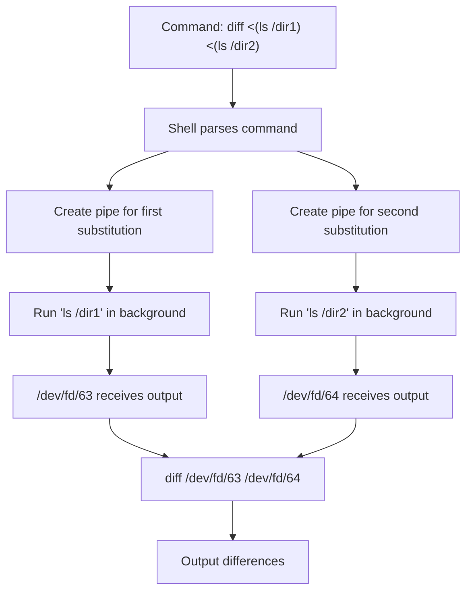

# How to Handle Process Substitution in Bash

Author: [nawazdhandala](https://github.com/nawazdhandala)

Tags: Bash, Shell Scripting, Linux, Process Substitution, Pipelines, Advanced Bash

Description: Master Bash process substitution to pass command output as files, compare outputs, and build powerful data processing pipelines.

---

## Introduction

Process substitution is a powerful Bash feature that allows you to treat command output as a file. This technique enables you to pass the output of commands to programs that expect file arguments, compare multiple command outputs, and create sophisticated data processing pipelines. Understanding process substitution unlocks advanced scripting capabilities that are difficult or impossible to achieve with simple pipes.

## What Is Process Substitution?

Process substitution creates a temporary file descriptor (typically under `/dev/fd/`) that contains the output of a command. There are two forms:

- `<(command)` - Provides command output for reading (input substitution)
- `>(command)` - Provides a file descriptor for writing (output substitution)

```bash
#!/bin/bash

# Basic example: diff two command outputs
diff <(ls /dir1) <(ls /dir2)

# The shell creates temporary file descriptors
echo <(echo "hello")  # Outputs something like /dev/fd/63
```

## How Process Substitution Works



## Input Process Substitution

### Comparing Two Command Outputs

The most common use case is comparing outputs from different commands.

```bash
#!/bin/bash

# Compare directory contents
diff <(ls -la /etc/nginx/sites-available) <(ls -la /etc/nginx/sites-enabled)

# Compare sorted vs unsorted file
diff <(sort data.txt) <(cat data.txt)

# Compare configurations from different servers
diff <(ssh server1 "cat /etc/config") <(ssh server2 "cat /etc/config")

# Compare package lists between systems
diff <(dpkg -l | awk '{print $2}') <(ssh backup-server "dpkg -l | awk '{print \$2}'")
```

### Using with Programs That Require File Arguments

Some programs only accept file arguments, not stdin input.

```bash
#!/bin/bash

# paste command requires file arguments
# Join two command outputs side by side
paste <(seq 1 5) <(seq 6 10)
# Output:
# 1    6
# 2    7
# 3    8
# 4    9
# 5    10

# comm command compares sorted files
# Find lines unique to each list
comm <(sort file1.txt) <(sort file2.txt)

# join command merges files on a common field
join <(sort -k1 users.txt) <(sort -k1 orders.txt)
```

### Multiple Input Sources

Process substitution allows combining multiple input sources.

```bash
#!/bin/bash

# Merge multiple sorted files
sort -m <(sort file1.txt) <(sort file2.txt) <(sort file3.txt)

# Compare three configurations
diff3 <(cat config.local) <(cat config.dev) <(cat config.prod)

# Combine data from multiple sources
paste <(cut -d',' -f1 data.csv) \
      <(cut -d',' -f3 data.csv) \
      <(awk -F',' '{print $2}' data.csv)
```

## Output Process Substitution

### Writing to Multiple Destinations

Output process substitution lets you send output to multiple destinations simultaneously.

```bash
#!/bin/bash

# Write to both a file and a processing command
echo "Log entry: $(date)" | tee >(cat >> logfile.txt) >(logger -t myapp)

# Split output to different processors
cat data.txt | tee >(grep "ERROR" > errors.txt) \
                   >(grep "WARN" > warnings.txt) \
                   >(wc -l > linecount.txt) > /dev/null

# Send to both stdout and a compression command
generate_data | tee >(gzip > backup.gz)
```

### Logging and Processing Pipeline

```bash
#!/bin/bash

# Process data while keeping a log
process_records() {
    while read -r line; do
        echo "Processing: $line"
        # Actual processing here
    done
}

cat input.txt | tee >(process_records) > processed_log.txt
```

## Practical Examples

### Comparing Git Branches

```bash
#!/bin/bash

# Compare file lists between branches
diff <(git ls-tree -r --name-only main) \
     <(git ls-tree -r --name-only feature-branch)

# Compare specific file across branches
diff <(git show main:config.yml) <(git show develop:config.yml)

# Compare commit logs
diff <(git log --oneline main -20) \
     <(git log --oneline feature -20)
```

### Database Operations

```bash
#!/bin/bash

# Compare table structures between databases
diff <(mysql -u user -p db1 -e "DESCRIBE users") \
     <(mysql -u user -p db2 -e "DESCRIBE users")

# Compare query results
diff <(mysql -u user -p db1 -e "SELECT * FROM config ORDER BY key") \
     <(mysql -u user -p db2 -e "SELECT * FROM config ORDER BY key")

# Export and compare data
comm -23 <(mysql db1 -e "SELECT id FROM users" | sort) \
         <(mysql db2 -e "SELECT id FROM users" | sort)
```

### Log Analysis

```bash
#!/bin/bash

# Find IPs that appear in access log but not in whitelist
comm -23 <(grep -oE '\b[0-9]+\.[0-9]+\.[0-9]+\.[0-9]+\b' access.log | sort -u) \
         <(sort -u whitelist.txt)

# Compare logs from different time periods
diff <(grep "2024-01-15" app.log | cut -d' ' -f4-) \
     <(grep "2024-01-16" app.log | cut -d' ' -f4-)

# Find common errors across multiple log files
comm -12 <(grep ERROR server1.log | sort -u) \
         <(grep ERROR server2.log | sort -u)
```

### Network Comparisons

```bash
#!/bin/bash

# Compare open ports between two servers
diff <(ssh server1 "netstat -tlnp 2>/dev/null | awk '{print \$4}' | sort") \
     <(ssh server2 "netstat -tlnp 2>/dev/null | awk '{print \$4}' | sort")

# Compare DNS resolution across servers
diff <(dig @8.8.8.8 example.com +short) \
     <(dig @1.1.1.1 example.com +short)

# Compare routing tables
diff <(ip route show) <(ssh backup-router "ip route show")
```

## Combining with Other Bash Features

### With While Loops

```bash
#!/bin/bash

# Read from process substitution in a loop
while IFS= read -r line; do
    echo "Processing: $line"
done < <(find /var/log -name "*.log" -mtime -1)

# Note: This keeps variables in the current shell
count=0
while read -r file; do
    ((count++))
done < <(ls -1)
echo "Found $count files"  # Variable is accessible here

# Compare with pipe (variables lost in subshell)
count=0
ls -1 | while read -r file; do
    ((count++))
done
echo "Found $count files"  # This prints 0!
```

### With Here Documents

```bash
#!/bin/bash

# Combine here document with process substitution
diff <(cat <<EOF
line 1
line 2
line 3
EOF
) <(cat <<EOF
line 1
line 2 modified
line 3
EOF
)
```

### With Arrays

```bash
#!/bin/bash

# Read command output into an array
mapfile -t files < <(find . -name "*.sh" -type f)

# Process array elements
for file in "${files[@]}"; do
    echo "Checking: $file"
    shellcheck "$file"
done

# Alternative: read into array
IFS=$'\n' read -r -d '' -a lines < <(cat file.txt && printf '\0')
```

## Process Substitution Flow

```mermaid
flowchart LR
    subgraph "Input Substitution <(cmd)"
        A1[Command runs] --> A2[Output to pipe]
        A2 --> A3[/dev/fd/N created]
        A3 --> A4[Parent reads from /dev/fd/N]
    end

    subgraph "Output Substitution >(cmd)"
        B1[Parent writes to /dev/fd/N]
        B1 --> B2[Pipe receives data]
        B2 --> B3[Command reads from pipe]
        B3 --> B4[Command processes data]
    end
```

## Error Handling

### Checking Process Substitution Success

```bash
#!/bin/bash

# Process substitution runs in background, so error handling is tricky
# Use a temporary file for critical operations

compare_configs() {
    local file1="$1"
    local file2="$2"

    # Create temporary files
    local tmp1 tmp2
    tmp1=$(mktemp)
    tmp2=$(mktemp)

    # Cleanup function
    cleanup() {
        rm -f "$tmp1" "$tmp2"
    }
    trap cleanup EXIT

    # Run commands and capture exit status
    if ! ssh server1 "cat $file1" > "$tmp1" 2>/dev/null; then
        echo "Failed to fetch from server1" >&2
        return 1
    fi

    if ! ssh server2 "cat $file2" > "$tmp2" 2>/dev/null; then
        echo "Failed to fetch from server2" >&2
        return 1
    fi

    # Now compare
    diff "$tmp1" "$tmp2"
}
```

### Handling Missing Commands

```bash
#!/bin/bash

# Check if commands exist before using process substitution
safe_diff_outputs() {
    local cmd1="$1"
    local cmd2="$2"

    # Verify commands exist
    if ! command -v "${cmd1%% *}" &>/dev/null; then
        echo "Command not found: ${cmd1%% *}" >&2
        return 1
    fi

    if ! command -v "${cmd2%% *}" &>/dev/null; then
        echo "Command not found: ${cmd2%% *}" >&2
        return 1
    fi

    diff <(eval "$cmd1") <(eval "$cmd2")
}
```

## Performance Considerations

### Parallel Execution

Process substitution runs commands in parallel, which can improve performance.

```bash
#!/bin/bash

# These commands run simultaneously
diff <(slow_command1) <(slow_command2)

# Equivalent sequential version (slower)
slow_command1 > /tmp/out1
slow_command2 > /tmp/out2
diff /tmp/out1 /tmp/out2
```

### Memory Usage

```bash
#!/bin/bash

# Process substitution streams data, avoiding large temporary files
# Good for large datasets

# Stream comparison (memory efficient)
diff <(sort huge_file1.txt) <(sort huge_file2.txt)

# vs. creating temporary files (uses disk space)
sort huge_file1.txt > /tmp/sorted1
sort huge_file2.txt > /tmp/sorted2
diff /tmp/sorted1 /tmp/sorted2
```

## Common Pitfalls

### POSIX Compatibility

```bash
#!/bin/bash

# Process substitution is NOT POSIX compliant
# It works in Bash and Zsh but not in sh, dash, or other POSIX shells

# Check shell before using
if [ -n "$BASH_VERSION" ]; then
    diff <(ls /dir1) <(ls /dir2)
else
    # Fallback for POSIX shells
    ls /dir1 > /tmp/dir1_list
    ls /dir2 > /tmp/dir2_list
    diff /tmp/dir1_list /tmp/dir2_list
    rm /tmp/dir1_list /tmp/dir2_list
fi
```

### File Descriptor Limitations

```bash
#!/bin/bash

# Each process substitution uses a file descriptor
# System has limits on open file descriptors

# Check current limits
ulimit -n

# For scripts with many substitutions, be mindful of limits
# Bad: Too many simultaneous substitutions
for i in {1..1000}; do
    cat <(echo $i) > /dev/null
done

# Better: Reuse or limit parallel operations
```

### Avoiding Variable Loss

```bash
#!/bin/bash

# Pipes create subshells, losing variable changes
count=0
cat file.txt | while read -r line; do
    ((count++))
done
echo "Count: $count"  # Always 0!

# Process substitution keeps variables in current shell
count=0
while read -r line; do
    ((count++))
done < <(cat file.txt)
echo "Count: $count"  # Correct count!
```

## Complete Example: Configuration Audit Script

```bash
#!/bin/bash

# Script to audit configuration differences across servers

set -euo pipefail

# Configuration
SERVERS=("web1" "web2" "web3")
CONFIGS=("/etc/nginx/nginx.conf" "/etc/php/php.ini" "/etc/my.cnf")
REPORT_FILE="config_audit_$(date +%Y%m%d_%H%M%S).txt"

# Function to fetch config from server
fetch_config() {
    local server="$1"
    local config="$2"
    ssh -o ConnectTimeout=5 "$server" "cat $config 2>/dev/null" || echo "FETCH_FAILED"
}

# Function to compare configs between two servers
compare_configs() {
    local server1="$1"
    local server2="$2"
    local config="$3"

    echo "=== Comparing $config: $server1 vs $server2 ===" >> "$REPORT_FILE"

    local diff_output
    diff_output=$(diff \
        <(fetch_config "$server1" "$config") \
        <(fetch_config "$server2" "$config") 2>&1) || true

    if [ -z "$diff_output" ]; then
        echo "IDENTICAL" >> "$REPORT_FILE"
    else
        echo "$diff_output" >> "$REPORT_FILE"
    fi
    echo "" >> "$REPORT_FILE"
}

# Main audit function
run_audit() {
    echo "Configuration Audit Report" > "$REPORT_FILE"
    echo "Generated: $(date)" >> "$REPORT_FILE"
    echo "==========================================" >> "$REPORT_FILE"
    echo "" >> "$REPORT_FILE"

    for config in "${CONFIGS[@]}"; do
        echo "Auditing: $config"

        # Compare each pair of servers
        for ((i=0; i<${#SERVERS[@]}-1; i++)); do
            for ((j=i+1; j<${#SERVERS[@]}; j++)); do
                compare_configs "${SERVERS[$i]}" "${SERVERS[$j]}" "$config"
            done
        done
    done

    echo "Audit complete. Report saved to: $REPORT_FILE"
}

# Generate summary using process substitution
generate_summary() {
    echo ""
    echo "=== Summary ===" >> "$REPORT_FILE"

    # Count identical vs different
    local identical different
    identical=$(grep -c "IDENTICAL" "$REPORT_FILE" || echo 0)
    different=$(grep -c "^[<>]" "$REPORT_FILE" || echo 0)

    echo "Identical configurations: $identical" >> "$REPORT_FILE"
    echo "Configurations with differences: $different" >> "$REPORT_FILE"
}

# Run the audit
run_audit
generate_summary
```

## Conclusion

Process substitution is an essential Bash feature for advanced shell scripting. It allows you to:

1. Compare outputs from multiple commands using `diff <(cmd1) <(cmd2)`
2. Use command output with programs that require file arguments
3. Write to multiple destinations simultaneously with output substitution
4. Keep variable scope in the current shell when reading from commands
5. Run commands in parallel for better performance

Key points to remember:

- Use `<(command)` for input substitution (reading command output as a file)
- Use `>(command)` for output substitution (writing to a command as if it were a file)
- Process substitution is Bash-specific and not POSIX compliant
- Commands in process substitution run in parallel
- Prefer process substitution over pipes when you need to preserve variable scope

Mastering process substitution will significantly enhance your ability to write powerful and efficient Bash scripts.
