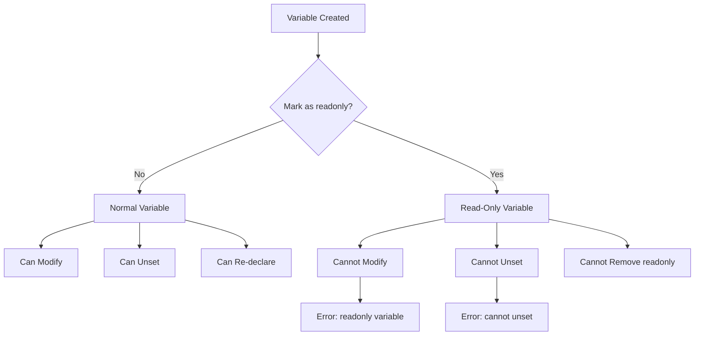
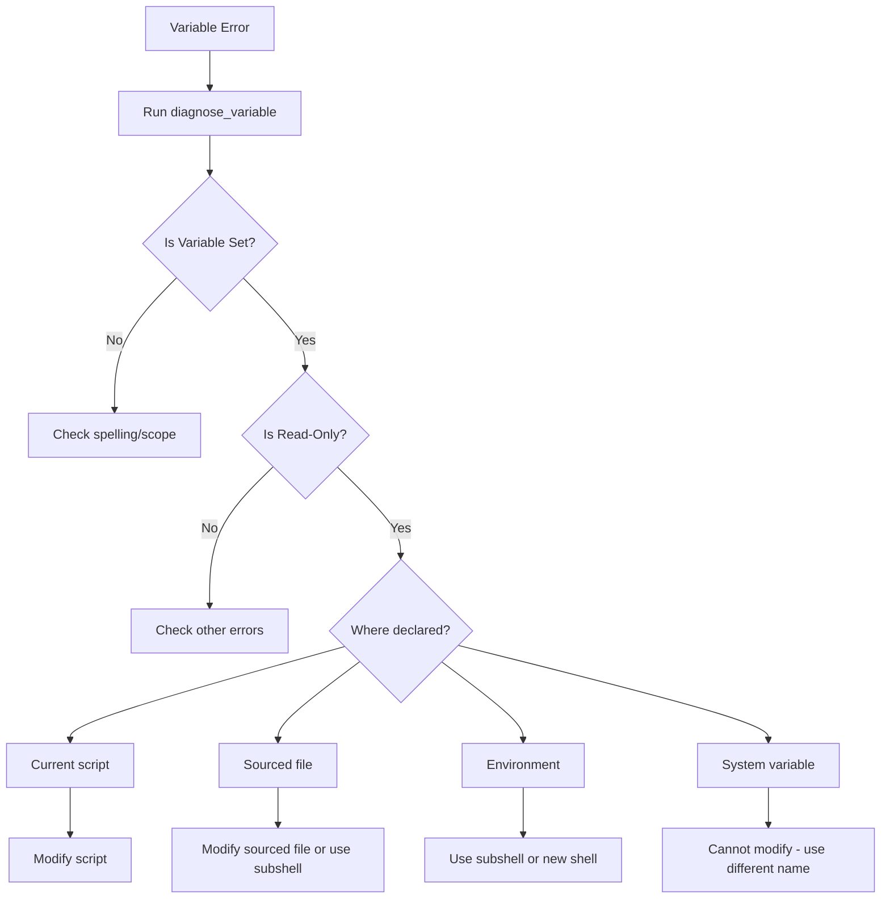
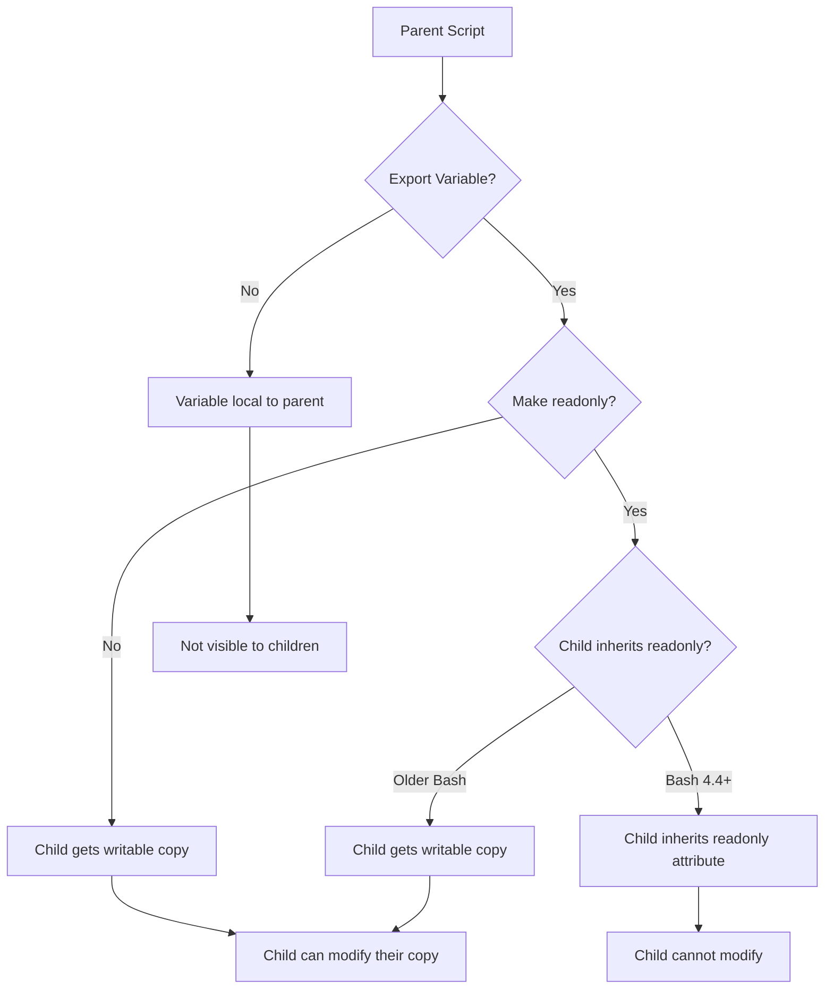
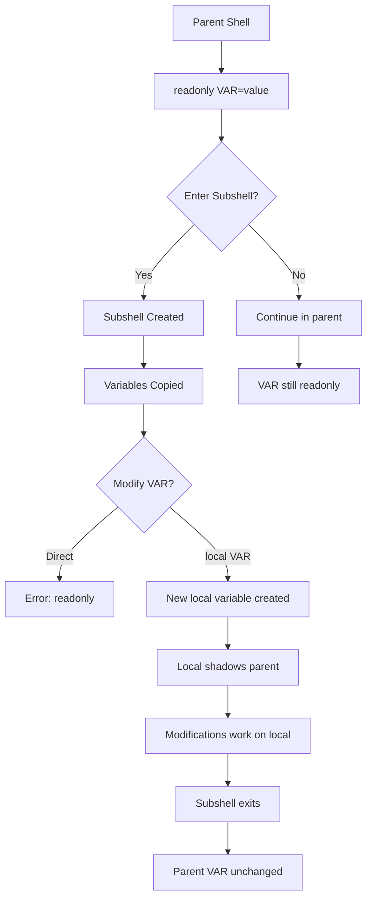

# How to Fix "Read-Only Variable" Errors in Bash

Author: [nawazdhandala](https://www.github.com/nawazdhandala)

Tags: Bash, Shell Scripting, Linux, Variables, Error Handling, Debugging

Description: Learn how to diagnose and resolve read-only variable errors in Bash, including understanding the readonly command, working around limitations, and best practices for variable management.

---

The "read-only variable" error in Bash occurs when you attempt to modify or unset a variable that has been marked as read-only. This protection mechanism is useful for constants but can cause issues when inherited or when scripts need to reset state. This guide covers how to understand, diagnose, and work around read-only variable errors.

---

## Table of Contents

1. Understanding Read-Only Variables
2. Common Causes of Read-Only Errors
3. Diagnosing Read-Only Variable Issues
4. Workarounds and Solutions
5. Working with Environment Variables
6. Best Practices for Constants
7. Subshell Techniques
8. Prevention Strategies

---

## 1. Understanding Read-Only Variables

Read-only variables cannot be modified or unset after being declared. This is useful for constants that should never change.

### Creating Read-Only Variables

```bash
#!/bin/bash

# Method 1: Using readonly command
MY_CONST="value"
readonly MY_CONST

# Method 2: Using declare -r
declare -r ANOTHER_CONST="another value"

# Method 3: Inline declaration
readonly INLINE_CONST="inline value"

# Attempt to modify - causes error
MY_CONST="new value"
# bash: MY_CONST: readonly variable

# Attempt to unset - causes error
unset MY_CONST
# bash: unset: MY_CONST: cannot unset: readonly variable
```

### Read-Only Behavior



### Listing Read-Only Variables

```bash
#!/bin/bash

# List all read-only variables
readonly -p

# Example output:
# declare -r BASHOPTS="..."
# declare -r BASH_VERSINFO=([0]="5" [1]="1" ...)
# declare -r EUID="1000"
# declare -r PPID="12345"
# declare -r SHELLOPTS="braceexpand:..."
# declare -r UID="1000"

# Check if specific variable is read-only
is_readonly() {
    local var_name=$1
    if readonly -p | grep -q "declare -r $var_name="; then
        return 0  # Is read-only
    else
        return 1  # Not read-only
    fi
}

# Usage
if is_readonly "PATH"; then
    echo "PATH is read-only"
else
    echo "PATH is not read-only"
fi
```

---

## 2. Common Causes of Read-Only Errors

### Inherited Read-Only Variables

```bash
#!/bin/bash

# Parent script
readonly SHARED_CONFIG="/etc/app/config"
export SHARED_CONFIG

# Child script tries to modify
# child.sh:
#!/bin/bash
SHARED_CONFIG="/new/path"  # Error if inherited as readonly
```

### System Read-Only Variables

```bash
#!/bin/bash

# These are read-only by default in Bash
echo "EUID: $EUID"      # Effective User ID
echo "UID: $UID"        # User ID
echo "PPID: $PPID"      # Parent Process ID
echo "BASHOPTS: $BASHOPTS"  # Shell options

# Attempting to modify causes error
EUID=0  # bash: EUID: readonly variable
```

### Loop Variable Conflicts

```bash
#!/bin/bash

# Accidentally making loop variable readonly
readonly i=100  # Oops!

# Later in script
for i in {1..10}; do  # Error!
    echo "$i"
done
# bash: i: readonly variable
```

### Sourced Scripts

```bash
# config.sh
#!/bin/bash
readonly DB_HOST="localhost"
readonly DB_PORT="5432"

# main.sh
#!/bin/bash
source config.sh

# Later, trying to override
DB_HOST="production.db.com"  # Error!
```

---

## 3. Diagnosing Read-Only Variable Issues

### Identifying the Problematic Variable

```bash
#!/bin/bash

# Error message format
# bash: VARIABLE_NAME: readonly variable

# Find where variable was made readonly
# Method 1: Search in current script
grep -n "readonly.*VARIABLE_NAME" script.sh
grep -n "declare -r.*VARIABLE_NAME" script.sh

# Method 2: Check environment
env | grep VARIABLE_NAME
readonly -p | grep VARIABLE_NAME
```

### Diagnostic Function

```bash
#!/bin/bash

diagnose_variable() {
    local var_name=$1

    echo "=== Diagnosing: $var_name ==="

    # Check if set
    if [[ -v "$var_name" ]]; then
        echo "Status: Set"
        echo "Value: ${!var_name}"
    else
        echo "Status: Not set"
    fi

    # Check if readonly
    if readonly -p | grep -q "declare -r $var_name"; then
        echo "Read-only: Yes"
    else
        echo "Read-only: No"
    fi

    # Check if exported
    if export -p | grep -q "declare -x $var_name"; then
        echo "Exported: Yes"
    else
        echo "Exported: No"
    fi

    # Check type
    local type_info
    type_info=$(declare -p "$var_name" 2>/dev/null)
    if [[ -n "$type_info" ]]; then
        echo "Declaration: $type_info"
    fi

    echo "=========================="
}

# Usage
readonly MY_VAR="test"
diagnose_variable MY_VAR
```

### Debug Output



---

## 4. Workarounds and Solutions

### Solution 1: Use Different Variable Names

```bash
#!/bin/bash

# If CONFIG is readonly from environment
# Use a different name internally

readonly EXTERNAL_CONFIG="${CONFIG:-default}"

# Use prefixed version for modifications
INTERNAL_CONFIG="$EXTERNAL_CONFIG"
INTERNAL_CONFIG="modified value"  # This works
```

### Solution 2: Use Subshell

```bash
#!/bin/bash

# Parent context
readonly PARENT_VAR="original"

# Subshell creates new variable space
(
    # This is a copy, not the readonly variable
    PARENT_VAR="modified in subshell"
    echo "In subshell: $PARENT_VAR"
)

echo "In parent: $PARENT_VAR"  # Still "original"
```

### Solution 3: Start New Shell

```bash
#!/bin/bash

readonly LOCKED_VAR="locked"

# Start completely new shell without the variable
env -u LOCKED_VAR bash -c '
    LOCKED_VAR="unlocked"
    echo "New shell: $LOCKED_VAR"
'
```

### Solution 4: Use Indirect References

```bash
#!/bin/bash

# When you cannot modify the variable itself
# Use a wrapper approach

readonly REAL_CONFIG="/original/path"

# Use indirection
CONFIG_OVERRIDE=""
get_config() {
    if [[ -n "$CONFIG_OVERRIDE" ]]; then
        echo "$CONFIG_OVERRIDE"
    else
        echo "$REAL_CONFIG"
    fi
}

# Usage
config=$(get_config)
echo "Config: $config"

# To "override" - set the override variable
CONFIG_OVERRIDE="/new/path"
config=$(get_config)
echo "Config: $config"
```

### Solution 5: Use Associative Arrays

```bash
#!/bin/bash

# Use an array for configurable constants
declare -A CONFIG

# Initialize with defaults
CONFIG[DB_HOST]="localhost"
CONFIG[DB_PORT]="5432"

# Lock specific keys by convention, not by readonly
CONFIG_LOCKED_KEYS=("DB_HOST")

set_config() {
    local key=$1
    local value=$2

    if [[ " ${CONFIG_LOCKED_KEYS[*]} " =~ " $key " ]]; then
        echo "Error: $key is locked" >&2
        return 1
    fi

    CONFIG[$key]=$value
}

# Usage
set_config "DB_PORT" "5433"  # Works
set_config "DB_HOST" "newhost"  # Error (by convention)
```

---

## 5. Working with Environment Variables

### Handling Inherited Read-Only Variables

```bash
#!/bin/bash

# Script that might receive readonly variables
main() {
    # Check if we inherited problematic readonly vars
    if readonly -p | grep -q "declare -r PROBLEMATIC_VAR"; then
        echo "Warning: PROBLEMATIC_VAR is readonly"
        echo "Starting fresh shell to work around..."

        # Restart without the variable
        exec env -u PROBLEMATIC_VAR "$0" "$@"
    fi

    # Normal script logic
    PROBLEMATIC_VAR="safe to set now"
    echo "$PROBLEMATIC_VAR"
}

main "$@"
```

### Export Without Readonly

```bash
#!/bin/bash

# When exporting constants to child processes
# Consider whether they need to be modifiable

# Method 1: Export and readonly (child cannot modify)
export STRICT_CONST="value"
readonly STRICT_CONST

# Method 2: Export only (child can modify their copy)
export FLEXIBLE_CONST="value"
# Children can: FLEXIBLE_CONST="new value"
```

### Environment Variable Patterns



---

## 6. Best Practices for Constants

### Naming Conventions

```bash
#!/bin/bash

# Use ALL_CAPS for constants
readonly MAX_RETRIES=3
readonly DEFAULT_TIMEOUT=30
readonly CONFIG_FILE="/etc/app/config.conf"

# Use lowercase for regular variables
current_retry=0
timeout=$DEFAULT_TIMEOUT

# Prefix with module name to avoid conflicts
readonly APP_DB_HOST="localhost"
readonly APP_DB_PORT="5432"
readonly APP_LOG_LEVEL="INFO"
```

### Constants Module Pattern

```bash
#!/bin/bash

# constants.sh - Define all constants in one place

# Prevent multiple sourcing
if [[ -n "$_CONSTANTS_LOADED" ]]; then
    return 0
fi
readonly _CONSTANTS_LOADED=1

# Application constants
readonly APP_NAME="MyApplication"
readonly APP_VERSION="1.0.0"

# Path constants
readonly APP_HOME="${APP_HOME:-/opt/myapp}"
readonly APP_CONFIG_DIR="$APP_HOME/config"
readonly APP_LOG_DIR="$APP_HOME/logs"

# Limit constants
readonly MAX_CONNECTIONS=100
readonly MAX_FILE_SIZE=$((100 * 1024 * 1024))  # 100MB

# Export for child processes (optional)
export APP_NAME APP_VERSION
```

### Conditional Readonly

```bash
#!/bin/bash

# Only make readonly in production
set_constant() {
    local name=$1
    local value=$2

    eval "$name='$value'"

    if [[ "${ENVIRONMENT:-production}" == "production" ]]; then
        readonly "$name"
    fi
}

set_constant "DB_HOST" "localhost"
set_constant "DB_PORT" "5432"

# In development, these can still be modified
# In production, they are locked
```

### Safe Constant Declaration

```bash
#!/bin/bash

# Declare constant only if not already set
declare_constant() {
    local name=$1
    local value=$2

    # Check if already readonly
    if readonly -p | grep -q "declare -r $name="; then
        echo "Warning: $name is already readonly" >&2
        return 1
    fi

    # Check if already set
    if [[ -v "$name" ]]; then
        echo "Warning: $name is already set to: ${!name}" >&2
        echo "Keeping existing value"
        readonly "$name"
    else
        eval "readonly $name='$value'"
    fi
}

# Usage
declare_constant "MY_CONST" "value1"
declare_constant "MY_CONST" "value2"  # Warning, keeps value1
```

---

## 7. Subshell Techniques

### Isolating Variable Changes

```bash
#!/bin/bash

readonly MAIN_CONFIG="main"

process_with_override() {
    local override=$1

    # Run in subshell to avoid affecting parent
    (
        # This shadows the readonly variable
        local MAIN_CONFIG="$override"
        echo "Using config: $MAIN_CONFIG"
        # Do work...
    )
}

echo "Main config: $MAIN_CONFIG"
process_with_override "temporary"
echo "Main config still: $MAIN_CONFIG"
```

### Fresh Environment Subshell

```bash
#!/bin/bash

run_in_clean_env() {
    # Start bash with minimal environment
    env -i HOME="$HOME" PATH="$PATH" bash -c "$1"
}

# Usage
readonly LOCKED="original"
export LOCKED

run_in_clean_env 'LOCKED="modified"; echo $LOCKED'
echo "Parent still has: $LOCKED"
```

### Subshell Flow



### Process Substitution

```bash
#!/bin/bash

readonly DATA_FILE="/original/data"

# Use process substitution to work with modified paths
# without actually changing the variable

process_data() {
    local file=$1
    cat "$file" | process_command
}

# Override via function argument, not variable
process_data "/different/data"

# Or use a wrapper
get_data_file() {
    echo "${DATA_FILE_OVERRIDE:-$DATA_FILE}"
}

DATA_FILE_OVERRIDE="/different/data"
process_data "$(get_data_file)"
```

---

## 8. Prevention Strategies

### Design Guidelines

```bash
#!/bin/bash

# 1. Use readonly sparingly
# Only for true constants that should never change

# 2. Document readonly variables
# READONLY: Application version string
readonly APP_VERSION="1.0.0"

# 3. Provide initialization functions
init_config() {
    # Set defaults that CAN be overridden
    : "${DB_HOST:=localhost}"
    : "${DB_PORT:=5432}"

    # Then lock if needed
    if [[ "$LOCK_CONFIG" == "true" ]]; then
        readonly DB_HOST DB_PORT
    fi
}

# 4. Use configuration objects instead
declare -A CONFIG
CONFIG[host]="localhost"
CONFIG[port]="5432"

# Lock by convention
config_set() {
    local key=$1 value=$2
    if [[ "$CONFIG_LOCKED" == "true" ]]; then
        echo "Config is locked" >&2
        return 1
    fi
    CONFIG[$key]=$value
}
```

### Testing for Readonly

```bash
#!/bin/bash

# Before setting, check if safe
safe_set() {
    local var_name=$1
    local value=$2

    # Check if readonly
    if readonly -p | grep -q "declare -r $var_name="; then
        echo "Error: Cannot set $var_name - readonly" >&2
        return 1
    fi

    eval "$var_name='$value'"
}

# Before making readonly, check if already set
safe_readonly() {
    local var_name=$1
    local value=$2

    # Check if already readonly
    if readonly -p | grep -q "declare -r $var_name="; then
        echo "Warning: $var_name already readonly" >&2
        return 1
    fi

    eval "readonly $var_name='$value'"
}
```

### Complete Variable Management Library

```bash
#!/bin/bash

# var_manager.sh - Safe variable management

declare -A _VAR_METADATA

var_set() {
    local name=$1
    local value=$2
    local flags="${3:-}"

    # Check if modifiable
    if [[ "${_VAR_METADATA[$name]}" == *"readonly"* ]]; then
        echo "Error: $name is readonly" >&2
        return 1
    fi

    # Set the variable
    eval "$name='$value'"

    # Handle flags
    if [[ "$flags" == *"readonly"* ]]; then
        _VAR_METADATA[$name]="readonly"
        readonly "$name"
    fi

    if [[ "$flags" == *"export"* ]]; then
        export "$name"
    fi
}

var_get() {
    local name=$1
    echo "${!name}"
}

var_is_readonly() {
    local name=$1
    [[ "${_VAR_METADATA[$name]}" == *"readonly"* ]] || \
    readonly -p | grep -q "declare -r $name="
}

var_info() {
    local name=$1

    echo "Variable: $name"
    echo "Value: ${!name}"
    echo "Readonly: $(var_is_readonly "$name" && echo "yes" || echo "no")"
    echo "Exported: $(export -p | grep -q "declare -x $name=" && echo "yes" || echo "no")"
}

# Usage
var_set "MY_VAR" "initial value"
var_set "MY_CONST" "constant value" "readonly"

var_info "MY_VAR"
var_info "MY_CONST"

var_set "MY_VAR" "new value"  # Works
var_set "MY_CONST" "new value"  # Error
```

---

## Quick Reference

```bash
# Create readonly variable
readonly VAR="value"
declare -r VAR="value"

# List readonly variables
readonly -p

# Check if readonly
readonly -p | grep "declare -r VAR="

# Cannot unset readonly
unset VAR  # Error

# Workarounds:
# 1. Use different variable name
# 2. Use subshell: (VAR="new"; ...)
# 3. Use new shell: bash -c 'VAR="new"; ...'
# 4. Use indirection/wrapper functions
```

### Error Messages

| Error | Cause | Solution |
|-------|-------|----------|
| `VAR: readonly variable` | Trying to assign | Use different name or subshell |
| `cannot unset: readonly variable` | Trying to unset | Use subshell or new shell |
| `cannot modify readonly variable` | Trying to modify | Same as above |

---

## Key Takeaways

1. **Understand readonly scope** - Readonly is per-shell; subshells can shadow but not modify
2. **Use readonly intentionally** - Only for true constants that must never change
3. **Document readonly variables** - Mark them clearly in your code
4. **Provide override mechanisms** - Use functions or override variables for flexibility
5. **Test before setting** - Check if a variable is already readonly before modification
6. **Use naming conventions** - ALL_CAPS for constants helps identify them
7. **Consider inheritance** - Readonly may or may not propagate to child processes
8. **Use subshells for isolation** - When you need to temporarily use different values

---

*Building robust shell scripts for production? [OneUptime](https://oneuptime.com) provides monitoring and alerting to help you catch script failures and configuration issues before they impact your services.*
