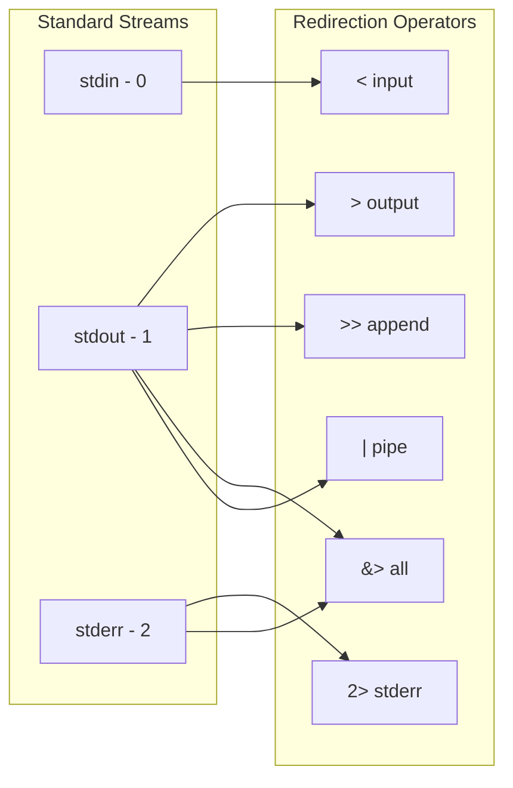
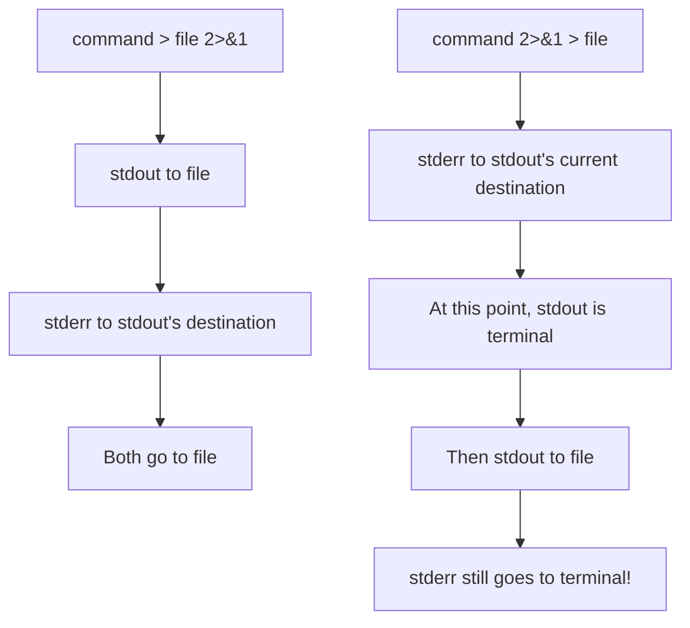

# How to Fix "Redirection" Errors in Bash

Author: [nawazdhandala](https://www.github.com/nawazdhandala)

Tags: Bash, Shell Scripting, Troubleshooting, Redirection, Linux, DevOps, I/O

Description: Learn how to diagnose and fix common Bash redirection errors including ambiguous redirect, permission denied, and file descriptor issues.

---

> Redirection is one of the most powerful features in Bash, allowing you to control where input comes from and where output goes. However, redirection errors can be cryptic and frustrating. This guide covers the most common redirection errors and their solutions.

Understanding redirection is essential for writing robust shell scripts that handle files and streams correctly.

---

## Understanding Bash Redirection



---

## Common Redirection Errors

### 1. Ambiguous Redirect

```bash
#!/bin/bash
# ERROR: ambiguous redirect

# This happens when a variable is empty or contains spaces
filename=""
echo "test" > $filename
# Error: -bash: $filename: ambiguous redirect

# CAUSE: Empty variable becomes no filename at all
# The shell sees: echo "test" >
# Which is ambiguous - redirect to what?

# SOLUTION 1: Quote your variables
filename="output.txt"
echo "test" > "$filename"  # Works correctly

# SOLUTION 2: Use default value
filename=""
echo "test" > "${filename:-/dev/null}"  # Uses /dev/null if empty

# SOLUTION 3: Check variable before use
filename=""
if [[ -n "$filename" ]]; then
    echo "test" > "$filename"
else
    echo "Error: filename is empty" >&2
    exit 1
fi
```

### 2. Permission Denied

```bash
#!/bin/bash
# ERROR: Permission denied

# This happens when:
# 1. File is not writable
# 2. Directory is not writable
# 3. File is owned by another user

# DIAGNOSIS
ls -la /path/to/file    # Check file permissions
ls -la /path/to/        # Check directory permissions
stat /path/to/file      # Detailed file info

# SOLUTION 1: Use sudo for system files
sudo bash -c 'echo "content" > /etc/myconfig'

# SOLUTION 2: Check and fix permissions
output_file="/var/log/myapp.log"

# Ensure parent directory exists and is writable
parent_dir=$(dirname "$output_file")
if [[ ! -d "$parent_dir" ]]; then
    mkdir -p "$parent_dir" || {
        echo "Cannot create directory: $parent_dir" >&2
        exit 1
    }
fi

# Check if file is writable (or can be created)
if [[ -e "$output_file" && ! -w "$output_file" ]]; then
    echo "Cannot write to: $output_file" >&2
    exit 1
fi

echo "content" > "$output_file"

# SOLUTION 3: Use a fallback location
write_safely() {
    local content="$1"
    local primary="$2"
    local fallback="$3"

    if echo "$content" > "$primary" 2>/dev/null; then
        echo "Wrote to: $primary"
    elif echo "$content" > "$fallback" 2>/dev/null; then
        echo "Wrote to fallback: $fallback"
    else
        echo "Cannot write to any location" >&2
        return 1
    fi
}

write_safely "my data" "/var/log/app.log" "/tmp/app.log"
```

### 3. No Such File or Directory

```bash
#!/bin/bash
# ERROR: No such file or directory

# This happens when:
# 1. Parent directory does not exist
# 2. Input file does not exist
# 3. Path contains typos

# PROBLEM: Redirecting to non-existent directory
echo "test" > /nonexistent/directory/file.txt
# Error: /nonexistent/directory/file.txt: No such file or directory

# SOLUTION 1: Create parent directories
output_file="/var/log/myapp/data/output.txt"
mkdir -p "$(dirname "$output_file")"
echo "test" > "$output_file"

# SOLUTION 2: Validate paths before use
safe_redirect() {
    local content="$1"
    local filepath="$2"

    local dir
    dir=$(dirname "$filepath")

    # Create directory if it does not exist
    if [[ ! -d "$dir" ]]; then
        if ! mkdir -p "$dir"; then
            echo "Failed to create directory: $dir" >&2
            return 1
        fi
    fi

    echo "$content" > "$filepath"
}

# Usage
safe_redirect "my content" "/path/to/new/dir/file.txt"

# SOLUTION 3: Use mktemp for temporary files
# Instead of guessing paths, use system temp directory
temp_file=$(mktemp)
echo "temporary content" > "$temp_file"
echo "Created: $temp_file"
```

### 4. Bad File Descriptor

```bash
#!/bin/bash
# ERROR: Bad file descriptor

# This happens when:
# 1. File descriptor is not open
# 2. Wrong file descriptor number
# 3. File descriptor was closed

# PROBLEM: Using unopened file descriptor
echo "test" >&3
# Error: -bash: 3: Bad file descriptor

# SOLUTION 1: Open file descriptor before use
exec 3>output.log    # Open fd 3 for writing
echo "test" >&3      # Now works
exec 3>&-            # Close fd 3 when done

# SOLUTION 2: Check if fd is open
is_fd_open() {
    local fd=$1
    # Try to get fd status
    if { true >&$fd; } 2>/dev/null; then
        return 0
    else
        return 1
    fi
}

# Usage
if is_fd_open 3; then
    echo "fd 3 is open" >&3
else
    echo "fd 3 is not open"
fi

# SOLUTION 3: Proper fd management pattern
setup_logging() {
    local log_file="$1"

    # Open file descriptor 3 for logging
    exec 3>"$log_file"

    # Set up cleanup trap
    trap 'exec 3>&-' EXIT
}

log() {
    echo "[$(date '+%Y-%m-%d %H:%M:%S')] $*" >&3
}

setup_logging "/tmp/myapp.log"
log "Script started"
log "Doing something"
log "Script finished"
```

---

## Redirection Order Matters



### Common Order Mistakes

```bash
#!/bin/bash
# Redirection order is evaluated left to right

# CORRECT: Both stdout and stderr to file
command > output.log 2>&1

# WRONG: Only stdout to file, stderr still to terminal
command 2>&1 > output.log

# EXPLANATION:
# 2>&1 means "make fd 2 point where fd 1 points"
# At the time 2>&1 is evaluated:
#   - In CORRECT: fd 1 already points to file, so fd 2 also points to file
#   - In WRONG: fd 1 still points to terminal, so fd 2 points to terminal

# MODERN ALTERNATIVE (Bash 4+): &> redirects both
command &> output.log        # Same as: command > output.log 2>&1
command &>> output.log       # Append both stdout and stderr

# Practical example - capturing all output
capture_all() {
    local output_file="$1"
    shift

    # Run command, capture both streams
    "$@" > "$output_file" 2>&1
    local exit_code=$?

    # Report result
    if [[ $exit_code -eq 0 ]]; then
        echo "Success. Output in: $output_file"
    else
        echo "Failed (exit code: $exit_code). See: $output_file"
    fi

    return $exit_code
}

capture_all /tmp/build.log make -j4
```

---

## Here Documents and Here Strings

### Here Document Errors

```bash
#!/bin/bash
# Common here-doc errors

# PROBLEM 1: Spaces before closing delimiter
cat << EOF
    content here
    EOF  # ERROR: delimiter has leading spaces

# SOLUTION: No spaces, OR use <<- with tabs
cat << EOF
    content here
EOF

# SOLUTION: Use <<- to ignore leading TABS (not spaces)
cat <<- EOF
	content here
	EOF

# PROBLEM 2: Variable expansion when not wanted
password='$ecretP@ss'
cat << EOF
Password is: $password  # Expands variable
EOF

# SOLUTION: Quote the delimiter to prevent expansion
cat << 'EOF'
Password is: $password  # Treated literally
EOF

# PROBLEM 3: Indentation issues in scripts
indent_example() {
    # This here-doc preserves the indentation
    cat << EOF
This text
    has weird
        indentation
EOF

    # Use <<- with tabs for cleaner scripts
    cat <<- EOF
		This text
		is properly
		indented
	EOF
}
```

### Here String Errors

```bash
#!/bin/bash
# Here string issues

# Here strings (<<<) pass a string as stdin
grep "pattern" <<< "string to search"

# PROBLEM: Trying to use here string with multiple words unquoted
# Wrong - word splitting occurs
grep pattern <<< $variable_with_spaces

# SOLUTION: Always quote
variable="word1 word2 word3"
grep "word2" <<< "$variable"

# PROBLEM: Here string does not work in POSIX sh
# Here strings are Bash-specific

# POSIX-compatible alternative
echo "$variable" | grep "word2"

# Or using printf
printf '%s\n' "$variable" | grep "word2"
```

---

## Process Substitution Errors

```bash
#!/bin/bash
# Process substitution <() and >()

# PROBLEM: Process substitution not available in sh
#!/bin/sh
diff <(sort file1) <(sort file2)
# Error: syntax error near unexpected token `('

# SOLUTION: Use Bash explicitly
#!/bin/bash
diff <(sort file1) <(sort file2)  # Works in Bash

# PROBLEM: Writing to process substitution incorrectly
# This does not work as expected
echo "data" > >(cat)

# SOLUTION: Process substitution for input works reliably
while read -r line; do
    echo "Processing: $line"
done < <(find . -name "*.txt")

# PROBLEM: Process substitution and variables
# Variables set inside do not persist
count=0
while read -r line; do
    ((count++))
done < <(echo -e "a\nb\nc")
echo "Count: $count"  # Works! count=3 (unlike pipe)

# Compare with pipe (variables do not persist)
count=0
echo -e "a\nb\nc" | while read -r line; do
    ((count++))
done
echo "Count: $count"  # count=0 (subshell issue)
```

---

## File Descriptor Management

```bash
#!/bin/bash
# Proper file descriptor handling

# Open multiple file descriptors
exec 3>stdout.log     # fd 3 for main output
exec 4>stderr.log     # fd 4 for errors
exec 5>debug.log      # fd 5 for debug

# Redirect different types of output
echo "Normal output" >&3
echo "Error message" >&4
echo "Debug info" >&5

# Close file descriptors
exec 3>&-
exec 4>&-
exec 5>&-

# Pattern: Temporary fd for backup/restore
# Save stdout to fd 6
exec 6>&1

# Redirect stdout to file
exec 1>output.log

# Commands here write to file
echo "This goes to file"
date
hostname

# Restore stdout
exec 1>&6
exec 6>&-

echo "This goes to terminal again"

# Pattern: Capturing output while displaying
{
    # This runs in current shell, output goes to both terminal and file
    ./my_script.sh 2>&1 | tee output.log
}

# Pattern: Swapping stdout and stderr
# Some commands put important info on stderr
# Swap them to capture only stderr
{
    command_that_logs_to_stderr 3>&1 1>&2 2>&3
} 2>captured_stderr.log
```

---

## Debugging Redirection Issues

```bash
#!/bin/bash
# Debug redirection problems

# Enable trace mode to see redirections
set -x

# Example command
echo "test" > output.txt 2>&1

set +x

# Check open file descriptors
list_open_fds() {
    echo "Open file descriptors:"
    ls -la /proc/$$/fd/ 2>/dev/null || lsof -p $$ 2>/dev/null
}

# Debug redirection step by step
debug_redirect() {
    local cmd="$1"
    local outfile="$2"

    echo "Command: $cmd"
    echo "Output file: $outfile"
    echo "Output file dir: $(dirname "$outfile")"
    echo "Dir exists: $(test -d "$(dirname "$outfile")" && echo yes || echo no)"
    echo "Dir writable: $(test -w "$(dirname "$outfile")" && echo yes || echo no)"

    if [[ -e "$outfile" ]]; then
        echo "File exists: yes"
        echo "File writable: $(test -w "$outfile" && echo yes || echo no)"
        echo "File owner: $(stat -c '%U' "$outfile" 2>/dev/null || stat -f '%Su' "$outfile")"
    else
        echo "File exists: no (will be created)"
    fi
}

# Usage
debug_redirect "echo test" "/var/log/myapp.log"
```

---

## Robust Redirection Patterns

```bash
#!/bin/bash
# Production-ready redirection patterns

# Pattern 1: Safe logging setup
setup_logging() {
    local log_dir="${1:-/var/log/myapp}"
    local log_file="$log_dir/app.log"

    # Ensure log directory exists
    if ! mkdir -p "$log_dir" 2>/dev/null; then
        log_dir="/tmp/myapp"
        mkdir -p "$log_dir"
        log_file="$log_dir/app.log"
        echo "Warning: Using fallback log directory: $log_dir" >&2
    fi

    # Redirect stdout and stderr to log file, keep copy on terminal
    exec > >(tee -a "$log_file") 2>&1

    echo "=== Log started at $(date) ==="
}

# Pattern 2: Atomic file writes
atomic_write() {
    local content="$1"
    local target="$2"
    local temp_file

    # Create temp file in same directory (for atomic rename)
    temp_file=$(mktemp "$(dirname "$target")/.tmp.XXXXXX")

    # Write to temp file
    if ! echo "$content" > "$temp_file"; then
        rm -f "$temp_file"
        return 1
    fi

    # Atomic rename
    if ! mv "$temp_file" "$target"; then
        rm -f "$temp_file"
        return 1
    fi

    return 0
}

# Pattern 3: Redirect with timeout
redirect_with_timeout() {
    local timeout="$1"
    local outfile="$2"
    shift 2

    # Run command with timeout, redirect output
    timeout "$timeout" bash -c '"$@" > "$0" 2>&1' "$outfile" "$@"
}

# Usage
redirect_with_timeout 30 /tmp/output.log curl -s "https://example.com"

# Pattern 4: Tee to multiple files
multi_tee() {
    local input="$1"
    shift
    local files=("$@")

    # Build tee command
    local tee_cmd="tee"
    for file in "${files[@]:1}"; do
        tee_cmd="$tee_cmd | tee"
    done

    # Simpler approach: use tee with process substitution
    echo "$input" | tee "${files[@]}"
}
```

---

## Summary

Common redirection errors and solutions:

| Error | Cause | Solution |
|-------|-------|----------|
| Ambiguous redirect | Empty or unquoted variable | Quote variables: `"$var"` |
| Permission denied | No write access | Check permissions, use sudo or fallback |
| No such file or directory | Missing parent directory | Use `mkdir -p` |
| Bad file descriptor | FD not open | Open with `exec N>file` |
| Wrong output destination | Incorrect order | `> file 2>&1` not `2>&1 > file` |

---

*Managing scripts across your infrastructure? [OneUptime](https://oneuptime.com) monitors your systems and alerts you when scripts fail or produce unexpected output.*

**Related Reading:**
- [How to Handle JSON Parsing in Bash with jq](https://oneuptime.com/blog/post/2026-01-24-bash-json-parsing-jq/view)
- [How to Handle Script Debugging with set -x](https://oneuptime.com/blog/post/2026-01-24-bash-debugging-set-x/view)
