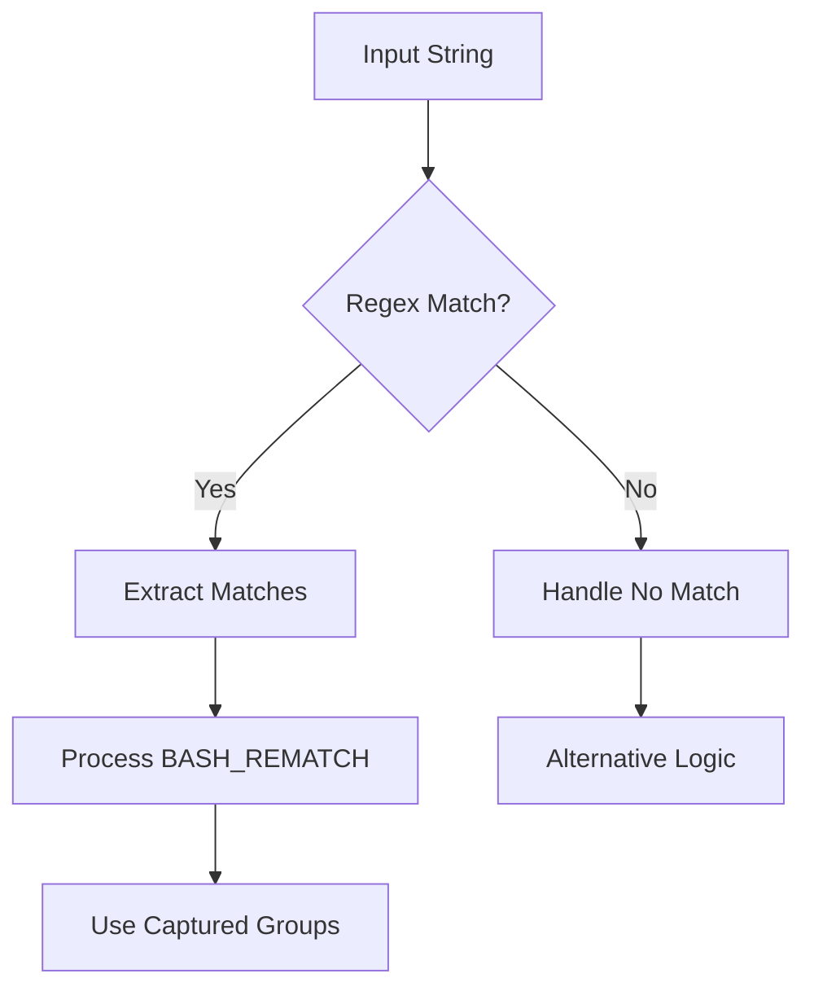
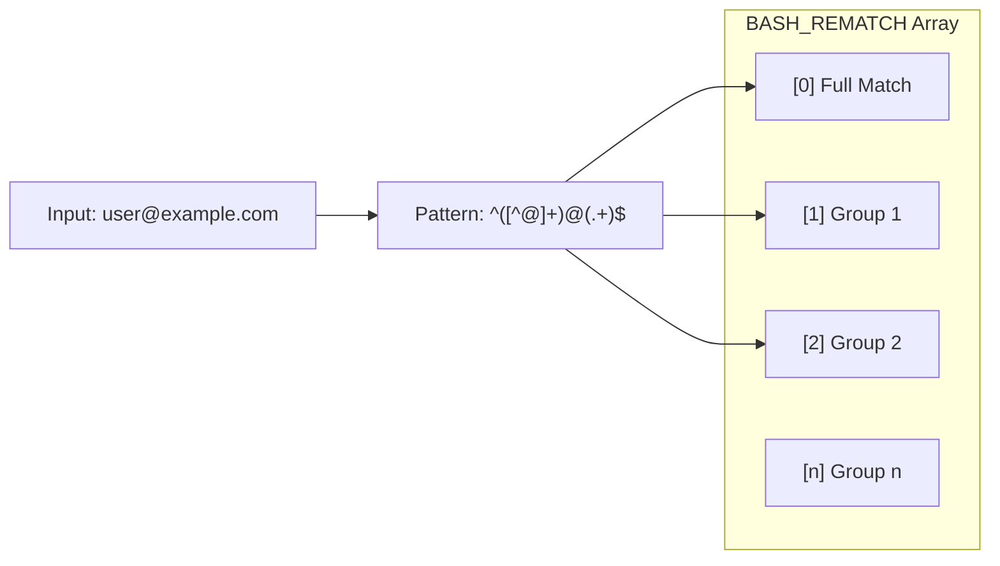
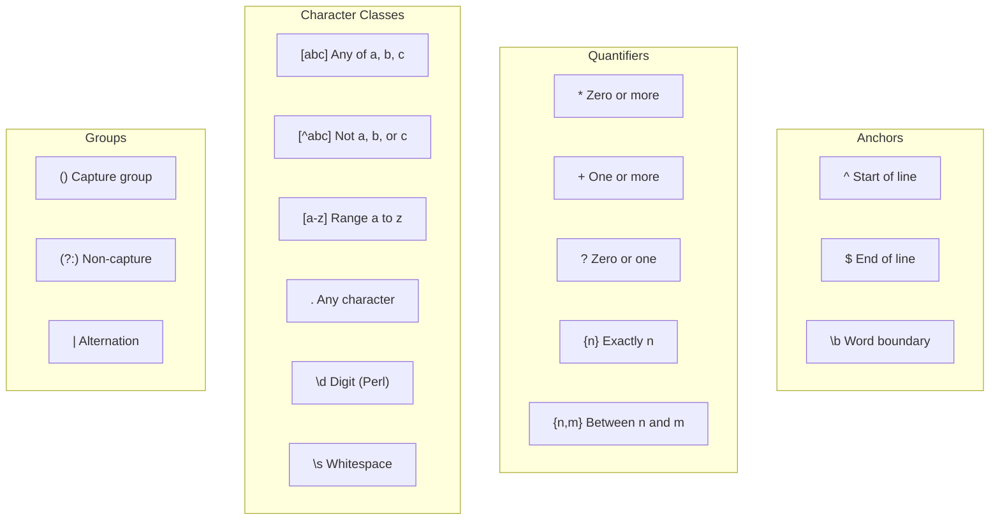

# How to Handle Regular Expressions in Bash

Author: [nawazdhandala](https://www.github.com/nawazdhandala)

Tags: Bash, Shell Scripting, Regular Expressions, Regex, Linux, Pattern Matching, Text Processing

Description: Learn how to use regular expressions in Bash for pattern matching, text validation, and string manipulation with practical examples.

---

> Regular expressions are powerful tools for pattern matching and text processing. Bash provides multiple ways to work with regex, from the `=~` operator to tools like grep and sed. Master these techniques to write more efficient shell scripts.

Understanding regex in Bash unlocks powerful text processing capabilities for your scripts.

---

## Overview



---

## Basic Regex Matching with =~

Bash provides the `=~` operator for regex matching inside `[[ ]]` conditional expressions.

### Simple Pattern Matching

```bash
#!/bin/bash
# Basic regex matching - check if a string contains a pattern

string="Hello World 2024"

# Check if string contains digits
# The =~ operator performs regex matching
if [[ $string =~ [0-9]+ ]]; then
    echo "String contains numbers"
    # BASH_REMATCH[0] contains the full match
    echo "Matched: ${BASH_REMATCH[0]}"
fi

# Check if string starts with "Hello"
# ^ anchors the pattern to the start of the string
if [[ $string =~ ^Hello ]]; then
    echo "String starts with Hello"
fi

# Check if string ends with digits
# $ anchors the pattern to the end of the string
if [[ $string =~ [0-9]+$ ]]; then
    echo "String ends with numbers"
fi
```

### Capturing Groups

```bash
#!/bin/bash
# Capturing groups allow extracting specific parts of a match
# Groups are defined with parentheses ()

email="user@example.com"

# Regex with two capturing groups:
# Group 1: ([^@]+) - one or more characters that are not @
# Group 2: (.+) - one or more of any character (the domain)
if [[ $email =~ ^([^@]+)@(.+)$ ]]; then
    echo "Valid email format"
    echo "Full match: ${BASH_REMATCH[0]}"   # user@example.com
    echo "Username: ${BASH_REMATCH[1]}"      # user
    echo "Domain: ${BASH_REMATCH[2]}"        # example.com
fi
```

---

## Regex Flow Diagram



---

## Common Regex Patterns

### Validating Input Formats

```bash
#!/bin/bash
# Common validation patterns for user input

validate_input() {
    local input="$1"
    local type="$2"

    case "$type" in
        # Validate IPv4 address format
        # Each octet: number from 0-255
        ip)
            local ip_regex='^([0-9]{1,3}\.){3}[0-9]{1,3}$'
            if [[ $input =~ $ip_regex ]]; then
                echo "Valid IP format: $input"
                return 0
            fi
            ;;

        # Validate date in YYYY-MM-DD format
        # [0-9]{4} matches exactly 4 digits for year
        # [0-9]{2} matches exactly 2 digits for month and day
        date)
            local date_regex='^[0-9]{4}-[0-9]{2}-[0-9]{2}$'
            if [[ $input =~ $date_regex ]]; then
                echo "Valid date format: $input"
                return 0
            fi
            ;;

        # Validate email address (basic pattern)
        # [a-zA-Z0-9._%+-]+ matches local part
        # [a-zA-Z0-9.-]+ matches domain
        # [a-zA-Z]{2,} matches TLD (at least 2 chars)
        email)
            local email_regex='^[a-zA-Z0-9._%+-]+@[a-zA-Z0-9.-]+\.[a-zA-Z]{2,}$'
            if [[ $input =~ $email_regex ]]; then
                echo "Valid email format: $input"
                return 0
            fi
            ;;

        # Validate URL (http or https)
        url)
            local url_regex='^https?://[a-zA-Z0-9.-]+(/.*)?$'
            if [[ $input =~ $url_regex ]]; then
                echo "Valid URL format: $input"
                return 0
            fi
            ;;
    esac

    echo "Invalid $type format: $input"
    return 1
}

# Test the validation function
validate_input "192.168.1.1" "ip"
validate_input "2024-01-15" "date"
validate_input "user@example.com" "email"
validate_input "https://example.com/path" "url"
```

---

## Extracting Data with Regex

### Parsing Log Files

```bash
#!/bin/bash
# Extract information from Apache-style log entries

parse_log_entry() {
    local log_line="$1"

    # Apache combined log format regex
    # Captures: IP, date, method, path, status code, bytes
    local log_regex='^([0-9.]+) .* \[([^\]]+)\] "([A-Z]+) ([^ ]+) [^"]*" ([0-9]+) ([0-9-]+)'

    if [[ $log_line =~ $log_regex ]]; then
        echo "IP Address: ${BASH_REMATCH[1]}"
        echo "Timestamp: ${BASH_REMATCH[2]}"
        echo "Method: ${BASH_REMATCH[3]}"
        echo "Path: ${BASH_REMATCH[4]}"
        echo "Status: ${BASH_REMATCH[5]}"
        echo "Bytes: ${BASH_REMATCH[6]}"
    else
        echo "Failed to parse log entry"
        return 1
    fi
}

# Example log entry
log='192.168.1.1 - - [15/Jan/2024:10:30:00 +0000] "GET /api/users HTTP/1.1" 200 1234'
parse_log_entry "$log"
```

### Extracting Version Numbers

```bash
#!/bin/bash
# Extract and compare semantic version numbers

extract_version() {
    local version_string="$1"

    # Semantic version regex: MAJOR.MINOR.PATCH
    # Optional: pre-release and build metadata
    local semver_regex='([0-9]+)\.([0-9]+)\.([0-9]+)(-[a-zA-Z0-9.]+)?(\+[a-zA-Z0-9.]+)?'

    if [[ $version_string =~ $semver_regex ]]; then
        local major="${BASH_REMATCH[1]}"
        local minor="${BASH_REMATCH[2]}"
        local patch="${BASH_REMATCH[3]}"
        local prerelease="${BASH_REMATCH[4]}"
        local build="${BASH_REMATCH[5]}"

        echo "Major: $major"
        echo "Minor: $minor"
        echo "Patch: $patch"
        [[ -n "$prerelease" ]] && echo "Pre-release: ${prerelease#-}"
        [[ -n "$build" ]] && echo "Build: ${build#+}"

        # Return version as comparable integer
        echo "Numeric: $((major * 10000 + minor * 100 + patch))"
    else
        echo "Invalid version format"
        return 1
    fi
}

# Test version extraction
extract_version "1.2.3"
echo "---"
extract_version "2.0.0-beta.1+build.123"
```

---

## Using Regex with grep

### Extended Regex with grep -E

```bash
#!/bin/bash
# Using grep with extended regular expressions

# Find all email addresses in a file
# -E enables extended regex (same as egrep)
# -o outputs only the matched portion
grep -Eo '[a-zA-Z0-9._%+-]+@[a-zA-Z0-9.-]+\.[a-zA-Z]{2,}' contacts.txt

# Find lines containing IP addresses
# -P enables Perl-compatible regex for more features
grep -Po '\b\d{1,3}\.\d{1,3}\.\d{1,3}\.\d{1,3}\b' server.log

# Find all function definitions in a shell script
# Match: function_name() or function function_name
grep -E '^\s*(function\s+)?[a-zA-Z_][a-zA-Z0-9_]*\s*\(\)' script.sh

# Count occurrences of HTTP status codes
# -c counts matching lines
grep -Eo 'HTTP/[0-9.]+ [0-9]{3}' access.log | sort | uniq -c
```

### Case-Insensitive Matching

```bash
#!/bin/bash
# Case-insensitive regex matching

text="Error: Connection Failed"

# Method 1: Using shopt to enable nocasematch
shopt -s nocasematch
if [[ $text =~ error ]]; then
    echo "Found error (case-insensitive)"
fi
shopt -u nocasematch  # Disable when done

# Method 2: Convert to lowercase before matching
text_lower="${text,,}"
if [[ $text_lower =~ error ]]; then
    echo "Found error in lowercase string"
fi

# Method 3: Include both cases in pattern
if [[ $text =~ [Ee][Rr][Rr][Oo][Rr] ]]; then
    echo "Found error using character classes"
fi

# Method 4: Using grep -i
echo "$text" | grep -qi "error" && echo "Found error with grep"
```

---

## Regex with sed

### Search and Replace

```bash
#!/bin/bash
# Using sed for regex-based text transformation

# Replace email domains
# s/pattern/replacement/g - global substitution
echo "contact@old-domain.com" | sed 's/@old-domain\.com/@new-domain.com/'

# Extract and reformat dates
# Capture groups referenced with \1, \2, etc.
# Convert MM/DD/YYYY to YYYY-MM-DD
echo "01/15/2024" | sed -E 's/([0-9]{2})\/([0-9]{2})\/([0-9]{4})/\3-\1-\2/'

# Remove HTML tags from text
# .*? is non-greedy matching in extended regex
echo "<p>Hello <b>World</b></p>" | sed -E 's/<[^>]+>//g'

# Normalize whitespace
# Replace multiple spaces/tabs with single space
echo "Hello    World		Tab" | sed -E 's/[[:space:]]+/ /g'
```

### Multi-line Processing

```bash
#!/bin/bash
# Process multi-line patterns with sed

# Remove multi-line comments from code
# N appends next line, creates pattern space with both lines
sed -E ':a;N;$!ba;s/\/\*[^*]*\*\///g' source.c

# Join continuation lines (lines ending with backslash)
sed -E ':a;/\\$/N;s/\\\n//;ta' config.txt

# Extract content between markers
sed -n '/BEGIN_SECTION/,/END_SECTION/p' document.txt
```

---

## Regex Cheat Sheet



---

## Common Patterns Reference

```bash
#!/bin/bash
# Collection of commonly used regex patterns

# Phone number (US format)
phone_regex='^(\+1)?[-. ]?\(?[0-9]{3}\)?[-. ]?[0-9]{3}[-. ]?[0-9]{4}$'

# Credit card (basic validation)
cc_regex='^[0-9]{4}[-. ]?[0-9]{4}[-. ]?[0-9]{4}[-. ]?[0-9]{4}$'

# UUID
uuid_regex='^[0-9a-fA-F]{8}-[0-9a-fA-F]{4}-[0-9a-fA-F]{4}-[0-9a-fA-F]{4}-[0-9a-fA-F]{12}$'

# Hex color code
hex_color_regex='^#?([0-9a-fA-F]{6}|[0-9a-fA-F]{3})$'

# MAC address
mac_regex='^([0-9A-Fa-f]{2}:){5}[0-9A-Fa-f]{2}$'

# Username (alphanumeric, underscore, 3-16 chars)
username_regex='^[a-zA-Z0-9_]{3,16}$'

# Password strength (8+ chars, upper, lower, digit, special)
password_regex='^(?=.*[a-z])(?=.*[A-Z])(?=.*[0-9])(?=.*[!@#$%^&*]).{8,}$'

# File path (Unix)
filepath_regex='^(/[^/ ]*)+/?$'

# Validate each pattern
test_pattern() {
    local value="$1"
    local pattern="$2"
    local name="$3"

    if [[ $value =~ $pattern ]]; then
        echo "$name: VALID"
    else
        echo "$name: INVALID"
    fi
}

# Example usage
test_pattern "550e8400-e29b-41d4-a716-446655440000" "$uuid_regex" "UUID"
test_pattern "#FF5733" "$hex_color_regex" "Hex Color"
test_pattern "00:1A:2B:3C:4D:5E" "$mac_regex" "MAC Address"
```

---

## Escaping Special Characters

### Handling Literal Characters

```bash
#!/bin/bash
# Properly escape special regex characters

# Special chars that need escaping: . * + ? ^ $ [ ] { } ( ) | \

escape_regex() {
    local string="$1"
    # Escape all special regex characters
    # Use printf to handle the escaping
    printf '%s\n' "$string" | sed 's/[.[\*^$()+?{|\\]/\\&/g'
}

# Search for literal string containing special chars
search_literal="file.txt"
escaped=$(escape_regex "$search_literal")
echo "Escaped pattern: $escaped"

# Now use in grep - will match literal "file.txt"
grep "$escaped" filelist.txt

# Alternative: Use grep -F for fixed strings (no regex)
grep -F "file.txt" filelist.txt
```

### Using Variables in Patterns

```bash
#!/bin/bash
# Safely use variables in regex patterns

# Store pattern in a variable
# Important: Do NOT quote the variable in the =~ comparison
pattern='[0-9]+'

string="Order 12345"

# Correct - pattern is unquoted
if [[ $string =~ $pattern ]]; then
    echo "Match found: ${BASH_REMATCH[0]}"
fi

# Building patterns dynamically
prefix="user"
suffix="[0-9]+"
dynamic_pattern="${prefix}_${suffix}"

if [[ "user_123" =~ $dynamic_pattern ]]; then
    echo "Dynamic pattern matched"
fi

# Using array for multiple patterns
patterns=(
    '^[A-Z]'        # Starts with uppercase
    '[0-9]+$'       # Ends with numbers
    'error|fail'    # Contains error or fail
)

text="Error in line 42"

for pattern in "${patterns[@]}"; do
    if [[ $text =~ $pattern ]]; then
        echo "Matched pattern: $pattern"
    fi
done
```

---

## Performance Considerations

```bash
#!/bin/bash
# Optimize regex for better performance

# Bad: Greedy quantifiers can cause backtracking
# This pattern can be slow on large strings
bad_pattern='.*foo.*bar.*'

# Better: Be more specific to reduce backtracking
better_pattern='[^f]*foo[^b]*bar'

# Avoid catastrophic backtracking
# Bad: (a+)+ on string "aaaaaaaaaaaaaaaaaaaaaaaab"
# Good: a+ achieves the same without nested quantifiers

# Use anchors when possible
# Anchored patterns fail faster on non-matches
anchored_pattern='^prefix.*suffix$'

# Compile patterns once, use multiple times
# Store pattern in variable outside loops
declare -r IP_PATTERN='^[0-9]{1,3}\.[0-9]{1,3}\.[0-9]{1,3}\.[0-9]{1,3}$'

validate_ips() {
    local file="$1"
    local count=0

    while IFS= read -r line; do
        # Pattern variable is reused, not recompiled
        if [[ $line =~ $IP_PATTERN ]]; then
            ((count++))
        fi
    done < "$file"

    echo "Valid IPs: $count"
}
```

---

## Best Practices

1. **Store patterns in variables** - improves readability and prevents quoting issues
2. **Use anchors** - `^` and `$` make patterns fail faster on non-matches
3. **Be specific** - avoid `.*` when you know the expected format
4. **Test patterns** - validate regex with sample inputs before deployment
5. **Handle edge cases** - empty strings, special characters, Unicode
6. **Document complex patterns** - add comments explaining each part

---

## Conclusion

Regular expressions in Bash provide powerful text processing capabilities:

- **The `=~` operator** enables native regex matching in conditionals
- **BASH_REMATCH** captures matched groups for extraction
- **grep and sed** extend regex capabilities for file processing
- **Proper escaping** prevents unexpected matches

Master these techniques to write more robust and efficient shell scripts.

---

*Need to monitor your shell scripts? [OneUptime](https://oneuptime.com) provides comprehensive monitoring and alerting to catch script failures before they impact your systems.*
