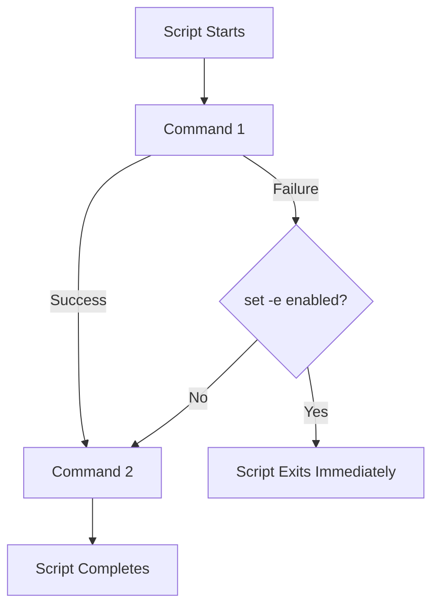
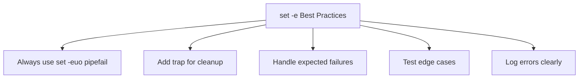

# How to Handle Error Handling with set -e in Bash

Author: [nawazdhandala](https://www.github.com/nawazdhandala)

Tags: Bash, Shell Scripting, Error Handling, DevOps, Automation

Description: A comprehensive guide to using set -e for robust error handling in Bash scripts, including best practices and common pitfalls.

---

Error handling is crucial for writing reliable Bash scripts. The `set -e` option (also known as `errexit`) tells Bash to exit immediately if any command returns a non-zero exit status.

## What is set -e?



## Basic Usage

```bash
#!/bin/bash

set -e

echo "This will print"
false  # This command returns non-zero
echo "This will NOT print because 'false' failed"
```

### Combining with Other Options

```bash
#!/bin/bash

# Common combination for strict error handling
set -euo pipefail

# -e: Exit on error
# -u: Exit on undefined variable
# -o pipefail: Catch errors in pipelines
```

## When set -e Does NOT Trigger

```mermaid
flowchart TD
    A[set -e Exceptions] --> B[Part of if/while condition]
    A --> C[Negated with !]
    A --> D[Part of && or || chain]
```

```bash
#!/bin/bash
set -e

# Commands in if conditions do not trigger exit
if grep "pattern" nonexistent.txt; then
    echo "Found"
else
    echo "Not found"  # Script continues
fi

# Commands negated with ! do not trigger exit
if ! grep "pattern" nonexistent.txt; then
    echo "Pattern not found"
fi

# Commands before || do not trigger exit
grep "pattern" file.txt || echo "Grep failed, continuing"
```

## The pipefail Option

```bash
#!/bin/bash
set -eo pipefail

# Without pipefail: only last command's status matters
# With pipefail: pipeline fails if ANY command fails
cat nonexistent.txt | head -5  # Script exits due to cat failure
```

## Handling Expected Failures

### Using || true

```bash
#!/bin/bash
set -e

rm nonexistent_file.txt 2>/dev/null || true
echo "Script continues"
```

### Capturing Exit Status

```bash
#!/bin/bash
set -e

set +e
output=$(some_command 2>&1)
exit_code=$?
set -e

if [ $exit_code -ne 0 ]; then
    echo "Command failed with code $exit_code"
fi
```

## Error Handling Patterns

### Pattern 1: Trap for Cleanup

```bash
#!/bin/bash
set -euo pipefail

cleanup() {
    local exit_code=$?
    echo "Cleaning up..."
    rm -f /tmp/tempfile_$$
    exit $exit_code
}

trap cleanup EXIT

echo "data" > /tmp/tempfile_$$
process_data /tmp/tempfile_$$
```

### Pattern 2: Error Handler

```bash
#!/bin/bash
set -euo pipefail

error_handler() {
    local line_number=$1
    local error_code=$2
    local command="$3"

    echo "ERROR at line $line_number: '$command' failed with code $error_code" >&2
}

trap 'error_handler ${LINENO} $? "$BASH_COMMAND"' ERR

echo "Starting process"
false  # Triggers error handler
```

### Pattern 3: Comprehensive Error Handling

```bash
#!/bin/bash
set -euo pipefail

readonly SCRIPT_NAME=$(basename "$0")

log_info() { echo "[INFO] $*"; }
log_error() { echo "[ERROR] $*" >&2; }

on_error() {
    log_error "Script failed at line ${1:-unknown}"
    exit 1
}

on_exit() {
    # Cleanup logic here
    :
}

trap 'on_error ${LINENO}' ERR
trap on_exit EXIT

main() {
    log_info "Script started"
    # Your logic here
    log_info "Script completed"
}

main "$@"
```

## Common Pitfalls

### Pitfall 1: Subshells

```bash
#!/bin/bash
set -e

# set -e does NOT propagate to command substitutions
result=$(false; echo "still runs")  # Does NOT exit

# Fixed - enable errexit in the subshell
result=$(set -e; false; echo "still runs")
```

### Pitfall 2: Arithmetic with Zero

```bash
#!/bin/bash
set -e

count=0
((count--))  # Returns 1 when result is 0, exits script!

# Fixed - ignore return value
((count--)) || true
```

## Real-World Example: Deployment Script

```bash
#!/bin/bash
set -euo pipefail

readonly APP_NAME="myapp"
readonly DEPLOY_DIR="/opt/$APP_NAME"

cleanup() {
    local exit_code=$?
    if [[ $exit_code -ne 0 ]]; then
        echo "Deployment failed! Rolling back..."
        # Rollback logic here
    fi
    exit $exit_code
}
trap cleanup EXIT

main() {
    echo "Starting deployment..."
    
    systemctl stop "$APP_NAME"
    rsync -av --delete /tmp/new_release/ "$DEPLOY_DIR/"
    "$DEPLOY_DIR/migrate.sh"
    systemctl start "$APP_NAME"
    
    sleep 5
    if ! curl -sf "http://localhost:8080/health" > /dev/null; then
        echo "Health check failed!"
        exit 1
    fi
    
    echo "Deployment successful!"
}

main "$@"
```

## Best Practices



1. **Start scripts with `set -euo pipefail`**
2. **Use `trap` for cleanup**
3. **Handle expected failures** with `|| true`
4. **Be careful with subshells**
5. **Test your error handling**
6. **Log errors clearly**

## Conclusion

The `set -e` option is powerful for writing robust Bash scripts. Combined with `set -u` and `set -o pipefail`, it provides a strong foundation for error handling. Use traps for cleanup, handle expected failures explicitly, and test your scripts thoroughly.
