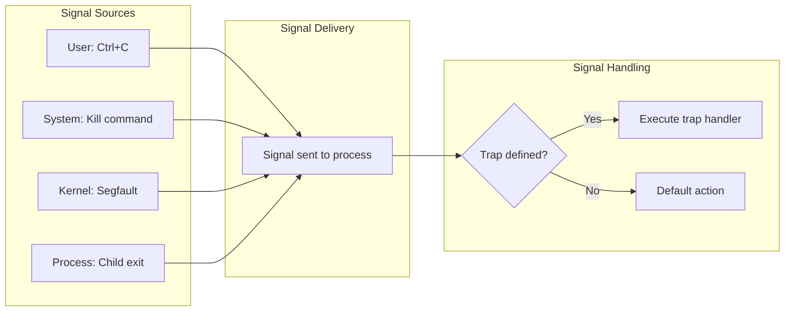
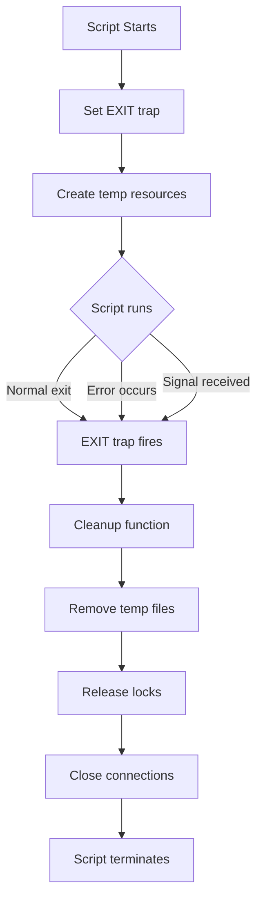
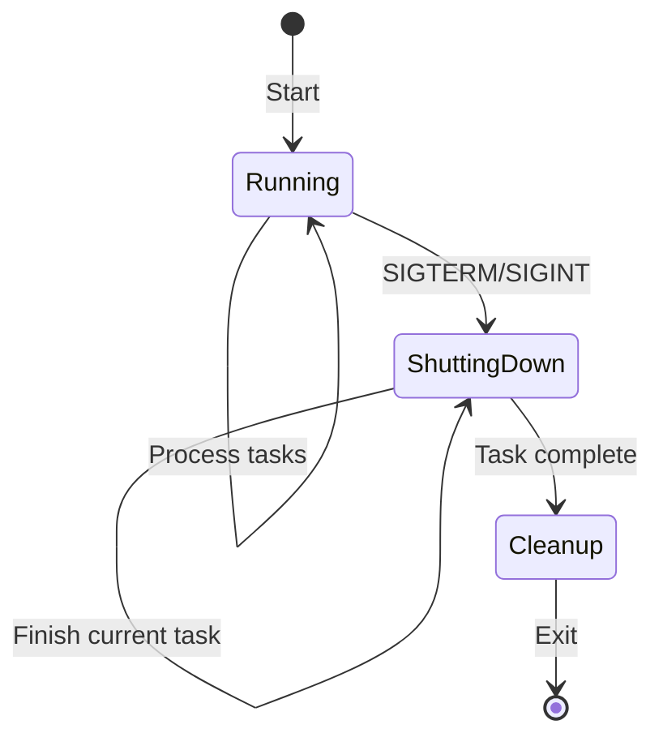
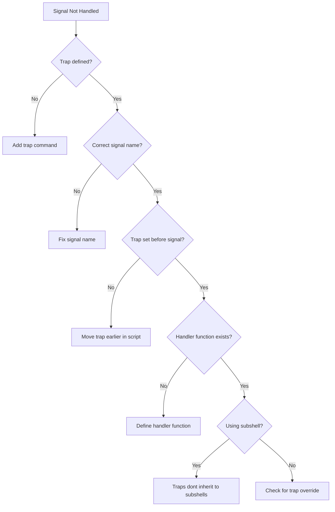

# How to Handle Signal Trapping in Bash

Author: [nawazdhandala](https://www.github.com/nawazdhandala)

Tags: Bash, Shell Scripting, Linux, Signals, Process Management, DevOps

Description: Learn how to use signal trapping in Bash scripts to handle interrupts, perform cleanup operations, and create robust shell applications.

---

Signal trapping is a powerful feature in Bash that allows your scripts to intercept and handle signals sent by the operating system or other processes. This enables graceful shutdowns, proper cleanup of temporary files, and recovery from unexpected interruptions. This guide covers everything you need to know about signal handling in Bash.

---

## Table of Contents

1. Understanding Unix Signals
2. The trap Command Basics
3. Common Signals to Handle
4. Cleanup Operations
5. Advanced Signal Handling
6. Signal Handling Patterns
7. Debugging Signal Issues
8. Best Practices

---

## 1. Understanding Unix Signals

Signals are software interrupts sent to a process to notify it of events. Each signal has a default action, but scripts can override this behavior.



### Common Signals

| Signal | Number | Default Action | Triggered By |
|--------|--------|----------------|--------------|
| SIGHUP | 1 | Terminate | Terminal closed |
| SIGINT | 2 | Terminate | Ctrl+C |
| SIGQUIT | 3 | Core dump | Ctrl+\\ |
| SIGTERM | 15 | Terminate | kill command |
| SIGKILL | 9 | Terminate | kill -9 (cannot be trapped) |
| SIGCHLD | 17 | Ignore | Child process exits |
| SIGUSR1 | 10 | Terminate | User-defined |
| SIGUSR2 | 12 | Terminate | User-defined |

### Viewing Signals

```bash
# List all signals on your system
kill -l

# Output example:
#  1) SIGHUP       2) SIGINT       3) SIGQUIT      4) SIGILL
#  5) SIGTRAP      6) SIGABRT      7) SIGBUS       8) SIGFPE
#  9) SIGKILL     10) SIGUSR1     11) SIGSEGV     12) SIGUSR2
# ...

# Get signal number by name
kill -l SIGTERM  # Returns: 15

# Get signal name by number
kill -l 15  # Returns: TERM
```

---

## 2. The trap Command Basics

The `trap` command sets signal handlers in your script.

### Basic Syntax

```bash
#!/bin/bash

# Syntax: trap 'commands' SIGNALS

# Simple trap for SIGINT (Ctrl+C)
trap 'echo "Caught SIGINT!"' SIGINT

# Your script continues...
echo "Press Ctrl+C to test the trap"
sleep 30
```

### Multiple Signals

```bash
#!/bin/bash

# Handle multiple signals with the same handler
trap 'echo "Script interrupted!"' SIGINT SIGTERM SIGHUP

# Each signal can have different handlers
trap 'echo "Ctrl+C pressed"' SIGINT
trap 'echo "Terminated"' SIGTERM
trap 'echo "Terminal closed"' SIGHUP
```

### Removing Traps

```bash
#!/bin/bash

# Set a trap
trap 'echo "Caught!"' SIGINT

# Remove the trap (restore default behavior)
trap - SIGINT

# Ignore a signal completely
trap '' SIGINT  # Empty string ignores the signal
```

### Viewing Current Traps

```bash
#!/bin/bash

trap 'echo "INT"' SIGINT
trap 'echo "TERM"' SIGTERM

# Display all traps
trap -p

# Display specific trap
trap -p SIGINT
```

---

## 3. Common Signals to Handle

### SIGINT (Ctrl+C)

```bash
#!/bin/bash

# Counter for Ctrl+C presses
ctrl_c_count=0

handle_sigint() {
    ctrl_c_count=$((ctrl_c_count + 1))

    if [[ $ctrl_c_count -eq 1 ]]; then
        echo ""
        echo "Press Ctrl+C again within 3 seconds to exit"
        sleep 3
        ctrl_c_count=0
    else
        echo ""
        echo "Exiting..."
        exit 0
    fi
}

trap handle_sigint SIGINT

echo "Running... Press Ctrl+C to exit"
while true; do
    sleep 1
done
```

### SIGTERM (Graceful Shutdown)

```bash
#!/bin/bash

# Flag to indicate shutdown requested
shutdown_requested=false

handle_sigterm() {
    echo "Shutdown signal received"
    shutdown_requested=true
}

trap handle_sigterm SIGTERM

# Main loop checks shutdown flag
while [[ "$shutdown_requested" == "false" ]]; do
    echo "Working..."
    sleep 2

    if [[ "$shutdown_requested" == "true" ]]; then
        echo "Finishing current work..."
        # Complete any in-progress operations
        sleep 1
        echo "Cleanup complete, exiting"
        exit 0
    fi
done
```

### EXIT (Always Runs)

```bash
#!/bin/bash

# EXIT trap runs when script exits (any reason)
cleanup() {
    echo "Cleanup running..."
    rm -f /tmp/myapp_*.tmp
    echo "Done"
}

trap cleanup EXIT

# These all trigger the EXIT trap:
# - Normal script completion
# - exit command
# - Fatal error (with set -e)
# - Signals (SIGINT, SIGTERM, etc.)

echo "Script running"
exit 0  # Cleanup will run
```

---

## 4. Cleanup Operations

### Temporary File Cleanup

```bash
#!/bin/bash

# Create array to track temp files
declare -a TEMP_FILES

# Function to create tracked temp file
create_temp_file() {
    local tmpfile
    tmpfile=$(mktemp /tmp/myapp_XXXXXX)
    TEMP_FILES+=("$tmpfile")
    echo "$tmpfile"
}

# Cleanup function
cleanup() {
    local exit_code=$?
    echo "Cleaning up temporary files..."

    for file in "${TEMP_FILES[@]}"; do
        if [[ -f "$file" ]]; then
            rm -f "$file"
            echo "  Removed: $file"
        fi
    done

    exit $exit_code
}

trap cleanup EXIT

# Usage
WORK_FILE=$(create_temp_file)
CONFIG_FILE=$(create_temp_file)

echo "Working with temp files:"
echo "  $WORK_FILE"
echo "  $CONFIG_FILE"

# Simulate work
echo "data" > "$WORK_FILE"
sleep 2

# Cleanup runs automatically on exit
```

### Cleanup Flow



### Lock File Management

```bash
#!/bin/bash

LOCK_FILE="/var/run/myapp.lock"

# Cleanup function
cleanup() {
    if [[ -f "$LOCK_FILE" ]]; then
        rm -f "$LOCK_FILE"
        echo "Lock file removed"
    fi
}

# Set trap before creating lock
trap cleanup EXIT

# Create lock file
if [[ -f "$LOCK_FILE" ]]; then
    echo "Another instance is running (lock file exists)"
    exit 1
fi

echo $$ > "$LOCK_FILE"
echo "Lock acquired, PID: $$"

# Main script logic
echo "Working..."
sleep 10

# Lock file removed automatically on exit
```

### Process Cleanup

```bash
#!/bin/bash

# Track background process PIDs
declare -a BG_PIDS

cleanup() {
    echo "Stopping background processes..."
    for pid in "${BG_PIDS[@]}"; do
        if kill -0 "$pid" 2>/dev/null; then
            echo "  Stopping PID $pid"
            kill "$pid" 2>/dev/null
            wait "$pid" 2>/dev/null
        fi
    done
}

trap cleanup EXIT SIGINT SIGTERM

# Start background processes
start_worker() {
    local name="$1"
    (
        while true; do
            echo "[$name] Working..."
            sleep 2
        done
    ) &
    BG_PIDS+=($!)
    echo "Started $name with PID ${BG_PIDS[-1]}"
}

start_worker "worker1"
start_worker "worker2"

# Wait for signal
echo "Main script running, press Ctrl+C to stop"
wait
```

---

## 5. Advanced Signal Handling

### Preserving Exit Codes

```bash
#!/bin/bash

cleanup() {
    # Capture the original exit code FIRST
    local exit_code=$?

    echo "Cleanup running (exit code was: $exit_code)"

    # Perform cleanup
    rm -f /tmp/myapp_*.tmp

    # Exit with the original code
    exit $exit_code
}

trap cleanup EXIT

# Simulate failure
false  # This exits with code 1

# With set -e, script exits here with code 1
# Cleanup runs and preserves the exit code
```

### Signal Forwarding

```bash
#!/bin/bash

# Forward signals to child processes
CHILD_PID=""

cleanup() {
    if [[ -n "$CHILD_PID" ]] && kill -0 "$CHILD_PID" 2>/dev/null; then
        echo "Forwarding signal to child process $CHILD_PID"
        kill -TERM "$CHILD_PID"
        wait "$CHILD_PID"
    fi
}

trap cleanup SIGINT SIGTERM

# Start child process
long_running_command &
CHILD_PID=$!

# Wait for child
wait $CHILD_PID
```

### Re-raising Signals

```bash
#!/bin/bash

handle_sigint() {
    echo "Caught SIGINT, cleaning up..."

    # Perform cleanup
    rm -f /tmp/myapp_*.tmp

    # Remove trap and re-raise signal
    # This ensures the parent process knows we died from SIGINT
    trap - SIGINT
    kill -SIGINT $$
}

trap handle_sigint SIGINT

echo "Running... press Ctrl+C"
sleep 30
```

### ERR and DEBUG Traps

```bash
#!/bin/bash

# ERR trap runs when a command fails (with set -e)
set -e

error_handler() {
    local line_no=$1
    local error_code=$2
    echo "Error on line $line_no (exit code: $error_code)"
}

trap 'error_handler $LINENO $?' ERR

# DEBUG trap runs before each command
debug_handler() {
    echo "DEBUG: About to run: $BASH_COMMAND"
}

trap debug_handler DEBUG

# Example commands
echo "Starting"
ls /nonexistent  # This will trigger ERR trap
echo "This won't run"
```

---

## 6. Signal Handling Patterns

### Graceful Service Shutdown

```bash
#!/bin/bash

# Robust service script pattern

# State variables
running=true
current_task=""

log() {
    echo "[$(date '+%Y-%m-%d %H:%M:%S')] $*"
}

shutdown_handler() {
    log "Shutdown requested"
    running=false

    if [[ -n "$current_task" ]]; then
        log "Waiting for current task to complete: $current_task"
    fi
}

trap shutdown_handler SIGINT SIGTERM

cleanup() {
    log "Final cleanup..."
    rm -f /tmp/service_*.tmp
    log "Service stopped"
}

trap cleanup EXIT

# Main service loop
log "Service started"
while $running; do
    current_task="processing_batch_$(date +%s)"
    log "Starting: $current_task"

    # Simulate work (checking running flag periodically)
    for i in {1..5}; do
        if ! $running; then
            break
        fi
        sleep 1
    done

    log "Completed: $current_task"
    current_task=""

    # Brief pause between tasks
    sleep 1
done

log "Service loop ended"
```

### Service State Machine



### Interactive Script with Undo

```bash
#!/bin/bash

# Track changes for potential rollback
declare -a CHANGES

record_change() {
    CHANGES+=("$1")
}

rollback() {
    echo "Rolling back changes..."

    # Process in reverse order
    for ((i=${#CHANGES[@]}-1; i>=0; i--)); do
        local change="${CHANGES[i]}"
        echo "  Undoing: $change"
        eval "$change"
    done
}

interrupt_handler() {
    echo ""
    echo "Installation interrupted!"
    rollback
    exit 1
}

trap interrupt_handler SIGINT

# Installation steps
echo "Installing..."

# Step 1: Create directory
mkdir -p /tmp/myapp
record_change "rm -rf /tmp/myapp"

# Step 2: Copy files
cp /etc/hosts /tmp/myapp/hosts.bak
record_change "rm -f /tmp/myapp/hosts.bak"

# Step 3: More installation...
sleep 5  # Simulate long operation (press Ctrl+C here to test)

echo "Installation complete"
```

### Timeout with Signal

```bash
#!/bin/bash

timeout_handler() {
    echo "Operation timed out!"
    exit 124  # Standard timeout exit code
}

# Run with timeout
run_with_timeout() {
    local timeout=$1
    shift
    local cmd="$@"

    # Set alarm
    trap timeout_handler SIGALRM

    # Start timer in background
    (
        sleep "$timeout"
        kill -ALRM $$ 2>/dev/null
    ) &
    local timer_pid=$!

    # Run command
    eval "$cmd"
    local result=$?

    # Cancel timer
    kill $timer_pid 2>/dev/null
    wait $timer_pid 2>/dev/null

    return $result
}

# Usage
run_with_timeout 5 "sleep 10"  # Will timeout
echo "Exit code: $?"
```

---

## 7. Debugging Signal Issues

### Debugging with Verbose Traps

```bash
#!/bin/bash

# Verbose signal handler
verbose_trap() {
    local signal=$1
    echo ""
    echo "=== Signal Debug Info ==="
    echo "Signal received: $signal"
    echo "Current PID: $$"
    echo "Parent PID: $PPID"
    echo "Current function: ${FUNCNAME[1]:-main}"
    echo "Line number: $LINENO"
    echo "========================="
}

trap 'verbose_trap SIGINT' SIGINT
trap 'verbose_trap SIGTERM' SIGTERM
trap 'verbose_trap SIGHUP' SIGHUP

echo "PID: $$ - Send signals to test"
echo "  kill -INT $$"
echo "  kill -TERM $$"
echo "  kill -HUP $$"

while true; do
    sleep 1
done
```

### Testing Signal Handlers

```bash
#!/bin/bash

# Test script to verify signal handlers work correctly

test_signal_handler() {
    local script="$1"
    local signal="$2"
    local expected="$3"

    echo "Testing $signal on $script..."

    # Start script in background
    bash "$script" &
    local pid=$!
    sleep 1

    # Send signal
    kill -"$signal" $pid
    sleep 1

    # Check result
    if wait $pid 2>/dev/null; then
        echo "  Script exited cleanly"
    else
        local exit_code=$?
        echo "  Script exited with code: $exit_code"
    fi
}

# Create test script
cat > /tmp/test_script.sh << 'EOF'
#!/bin/bash
trap 'echo "Cleanup!"; exit 0' SIGTERM
while true; do sleep 1; done
EOF

chmod +x /tmp/test_script.sh
test_signal_handler /tmp/test_script.sh TERM "Cleanup!"
```

### Common Signal Issues



---

## 8. Best Practices

### Complete Trap Template

```bash
#!/bin/bash
#
# Robust script with comprehensive signal handling
#

set -euo pipefail

# Global state
declare -a TEMP_FILES=()
declare -a BG_PIDS=()
LOCK_FILE=""
CLEANUP_DONE=false

# Logging
log() {
    echo "[$(date '+%Y-%m-%d %H:%M:%S')] $*" >&2
}

log_error() {
    echo "[$(date '+%Y-%m-%d %H:%M:%S')] ERROR: $*" >&2
}

# Cleanup function (idempotent)
cleanup() {
    # Prevent running twice
    if [[ "$CLEANUP_DONE" == "true" ]]; then
        return
    fi
    CLEANUP_DONE=true

    local exit_code=$?
    log "Running cleanup (exit code: $exit_code)"

    # Stop background processes
    for pid in "${BG_PIDS[@]}"; do
        if kill -0 "$pid" 2>/dev/null; then
            log "Stopping background process: $pid"
            kill -TERM "$pid" 2>/dev/null || true
            wait "$pid" 2>/dev/null || true
        fi
    done

    # Remove temporary files
    for file in "${TEMP_FILES[@]}"; do
        if [[ -f "$file" ]]; then
            log "Removing temp file: $file"
            rm -f "$file"
        fi
    done

    # Release lock
    if [[ -n "$LOCK_FILE" ]] && [[ -f "$LOCK_FILE" ]]; then
        log "Releasing lock: $LOCK_FILE"
        rm -f "$LOCK_FILE"
    fi

    log "Cleanup complete"
    exit $exit_code
}

# Signal handlers
handle_sigint() {
    log "Received SIGINT (Ctrl+C)"
    cleanup
}

handle_sigterm() {
    log "Received SIGTERM"
    cleanup
}

handle_sighup() {
    log "Received SIGHUP (terminal closed)"
    cleanup
}

handle_error() {
    local line=$1
    local code=$2
    log_error "Error on line $line (exit code: $code)"
    cleanup
}

# Set up all traps
trap cleanup EXIT
trap handle_sigint SIGINT
trap handle_sigterm SIGTERM
trap handle_sighup SIGHUP
trap 'handle_error $LINENO $?' ERR

# Helper functions
create_temp_file() {
    local tmpfile
    tmpfile=$(mktemp)
    TEMP_FILES+=("$tmpfile")
    echo "$tmpfile"
}

acquire_lock() {
    local lock_path="$1"

    if [[ -f "$lock_path" ]]; then
        local other_pid
        other_pid=$(cat "$lock_path")
        if kill -0 "$other_pid" 2>/dev/null; then
            log_error "Another instance is running (PID: $other_pid)"
            exit 1
        else
            log "Removing stale lock file"
            rm -f "$lock_path"
        fi
    fi

    echo $$ > "$lock_path"
    LOCK_FILE="$lock_path"
    log "Lock acquired: $lock_path"
}

# Main function
main() {
    log "Script started (PID: $$)"

    # Acquire lock
    acquire_lock "/tmp/myapp.lock"

    # Create temp file
    local work_file
    work_file=$(create_temp_file)
    log "Using temp file: $work_file"

    # Main logic here
    log "Performing work..."
    sleep 5

    log "Script completed successfully"
}

main "$@"
```

### Signal Handling Guidelines

| Do | Do Not |
|----|--------|
| Set traps early in script | Set traps after operations begin |
| Use EXIT trap for cleanup | Rely only on SIGTERM |
| Make cleanup idempotent | Assume cleanup runs once |
| Preserve exit codes | Ignore original exit status |
| Test signal handlers | Assume they work |
| Use named functions | Use inline commands for complex logic |
| Log signal receipt | Silently handle signals |
| Handle SIGINT and SIGTERM | Only handle one signal |

### Subshell Considerations

```bash
#!/bin/bash

# Traps are NOT inherited by subshells

cleanup() {
    echo "Cleanup from PID $$"
}

trap cleanup EXIT

echo "Parent PID: $$"

# Subshell has its own trap (or none)
(
    # This subshell does NOT inherit the parent trap
    echo "Subshell PID: $$"

    # Must set trap in subshell if needed
    trap 'echo "Subshell cleanup"' EXIT

    exit 0
)

# Command substitution is also a subshell
result=$(
    # No inherited trap here either
    echo "command substitution"
)
```

---

## Quick Reference

```bash
# Set trap
trap 'handler' SIGNAL

# Multiple signals
trap 'handler' SIGINT SIGTERM

# Remove trap
trap - SIGNAL

# Ignore signal
trap '' SIGNAL

# View traps
trap -p

# Common signals
SIGINT   # Ctrl+C
SIGTERM  # kill command
SIGHUP   # Terminal closed
EXIT     # Script exit (any reason)
ERR      # Command failure (with set -e)
```

---

## Key Takeaways

1. **Always use EXIT trap for cleanup** - It runs regardless of how the script exits
2. **Handle both SIGINT and SIGTERM** - Users expect Ctrl+C and kill to work gracefully
3. **Make cleanup idempotent** - Cleanup might run multiple times in edge cases
4. **Preserve exit codes** - Capture $? at the start of cleanup handlers
5. **Set traps early** - Before creating resources that need cleanup
6. **Test your signal handlers** - Send signals manually to verify behavior
7. **Remember subshell limitations** - Traps do not inherit to subshells
8. **Log signal receipt** - Helps debugging when things go wrong

---

*Need to monitor your scripts and services in production? [OneUptime](https://oneuptime.com) provides comprehensive monitoring solutions that can alert you when your processes crash, hang, or behave unexpectedly.*
