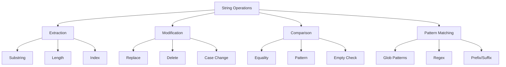
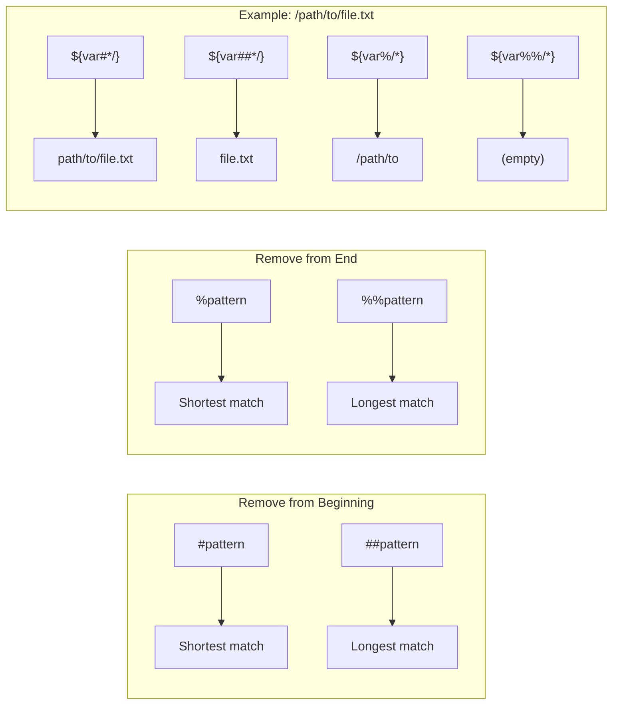
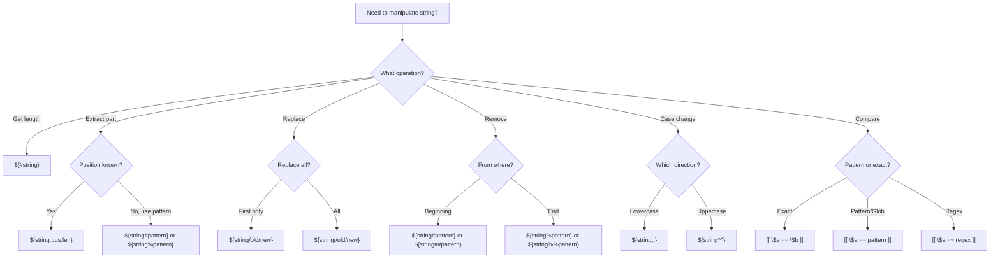

# How to Handle String Manipulation in Bash

Author: [nawazdhandala](https://www.github.com/nawazdhandala)

Tags: Bash, Shell Scripting, String Manipulation, Linux, DevOps, Automation

Description: A comprehensive guide to string manipulation in Bash scripts covering extraction, replacement, comparison, and advanced pattern matching techniques.

---

> String manipulation is one of the most common tasks in shell scripting. Whether you are parsing log files, processing configuration data, or building dynamic commands, understanding Bash string operations is essential for effective automation.

Bash provides powerful built-in string manipulation capabilities that eliminate the need for external tools like `sed` or `awk` in many cases. This guide covers all the essential techniques.

---

## String Operations Overview



---

## Basic String Operations

### Getting String Length

```bash
#!/bin/bash
# Get the length of a string using parameter expansion

my_string="Hello, World!"

# Method 1: Using ${#variable}
length=${#my_string}
echo "Length: $length"  # Output: Length: 13

# Method 2: Using expr (older, less efficient)
length=$(expr length "$my_string")
echo "Length: $length"  # Output: Length: 13

# Practical example: Validate input length
validate_password() {
    local password="$1"
    local min_length=8

    if [[ ${#password} -lt $min_length ]]; then
        echo "Error: Password must be at least $min_length characters"
        return 1
    fi
    echo "Password length is valid"
    return 0
}

validate_password "short"    # Error
validate_password "longpassword123"  # Valid
```

### Extracting Substrings

```bash
#!/bin/bash
# Extract portions of strings using parameter expansion

my_string="Hello, World!"

# Syntax: ${string:position:length}

# Extract from position 0, length 5
echo "${my_string:0:5}"   # Output: Hello

# Extract from position 7
echo "${my_string:7}"     # Output: World!

# Extract last 6 characters (negative index)
echo "${my_string: -6}"   # Output: World!
# Note: Space before minus is required

# Extract 5 characters starting from 6th from end
echo "${my_string: -6:5}" # Output: World

# Practical example: Parse a timestamp
timestamp="2026-01-24T10:30:45"

year="${timestamp:0:4}"
month="${timestamp:5:2}"
day="${timestamp:8:2}"
hour="${timestamp:11:2}"
minute="${timestamp:14:2}"
second="${timestamp:17:2}"

echo "Year: $year, Month: $month, Day: $day"
echo "Time: $hour:$minute:$second"
```

---

## String Replacement

### Basic Replacement

```bash
#!/bin/bash
# Replace patterns within strings

filename="document.txt.backup.txt"

# Replace first occurrence
# Syntax: ${string/pattern/replacement}
echo "${filename/txt/pdf}"
# Output: document.pdf.backup.txt

# Replace all occurrences
# Syntax: ${string//pattern/replacement}
echo "${filename//txt/pdf}"
# Output: document.pdf.backup.pdf

# Replace only if pattern matches at beginning
# Syntax: ${string/#pattern/replacement}
path="/home/user/documents"
echo "${path/#\/home/\/Users}"
# Output: /Users/user/documents

# Replace only if pattern matches at end
# Syntax: ${string/%pattern/replacement}
file="image.jpeg"
echo "${file/%.jpeg/.png}"
# Output: image.png
```

### Practical Replacement Examples

```bash
#!/bin/bash
# Common string replacement patterns

# Convert spaces to underscores in filenames
filename="my document file.txt"
safe_filename="${filename// /_}"
echo "$safe_filename"  # Output: my_document_file.txt

# Remove all digits from a string
data="abc123def456"
letters_only="${data//[0-9]/}"
echo "$letters_only"  # Output: abcdef

# Sanitize user input - remove special characters
user_input="Hello<script>alert('xss')</script>World"
sanitized="${user_input//[<>\'\"]/}"
echo "$sanitized"  # Output: Helloscriptalert(xss)/scriptWorld

# Replace multiple consecutive spaces with single space
messy_text="too    many     spaces"
# This requires a loop or external tool
clean_text="$messy_text"
while [[ "$clean_text" == *"  "* ]]; do
    clean_text="${clean_text//  / }"
done
echo "$clean_text"  # Output: too many spaces
```

---

## Removing Patterns

### Prefix and Suffix Removal

```bash
#!/bin/bash
# Remove patterns from beginning or end of strings

filepath="/home/user/documents/report.txt"

# Remove shortest match from beginning
# Syntax: ${string#pattern}
echo "${filepath#*/}"
# Output: home/user/documents/report.txt

# Remove longest match from beginning
# Syntax: ${string##pattern}
echo "${filepath##*/}"
# Output: report.txt (basename)

# Remove shortest match from end
# Syntax: ${string%pattern}
echo "${filepath%/*}"
# Output: /home/user/documents (dirname)

# Remove longest match from end
# Syntax: ${string%%pattern}
echo "${filepath%%/*}"
# Output: (empty - removes everything after first /)

# Practical example: File extension operations
filename="archive.tar.gz"

# Get extension (remove everything up to last dot)
extension="${filename##*.}"
echo "Extension: $extension"  # Output: gz

# Get full extension (tar.gz)
full_extension="${filename#*.}"
echo "Full extension: $full_extension"  # Output: tar.gz

# Get basename without extension
basename="${filename%.*}"
echo "Basename: $basename"  # Output: archive.tar

# Get basename without full extension
basename_short="${filename%%.*}"
echo "Short basename: $basename_short"  # Output: archive
```

### Visual Guide to Pattern Removal



---

## Case Conversion

```bash
#!/bin/bash
# Convert string case using parameter expansion (Bash 4.0+)

text="Hello World"

# Convert to lowercase
# Single character: ${var,}
# Entire string: ${var,,}
echo "${text,,}"   # Output: hello world
echo "${text,}"    # Output: hello World (first char only)

# Convert to uppercase
# Single character: ${var^}
# Entire string: ${var^^}
echo "${text^^}"   # Output: HELLO WORLD
echo "${text^}"    # Output: Hello World (first char only)

# Toggle case
# Single character: ${var~}
# Entire string: ${var~~}
echo "${text~~}"   # Output: hELLO wORLD

# Practical example: Case-insensitive comparison
compare_case_insensitive() {
    local str1="${1,,}"
    local str2="${2,,}"

    if [[ "$str1" == "$str2" ]]; then
        echo "Strings are equal (case-insensitive)"
        return 0
    else
        echo "Strings are different"
        return 1
    fi
}

compare_case_insensitive "Hello" "HELLO"  # Equal
compare_case_insensitive "Hello" "World"  # Different

# Practical example: Normalize user input
normalize_input() {
    local input="$1"

    # Trim whitespace, convert to lowercase
    input="${input#"${input%%[![:space:]]*}"}"  # Trim leading
    input="${input%"${input##*[![:space:]]}"}"  # Trim trailing
    input="${input,,}"  # Lowercase

    echo "$input"
}

result=$(normalize_input "  HELLO WORLD  ")
echo "Normalized: '$result'"  # Output: Normalized: 'hello world'
```

---

## String Comparison

### Basic Comparisons

```bash
#!/bin/bash
# Compare strings in Bash

str1="hello"
str2="world"
str3="hello"

# Equality comparison
if [[ "$str1" == "$str3" ]]; then
    echo "$str1 equals $str3"
fi

# Inequality comparison
if [[ "$str1" != "$str2" ]]; then
    echo "$str1 does not equal $str2"
fi

# Lexicographic comparison (alphabetical order)
if [[ "$str1" < "$str2" ]]; then
    echo "$str1 comes before $str2"
fi

# Check if string is empty
empty_string=""
if [[ -z "$empty_string" ]]; then
    echo "String is empty"
fi

# Check if string is not empty
if [[ -n "$str1" ]]; then
    echo "String is not empty"
fi
```

### Pattern Matching in Comparisons

```bash
#!/bin/bash
# Pattern matching with == and =~

filename="document.pdf"

# Glob pattern matching with ==
if [[ "$filename" == *.pdf ]]; then
    echo "This is a PDF file"
fi

# Match multiple patterns
if [[ "$filename" == *.pdf || "$filename" == *.doc ]]; then
    echo "This is a document file"
fi

# Extended glob patterns (requires shopt -s extglob)
shopt -s extglob
if [[ "$filename" == *.@(pdf|doc|docx) ]]; then
    echo "This is a document file"
fi

# Regular expression matching with =~
email="user@example.com"
email_regex="^[A-Za-z0-9._%+-]+@[A-Za-z0-9.-]+\.[A-Za-z]{2,}$"

if [[ "$email" =~ $email_regex ]]; then
    echo "Valid email format"
else
    echo "Invalid email format"
fi

# Capture groups with regex
date_string="2026-01-24"
if [[ "$date_string" =~ ^([0-9]{4})-([0-9]{2})-([0-9]{2})$ ]]; then
    echo "Year: ${BASH_REMATCH[1]}"
    echo "Month: ${BASH_REMATCH[2]}"
    echo "Day: ${BASH_REMATCH[3]}"
fi
```

---

## String Splitting

### Splitting into Arrays

```bash
#!/bin/bash
# Split strings into arrays

# Method 1: Using IFS (Internal Field Separator)
csv_line="apple,banana,cherry,date"

# Save original IFS and set new delimiter
IFS=',' read -ra fruits <<< "$csv_line"

# Access individual elements
echo "First fruit: ${fruits[0]}"   # Output: apple
echo "All fruits: ${fruits[@]}"    # Output: apple banana cherry date
echo "Number of fruits: ${#fruits[@]}"  # Output: 4

# Method 2: Using parameter expansion and loop
path="/home/user/documents/file.txt"

# Split by /
IFS='/' read -ra path_parts <<< "$path"
for part in "${path_parts[@]}"; do
    [[ -n "$part" ]] && echo "Part: $part"
done

# Method 3: Split into lines
multiline="line1
line2
line3"

while IFS= read -r line; do
    echo "Line: $line"
done <<< "$multiline"

# Practical example: Parse key-value pairs
config="host=localhost;port=8080;debug=true"

IFS=';' read -ra pairs <<< "$config"
declare -A settings

for pair in "${pairs[@]}"; do
    IFS='=' read -r key value <<< "$pair"
    settings["$key"]="$value"
done

echo "Host: ${settings[host]}"
echo "Port: ${settings[port]}"
echo "Debug: ${settings[debug]}"
```

---

## String Concatenation

```bash
#!/bin/bash
# Concatenate strings in Bash

str1="Hello"
str2="World"

# Method 1: Direct concatenation
result="$str1 $str2"
echo "$result"  # Output: Hello World

# Method 2: Using curly braces (when needed)
prefix="file"
suffix="_backup"
filename="${prefix}${suffix}.txt"
echo "$filename"  # Output: file_backup.txt

# Method 3: Append to variable
message="Starting "
message+="the "
message+="process"
echo "$message"  # Output: Starting the process

# Method 4: Using printf
formatted=$(printf "%s-%s-%s" "2026" "01" "24")
echo "$formatted"  # Output: 2026-01-24

# Practical example: Build a URL
build_url() {
    local protocol="${1:-https}"
    local host="$2"
    local port="$3"
    local path="${4:-/}"

    local url="${protocol}://${host}"

    # Add port if not standard
    if [[ -n "$port" && "$port" != "80" && "$port" != "443" ]]; then
        url+=":${port}"
    fi

    url+="$path"
    echo "$url"
}

echo $(build_url "https" "example.com" "8080" "/api/v1")
# Output: https://example.com:8080/api/v1
```

---

## Advanced String Operations

### Default Values and Variable Expansion

```bash
#!/bin/bash
# Handle unset or empty variables

# Use default value if variable is unset or empty
# Syntax: ${var:-default}
echo "${UNDEFINED_VAR:-default_value}"  # Output: default_value

# Use default and assign if variable is unset or empty
# Syntax: ${var:=default}
echo "${MY_VAR:=assigned_default}"  # Output: assigned_default
echo "$MY_VAR"  # Output: assigned_default (now set)

# Use alternative value if variable IS set
# Syntax: ${var:+alternative}
SET_VAR="exists"
echo "${SET_VAR:+variable is set}"  # Output: variable is set
echo "${UNSET_VAR:+variable is set}"  # Output: (empty)

# Error if variable is unset
# Syntax: ${var:?error message}
# ${REQUIRED_VAR:?Error: REQUIRED_VAR must be set}  # Would exit with error

# Practical example: Configuration with defaults
configure_app() {
    local host="${APP_HOST:-localhost}"
    local port="${APP_PORT:-8080}"
    local log_level="${LOG_LEVEL:-info}"
    local debug="${DEBUG_MODE:+--debug}"

    echo "Starting app on $host:$port"
    echo "Log level: $log_level"
    [[ -n "$debug" ]] && echo "Debug mode enabled"
}

export DEBUG_MODE=1
configure_app
```

### Indirect Variable Reference

```bash
#!/bin/bash
# Access variables dynamically using indirect reference

# Syntax: ${!var}
prefix="CONFIG"
var_name="${prefix}_HOST"
CONFIG_HOST="production.example.com"

echo "${!var_name}"  # Output: production.example.com

# Practical example: Dynamic configuration loading
load_config() {
    local env="$1"

    # Define environment-specific configs
    DEV_HOST="localhost"
    DEV_PORT="3000"
    DEV_DEBUG="true"

    PROD_HOST="api.example.com"
    PROD_PORT="443"
    PROD_DEBUG="false"

    # Dynamically access based on environment
    local host_var="${env^^}_HOST"
    local port_var="${env^^}_PORT"
    local debug_var="${env^^}_DEBUG"

    echo "Environment: $env"
    echo "Host: ${!host_var}"
    echo "Port: ${!port_var}"
    echo "Debug: ${!debug_var}"
}

load_config "dev"
echo "---"
load_config "prod"
```

---

## String Manipulation Decision Tree



---

## Practical Examples

### Log File Parser

```bash
#!/bin/bash
# Parse and analyze log entries

parse_log_entry() {
    local entry="$1"

    # Example log format: 2026-01-24 10:30:45 [ERROR] Failed to connect to database

    # Extract timestamp
    local timestamp="${entry:0:19}"

    # Extract log level
    if [[ "$entry" =~ \[([A-Z]+)\] ]]; then
        local level="${BASH_REMATCH[1]}"
    fi

    # Extract message (everything after log level)
    local message="${entry##*] }"

    echo "Timestamp: $timestamp"
    echo "Level: $level"
    echo "Message: $message"
}

# Count errors in a log file
count_log_levels() {
    local log_content="$1"
    local -A counts

    while IFS= read -r line; do
        if [[ "$line" =~ \[([A-Z]+)\] ]]; then
            local level="${BASH_REMATCH[1]}"
            ((counts[$level]++))
        fi
    done <<< "$log_content"

    for level in "${!counts[@]}"; do
        echo "$level: ${counts[$level]}"
    done
}

# Example usage
log_entry="2026-01-24 10:30:45 [ERROR] Failed to connect to database"
parse_log_entry "$log_entry"
```

### URL Parser

```bash
#!/bin/bash
# Parse URL components

parse_url() {
    local url="$1"

    # Extract protocol
    local protocol="${url%%://*}"
    local remainder="${url#*://}"

    # Extract host and path
    local host_port="${remainder%%/*}"
    local path="/${remainder#*/}"
    [[ "$path" == "/$remainder" ]] && path="/"

    # Extract host and port
    local host="${host_port%%:*}"
    local port="${host_port##*:}"
    [[ "$port" == "$host" ]] && port=""

    # Extract query string
    local query=""
    if [[ "$path" == *"?"* ]]; then
        query="${path#*\?}"
        path="${path%%\?*}"
    fi

    echo "Protocol: $protocol"
    echo "Host: $host"
    echo "Port: ${port:-default}"
    echo "Path: $path"
    echo "Query: ${query:-none}"
}

parse_url "https://api.example.com:8080/v1/users?page=1&limit=10"
```

---

## Best Practices

### 1. Always Quote Variables

```bash
# Bad - can break with spaces or special characters
filename=$user_input
echo $filename

# Good - preserves spaces and special characters
filename="$user_input"
echo "$filename"
```

### 2. Use Parameter Expansion Over External Tools

```bash
# Less efficient - spawns subprocess
basename=$(basename "$filepath")
dirname=$(dirname "$filepath")

# More efficient - pure Bash
basename="${filepath##*/}"
dirname="${filepath%/*}"
```

### 3. Check for Empty Strings

```bash
# Always validate input
process_input() {
    local input="$1"

    if [[ -z "$input" ]]; then
        echo "Error: Input cannot be empty" >&2
        return 1
    fi

    # Process input
    echo "Processing: $input"
}
```

### 4. Use Meaningful Variable Names

```bash
# Bad
s="Hello World"
l=${#s}

# Good
greeting_message="Hello World"
message_length=${#greeting_message}
```

---

## Conclusion

Bash string manipulation provides powerful tools for text processing without external dependencies. Key takeaways:

- Use parameter expansion for efficient string operations
- Pattern removal with `#`, `##`, `%`, `%%` handles most extraction needs
- Regular expressions with `=~` enable complex pattern matching
- Always quote variables to prevent word splitting issues
- Prefer built-in operations over external commands for performance

Master these techniques to write more efficient and maintainable shell scripts.

---

*Need to monitor your shell scripts in production? [OneUptime](https://oneuptime.com) provides comprehensive monitoring and alerting for all your automation workflows.*
