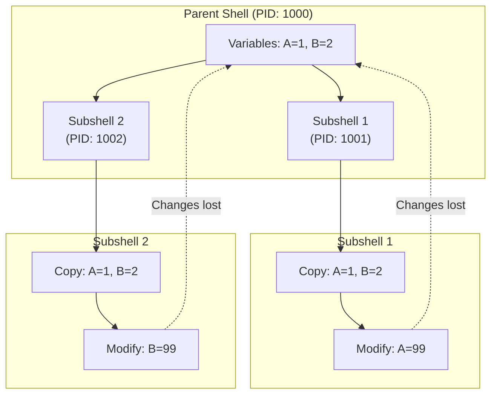
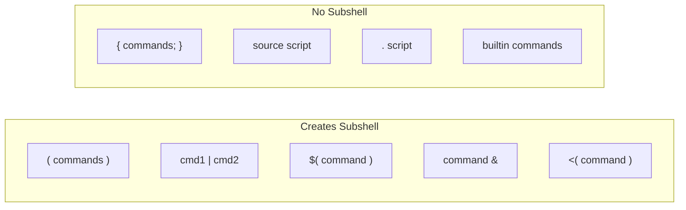
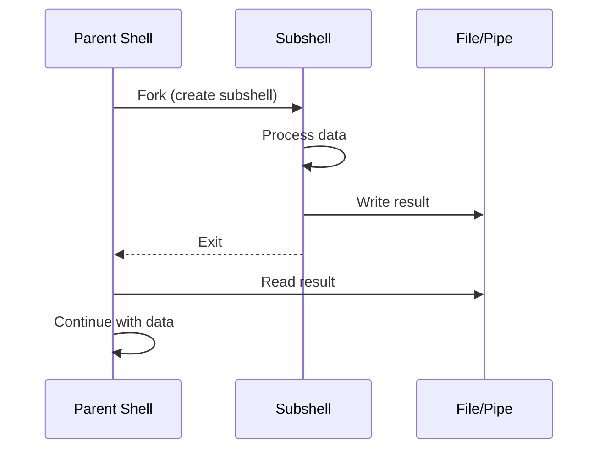
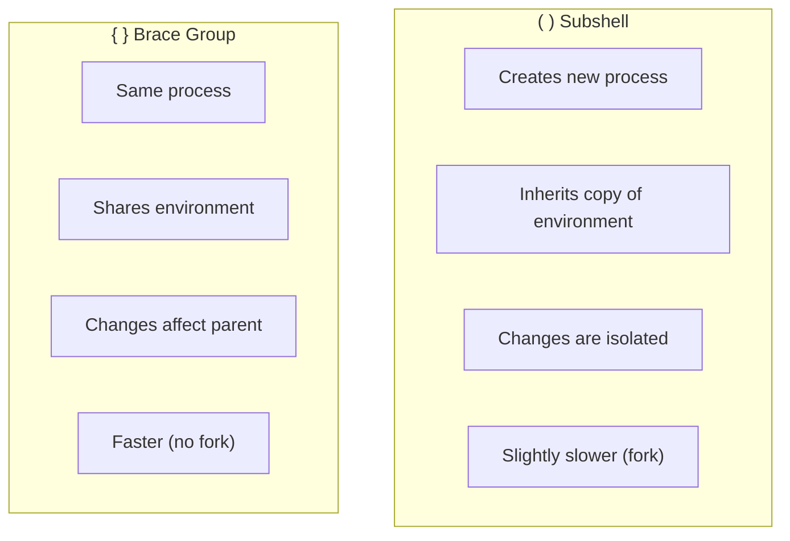

# How to Handle Subshells in Bash Scripts

Author: [nawazdhandala](https://www.github.com/nawazdhandala)

Tags: Bash, Shell Scripting, Subshells, Linux, Process Management, Pipelines, Command Substitution

Description: Learn how subshells work in Bash, when they are created automatically, and techniques to control variable scope and process isolation.

---

> Subshells in Bash create isolated execution environments that can both help and hinder your scripts. Understanding when subshells are created and how they affect variable scope is essential for writing reliable shell scripts.

Mastering subshells helps you avoid subtle bugs and leverage process isolation intentionally.

---

## Overview



---

## What Is a Subshell?

### Basic Definition

```bash
#!/bin/bash
# A subshell is a child process that inherits a copy of the parent's environment

echo "Parent PID: $$"
echo "Parent BASHPID: $BASHPID"

# Create explicit subshell with parentheses
(
    echo "Subshell PID: $$"        # Same as parent (historical reasons)
    echo "Subshell BASHPID: $BASHPID"  # Different - actual subshell PID
)

# $$ always returns the original shell's PID
# $BASHPID returns the current process's PID (Bash 4+)
```

### Detecting Subshells

```bash
#!/bin/bash
# Function to detect if running in a subshell

in_subshell() {
    if [[ $$ != $BASHPID ]]; then
        echo "Running in subshell (BASHPID: $BASHPID, original: $$)"
        return 0
    else
        echo "Running in main shell (PID: $$)"
        return 1
    fi
}

echo "=== Main Shell ==="
in_subshell

echo -e "\n=== Explicit Subshell ==="
( in_subshell )

echo -e "\n=== Pipeline ==="
echo "test" | in_subshell

echo -e "\n=== Command Substitution ==="
result=$(in_subshell)
echo "$result"
```

---

## When Subshells Are Created

### Explicit Subshells (Parentheses)

```bash
#!/bin/bash
# Parentheses create an explicit subshell

counter=0

# Everything inside () runs in a subshell
(
    counter=100
    cd /tmp
    echo "In subshell: counter=$counter, pwd=$(pwd)"
)

# Parent environment is unchanged
echo "After subshell: counter=$counter, pwd=$(pwd)"
```

### Pipeline Commands

```bash
#!/bin/bash
# Each command in a pipeline runs in its own subshell

count=0

# This WON'T work as expected
echo -e "one\ntwo\nthree" | while read -r line; do
    count=$((count + 1))
    echo "Read: $line, count=$count"
done

echo "Final count: $count"  # Still 0!

# The while loop ran in a subshell due to the pipe
# Its modifications to $count were lost
```

### Command Substitution

```bash
#!/bin/bash
# $() and backticks create subshells

var="original"

# Command substitution runs in a subshell
result=$(
    var="modified"
    echo "Inside: var=$var"
)

echo "Result: $result"
echo "Outside: var=$var"  # Still "original"
```

### Process Substitution

```bash
#!/bin/bash
# <() and >() create subshells

# Process substitution - commands run in subshells
diff <(ls /dir1) <(ls /dir2)

# Reading from process substitution
while read -r line; do
    echo "Line: $line"
done < <(echo -e "a\nb\nc")

# The commands inside <() run in subshells
# But the while loop runs in the current shell
```

---

## Subshell Creation Methods



---

## Avoiding Subshell Pitfalls

### Pipeline Variable Modification

```bash
#!/bin/bash
# Problem: Variables modified in pipeline are lost

# BAD - modification lost
count=0
cat file.txt | while read -r line; do
    count=$((count + 1))
done
echo "Count: $count"  # Always 0

# SOLUTION 1: Process substitution
count=0
while read -r line; do
    count=$((count + 1))
done < <(cat file.txt)
echo "Count: $count"  # Correct count

# SOLUTION 2: Here string (for simple cases)
count=0
while read -r line; do
    count=$((count + 1))
done <<< "$(cat file.txt)"
echo "Count: $count"  # Correct count

# SOLUTION 3: lastpipe option (Bash 4.2+)
shopt -s lastpipe
count=0
cat file.txt | while read -r line; do
    count=$((count + 1))
done
echo "Count: $count"  # Now works!
```

### Preserving Working Directory

```bash
#!/bin/bash
# Subshells isolate directory changes

original_dir=$(pwd)

# BAD - cd in main shell affects everything
cd /tmp
# ... do work ...
cd "$original_dir"  # Must remember to change back

# GOOD - use subshell to isolate
(
    cd /tmp
    # ... do work ...
    # No need to cd back - subshell ends and we're back
)
pwd  # Still in original directory

# GOOD - use pushd/popd
pushd /tmp >/dev/null
# ... do work ...
popd >/dev/null
```

### Returning Data from Subshells

```bash
#!/bin/bash
# Techniques to get data out of subshells

# Method 1: Standard output
get_data() {
    echo "result_value"
}
data=$(get_data)

# Method 2: Multiple values via structured output
get_multi() {
    echo "name=John"
    echo "age=30"
    echo "city=NYC"
}

declare -A result
while IFS='=' read -r key value; do
    result["$key"]="$value"
done < <(get_multi)

echo "Name: ${result[name]}, Age: ${result[age]}"

# Method 3: Temporary file
process_in_subshell() {
    local temp_file
    temp_file=$(mktemp)

    (
        # Do complex processing in subshell
        echo "processed_data" > "$temp_file"
    )

    # Read result in parent
    cat "$temp_file"
    rm "$temp_file"
}

# Method 4: Named pipe (FIFO)
setup_communication() {
    local fifo="/tmp/myfifo_$$"
    mkfifo "$fifo"

    # Subshell writes to pipe
    (
        echo "data from subshell" > "$fifo"
    ) &

    # Parent reads from pipe
    read -r data < "$fifo"
    echo "Received: $data"

    rm "$fifo"
}
```

---

## Subshell Communication Flow



---

## Using Subshells Intentionally

### Isolating Environment Changes

```bash
#!/bin/bash
# Use subshells to prevent side effects

# Temporarily change environment
(
    export PATH="/custom/path:$PATH"
    export DEBUG=1

    # Run command with modified environment
    ./my_program
)
# PATH and DEBUG are back to original values

# Temporarily change shell options
(
    set -e  # Exit on error
    set -u  # Error on undefined variables

    # Strict mode only in subshell
    risky_operation
)
# Options are back to normal
```

### Parallel Execution

```bash
#!/bin/bash
# Run multiple tasks in parallel using subshells

run_parallel() {
    local pids=()

    # Start background subshells
    (
        echo "Task 1 starting"
        sleep 2
        echo "Task 1 done"
    ) &
    pids+=($!)

    (
        echo "Task 2 starting"
        sleep 1
        echo "Task 2 done"
    ) &
    pids+=($!)

    (
        echo "Task 3 starting"
        sleep 3
        echo "Task 3 done"
    ) &
    pids+=($!)

    # Wait for all to complete
    for pid in "${pids[@]}"; do
        wait "$pid"
    done

    echo "All tasks complete"
}

run_parallel
```

### Resource Cleanup

```bash
#!/bin/bash
# Subshells for automatic cleanup

process_with_cleanup() {
    (
        # Create temporary resources
        temp_dir=$(mktemp -d)
        temp_file=$(mktemp)

        # Set trap for cleanup
        trap "rm -rf '$temp_dir' '$temp_file'" EXIT

        # Do work
        echo "Working in $temp_dir"
        touch "$temp_dir/file1" "$temp_dir/file2"

        # Simulate error
        if [[ "$1" == "fail" ]]; then
            exit 1
        fi

        echo "Work complete"
    )

    local exit_code=$?

    if [[ $exit_code -ne 0 ]]; then
        echo "Subshell failed, but cleanup still happened"
    fi

    return $exit_code
}

process_with_cleanup "success"
process_with_cleanup "fail"
```

---

## Brace Groups vs Subshells

### Understanding the Difference

```bash
#!/bin/bash
# { } runs in current shell, ( ) creates subshell

var="original"

# Brace group - runs in current shell
{
    var="modified_by_braces"
    echo "In braces: var=$var"
}
echo "After braces: var=$var"  # "modified_by_braces"

var="original"

# Parentheses - runs in subshell
(
    var="modified_by_parens"
    echo "In parens: var=$var"
)
echo "After parens: var=$var"  # "original" (unchanged)
```

### When to Use Each

```bash
#!/bin/bash
# Use brace groups for grouping without isolation

# Redirect multiple commands
{
    echo "Line 1"
    echo "Line 2"
    echo "Line 3"
} > output.txt

# Compound command with shared exit status
{
    cmd1 &&
    cmd2 &&
    cmd3
} || echo "One of the commands failed"

# Use subshells for isolation
(
    cd /different/directory
    source different_environment.sh
    run_isolated_command
)
# Back to original state
```

---

## Comparison Table



---

## Advanced Subshell Patterns

### Coprocess Communication

```bash
#!/bin/bash
# Coprocesses for bidirectional communication (Bash 4+)

# Start a coprocess
coproc WORKER {
    while read -r input; do
        echo "Processed: $input"
    done
}

# Write to coprocess
echo "data1" >&"${WORKER[1]}"
echo "data2" >&"${WORKER[1]}"

# Read from coprocess
read -r result1 <&"${WORKER[0]}"
read -r result2 <&"${WORKER[0]}"

echo "Result 1: $result1"
echo "Result 2: $result2"

# Close and wait
exec {WORKER[1]}>&-
wait "$WORKER_PID"
```

### Subshell Job Control

```bash
#!/bin/bash
# Managing multiple subshell jobs

declare -A jobs

start_job() {
    local name="$1"
    local command="$2"

    (
        eval "$command"
    ) &

    jobs["$name"]=$!
    echo "Started job '$name' with PID ${jobs[$name]}"
}

wait_job() {
    local name="$1"
    local pid="${jobs[$name]}"

    if [[ -n "$pid" ]]; then
        wait "$pid"
        local status=$?
        echo "Job '$name' completed with status $status"
        unset "jobs[$name]"
        return $status
    fi
}

wait_all_jobs() {
    for name in "${!jobs[@]}"; do
        wait_job "$name"
    done
}

# Usage
start_job "download" "sleep 2 && echo 'Download complete'"
start_job "process" "sleep 3 && echo 'Processing complete'"
start_job "upload" "sleep 1 && echo 'Upload complete'"

echo "All jobs started, waiting..."
wait_all_jobs
echo "All jobs finished"
```

### Error Handling in Subshells

```bash
#!/bin/bash
# Proper error handling with subshells

run_with_error_handling() {
    local output
    local exit_code

    # Capture both output and exit code
    output=$(
        set -e  # Exit on first error

        echo "Step 1"
        potentially_failing_command
        echo "Step 2"
    ) 2>&1
    exit_code=$?

    if [[ $exit_code -ne 0 ]]; then
        echo "Subshell failed with code $exit_code"
        echo "Output was: $output"
        return 1
    fi

    echo "Success: $output"
    return 0
}

# Alternative: Using errexit and pipefail
strict_subshell() {
    (
        set -euo pipefail

        # All commands here will cause immediate exit on failure
        command1
        command2 | command3
        command4
    )
}
```

---

## Common Gotchas

### Exit in Subshell

```bash
#!/bin/bash
# exit in subshell only exits the subshell

echo "Starting"

(
    echo "In subshell"
    exit 1  # Only exits subshell, not script
    echo "Never reached"
)

echo "Script continues after subshell exit"
echo "Subshell exit code was: $?"
```

### Variable Export

```bash
#!/bin/bash
# Exported variables are inherited but changes don't propagate back

export MY_VAR="parent_value"

(
    echo "Subshell sees: $MY_VAR"
    export MY_VAR="child_value"
    echo "Subshell changed to: $MY_VAR"

    # Even starting a new process shows the subshell's value
    bash -c 'echo "Nested sees: $MY_VAR"'
)

echo "Parent still has: $MY_VAR"  # "parent_value"
```

### Function Scope

```bash
#!/bin/bash
# Functions defined in subshells don't exist in parent

(
    my_func() {
        echo "I exist only in subshell"
    }
    my_func
)

# This will fail - function doesn't exist
my_func 2>/dev/null || echo "Function not found in parent"

# To define function for subshell execution:
my_outer_func() {
    echo "I'm defined in parent"
}

(
    # Can call parent's function
    my_outer_func
)
```

---

## Best Practices

1. **Use process substitution** instead of pipes when modifying variables
2. **Use subshells intentionally** for isolation and cleanup
3. **Prefer brace groups** when isolation is not needed
4. **Always handle subshell exit codes** when they matter
5. **Be aware of implicit subshells** in pipelines and command substitution
6. **Use lastpipe** when you need pipeline results in current shell

---

## Conclusion

Understanding subshells is crucial for writing reliable Bash scripts:

- **Parentheses `()`** create explicit subshells with isolated environments
- **Pipelines** run commands in subshells, losing variable modifications
- **Command substitution `$()`** runs in a subshell
- **Process substitution `<()`** allows reading from subshell output without pipeline issues
- **Brace groups `{}`** group commands without creating subshells

Use subshells intentionally for isolation and cleanup, but be aware of their implicit creation in common constructs.

---

*Need to monitor your shell scripts? [OneUptime](https://oneuptime.com) provides comprehensive monitoring and alerting to catch script failures and unexpected behaviors in production environments.*
