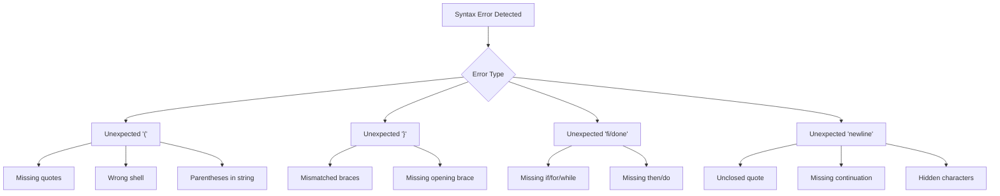
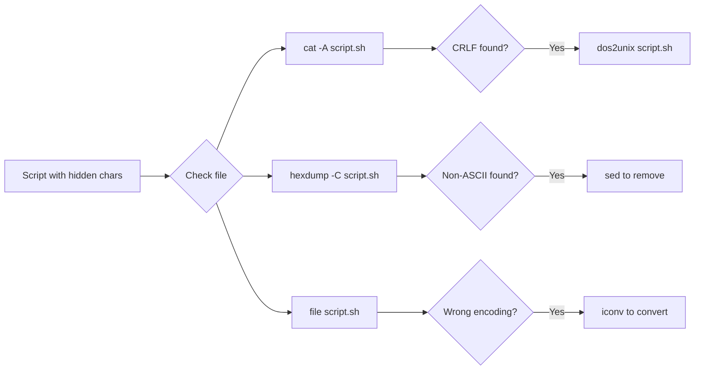
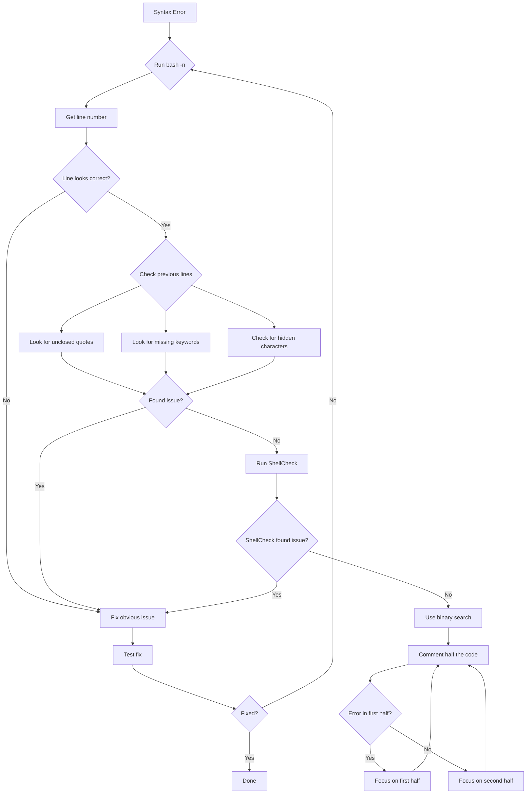

# How to Fix "Syntax Error Near Unexpected Token" in Bash

Author: [nawazdhandala](https://www.github.com/nawazdhandala)

Tags: Bash, Shell Scripting, Debugging, Linux, DevOps, Error Handling, Troubleshooting

Description: Learn how to diagnose and fix the common "syntax error near unexpected token" error in Bash scripts with practical examples and debugging techniques.

---

> The "syntax error near unexpected token" message is one of the most frustrating errors in Bash scripting. It often appears cryptic and can stem from many different causes. This guide will help you systematically diagnose and fix these errors.

Understanding why this error occurs and how to debug it will save you hours of troubleshooting time.

---

## Understanding the Error

The error typically looks like one of these:

```
bash: syntax error near unexpected token `('
bash: syntax error near unexpected token `}'
bash: syntax error near unexpected token `fi'
bash: syntax error near unexpected token `done'
bash: syntax error near unexpected token `newline'
```



---

## Common Causes and Solutions

### 1. Missing or Mismatched Quotes

One of the most common causes is unbalanced quotes.

```bash
# WRONG - Missing closing quote
echo "Hello World
echo "Next line"

# Error: syntax error near unexpected token `echo'

# CORRECT
echo "Hello World"
echo "Next line"
```

```bash
# WRONG - Quote inside unescaped string
message="He said "Hello" to me"

# Error: syntax error near unexpected token `Hello'

# CORRECT - Escape inner quotes
message="He said \"Hello\" to me"

# CORRECT - Use single quotes for outer
message='He said "Hello" to me'

# CORRECT - Use different quotes
message="He said 'Hello' to me"
```

### 2. Parentheses Issues

Parentheses have special meaning in Bash and must be handled carefully.

```bash
# WRONG - Unquoted parentheses in echo
echo (this will fail)

# Error: syntax error near unexpected token `('

# CORRECT - Quote the string
echo "(this will work)"

# CORRECT - Escape the parentheses
echo \(this will also work\)
```

```bash
# WRONG - Spaces inside function definition parentheses in older Bash
function greet ( ) {
    echo "Hello"
}

# CORRECT - No spaces inside parentheses
function greet() {
    echo "Hello"
}

# CORRECT - Alternative syntax
greet() {
    echo "Hello"
}
```

### 3. Missing Keywords (then, do, fi, done)

Control structures require specific keywords.

```bash
# WRONG - Missing 'then'
if [ "$x" -eq 1 ]
    echo "One"
fi

# Error: syntax error near unexpected token `echo'

# CORRECT
if [ "$x" -eq 1 ]; then
    echo "One"
fi
```

```bash
# WRONG - Missing 'do'
for i in 1 2 3
    echo "$i"
done

# Error: syntax error near unexpected token `echo'

# CORRECT
for i in 1 2 3; do
    echo "$i"
done
```

```bash
# WRONG - Mismatched if/fi
if [ "$x" -eq 1 ]; then
    echo "One"
    if [ "$y" -eq 2 ]; then
        echo "Two"
fi

# Error: syntax error near unexpected token `fi'

# CORRECT - Properly nested
if [ "$x" -eq 1 ]; then
    echo "One"
    if [ "$y" -eq 2 ]; then
        echo "Two"
    fi
fi
```

### 4. Semicolon and Newline Issues

Bash is sensitive to how statements are separated.

```bash
# WRONG - Missing semicolon before then on same line
if [ "$x" -eq 1 ] then
    echo "One"
fi

# Error: syntax error near unexpected token `then'

# CORRECT - Add semicolon
if [ "$x" -eq 1 ]; then
    echo "One"
fi

# CORRECT - Use newline instead
if [ "$x" -eq 1 ]
then
    echo "One"
fi
```

```bash
# WRONG - Semicolon after do or then
for i in 1 2 3; do;
    echo "$i"
done

# Error: syntax error near unexpected token `;'

# CORRECT - No semicolon after do
for i in 1 2 3; do
    echo "$i"
done
```

---

## Hidden Character Issues

### DOS/Windows Line Endings (CRLF)

Files created on Windows often have CRLF line endings that cause issues.

```bash
# Check for CRLF characters
cat -A script.sh | head -5

# If you see ^M at end of lines, you have CRLF

# Fix with dos2unix
dos2unix script.sh

# Fix with sed
sed -i 's/\r$//' script.sh

# Fix with tr
tr -d '\r' < script.sh > script_fixed.sh

# Verify the fix
file script.sh
# Should show: ASCII text
# Not: ASCII text, with CRLF line terminators
```

### Non-Breaking Spaces and Unicode Characters

Copy-pasting from web pages or documents can introduce invisible characters.

```bash
#!/bin/bash
# Check for non-printable characters

# View hex dump of file
hexdump -C script.sh | head -20

# Find non-ASCII characters
grep -P '[^\x00-\x7F]' script.sh

# Remove non-breaking spaces (0xC2 0xA0)
sed -i 's/\xc2\xa0/ /g' script.sh

# Replace all non-ASCII with ASCII equivalents
iconv -f utf-8 -t ascii//TRANSLIT script.sh > script_clean.sh
```



---

## Debugging Techniques

### 1. Use Bash Syntax Check

```bash
# Check syntax without executing
bash -n script.sh

# This will show syntax errors without running the script
# Example output:
# script.sh: line 15: syntax error near unexpected token `}'
```

### 2. Enable Debug Mode

```bash
#!/bin/bash
# Add at top of script for verbose output
set -x  # Print commands as they execute
set -v  # Print lines as they are read

# Or run script with debug flags
bash -x script.sh
bash -v script.sh
bash -xv script.sh  # Both
```

### 3. Use ShellCheck

ShellCheck is an excellent static analysis tool for shell scripts.

```bash
# Install ShellCheck
# Ubuntu/Debian
sudo apt install shellcheck

# macOS
brew install shellcheck

# Run ShellCheck
shellcheck script.sh

# Example output:
# In script.sh line 10:
# if [ $x == 1 ]; then
#    ^-- SC2086: Double quote to prevent globbing and word splitting.
#       ^-- SC2039: In POSIX sh, == is undefined.
```

### 4. Binary Search for Errors

When the error line number does not help, use binary search.

```bash
#!/bin/bash
# Comment out half the script to isolate the error

# Part 1
: <<'COMMENT'
echo "This part is commented"
function_that_might_have_error() {
    # ...
}
COMMENT

# Part 2 - Keep this active
echo "This part runs"

# If error persists, issue is in Part 2
# If error disappears, issue is in Part 1
# Repeat to narrow down
```

---

## Specific Error Solutions

### Error: `syntax error near unexpected token '('`

```bash
# Cause 1: Running Bash script with sh
# WRONG
sh script.sh  # sh doesn't support all Bash features

# CORRECT
bash script.sh

# Or add shebang and make executable
#!/bin/bash
chmod +x script.sh
./script.sh
```

```bash
# Cause 2: Array syntax in non-Bash shell
# This fails in sh:
array=(1 2 3)

# Solution: Use bash or avoid arrays
#!/bin/bash
array=(1 2 3)
```

```bash
# Cause 3: Function definition issues
# WRONG
function name (arg) {  # Bash functions don't take parameters in ()
    echo "$arg"
}

# CORRECT
name() {
    local arg="$1"
    echo "$arg"
}
```

### Error: `syntax error near unexpected token 'fi'`

```bash
# Cause: Empty if block or missing command
# WRONG
if [ "$x" -eq 1 ]; then
    # Comment only, no command
fi

# CORRECT - Use : (no-op) or true
if [ "$x" -eq 1 ]; then
    : # No-op placeholder
fi

# CORRECT - Use true command
if [ "$x" -eq 1 ]; then
    true
fi
```

### Error: `syntax error near unexpected token 'done'`

```bash
# Cause 1: Empty loop body
# WRONG
for i in 1 2 3; do
done

# CORRECT
for i in 1 2 3; do
    :
done
```

```bash
# Cause 2: Missing do keyword
# WRONG
while [ "$x" -lt 10 ]
    echo "$x"
    ((x++))
done

# CORRECT
while [ "$x" -lt 10 ]; do
    echo "$x"
    ((x++))
done
```

### Error: `syntax error near unexpected token 'else'`

```bash
# Cause: Empty then block
# WRONG
if [ "$x" -eq 1 ]; then
else
    echo "Not one"
fi

# CORRECT
if [ "$x" -eq 1 ]; then
    :
else
    echo "Not one"
fi

# BETTER - Negate the condition
if [ "$x" -ne 1 ]; then
    echo "Not one"
fi
```

### Error: `syntax error near unexpected token 'newline'`

```bash
# Cause 1: Unclosed quote
# WRONG
echo "This string never ends

# CORRECT
echo "This string ends properly"
```

```bash
# Cause 2: Backslash before newline but with trailing space
# WRONG (invisible space after backslash)
command --option1 \
        --option2

# CORRECT (no space after backslash)
command --option1 \
        --option2
```

```bash
# Cause 3: Incomplete command
# WRONG
if [ "$x" -eq 1 ]

# CORRECT
if [ "$x" -eq 1 ]; then
    echo "Complete"
fi
```

---

## Prevention Strategies

### 1. Use a Consistent Editor Setup

```bash
# .editorconfig for shell scripts
[*.sh]
indent_style = space
indent_size = 4
end_of_line = lf
charset = utf-8
trim_trailing_whitespace = true
insert_final_newline = true
```

### 2. Add Strict Mode to Scripts

```bash
#!/bin/bash
# Strict mode - catches many errors early
set -euo pipefail

# -e: Exit on error
# -u: Error on undefined variable
# -o pipefail: Pipeline fails if any command fails
```

### 3. Use Templates for Control Structures

```bash
# Template: if-then-else
if [[ condition ]]; then
    # true branch
else
    # false branch
fi

# Template: for loop
for item in "${array[@]}"; do
    # loop body
done

# Template: while loop
while [[ condition ]]; do
    # loop body
done

# Template: case statement
case "$variable" in
    pattern1)
        # commands
        ;;
    pattern2)
        # commands
        ;;
    *)
        # default
        ;;
esac

# Template: function
function_name() {
    local arg1="$1"
    local arg2="$2"

    # function body

    return 0
}
```

---

## Debugging Flowchart



---

## Quick Reference

| Error Token | Common Causes | Quick Fix |
|-------------|---------------|-----------|
| `(` | Wrong shell, unquoted string | Use bash, add quotes |
| `)` | Unmatched parenthesis | Check all `(` have `)` |
| `{` | Missing space after `{` | Add space: `{ command; }` |
| `}` | Unmatched brace | Check all `{` have `}` |
| `then` | Missing semicolon or newline | Add `;` before `then` |
| `do` | Missing semicolon or newline | Add `;` before `do` |
| `fi` | Missing `then` or empty block | Add `then` and command |
| `done` | Missing `do` or empty block | Add `do` and command |
| `else` | Empty `then` block | Add `:` in `then` block |
| `newline` | Unclosed quote, trailing backslash | Close quotes, check `\` |

---

## Conclusion

The "syntax error near unexpected token" error in Bash can be frustrating, but it is almost always caused by one of these issues:

- Unbalanced or mismatched quotes
- Missing control structure keywords (then, do, fi, done)
- Hidden characters from copy-paste or Windows line endings
- Running Bash-specific code with a different shell

Key debugging strategies:

1. Use `bash -n` to check syntax without executing
2. Use ShellCheck for static analysis
3. Check for hidden characters with `cat -A` or `hexdump`
4. Use binary search to isolate the problem area
5. Always use `#!/bin/bash` shebang for Bash scripts

With these techniques, you can quickly identify and fix syntax errors in your shell scripts.

---

*Need to monitor your shell scripts and automation? [OneUptime](https://oneuptime.com) provides comprehensive monitoring and alerting for all your DevOps workflows.*
