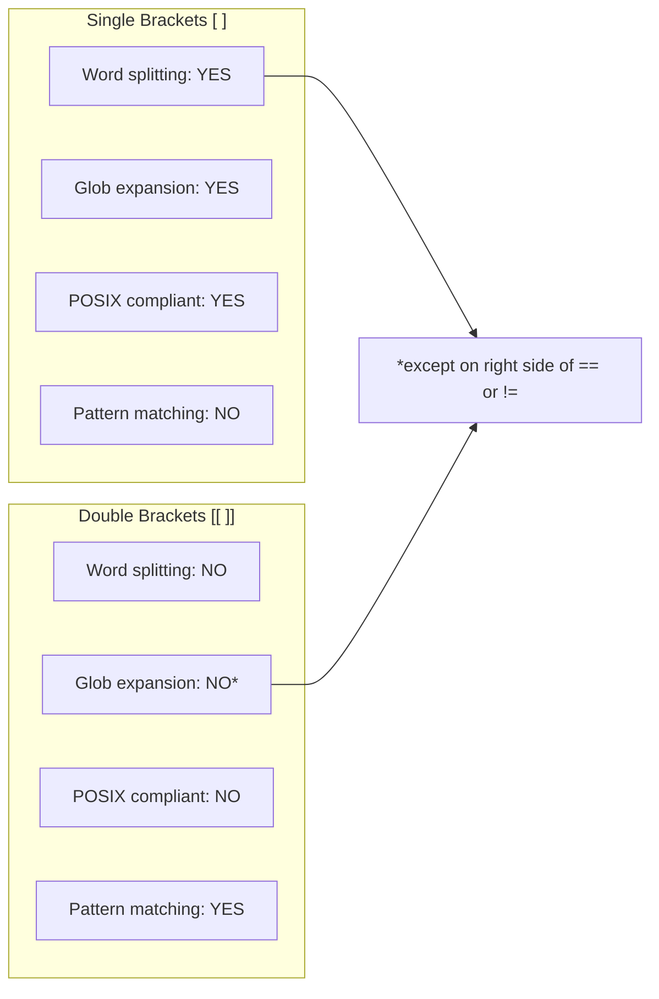
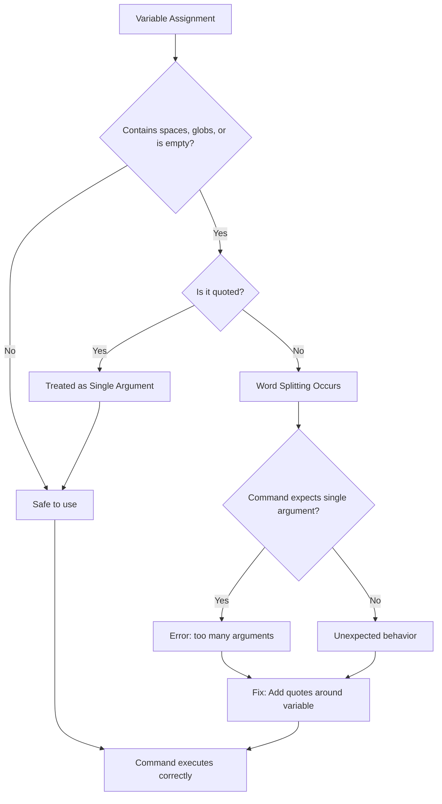

# How to Fix "Too Many Arguments" Errors in Bash

Author: [nawazdhandala](https://github.com/nawazdhandala)

Tags: Bash, Shell Scripting, Linux, Error Handling, Debugging, Command Line

Description: Learn how to diagnose and fix the common "too many arguments" error in Bash scripts caused by unquoted variables, glob expansion, and word splitting.

---

## Introduction

The "too many arguments" error is one of the most common issues Bash users encounter. This error occurs when a command receives more arguments than it expects, typically due to improper variable handling or shell expansion. Understanding why this happens and how to prevent it will make your scripts more robust and reliable.

## Understanding the Error

### When Does It Occur?

The error appears when commands that expect a specific number of arguments receive more than expected. The most common culprits are the `test` command (also written as `[`) and conditional expressions.

```bash
#!/bin/bash

# This will fail with "too many arguments"
filename="my file with spaces.txt"
if [ -f $filename ]; then
    echo "File exists"
fi
```

The shell expands `$filename` to `my file with spaces.txt`, which becomes four separate arguments: `my`, `file`, `with`, and `spaces.txt`.

### How Word Splitting Works

```mermaid
flowchart TD
    A[Variable: filename="my file.txt"] --> B[Unquoted: $filename]
    B --> C[Word Splitting by IFS]
    C --> D[Argument 1: my]
    C --> E[Argument 2: file.txt]
    D --> F["test command receives: -f my file.txt"]
    E --> F
    F --> G["Error: too many arguments"]

    A --> H["Quoted: \"$filename\""]
    H --> I[No Word Splitting]
    I --> J["Single Argument: my file.txt"]
    J --> K["test command receives: -f \"my file.txt\""]
    K --> L["Success!"]
```

## Common Causes and Solutions

### Cause 1: Unquoted Variables with Spaces

The most frequent cause is using unquoted variables that contain spaces.

```bash
#!/bin/bash

# Problem: Unquoted variable with spaces
path="/home/user/my documents"

# This fails - expands to: [ -d /home/user/my documents ]
if [ -d $path ]; then
    echo "Directory exists"
fi

# Solution: Always quote your variables
if [ -d "$path" ]; then
    echo "Directory exists"
fi
```

### Cause 2: Glob Pattern Expansion

Variables containing glob characters (`*`, `?`, `[]`) expand to matching filenames.

```bash
#!/bin/bash

# Problem: Glob characters in variable
pattern="*.txt"

# If there are multiple .txt files, this expands to all of them
if [ -f $pattern ]; then  # Error if multiple files match
    echo "Found pattern"
fi

# Solution 1: Quote to prevent glob expansion
if [ -f "$pattern" ]; then
    echo "Checking literal *.txt"
fi

# Solution 2: Use a loop for multiple files
for file in $pattern; do
    if [ -f "$file" ]; then
        echo "Found: $file"
    fi
done
```

### Cause 3: Command Substitution Results

Command substitution can return multiple words, causing the same issue.

```bash
#!/bin/bash

# Problem: Command output with multiple lines or words
files=$(ls /tmp)

# This fails if ls returns multiple files
if [ -n $files ]; then
    echo "Files found"
fi

# Solution: Quote the command substitution
if [ -n "$files" ]; then
    echo "Files found"
fi
```

### Cause 4: Empty Variables

Empty or unset variables can cause unexpected behavior with certain test operators.

```bash
#!/bin/bash

# Problem: Empty variable
value=""

# This becomes [ = "expected" ] which is invalid
if [ $value = "expected" ]; then
    echo "Match"
fi

# Solution: Quote the variable
if [ "$value" = "expected" ]; then
    echo "Match"
fi
```

## Using Double Brackets for Safer Tests

Bash's `[[` construct handles many edge cases automatically.

```bash
#!/bin/bash

# Double brackets handle word splitting automatically
filename="my file with spaces.txt"

# This works without quoting (but quoting is still recommended)
if [[ -f $filename ]]; then
    echo "File exists"
fi

# Pattern matching with double brackets
text="hello world"
if [[ $text == *world* ]]; then
    echo "Contains 'world'"
fi

# Double brackets also prevent glob expansion in comparisons
pattern="*.txt"
if [[ $pattern == "*.txt" ]]; then
    echo "Pattern is literally *.txt"
fi
```

### Comparison: Single vs Double Brackets



## Handling Arrays Properly

Arrays require special handling to avoid "too many arguments" errors.

```bash
#!/bin/bash

# Define an array
files=("file 1.txt" "file 2.txt" "file 3.txt")

# Problem: This expands all elements as separate arguments
if [ -f ${files[@]} ]; then  # Too many arguments
    echo "First file exists"
fi

# Solution 1: Access specific array element
if [ -f "${files[0]}" ]; then
    echo "First file exists"
fi

# Solution 2: Loop through array elements
for file in "${files[@]}"; do
    if [ -f "$file" ]; then
        echo "Found: $file"
    fi
done

# Solution 3: Check array length
if [ ${#files[@]} -gt 0 ]; then
    echo "Array has ${#files[@]} elements"
fi
```

## The Find Command and Arguments

The `find` command combined with `-exec` can also trigger argument errors.

```bash
#!/bin/bash

# Problem: Too many files for single command
# This might fail if there are many matches
result=$(find /var/log -name "*.log")
if [ -n $result ]; then
    echo "Found log files"
fi

# Solution 1: Quote the variable
if [ -n "$result" ]; then
    echo "Found log files"
fi

# Solution 2: Use find's exit status directly
if find /var/log -name "*.log" -quit 2>/dev/null | grep -q .; then
    echo "Found log files"
fi

# Solution 3: Count results
count=$(find /var/log -name "*.log" 2>/dev/null | wc -l)
if [ "$count" -gt 0 ]; then
    echo "Found $count log files"
fi
```

## Debugging "Too Many Arguments"

### Enable Debug Mode

```bash
#!/bin/bash

# Enable verbose mode to see expansions
set -x

filename="my file.txt"
if [ -f $filename ]; then
    echo "exists"
fi

# Output shows:
# + '[' -f my file.txt ']'
# bash: [: too many arguments

set +x  # Disable debug mode
```

### Print Variables Before Use

```bash
#!/bin/bash

# Debug function to inspect variables
debug_var() {
    local name="$1"
    local value="$2"
    echo "DEBUG: $name = '$value'"
    echo "DEBUG: Word count: $(echo "$value" | wc -w)"
}

filename="my important file.txt"
debug_var "filename" "$filename"

# Check what the variable expands to
echo "Unquoted expansion:"
printf "'%s'\n" $filename

echo "Quoted expansion:"
printf "'%s'\n" "$filename"
```

## Best Practices

### Always Quote Variables

```bash
#!/bin/bash

# Good practice: Always use quotes around variables
name="John Doe"
path="/home/user/my files"
command_output="$(ls -la)"

# All of these are safe
echo "$name"
cd "$path"
echo "$command_output"

# Even when you think it is safe, quote anyway
count=5
if [ "$count" -gt 0 ]; then  # Quotes are defensive programming
    echo "Count is positive"
fi
```

### Use Parameter Expansion Defaults

```bash
#!/bin/bash

# Handle potentially empty variables safely
config_file="${CONFIG_FILE:-/etc/default/config}"

# Check if variable is set and non-empty
if [ -n "${username:-}" ]; then
    echo "Username is set to: $username"
else
    echo "Username is not set"
fi

# Provide default when variable might be unset
if [ "${DEBUG:-false}" = "true" ]; then
    set -x
fi
```

### Use Arrays for Multiple Values

```bash
#!/bin/bash

# Instead of storing multiple items in a string
# Bad: files="file1.txt file2.txt file3.txt"

# Use an array
files=("file1.txt" "file2.txt" "file3.txt")

# Process each element safely
for file in "${files[@]}"; do
    if [ -f "$file" ]; then
        process_file "$file"
    fi
done
```

## Complete Example: Robust File Checker

```bash
#!/bin/bash

# A robust script that handles all edge cases

check_files() {
    local dir="${1:-.}"  # Default to current directory
    local pattern="${2:-*}"  # Default to all files
    local found=0

    # Validate directory exists
    if [ ! -d "$dir" ]; then
        echo "Error: Directory '$dir' does not exist" >&2
        return 1
    fi

    # Use nullglob to handle no matches gracefully
    shopt -s nullglob

    # Process files matching pattern
    for file in "$dir"/$pattern; do
        if [ -f "$file" ]; then
            echo "Found file: $file"
            ((found++))
        fi
    done

    shopt -u nullglob

    if [ "$found" -eq 0 ]; then
        echo "No files matching '$pattern' found in '$dir'"
        return 1
    fi

    echo "Total files found: $found"
    return 0
}

# Safe argument handling
main() {
    local search_dir="$1"
    local search_pattern="$2"

    # Quote everything when passing to functions
    check_files "$search_dir" "$search_pattern"
}

# Call with properly quoted arguments
main "$@"
```

## Error Flow Diagram



## Conclusion

The "too many arguments" error is almost always caused by improper quoting. By following these guidelines, you can avoid this error entirely:

1. Always quote variables: Use `"$variable"` instead of `$variable`
2. Use double brackets `[[` for conditional tests in Bash scripts
3. Handle arrays properly with `"${array[@]}"` syntax
4. Use `set -x` for debugging expansion issues
5. Apply defensive programming by quoting even when you think it is unnecessary
6. Consider using `shellcheck` to catch quoting issues before runtime

Remember that quoting is not just about fixing errors - it is about writing reliable scripts that work correctly with any input, including filenames with spaces, special characters, or empty values.
