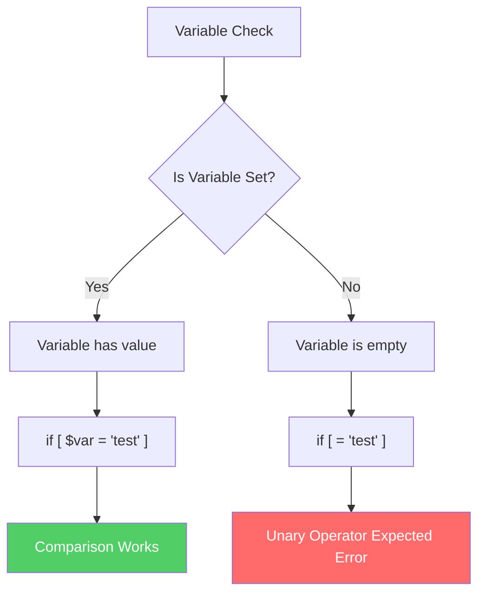
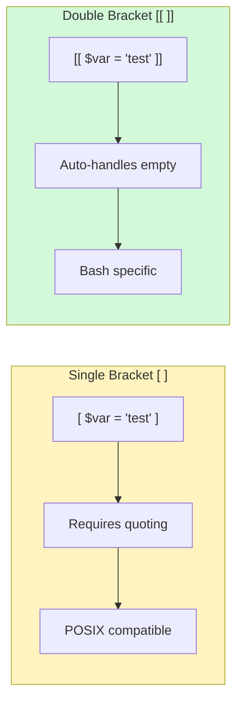
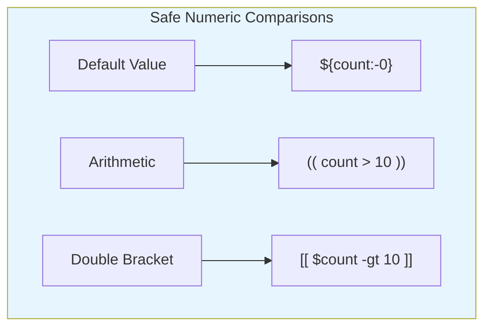

# How to Fix "Unary Operator Expected" Errors in Bash

Author: [nawazdhandala](https://www.github.com/nawazdhandala)

Tags: Bash, Shell Scripting, Debugging, Error Handling, Linux, DevOps

Description: Learn how to diagnose and fix the common "unary operator expected" error in Bash scripts caused by unquoted variables and empty strings.

---

> The "unary operator expected" error is one of the most common Bash errors that catches developers off guard. It typically occurs when a variable is empty or unset during a comparison operation. This guide explains why it happens and provides multiple solutions.

---

## Understanding the Error

The "unary operator expected" error occurs when Bash expects a value on one side of a comparison operator but finds nothing. This usually happens when a variable is empty or undefined.



### Example of the Error

```bash
#!/bin/bash
# This script demonstrates the unary operator expected error

# Variable is not set or empty
my_var=""

# This will cause "unary operator expected" error
if [ $my_var = "hello" ]; then
    echo "Match found"
fi
```

When `my_var` is empty, Bash interprets the condition as:

```bash
# What Bash sees when my_var is empty:
if [ = "hello" ]; then
```

The `=` operator expects a value on both sides, hence the "unary operator expected" error.

---

## Solution 1: Quote Your Variables

The simplest and most recommended fix is to always quote your variables in test conditions.

```bash
#!/bin/bash
# CORRECT: Always quote variables in comparisons

my_var=""

# Double quotes prevent the error
if [ "$my_var" = "hello" ]; then
    echo "Match found"
else
    echo "No match"
fi
```

When quoted, an empty variable becomes an empty string:

```bash
# What Bash sees when my_var is empty but quoted:
if [ "" = "hello" ]; then
```

This is a valid comparison that evaluates to false.

---

## Solution 2: Use Double Brackets [[ ]]

Modern Bash (version 2.02+) supports double brackets which handle empty variables automatically.

```bash
#!/bin/bash
# CORRECT: Double brackets handle empty variables

my_var=""

# Double brackets don't require quoting
if [[ $my_var = "hello" ]]; then
    echo "Match found"
else
    echo "No match"
fi
```



### Advantages of Double Brackets

```bash
#!/bin/bash
# Double brackets provide additional benefits

name=""
pattern="user*"

# Pattern matching with double brackets
if [[ $name == user* ]]; then
    echo "Name starts with user"
fi

# Regex matching
if [[ $name =~ ^[a-z]+$ ]]; then
    echo "Name contains only lowercase letters"
fi

# Logical operators inside brackets
if [[ $name = "admin" || $name = "root" ]]; then
    echo "Administrative user"
fi
```

---

## Solution 3: Use Default Values

Provide a default value when a variable might be empty.

```bash
#!/bin/bash
# Using parameter expansion for default values

# ${var:-default} uses default if var is unset or empty
if [ "${my_var:-}" = "hello" ]; then
    echo "Match found"
fi

# ${var:=default} sets var to default if unset or empty
if [ "${my_var:=none}" = "hello" ]; then
    echo "Match found"
fi
echo "my_var is now: $my_var"
```

### Parameter Expansion Options

```bash
#!/bin/bash
# Different parameter expansion techniques

unset username

# ${var:-default} - Use default value (doesn't modify var)
echo "User: ${username:-guest}"      # Output: guest
echo "Username is: $username"        # Output: (empty)

# ${var:=default} - Set default value (modifies var)
echo "User: ${username:=guest}"      # Output: guest
echo "Username is: $username"        # Output: guest

# ${var:+alternate} - Use alternate if var is set
username="admin"
echo "User: ${username:+authenticated}"  # Output: authenticated

# ${var:?error_message} - Exit with error if unset
# echo "User: ${username:?Username is required}"  # Would exit if unset
```

---

## Solution 4: Check If Variable Is Set First

Explicitly check if a variable is set before using it.

```bash
#!/bin/bash
# Check variable existence before comparison

# Using -n (non-zero length string test)
if [ -n "$my_var" ] && [ "$my_var" = "hello" ]; then
    echo "Match found"
fi

# Using -z (zero length string test)
if [ -z "$my_var" ]; then
    echo "Variable is empty or unset"
else
    if [ "$my_var" = "hello" ]; then
        echo "Match found"
    fi
fi
```

### String Test Operators

```bash
#!/bin/bash
# String testing operators explained

var1=""
var2="hello"
unset var3

# -z tests for zero length (empty string)
[ -z "$var1" ] && echo "var1 is empty"         # True
[ -z "$var2" ] && echo "var2 is empty"         # False
[ -z "$var3" ] && echo "var3 is empty/unset"   # True

# -n tests for non-zero length
[ -n "$var1" ] && echo "var1 has content"      # False
[ -n "$var2" ] && echo "var2 has content"      # True
[ -n "$var3" ] && echo "var3 has content"      # False
```

---

## Common Scenarios and Fixes

### Scenario 1: Command Output May Be Empty

```bash
#!/bin/bash
# Handling potentially empty command output

# WRONG: Command might return nothing
result=$(grep "pattern" file.txt 2>/dev/null)
if [ $result = "expected" ]; then  # Error if grep finds nothing
    echo "Found"
fi

# CORRECT: Quote the variable
result=$(grep "pattern" file.txt 2>/dev/null)
if [ "$result" = "expected" ]; then
    echo "Found"
fi
```

### Scenario 2: Environment Variables

```bash
#!/bin/bash
# Safely handling environment variables

# WRONG: ENV var might not exist
if [ $USER = "root" ]; then
    echo "Running as root"
fi

# CORRECT: Quote the variable
if [ "$USER" = "root" ]; then
    echo "Running as root"
fi

# ALSO CORRECT: Check if set first
if [ -n "$USER" ] && [ "$USER" = "root" ]; then
    echo "Running as root"
fi
```

### Scenario 3: Function Arguments

```bash
#!/bin/bash
# Handling function arguments safely

process_user() {
    local username=$1

    # WRONG: Argument might be missing
    if [ $username = "admin" ]; then
        echo "Admin user"
    fi

    # CORRECT: Always quote
    if [ "$username" = "admin" ]; then
        echo "Admin user"
    fi

    # BEST: Check argument exists
    if [ -z "$username" ]; then
        echo "Error: Username required" >&2
        return 1
    fi

    if [ "$username" = "admin" ]; then
        echo "Admin user"
    fi
}

# Test with missing argument
process_user
```

---

## Numeric Comparisons

The unary operator error also affects numeric comparisons.

```bash
#!/bin/bash
# Numeric comparison pitfalls

count=""

# WRONG: Will cause error
if [ $count -gt 10 ]; then
    echo "Count exceeds 10"
fi

# CORRECT: Quote and use default
if [ "${count:-0}" -gt 10 ]; then
    echo "Count exceeds 10"
fi

# ALSO CORRECT: Use arithmetic evaluation
if (( ${count:-0} > 10 )); then
    echo "Count exceeds 10"
fi
```



---

## Best Practices Summary

```bash
#!/bin/bash
# Complete example with all best practices

set -euo pipefail  # Enable strict mode

# Always initialize variables with defaults
config_file="${1:-/etc/myapp/config}"
log_level="${LOG_LEVEL:-info}"
max_retries="${MAX_RETRIES:-3}"

# Function with proper argument handling
validate_input() {
    local input="${1:-}"

    # Check for empty input
    if [[ -z "$input" ]]; then
        echo "Error: Input required" >&2
        return 1
    fi

    # Safe comparison with double brackets
    if [[ "$input" == "valid" ]]; then
        return 0
    fi

    return 1
}

# Main logic with proper variable handling
main() {
    local status="${1:-unknown}"

    # Use double brackets for string comparison
    if [[ "$status" == "running" ]]; then
        echo "Service is running"
    elif [[ "$status" == "stopped" ]]; then
        echo "Service is stopped"
    else
        echo "Unknown status: $status"
    fi
}

main "$@"
```

---

## Quick Reference

| Problem | Solution |
|---------|----------|
| Empty variable in `[ ]` | Quote: `[ "$var" = "value" ]` |
| Unset variable | Default: `[ "${var:-}" = "value" ]` |
| Complex conditions | Double brackets: `[[ $var = "value" ]]` |
| Numeric comparison | Arithmetic: `(( ${var:-0} > 10 ))` |
| Missing function argument | Check: `[ -z "$1" ] && return 1` |

---

## Summary

The "unary operator expected" error is easily preventable by:

1. **Always quoting variables** in test conditions
2. **Using double brackets** `[[ ]]` for Bash-specific scripts
3. **Providing default values** with parameter expansion
4. **Checking if variables are set** before using them

Following these practices will make your Bash scripts more robust and eliminate this common error.

---

*Building reliable automation? [OneUptime](https://oneuptime.com) helps you monitor your scripts and infrastructure with real-time alerting when things go wrong.*

**Related Reading:**
- [Shell Scripting Best Practices](https://oneuptime.com/blog/post/shell-scripting-best-practices)
- [Debugging Bash Scripts](https://oneuptime.com/blog/post/debugging-bash-scripts)
