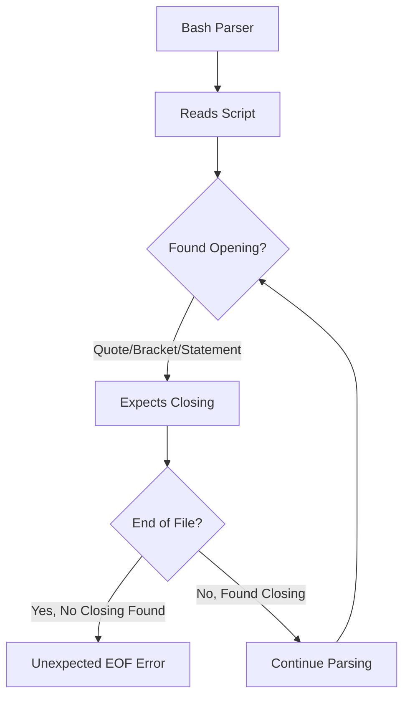
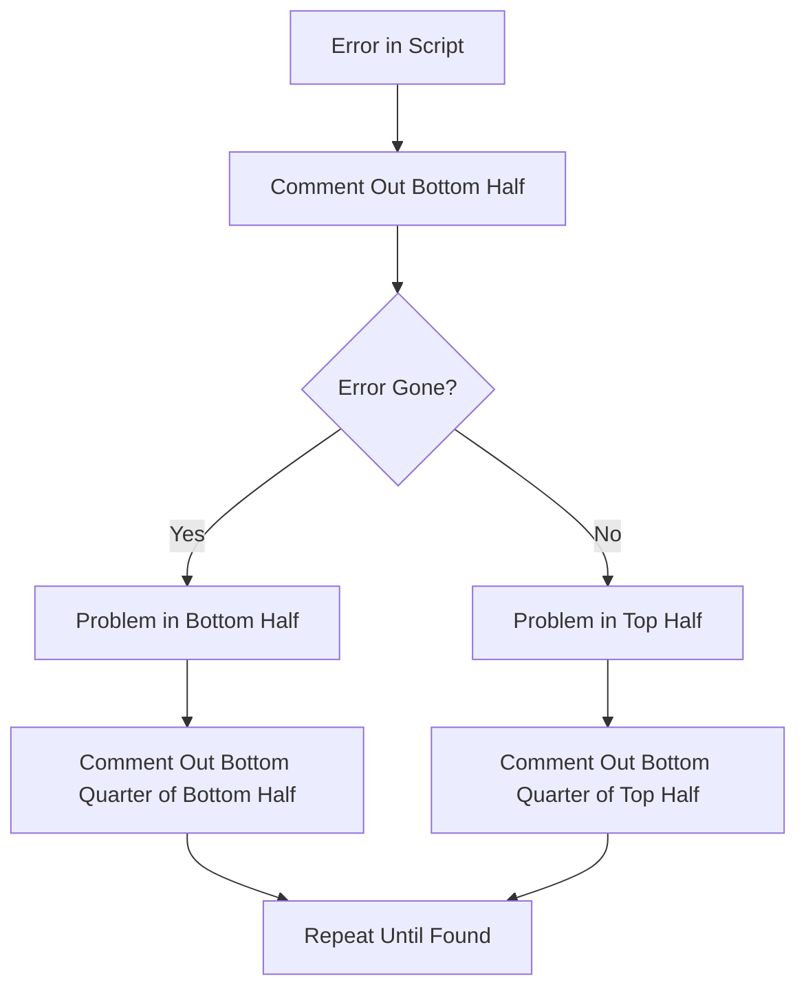
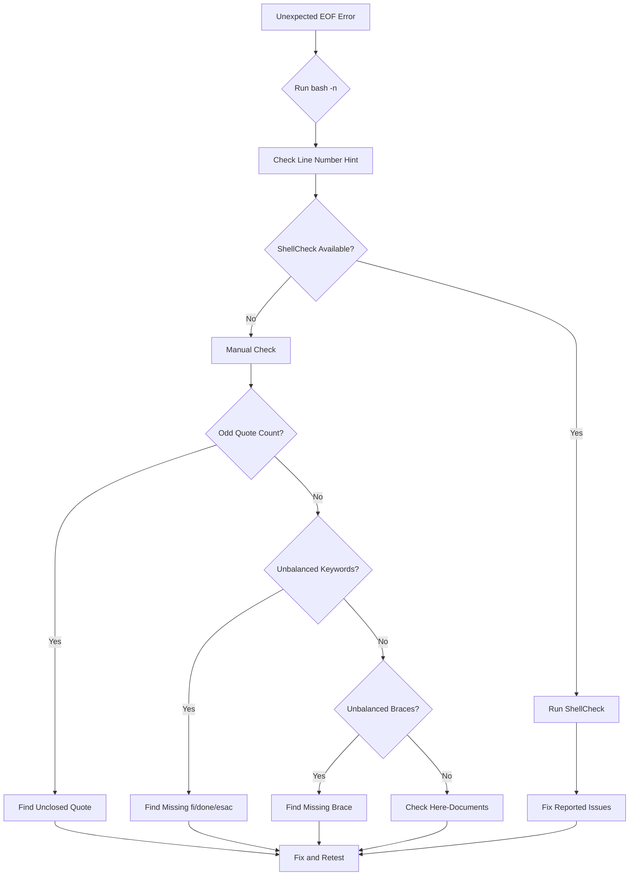

# How to Fix "Unexpected End of File" Errors

Author: [nawazdhandala](https://www.github.com/nawazdhandala)

Tags: Bash, Shell Scripting, Troubleshooting, Debugging, Linux, Syntax Errors

Description: Learn how to diagnose and fix the "unexpected end of file" error in Bash scripts, including unclosed quotes, missing statement terminators, and here-document issues.

---

The "unexpected end of file" error is one of the most frustrating Bash errors because it points to the end of your script, not to where the actual problem is. This guide teaches you how to quickly find and fix the real cause.

## Understanding the Error



When Bash starts parsing something that requires a closing element (quote, bracket, keyword) but reaches the end of the file without finding it, you get this error.

## Common Causes and Fixes

### Cause 1: Unclosed Quotes

The most common cause is a missing closing quote.

#### The Problem

```bash
#!/bin/bash

echo "Starting process
echo "Processing data..."
echo "Done"
```

Error output:
```
script.sh: line 6: unexpected end of file
```

#### The Fix

```bash
#!/bin/bash

echo "Starting process"  # Added closing quote
echo "Processing data..."
echo "Done"
```

#### Finding Unclosed Quotes

```bash
# Method 1: Use grep to find lines with odd number of quotes
grep -n '"' script.sh | awk -F'"' 'NF%2==0 {print "Line " NR ": possible unclosed quote"}'

# Method 2: Use syntax highlighting in vim
vim script.sh
# Look for text that continues in quote color past line end

# Method 3: Use shellcheck
shellcheck script.sh
```

### Cause 2: Unclosed Single Quotes

Single quotes are trickier because they don't allow escaping.

#### The Problem

```bash
#!/bin/bash

message='Hello, it's a beautiful day'
echo "$message"
```

#### The Fix

```bash
#!/bin/bash

# Method 1: Use double quotes
message="Hello, it's a beautiful day"

# Method 2: End single quote, add escaped quote, restart single quote
message='Hello, it'\''s a beautiful day'

# Method 3: Use $'...' syntax
message=$'Hello, it\'s a beautiful day'

echo "$message"
```

### Cause 3: Missing `fi` for `if` Statements

Forgetting to close if statements is very common.

#### The Problem

```bash
#!/bin/bash

if [[ -f /etc/config ]]; then
    echo "Config exists"
    if [[ -r /etc/config ]]; then
        echo "Config is readable"
    # Missing fi here

echo "Done"  # This line causes the error
```

#### The Fix

```bash
#!/bin/bash

if [[ -f /etc/config ]]; then
    echo "Config exists"
    if [[ -r /etc/config ]]; then
        echo "Config is readable"
    fi  # Added missing fi
fi  # Make sure outer if is closed too

echo "Done"
```

#### Finding Missing `fi`

```bash
#!/bin/bash

# Count if/fi pairs
count_pairs() {
    local file="$1"
    local if_count=$(grep -cE '^\s*(if|elif)\b' "$file")
    local fi_count=$(grep -cE '^\s*fi\b' "$file")

    echo "if/elif statements: $if_count"
    echo "fi statements: $fi_count"

    if [[ $if_count -ne $fi_count ]]; then
        echo "WARNING: Mismatch detected!"
    fi
}

count_pairs script.sh
```

### Cause 4: Missing `done` for Loops

Unclosed loops produce the same error.

#### The Problem

```bash
#!/bin/bash

for file in *.txt; do
    echo "Processing $file"
    while read -r line; do
        echo "$line"
    # Missing done for while loop
# Missing done for for loop

echo "Finished"
```

#### The Fix

```bash
#!/bin/bash

for file in *.txt; do
    echo "Processing $file"
    while read -r line; do
        echo "$line"
    done < "$file"  # Added done for while
done  # Added done for for

echo "Finished"
```

### Cause 5: Missing `esac` for `case` Statements

#### The Problem

```bash
#!/bin/bash

case "$1" in
    start)
        echo "Starting..."
        ;;
    stop)
        echo "Stopping..."
        ;;
    *)
        echo "Unknown command"
        ;;
# Missing esac
```

#### The Fix

```bash
#!/bin/bash

case "$1" in
    start)
        echo "Starting..."
        ;;
    stop)
        echo "Stopping..."
        ;;
    *)
        echo "Unknown command"
        ;;
esac  # Added esac
```

### Cause 6: Unclosed Braces and Parentheses

#### The Problem

```bash
#!/bin/bash

# Unclosed function brace
process_data() {
    echo "Processing..."
    for i in {1..10}; do
        echo "$i"
    done
# Missing closing brace

# Unclosed subshell
result=$(
    echo "Starting"
    do_something
# Missing closing parenthesis
```

#### The Fix

```bash
#!/bin/bash

process_data() {
    echo "Processing..."
    for i in {1..10}; do
        echo "$i"
    done
}  # Added closing brace

result=$(
    echo "Starting"
    do_something
)  # Added closing parenthesis
```

### Cause 7: Here-Document Issues

Here-documents have strict requirements for the ending delimiter.

#### The Problem

```bash
#!/bin/bash

cat << EOF
This is a multi-line
text block
 EOF
```

The delimiter `EOF` has a leading space, so it's not recognized.

#### The Fix

```bash
#!/bin/bash

# Delimiter must be at the start of the line (no leading whitespace)
cat << EOF
This is a multi-line
text block
EOF

# Unless using <<- which strips leading tabs (not spaces)
cat <<- EOF
	This is indented content
	More content
	EOF
```

#### Common Here-Document Mistakes

```bash
#!/bin/bash

# WRONG: Delimiter has trailing space
cat << 'EOF'
content
EOF

# WRONG: Delimiter has different quote style
cat << "EOF"
content
EOF'

# WRONG: Delimiter is part of the content
cat << EOF
This text mentions EOF in the middle
EOF

# CORRECT: Use a unique delimiter
cat << 'END_OF_TEXT'
This text mentions EOF in the middle
END_OF_TEXT
```

### Cause 8: Backslash at End of File

A trailing backslash expects a continuation.

#### The Problem

```bash
#!/bin/bash

echo "Hello" \
# File ends with backslash continuation but no next line
```

#### The Fix

```bash
#!/bin/bash

echo "Hello"
# Remove trailing backslash or add continuation
```

## Debugging Strategies

### Strategy 1: Binary Search



```bash
#!/bin/bash

# Original script with error somewhere
# ... many lines ...

# Binary search: Comment out bottom half
# : << 'COMMENT_BLOCK'
# ... bottom half of script ...
# COMMENT_BLOCK

# If error persists, problem is in top half
# If error gone, problem is in bottom half
```

### Strategy 2: Use ShellCheck

```bash
# Install shellcheck
# Ubuntu/Debian
sudo apt-get install shellcheck

# macOS
brew install shellcheck

# Run analysis
shellcheck script.sh
```

ShellCheck output example:
```
In script.sh line 5:
if [[ -f /etc/config ]]; then
                              ^-- SC1009: The mentioned syntax error was in this if expression.

In script.sh line 10:
echo "Done"
          ^-- SC1073: Couldn't parse this if expression.
```

### Strategy 3: Syntax Check Mode

```bash
# Check syntax without executing
bash -n script.sh

# Verbose syntax check
bash -v -n script.sh
```

### Strategy 4: Add Debug Markers

```bash
#!/bin/bash

echo "DEBUG: Reached point 1"

if [[ -f /etc/config ]]; then
    echo "DEBUG: Inside if"

echo "DEBUG: Reached point 2"  # If this doesn't print, problem is above
```

### Strategy 5: Count Opening/Closing Pairs

```bash
#!/bin/bash

check_balance() {
    local file="$1"

    echo "=== Balance Check for $file ==="

    # Check quotes (rough estimate)
    local double_quotes=$(grep -o '"' "$file" | wc -l)
    local single_quotes=$(grep -o "'" "$file" | wc -l)

    echo "Double quotes: $double_quotes (should be even)"
    echo "Single quotes: $single_quotes (should be even)"

    # Check control structures
    local if_count=$(grep -cE '\bif\b' "$file")
    local fi_count=$(grep -cE '\bfi\b' "$file")
    echo "if: $if_count, fi: $fi_count"

    local do_count=$(grep -cE '\bdo\b' "$file")
    local done_count=$(grep -cE '\bdone\b' "$file")
    echo "do: $do_count, done: $done_count"

    local case_count=$(grep -cE '\bcase\b' "$file")
    local esac_count=$(grep -cE '\besac\b' "$file")
    echo "case: $case_count, esac: $esac_count"

    # Check braces
    local open_brace=$(grep -o '{' "$file" | wc -l)
    local close_brace=$(grep -o '}' "$file" | wc -l)
    echo "Open braces: $open_brace, Close braces: $close_brace"

    # Check parentheses
    local open_paren=$(grep -o '(' "$file" | wc -l)
    local close_paren=$(grep -o ')' "$file" | wc -l)
    echo "Open parens: $open_paren, Close parens: $close_paren"
}

check_balance script.sh
```

## Editor Configuration for Prevention

### Vim Settings

```vim
" Add to ~/.vimrc

" Enable syntax highlighting
syntax on

" Show matching brackets
set showmatch

" Highlight search results
set hlsearch

" Show line numbers
set number

" Highlight trailing whitespace
highlight ExtraWhitespace ctermbg=red guibg=red
match ExtraWhitespace /\s\+$/
```

### VS Code Settings

```json
{
    "editor.bracketPairColorization.enabled": true,
    "editor.guides.bracketPairs": true,
    "editor.renderWhitespace": "all",
    "files.trimTrailingWhitespace": true,
    "shellcheck.enable": true
}
```

## Common Patterns That Cause Errors

### Pattern 1: Multi-line Strings

```bash
#!/bin/bash

# WRONG: Quote continues to next line
message="This is a long message
that spans multiple lines"  # Need to escape or use different approach

# CORRECT: Use line continuation
message="This is a long message \
that spans multiple lines"

# CORRECT: Use $'...' for embedded newlines
message=$'This is a long message\nthat spans multiple lines'

# CORRECT: Use here-string
read -r -d '' message << 'EOF'
This is a long message
that spans multiple lines
EOF
```

### Pattern 2: Nested Structures

```bash
#!/bin/bash

# Keep track of nesting levels with comments
if [[ condition1 ]]; then
    # if level 1
    if [[ condition2 ]]; then
        # if level 2
        for item in list; do
            # for level 1
            while condition3; do
                # while level 1
                echo "Deep nesting"
            done  # end while level 1
        done  # end for level 1
    fi  # end if level 2
fi  # end if level 1
```

### Pattern 3: Conditional Command Substitution

```bash
#!/bin/bash

# WRONG: Unclosed substitution
result=$(
    if [[ -f file ]]; then
        cat file
    fi
# Missing closing parenthesis

# CORRECT: Properly closed
result=$(
    if [[ -f file ]]; then
        cat file
    fi
)
```

## Error Recovery Checklist



## Quick Fixes Reference

| Symptom | Likely Cause | Fix |
|---------|--------------|-----|
| Error at last line | Unclosed quote or structure | Find and close it |
| Error mentions `fi` | Missing `fi` or `then` | Check if statement balance |
| Error mentions `done` | Missing `done` or `do` | Check loop balance |
| Error mentions `esac` | Missing `esac` | Check case statement |
| Error after here-doc | Delimiter has whitespace | Remove spaces before delimiter |
| Error in function | Missing closing brace | Add `}` at function end |

## Prevention Tips

1. **Use consistent indentation** - Makes structure visible
2. **Write closing elements immediately** - Type `fi` right after `then`, fill in later
3. **Use an editor with syntax highlighting** - Unclosed quotes show different colors
4. **Run ShellCheck regularly** - Catches issues before they become problems
5. **Keep functions short** - Easier to spot structural problems
6. **Comment closing elements** - `done # end of file loop` helps tracking
7. **Use a linter in your CI pipeline** - Catch errors before deployment

---

The "unexpected end of file" error always means Bash is waiting for something to close. The key is knowing what to look for: quotes, control structure keywords, braces, parentheses, or here-document delimiters. Use ShellCheck and `bash -n` to quickly identify the problem, and adopt editor settings that make structural issues visible. With practice, you will spot these issues instantly.
