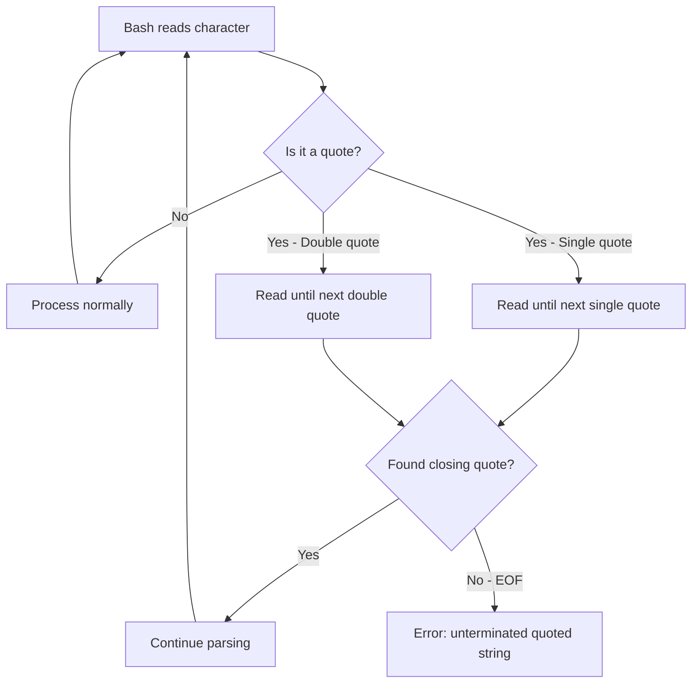

# How to Fix 'Unterminated Quoted String' Errors

Author: [nawazdhandala](https://github.com/nawazdhandala)

Tags: Bash, Shell Scripting, Linux, Error Handling, Quoting, Syntax Errors, Debugging

Description: Learn how to identify and fix unterminated quoted string errors in Bash scripts caused by mismatched quotes, special characters, and multiline strings.

---

## Introduction

The "unterminated quoted string" error is one of the most frustrating Bash errors because it often points to the wrong line number. This error occurs when Bash encounters an opening quote without a matching closing quote, causing it to continue reading until it finds a match or reaches the end of the file. Understanding how Bash quoting works and knowing common pitfalls will help you quickly identify and fix these issues.

## Understanding the Error

### What Causes It?

Bash requires matching quotes for string delimiters. When you open a quote (single `'` or double `"`), Bash reads everything until it finds the closing quote. If no closing quote is found, you get an error.

```bash
#!/bin/bash

# This causes an unterminated quoted string error
echo "Hello, World!

# Bash keeps reading, looking for the closing "
# Eventually reports: unexpected EOF while looking for matching `"'
```

### How Bash Processes Quotes



## Common Causes and Solutions

### Cause 1: Missing Closing Quote

The simplest case is a forgotten closing quote.

```bash
#!/bin/bash

# Problem: Missing closing quote
message="Hello, World!
echo "$message"

# Bash reads until it finds a " which happens to be at the start of $message
# This creates very confusing errors

# Solution: Add the closing quote
message="Hello, World!"
echo "$message"
```

### Cause 2: Unescaped Quotes Inside Strings

Quotes inside strings must be escaped or use alternating quote types.

```bash
#!/bin/bash

# Problem: Unescaped double quote inside double-quoted string
echo "She said "hello" to me"
# Bash sees: "She said " followed by hello" to me"

# Solution 1: Escape the inner quotes
echo "She said \"hello\" to me"

# Solution 2: Use single quotes for the outer string
echo 'She said "hello" to me'

# Solution 3: Mix quote types
echo "She said "'"'"hello"'"'"' to me"
# This works but is hard to read

# Better approach: Use variables
word="hello"
echo "She said \"$word\" to me"
```

### Cause 3: Single Quotes and Apostrophes

Single quotes cannot contain literal single quotes, even escaped.

```bash
#!/bin/bash

# Problem: Apostrophe in single-quoted string
echo 'Don't do this'
# Bash sees: 'Don' followed by t do this'

# Solution 1: Use double quotes
echo "Don't do this"

# Solution 2: End string, add escaped quote, continue
echo 'Don'\''t do this'
# This is: 'Don' + \' + 't do this'

# Solution 3: Use $'...' syntax (ANSI-C quoting)
echo $'Don\'t do this'
```

### Cause 4: Multi-line Strings

Multi-line strings require proper quoting throughout.

```bash
#!/bin/bash

# Problem: Broken multi-line string
message="This is a
long message
that spans
multiple lines

# Missing closing quote!

# Solution: Ensure closing quote is present
message="This is a
long message
that spans
multiple lines"

# Alternative: Use heredoc for long text
message=$(cat <<EOF
This is a
long message
that spans
multiple lines
EOF
)
```

### Cause 5: Command Substitution Issues

Quotes inside command substitution can cause confusion.

```bash
#!/bin/bash

# Problem: Nested quotes in command substitution
result="$(echo "inner quote)"
# The closing ) is inside the quoted string

# Solution 1: Escape inner quotes
result="$(echo \"inner quote\")"

# Solution 2: Use single quotes inside (if no expansion needed)
result="$(echo 'inner quote')"

# Solution 3: Use variables
inner="inner quote"
result="$(echo "$inner")"
```

## Quote Type Comparison

```mermaid
flowchart LR
    subgraph "Single Quotes '...'"
        A1[Everything literal]
        A2[No variable expansion]
        A3[No escape sequences]
        A4[Cannot contain single quote]
    end

    subgraph "Double Quotes \"...\""
        B1["Variables expanded: $var"]
        B2["Commands expanded: $(cmd)"]
        B3["Escape sequences: \n, \\, \$, \""]
        B4["Can contain single quotes"]
    end

    subgraph "$'...' ANSI-C"
        C1["Escape sequences work: \n, \t"]
        C2["Can escape single quote: \'"]
        C3[No variable expansion]
    end
```

## Debugging Techniques

### Check Syntax Before Running

```bash
#!/bin/bash

# Use bash -n to check syntax without executing
bash -n script.sh

# Output shows line number (though may not be accurate)
# script.sh: line 15: unexpected EOF while looking for matching `"'

# Use shellcheck for better diagnostics
shellcheck script.sh
# Shows: SC1078: Did you forget to close this double-quoted string?
```

### Isolate the Problem

```bash
#!/bin/bash

# Comment out sections to find the problematic line
echo "Line 1"
echo "Line 2"
# echo "Line 3  # <- Suspect line
echo "Line 4"

# Or use set -v to see what Bash reads
set -v
echo "Test string"
set +v
```

### Check Quote Balance

```bash
#!/bin/bash

# Count quotes in your script
grep -o '"' script.sh | wc -l  # Should be even
grep -o "'" script.sh | wc -l  # Should be even (accounting for apostrophes)

# Visual check with highlighting
grep --color=always '["'"'"']' script.sh
```

### Use Editor Features

Most code editors highlight matching quotes and show mismatches:

- VS Code: Shows quote pairs and highlights syntax errors
- Vim: Use `%` to jump between matching quotes (with matchit plugin)
- Emacs: Shows matching delimiters
- Sublime: Highlights matching quotes

## Common Patterns and Fixes

### Pattern 1: JSON in Bash

```bash
#!/bin/bash

# Problem: JSON with nested quotes
json="{"name": "John", "age": 30}"

# Solution 1: Escape all inner quotes
json="{\"name\": \"John\", \"age\": 30}"

# Solution 2: Use single quotes (but no variable expansion)
json='{"name": "John", "age": 30}'

# Solution 3: Use heredoc for complex JSON
json=$(cat <<EOF
{
    "name": "John",
    "age": 30
}
EOF
)

# Solution 4: Use jq for JSON construction
json=$(jq -n --arg name "John" --argjson age 30 \
    '{name: $name, age: $age}')
```

### Pattern 2: SQL Queries

```bash
#!/bin/bash

# Problem: SQL with quotes
mysql -e "SELECT * FROM users WHERE name = "John""

# Solution 1: Use single quotes for SQL strings
mysql -e "SELECT * FROM users WHERE name = 'John'"

# Solution 2: Escape double quotes
mysql -e "SELECT * FROM users WHERE name = \"John\""

# Solution 3: Use heredoc for complex queries
mysql <<EOF
SELECT *
FROM users
WHERE name = 'John'
  AND status = 'active';
EOF

# Solution 4: Use variables
name="John"
mysql -e "SELECT * FROM users WHERE name = '$name'"
```

### Pattern 3: Strings with Variables and Special Characters

```bash
#!/bin/bash

# Problem: Mix of variables and special characters
path="/home/$user"
message="Path is "$path" and it's great"  # Wrong!

# Solution: Proper quoting strategy
message="Path is \"$path\" and it's great"

# Or use printf for complex strings
message=$(printf "Path is \"%s\" and it's great" "$path")
```

### Pattern 4: Awk and Sed Commands

```bash
#!/bin/bash

# Problem: Nested quotes in awk
awk "BEGIN {print "hello"}"

# Solution 1: Use single quotes for awk, escape as needed
awk 'BEGIN {print "hello"}'

# Solution 2: Use variables for dynamic content
pattern="hello"
awk -v p="$pattern" 'BEGIN {print p}'

# Problem: Sed with quotes
sed "s/old/new with "quotes"/"

# Solution: Use single quotes or escape
sed 's/old/new with "quotes"/'
sed "s/old/new with \"quotes\"/"
```

### Pattern 5: SSH Commands

```bash
#!/bin/bash

# Problem: Quotes in SSH commands
ssh user@host "echo "hello""

# Solution 1: Use single quotes on remote
ssh user@host "echo 'hello'"

# Solution 2: Escape quotes
ssh user@host "echo \"hello\""

# Solution 3: Use heredoc for complex remote scripts
ssh user@host <<'EOF'
echo "This is easier"
var="value"
echo "$var"
EOF
```

## Prevention Strategies

### Strategy 1: Consistent Quoting Style

```bash
#!/bin/bash

# Adopt a consistent approach
# Rule: Use double quotes by default, single quotes for literals

# Double quotes for variables
echo "$variable"

# Single quotes for patterns and literal text
grep 'pattern' file.txt

# Double quotes with escaping for mixed content
echo "He said \"hello\""
```

### Strategy 2: Use Here Documents for Long Text

```bash
#!/bin/bash

# Instead of multi-line quoted strings
# Use heredocs for anything longer than one line

# Bad
message="This is line 1
This is line 2
This is line 3"

# Good
message=$(cat <<EOF
This is line 1
This is line 2
This is line 3
EOF
)
```

### Strategy 3: Validate Early

```bash
#!/bin/bash

# Add syntax check to your workflow

# In your Makefile or CI pipeline
check-syntax:
    shellcheck *.sh
    for f in *.sh; do bash -n "$$f"; done

# Pre-commit hook
#!/bin/bash
for file in $(git diff --cached --name-only | grep '\.sh$'); do
    if ! bash -n "$file"; then
        echo "Syntax error in $file"
        exit 1
    fi
done
```

### Strategy 4: Break Up Complex Strings

```bash
#!/bin/bash

# Instead of one complex string with many quotes
# Break it into parts

# Hard to read and error-prone
cmd="docker run -v \"/path/with spaces\":/data -e VAR=\"value with \"quotes\"\" image"

# Easier to maintain
volume_mount="/path/with spaces"
env_value='value with "quotes"'
cmd="docker run -v \"$volume_mount\":/data -e VAR='$env_value' image"

# Or use arrays
docker_args=(
    "run"
    "-v" "/path/with spaces:/data"
    "-e" "VAR=value with \"quotes\""
    "image"
)
docker "${docker_args[@]}"
```

## Error Message Guide

```mermaid
flowchart TD
    A["Error: unexpected EOF while looking for matching quote"] --> B{Which quote?}
    B -->|Double quote| C["Missing \" somewhere above the error line"]
    B -->|Single quote| D["Missing ' or unescaped apostrophe"]

    C --> E["Check multiline strings"]
    C --> F["Check command substitution"]
    C --> G["Check JSON/SQL strings"]

    D --> H["Check contractions: don't, can't"]
    D --> I["Check possessives: user's"]
    D --> J["Check literal quotes in text"]
```

## Complete Example: Quote-Safe Script

```bash
#!/bin/bash

# A script demonstrating proper quoting techniques

set -euo pipefail

# Configuration using proper quoting
readonly CONFIG_FILE="/etc/app/config.json"
readonly LOG_DIR="/var/log/app"
readonly APP_NAME="My Application"  # Contains space, needs quotes

# Function with proper string handling
log_message() {
    local level="$1"
    local message="$2"
    local timestamp
    timestamp=$(date '+%Y-%m-%d %H:%M:%S')

    # Properly quoted string with variables
    echo "[$timestamp] [$level] $message" >> "$LOG_DIR/app.log"
}

# Handle strings with special characters
process_user_input() {
    local input="$1"

    # Escape special characters for safe processing
    local safe_input
    safe_input=$(printf '%q' "$input")

    log_message "INFO" "Processing input: $safe_input"
}

# Generate JSON with proper quoting
generate_json() {
    local name="$1"
    local value="$2"

    # Use jq for safe JSON generation
    jq -n \
        --arg name "$name" \
        --arg value "$value" \
        '{name: $name, value: $value}'
}

# SQL query with proper quoting
run_query() {
    local search_term="$1"

    # Use parameterized queries when possible
    # For simple cases, properly escape
    mysql -e "SELECT * FROM users WHERE name = '${search_term//\'/\'\'}'"
}

# Handle multi-line content with heredoc
send_notification() {
    local recipient="$1"
    local subject="$2"

    mail -s "$subject" "$recipient" <<EOF
Hello,

This is a notification from $APP_NAME.
Please check the logs at: $LOG_DIR

Regards,
The System
EOF
}

# Main function
main() {
    log_message "INFO" "Starting $APP_NAME"

    # Handle user input with quotes
    local user_message="User said: \"Hello, it's me!\""
    process_user_input "$user_message"

    # Generate JSON output
    generate_json "greeting" "Hello, World!"

    log_message "INFO" "$APP_NAME completed successfully"
}

main "$@"
```

## Conclusion

Unterminated quoted string errors are common but preventable. Key strategies include:

1. Always match opening and closing quotes
2. Use the right quote type for your content:
   - Double quotes for variable expansion
   - Single quotes for literal text
   - `$'...'` for escape sequences with no expansion
3. Escape quotes inside strings using backslash or alternating quote types
4. Use heredocs for multi-line text
5. Run `bash -n` or `shellcheck` to catch errors early
6. Use editor features to highlight matching quotes

Common fixes by scenario:

- Apostrophes: Use double quotes or `'\''`
- Nested quotes: Escape with backslash or use opposite quote type
- JSON/SQL: Use single quotes inside double quotes or heredocs
- Multi-line: Use heredocs instead of quoted strings

With these techniques, you can avoid the frustration of hunting down unterminated quote errors in your Bash scripts.
