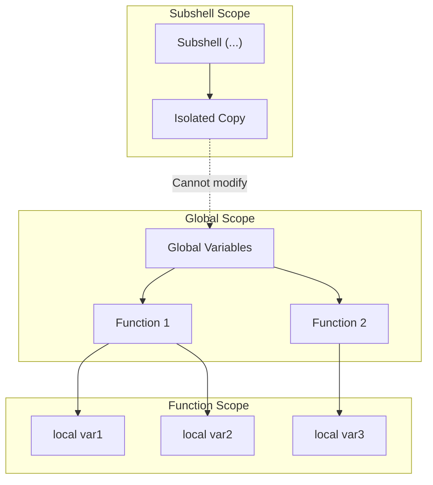
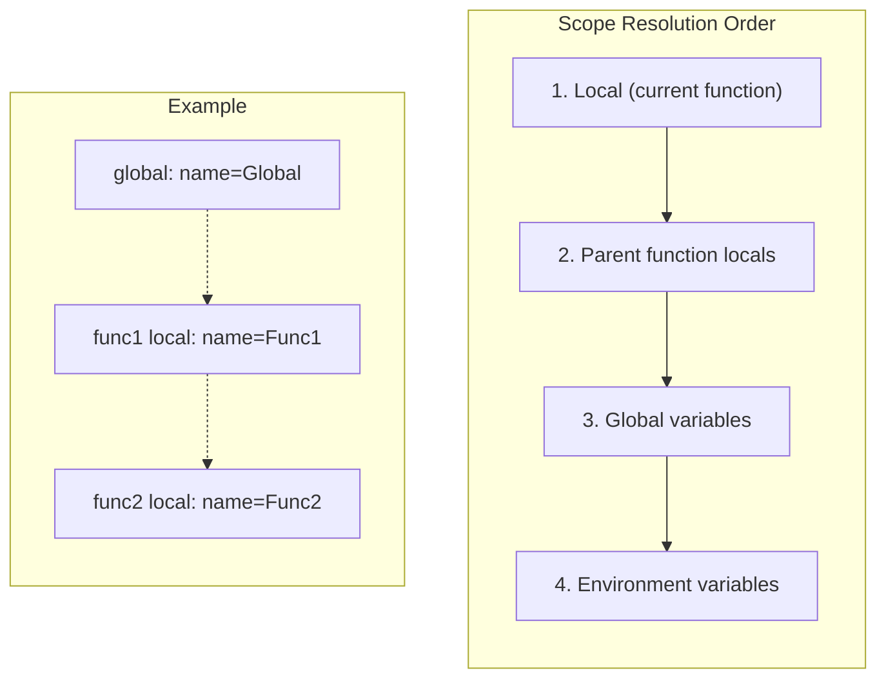
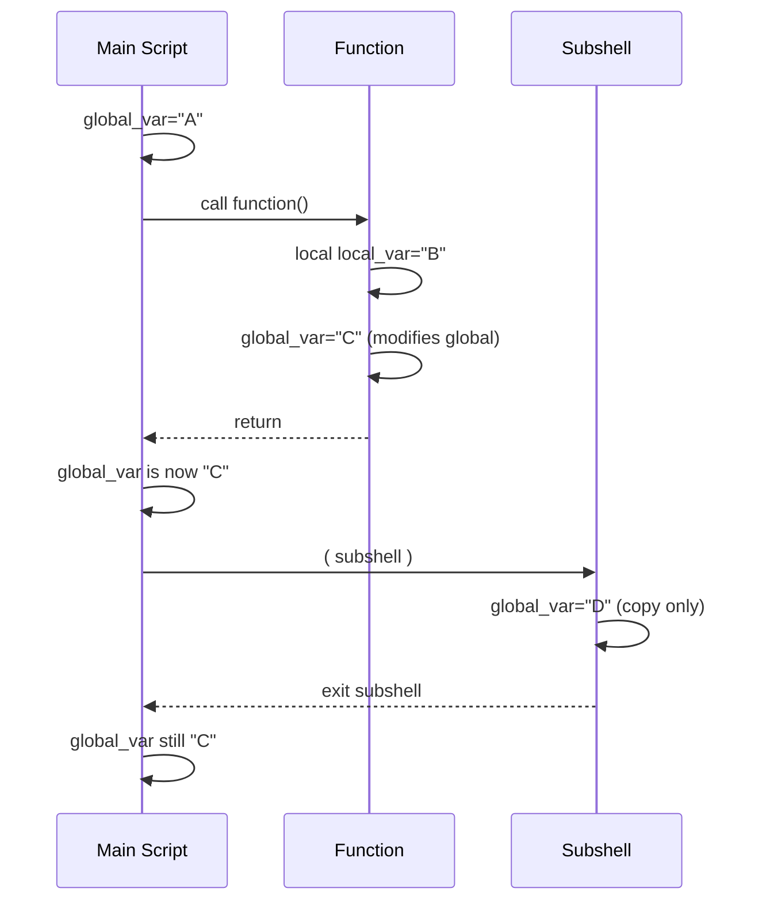

# How to Handle Variable Scoping in Bash Functions

Author: [nawazdhandala](https://www.github.com/nawazdhandala)

Tags: Bash, Shell Scripting, Functions, Variable Scope, Linux, Programming, Best Practices

Description: Learn how variable scoping works in Bash functions, including local variables, global scope, and techniques to avoid common pitfalls.

---

> Bash variable scoping often surprises developers coming from other languages. Variables are global by default, functions can modify parent scope, and subshells create isolated environments. Understanding these behaviors is essential for writing reliable shell scripts.

Mastering variable scope prevents subtle bugs that are difficult to debug in shell scripts.

---

## Overview



---

## Default Global Scope

### Variables Are Global by Default

```bash
#!/bin/bash
# Demonstration of default global scope in Bash

# Global variable
counter=0

increment() {
    # Without 'local', this modifies the global variable
    counter=$((counter + 1))

    # This creates a NEW global variable
    result="incremented"
}

echo "Before: counter=$counter"
increment
echo "After: counter=$counter"
echo "Result: $result"  # Accessible because it's global

# Output:
# Before: counter=0
# After: counter=1
# Result: incremented
```

### Accidental Global Variables

```bash
#!/bin/bash
# Common mistake: loop variables leak into global scope

process_items() {
    # 'item' becomes a global variable
    for item in one two three; do
        echo "Processing: $item"
    done
}

process_items

# The loop variable persists after function returns
echo "After function: item=$item"  # Prints: three

# This can cause bugs in subsequent code
for item in a b c; do
    # This loop might behave unexpectedly if 'item'
    # was expected to start fresh
    echo "$item"
done
```

---

## Using Local Variables

### The local Keyword

```bash
#!/bin/bash
# Using 'local' to create function-scoped variables

calculate_sum() {
    # Declare local variables - only visible within this function
    local num1="$1"
    local num2="$2"
    local result

    result=$((num1 + num2))

    # Return value via echo (local doesn't affect this)
    echo "$result"
}

# Call function and capture output
sum=$(calculate_sum 5 3)
echo "Sum: $sum"

# These variables don't exist in global scope
echo "num1: ${num1:-undefined}"    # undefined
echo "num2: ${num2:-undefined}"    # undefined
echo "result: ${result:-undefined}" # undefined
```

### Local Variable Inheritance

```bash
#!/bin/bash
# Local variables are visible to nested function calls

outer_function() {
    local shared_var="from outer"

    inner_function
}

inner_function() {
    # Can see the local variable from calling function
    echo "Inner sees: $shared_var"

    # Can also modify it (affects outer's copy)
    shared_var="modified by inner"
}

outer_function
# shared_var doesn't exist here
echo "Global scope: ${shared_var:-not defined}"

# Output:
# Inner sees: from outer
# Global scope: not defined
```

---

## Scope Hierarchy



---

## Returning Values from Functions

### Using Global Variables (Not Recommended)

```bash
#!/bin/bash
# Anti-pattern: using global variables to return values

get_user_info() {
    # These pollute global namespace
    USER_NAME="john"
    USER_ID=1001
    USER_HOME="/home/john"
}

get_user_info
echo "User: $USER_NAME, ID: $USER_ID, Home: $USER_HOME"

# Problems:
# 1. Caller must know variable names
# 2. Easy to accidentally overwrite
# 3. Hard to trace data flow
```

### Using Command Substitution (Recommended)

```bash
#!/bin/bash
# Good pattern: return values via stdout

get_timestamp() {
    local format="${1:-%Y-%m-%d %H:%M:%S}"
    date +"$format"
}

# Capture output in variable
timestamp=$(get_timestamp)
echo "Current time: $timestamp"

# Use directly in command
echo "Log entry: $(get_timestamp '%H:%M:%S') - Script started"
```

### Returning Multiple Values

```bash
#!/bin/bash
# Technique 1: Delimiter-separated output

get_dimensions() {
    local width=1920
    local height=1080

    # Return as delimiter-separated string
    echo "${width}x${height}"
}

# Parse the output
dimensions=$(get_dimensions)
width="${dimensions%x*}"   # Remove from x to end
height="${dimensions#*x}"  # Remove from start to x
echo "Width: $width, Height: $height"

# Technique 2: Multiple lines

get_user_data() {
    echo "username=john"
    echo "uid=1001"
    echo "shell=/bin/bash"
}

# Read into associative array
declare -A user_data
while IFS='=' read -r key value; do
    user_data["$key"]="$value"
done < <(get_user_data)

echo "Username: ${user_data[username]}"
echo "UID: ${user_data[uid]}"

# Technique 3: Using nameref (Bash 4.3+)

store_result() {
    local -n ref="$1"  # nameref - reference to variable named in $1
    local value="$2"
    ref="$value"
}

my_variable=""
store_result my_variable "Hello World"
echo "Result: $my_variable"  # Hello World
```

---

## Subshells and Scope

### Subshell Isolation

```bash
#!/bin/bash
# Subshells create isolated environments

parent_var="original"

# Parentheses create a subshell
(
    # This is a COPY of parent_var
    parent_var="modified in subshell"
    echo "Inside subshell: $parent_var"

    # New variables only exist in subshell
    subshell_only="I exist only here"
)

echo "After subshell: $parent_var"  # Still "original"
echo "Subshell var: ${subshell_only:-does not exist}"
```

### Pipeline Subshell Gotcha

```bash
#!/bin/bash
# Commands in pipelines run in subshells

count=0

# This WON'T work - while loop runs in subshell
echo -e "a\nb\nc" | while read -r line; do
    count=$((count + 1))
done

echo "Count: $count"  # Still 0!

# Solution 1: Use process substitution
count=0
while read -r line; do
    count=$((count + 1))
done < <(echo -e "a\nb\nc")

echo "Count: $count"  # Now 3

# Solution 2: Use lastpipe (Bash 4.2+)
shopt -s lastpipe

count=0
echo -e "a\nb\nc" | while read -r line; do
    count=$((count + 1))
done

echo "Count: $count"  # Now 3
```

### Subshell Detection

```bash
#!/bin/bash
# Detect if running in a subshell

is_subshell() {
    # BASHPID is current process, $$ is original shell
    if [[ $BASHPID != $$ ]]; then
        echo "Running in subshell (BASHPID=$BASHPID, $$=$$)"
        return 0
    else
        echo "Running in main shell (PID=$$)"
        return 1
    fi
}

echo "=== Main Shell ==="
is_subshell

echo -e "\n=== Parentheses Subshell ==="
( is_subshell )

echo -e "\n=== Pipeline Subshell ==="
echo "" | is_subshell
```

---

## Scope Flow Diagram



---

## Best Practices

### Always Use Local Variables

```bash
#!/bin/bash
# Template for well-scoped functions

process_data() {
    # Declare ALL variables as local at the start
    local input="$1"
    local output=""
    local temp_var
    local i

    # Loop variables should also be local
    for ((i = 0; i < ${#input}; i++)); do
        temp_var="${input:$i:1}"
        output+="$temp_var"
    done

    echo "$output"
}
```

### Use Naming Conventions

```bash
#!/bin/bash
# Use prefixes to indicate scope and purpose

# Global constants - UPPERCASE
readonly APP_NAME="MyApplication"
readonly MAX_RETRIES=3

# Global mutable variables - prefix with g_
g_verbose=false
g_debug=false

# Function-local variables - lowercase, descriptive
process_file() {
    local file_path="$1"
    local file_content
    local line_count

    file_content=$(cat "$file_path")
    line_count=$(wc -l < "$file_path")

    echo "Lines: $line_count"
}

# Private/internal functions - prefix with _
_validate_input() {
    local value="$1"
    [[ -n "$value" ]]
}
```

### Avoid Side Effects

```bash
#!/bin/bash
# Functions should be predictable - same input = same output

# Bad: relies on and modifies global state
bad_function() {
    result=$((counter + value))  # Uses globals
    counter=$((counter + 1))     # Modifies global
}

# Good: explicit inputs, no side effects
good_function() {
    local current_count="$1"
    local add_value="$2"
    local result

    result=$((current_count + add_value))
    echo "$result"
}

# Usage
counter=5
value=10
new_count=$(good_function "$counter" "$value")
echo "Result: $new_count, Counter unchanged: $counter"
```

---

## Advanced Techniques

### Using declare for Explicit Scoping

```bash
#!/bin/bash
# 'declare' in functions creates local variables

my_function() {
    # These are equivalent inside functions:
    local var1="value1"
    declare var2="value2"

    # declare -g creates a GLOBAL variable from within function
    declare -g global_from_function="I'm global"

    echo "var1: $var1"
    echo "var2: $var2"
}

my_function

echo "After function:"
echo "var1: ${var1:-undefined}"
echo "var2: ${var2:-undefined}"
echo "global_from_function: $global_from_function"
```

### Name References (Bash 4.3+)

```bash
#!/bin/bash
# nameref allows passing variable names to functions

# Function that modifies caller's variable
update_status() {
    local -n status_ref="$1"  # Reference to caller's variable
    local new_status="$2"

    status_ref="$new_status"
}

# Usage
current_status="pending"
echo "Before: $current_status"

update_status current_status "completed"
echo "After: $current_status"

# Works with arrays too
populate_array() {
    local -n arr_ref="$1"
    arr_ref=("one" "two" "three")
}

my_array=()
populate_array my_array
echo "Array: ${my_array[*]}"
```

### Dynamic Variable Names

```bash
#!/bin/bash
# Create and access variables with dynamic names

# Using indirect expansion
set_dynamic_var() {
    local var_name="$1"
    local var_value="$2"

    # Use printf -v to assign to variable with dynamic name
    printf -v "$var_name" '%s' "$var_value"
}

get_dynamic_var() {
    local var_name="$1"

    # Indirect expansion - ${!name} gets value of variable named in $name
    echo "${!var_name}"
}

# Create variables dynamically
for i in 1 2 3; do
    set_dynamic_var "item_$i" "Value $i"
done

# Access them
for i in 1 2 3; do
    echo "item_$i = $(get_dynamic_var "item_$i")"
done
```

---

## Common Pitfalls

### Pitfall 1: Loop Variables

```bash
#!/bin/bash
# Always make loop variables local

bad_loop() {
    for i in 1 2 3; do  # 'i' is global
        echo "$i"
    done
}

good_loop() {
    local i  # Declare before loop
    for i in 1 2 3; do
        echo "$i"
    done
}

# Or use C-style with local
better_loop() {
    local i
    for ((i = 1; i <= 3; i++)); do
        echo "$i"
    done
}
```

### Pitfall 2: Command Substitution Scope

```bash
#!/bin/bash
# Variables set in command substitution don't persist

count=0
result=$(
    count=5
    echo "Inside: $count"
)

echo "Outside: $count"  # Still 0, not 5
echo "Result: $result"  # "Inside: 5"
```

### Pitfall 3: Export Confusion

```bash
#!/bin/bash
# export makes variables available to child processes, not parent

my_var="original"

# Child script or process
bash -c 'echo "Child sees: $my_var"'  # Empty - not exported

export my_var
bash -c 'echo "Child sees: $my_var"'  # "original"

# But child cannot modify parent
bash -c 'my_var="from child"'
echo "Parent still has: $my_var"  # "original"
```

---

## Testing Variable Scope

```bash
#!/bin/bash
# Test suite for understanding scope

echo "=== Scope Test Suite ==="

# Test 1: Basic local
test_basic_local() {
    local inner="local value"
    echo "  Inside function: inner=$inner"
}

echo "Test 1: Basic local variable"
test_basic_local
echo "  Outside function: inner=${inner:-undefined}"

# Test 2: Global modification
test_global_mod() {
    global_test="modified"
}

global_test="original"
echo -e "\nTest 2: Global modification"
echo "  Before: global_test=$global_test"
test_global_mod
echo "  After: global_test=$global_test"

# Test 3: Subshell isolation
echo -e "\nTest 3: Subshell isolation"
subshell_test="original"
( subshell_test="subshell modified" )
echo "  After subshell: subshell_test=$subshell_test"

# Test 4: Pipeline scope
echo -e "\nTest 4: Pipeline scope"
pipeline_count=0
echo "a b c" | while read -r word; do
    pipeline_count=$((pipeline_count + 1))
done
echo "  After pipeline: pipeline_count=$pipeline_count (expected: 0)"

echo -e "\n=== All tests complete ==="
```

---

## Best Practices Summary

1. **Always use `local`** for function variables
2. **Declare loop variables** as local before the loop
3. **Avoid modifying global state** in functions
4. **Return values via stdout** instead of global variables
5. **Use process substitution** instead of pipelines when you need to modify variables
6. **Use naming conventions** to indicate scope
7. **Test scope behavior** when writing complex scripts

---

## Conclusion

Variable scoping in Bash differs significantly from most programming languages:

- **Variables are global by default** - always use `local` in functions
- **Subshells create isolated copies** - changes don't propagate to parent
- **Pipelines run in subshells** - use process substitution for variable modification
- **Namerefs provide safe indirection** - for passing variable names to functions

Understanding these behaviors helps you write more reliable and maintainable shell scripts.

---

*Need to monitor your shell scripts? [OneUptime](https://oneuptime.com) provides comprehensive monitoring and alerting to catch script failures and unexpected behaviors in production.*
