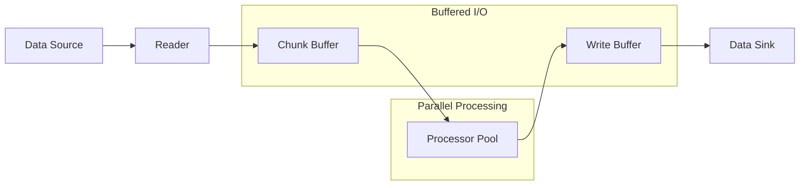
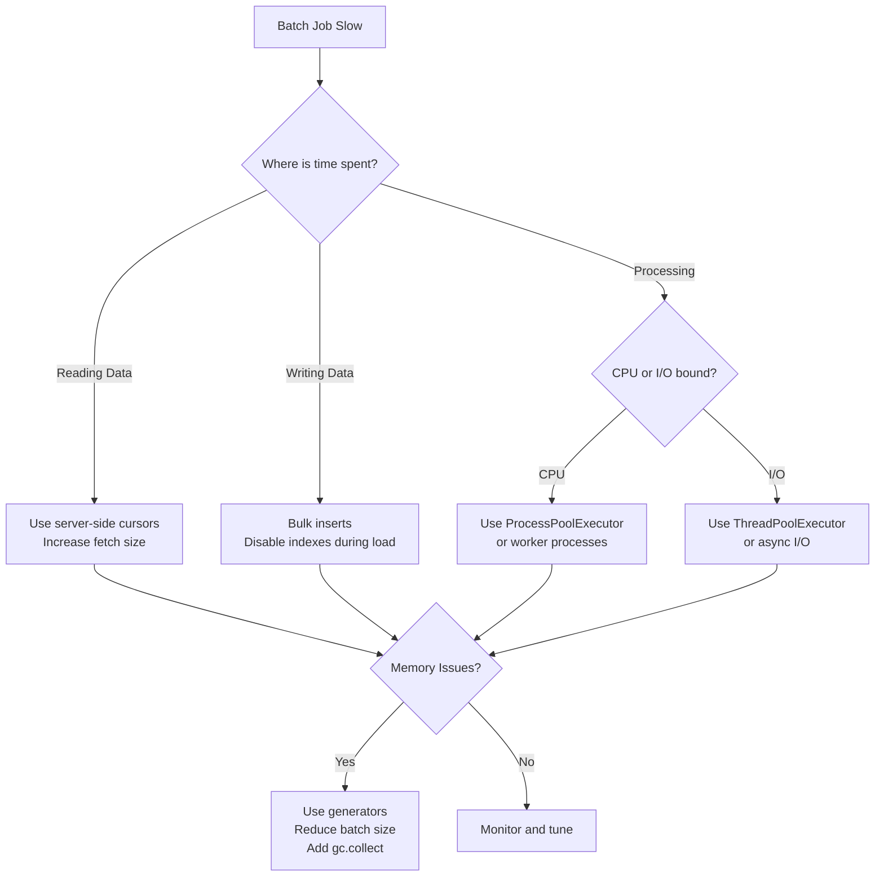

# How to Handle Batch Processing Optimization

Author: [nawazdhandala](https://www.github.com/nawazdhandala)

Tags: Batch Processing, Performance, Database, ETL, Python, Java, Optimization, Backend

Description: Learn techniques to optimize batch processing jobs including chunking strategies, parallel processing, and memory management.

---

Batch processing jobs that handle millions of records can take hours or even days when poorly optimized. The difference between a naive implementation and an optimized one can be 10-100x in execution time. This guide covers practical techniques to dramatically speed up your batch jobs while keeping memory usage under control.

## Batch Processing Architecture

A well-designed batch processing pipeline separates reading, processing, and writing into distinct phases that can be optimized independently.



## Chunking Strategies

Processing records one at a time creates excessive overhead. Chunking groups records into batches for efficient processing.

### Basic Chunking Pattern

```python
def process_in_chunks(items, chunk_size=1000):
    """Process items in chunks to reduce overhead"""
    chunk = []

    for item in items:
        chunk.append(item)

        if len(chunk) >= chunk_size:
            yield chunk
            chunk = []

    # Don't forget the last partial chunk
    if chunk:
        yield chunk


# Usage
for chunk in process_in_chunks(all_records, chunk_size=1000):
    process_batch(chunk)
```

### Database Cursor Chunking

Never load millions of rows into memory at once. Use server-side cursors.

**Python with PostgreSQL:**

```python
import psycopg2
from psycopg2.extras import RealDictCursor

def fetch_in_batches(connection_string, query, batch_size=5000):
    """Fetch large result sets in batches using server-side cursor"""
    conn = psycopg2.connect(connection_string)

    # Named cursor enables server-side cursors
    with conn.cursor(name='batch_cursor', cursor_factory=RealDictCursor) as cursor:
        cursor.itersize = batch_size  # Fetch this many rows at a time
        cursor.execute(query)

        while True:
            rows = cursor.fetchmany(batch_size)
            if not rows:
                break
            yield rows

    conn.close()


# Process 10 million rows without running out of memory
for batch in fetch_in_batches(conn_string, "SELECT * FROM large_table", batch_size=5000):
    process_batch(batch)
```

**Java with JDBC:**

```java
public void processBatches(Connection conn, String query, int batchSize) throws SQLException {
    // Enable streaming result set
    PreparedStatement stmt = conn.prepareStatement(query,
        ResultSet.TYPE_FORWARD_ONLY,
        ResultSet.CONCUR_READ_ONLY);
    stmt.setFetchSize(batchSize);  // Critical for streaming

    ResultSet rs = stmt.executeQuery();
    List<Row> batch = new ArrayList<>(batchSize);

    while (rs.next()) {
        batch.add(extractRow(rs));

        if (batch.size() >= batchSize) {
            processBatch(batch);
            batch.clear();
        }
    }

    // Process remaining rows
    if (!batch.isEmpty()) {
        processBatch(batch);
    }

    rs.close();
    stmt.close();
}
```

## Parallel Processing

Utilize multiple cores to process chunks concurrently.

### Python Parallel Processing

```python
from concurrent.futures import ProcessPoolExecutor, ThreadPoolExecutor
import multiprocessing

def process_chunk(chunk):
    """Process a single chunk - must be picklable for ProcessPoolExecutor"""
    results = []
    for record in chunk:
        # CPU-intensive processing
        result = transform_record(record)
        results.append(result)
    return results


def parallel_batch_process(data_source, chunk_size=1000, max_workers=None):
    """Process data in parallel using multiple processes"""
    if max_workers is None:
        max_workers = multiprocessing.cpu_count()

    all_results = []

    # Use ProcessPoolExecutor for CPU-bound work
    # Use ThreadPoolExecutor for I/O-bound work
    with ProcessPoolExecutor(max_workers=max_workers) as executor:
        # Submit chunks as they become available
        futures = []

        for chunk in process_in_chunks(data_source, chunk_size):
            future = executor.submit(process_chunk, chunk)
            futures.append(future)

            # Limit pending futures to control memory
            if len(futures) >= max_workers * 2:
                # Wait for some to complete before submitting more
                done_future = futures.pop(0)
                all_results.extend(done_future.result())

        # Collect remaining results
        for future in futures:
            all_results.extend(future.result())

    return all_results
```

### Go Worker Pool Pattern

```go
package main

import (
    "sync"
)

type Record struct {
    ID   int
    Data string
}

type Result struct {
    RecordID int
    Output   string
}

func processRecord(record Record) Result {
    // Simulate processing
    return Result{
        RecordID: record.ID,
        Output:   transform(record.Data),
    }
}

func parallelProcess(records []Record, numWorkers int) []Result {
    jobs := make(chan Record, numWorkers*2)    // Buffered channel
    results := make(chan Result, numWorkers*2)

    // Start worker pool
    var wg sync.WaitGroup
    for i := 0; i < numWorkers; i++ {
        wg.Add(1)
        go func() {
            defer wg.Done()
            for record := range jobs {
                results <- processRecord(record)
            }
        }()
    }

    // Send jobs in a separate goroutine
    go func() {
        for _, record := range records {
            jobs <- record
        }
        close(jobs)
    }()

    // Close results channel when workers are done
    go func() {
        wg.Wait()
        close(results)
    }()

    // Collect results
    var allResults []Result
    for result := range results {
        allResults = append(allResults, result)
    }

    return allResults
}
```

## Optimizing Database Writes

Writing one row at a time is extremely slow. Batch your inserts.

### Bulk Insert Pattern

```python
import psycopg2
from psycopg2.extras import execute_values

def bulk_insert(connection, table_name, records, batch_size=1000):
    """Insert records in batches using execute_values for best performance"""
    cursor = connection.cursor()

    # Prepare column names from first record
    columns = list(records[0].keys())
    columns_str = ', '.join(columns)

    for i in range(0, len(records), batch_size):
        batch = records[i:i + batch_size]

        # Convert dicts to tuples
        values = [tuple(record[col] for col in columns) for record in batch]

        # execute_values is much faster than executemany
        query = f"INSERT INTO {table_name} ({columns_str}) VALUES %s"
        execute_values(cursor, query, values, page_size=batch_size)

        connection.commit()
        print(f"Inserted {i + len(batch)} / {len(records)} records")

    cursor.close()
```

### Upsert with Conflict Handling

```python
def bulk_upsert(connection, table_name, records, conflict_columns, update_columns, batch_size=1000):
    """Bulk upsert with ON CONFLICT handling"""
    cursor = connection.cursor()

    columns = list(records[0].keys())
    columns_str = ', '.join(columns)
    conflict_str = ', '.join(conflict_columns)
    update_str = ', '.join(f"{col} = EXCLUDED.{col}" for col in update_columns)

    query = f"""
        INSERT INTO {table_name} ({columns_str}) VALUES %s
        ON CONFLICT ({conflict_str}) DO UPDATE SET {update_str}
    """

    for i in range(0, len(records), batch_size):
        batch = records[i:i + batch_size]
        values = [tuple(record[col] for col in columns) for record in batch]

        execute_values(cursor, query, values, page_size=batch_size)
        connection.commit()

    cursor.close()


# Usage
bulk_upsert(
    conn,
    'users',
    user_records,
    conflict_columns=['email'],
    update_columns=['name', 'updated_at']
)
```

## Memory Management

Large batch jobs can easily exhaust memory. Here are patterns to keep usage under control.

### Generator-Based Pipeline

```python
def read_records(file_path):
    """Generator that yields records one at a time"""
    with open(file_path, 'r') as f:
        for line in f:
            yield parse_line(line)


def transform_records(records):
    """Transform generator - processes lazily"""
    for record in records:
        yield transform(record)


def batch_records(records, batch_size):
    """Batch generator output"""
    batch = []
    for record in records:
        batch.append(record)
        if len(batch) >= batch_size:
            yield batch
            batch = []
    if batch:
        yield batch


# Pipeline processes data lazily - only one batch in memory at a time
pipeline = batch_records(
    transform_records(
        read_records('huge_file.csv')
    ),
    batch_size=1000
)

for batch in pipeline:
    write_batch(batch)
```

### Explicit Memory Cleanup

```python
import gc

def process_large_dataset(data_source):
    """Process with explicit memory management"""
    processed_count = 0

    for chunk in fetch_in_batches(data_source, batch_size=10000):
        # Process chunk
        results = process_chunk(chunk)
        write_results(results)

        processed_count += len(chunk)

        # Explicit cleanup every 100k records
        if processed_count % 100000 == 0:
            del chunk
            del results
            gc.collect()
            print(f"Processed {processed_count} records, memory cleaned")
```

## Progress Tracking and Checkpointing

Long-running jobs should save progress to allow resumption after failures.

```python
import json
import os

class BatchCheckpoint:
    def __init__(self, checkpoint_file):
        self.checkpoint_file = checkpoint_file
        self.state = self._load_or_create()

    def _load_or_create(self):
        if os.path.exists(self.checkpoint_file):
            with open(self.checkpoint_file, 'r') as f:
                return json.load(f)
        return {'last_processed_id': 0, 'processed_count': 0}

    def save(self):
        with open(self.checkpoint_file, 'w') as f:
            json.dump(self.state, f)

    def update(self, last_id, count):
        self.state['last_processed_id'] = last_id
        self.state['processed_count'] += count
        self.save()

    @property
    def last_processed_id(self):
        return self.state['last_processed_id']


def resumable_batch_process(data_source, checkpoint_file='checkpoint.json'):
    """Batch process with checkpoint support for resumption"""
    checkpoint = BatchCheckpoint(checkpoint_file)

    # Resume from last checkpoint
    query = f"""
        SELECT * FROM records
        WHERE id > {checkpoint.last_processed_id}
        ORDER BY id
    """

    for batch in fetch_in_batches(data_source, query, batch_size=1000):
        process_batch(batch)

        # Save checkpoint after each batch
        last_id = batch[-1]['id']
        checkpoint.update(last_id, len(batch))

        print(f"Checkpoint saved: processed up to ID {last_id}")
```

## Optimization Decision Flow



## Performance Comparison

| Technique | 1M Records | 10M Records | Memory Usage |
|-----------|-----------|-------------|--------------|
| Naive (one by one) | 45 min | 7+ hours | High |
| Basic chunking (1000) | 8 min | 80 min | Low |
| Parallel (4 workers) | 3 min | 25 min | Medium |
| Bulk insert + parallel | 1 min | 8 min | Medium |

## Summary

Optimizing batch processing involves several key techniques:

1. **Chunk your data** - Process in batches of 1000-10000 records
2. **Use server-side cursors** - Never load entire datasets into memory
3. **Parallelize processing** - Use worker pools for CPU-bound work
4. **Bulk database operations** - Use execute_values or COPY for inserts
5. **Implement checkpointing** - Save progress for resumable jobs
6. **Manage memory explicitly** - Use generators and periodic cleanup

Start by profiling to find your actual bottleneck. Often the biggest gains come from batching database operations, which can improve performance by 10-50x with minimal code changes. Add parallelization for CPU-intensive transformations, and always implement checkpointing for jobs that run longer than a few minutes.
