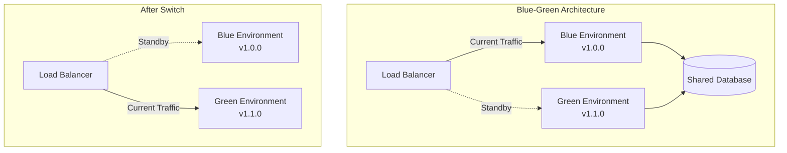
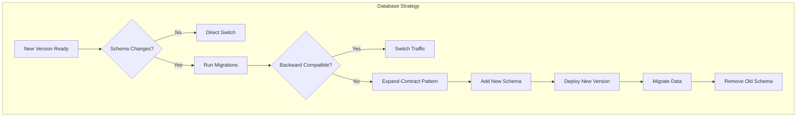

# How to Configure Blue-Green Deployments

Author: [nawazdhandala](https://www.github.com/nawazdhandala)

Tags: Blue-Green Deployment, Kubernetes, DevOps, Zero Downtime, Deployment Strategy, AWS, Load Balancer

Description: Learn how to configure blue-green deployments for zero-downtime releases with instant rollback capability using Kubernetes, AWS, and other platforms.

---

Blue-green deployments maintain two identical production environments, allowing you to switch traffic instantly between versions. This strategy provides the fastest rollback possible since the previous version remains running and ready to receive traffic. While it requires more infrastructure resources, the safety and simplicity of blue-green deployments make them ideal for critical applications.

## How Blue-Green Deployments Work

The core concept is simple: run two complete environments and switch traffic between them.



## Kubernetes Blue-Green with Services

The simplest Kubernetes blue-green deployment uses Service selector switching.

### Step 1: Deploy Blue Environment

```yaml
# blue-deployment.yaml
apiVersion: apps/v1
kind: Deployment
metadata:
  name: web-api-blue
  namespace: production
  labels:
    app: web-api
    version: blue
spec:
  replicas: 3
  selector:
    matchLabels:
      app: web-api
      version: blue
  template:
    metadata:
      labels:
        app: web-api
        version: blue
        deployment-color: blue
    spec:
      containers:
        - name: api
          image: myapp/api:v1.0.0
          ports:
            - containerPort: 8080
          readinessProbe:
            httpGet:
              path: /health
              port: 8080
            initialDelaySeconds: 5
            periodSeconds: 5
          resources:
            requests:
              cpu: 100m
              memory: 128Mi
            limits:
              cpu: 500m
              memory: 512Mi
```

### Step 2: Create Service Pointing to Blue

```yaml
# service.yaml
apiVersion: v1
kind: Service
metadata:
  name: web-api
  namespace: production
spec:
  selector:
    app: web-api
    version: blue  # Currently pointing to blue
  ports:
    - port: 80
      targetPort: 8080
  type: ClusterIP
```

### Step 3: Deploy Green Environment

```yaml
# green-deployment.yaml
apiVersion: apps/v1
kind: Deployment
metadata:
  name: web-api-green
  namespace: production
  labels:
    app: web-api
    version: green
spec:
  replicas: 3
  selector:
    matchLabels:
      app: web-api
      version: green
  template:
    metadata:
      labels:
        app: web-api
        version: green
        deployment-color: green
    spec:
      containers:
        - name: api
          image: myapp/api:v1.1.0  # New version
          ports:
            - containerPort: 8080
          readinessProbe:
            httpGet:
              path: /health
              port: 8080
            initialDelaySeconds: 5
            periodSeconds: 5
          resources:
            requests:
              cpu: 100m
              memory: 128Mi
            limits:
              cpu: 500m
              memory: 512Mi
```

### Step 4: Test Green Before Switching

Create a separate service for testing the green environment:

```yaml
# green-test-service.yaml
apiVersion: v1
kind: Service
metadata:
  name: web-api-green-test
  namespace: production
spec:
  selector:
    app: web-api
    version: green
  ports:
    - port: 80
      targetPort: 8080
  type: ClusterIP
```

Run smoke tests against the green environment:

```bash
#!/bin/bash
# test-green.sh

GREEN_SERVICE="web-api-green-test.production.svc.cluster.local"

echo "Running smoke tests against green environment..."

# Test health endpoint
HTTP_CODE=$(curl -s -o /dev/null -w "%{http_code}" "http://${GREEN_SERVICE}/health")
if [ "$HTTP_CODE" != "200" ]; then
  echo "FAIL: Health check returned $HTTP_CODE"
  exit 1
fi

# Test critical API endpoints
HTTP_CODE=$(curl -s -o /dev/null -w "%{http_code}" "http://${GREEN_SERVICE}/api/v1/status")
if [ "$HTTP_CODE" != "200" ]; then
  echo "FAIL: Status endpoint returned $HTTP_CODE"
  exit 1
fi

echo "All smoke tests passed"
```

### Step 5: Switch Traffic to Green

```bash
# switch-to-green.sh
kubectl patch service web-api -n production \
  -p '{"spec":{"selector":{"app":"web-api","version":"green"}}}'

echo "Traffic switched to green environment"

# Verify the switch
kubectl get service web-api -n production -o jsonpath='{.spec.selector}'
```

### Step 6: Rollback to Blue (If Needed)

```bash
# rollback-to-blue.sh
kubectl patch service web-api -n production \
  -p '{"spec":{"selector":{"app":"web-api","version":"blue"}}}'

echo "Traffic rolled back to blue environment"
```

## Blue-Green with Argo Rollouts

Argo Rollouts provides a more sophisticated blue-green implementation with automatic promotion and analysis.

```yaml
# argo-rollout-blue-green.yaml
apiVersion: argoproj.io/v1alpha1
kind: Rollout
metadata:
  name: web-api
  namespace: production
spec:
  replicas: 3
  revisionHistoryLimit: 2
  selector:
    matchLabels:
      app: web-api
  template:
    metadata:
      labels:
        app: web-api
    spec:
      containers:
        - name: api
          image: myapp/api:v1.0.0
          ports:
            - containerPort: 8080
          readinessProbe:
            httpGet:
              path: /health
              port: 8080
            initialDelaySeconds: 5
            periodSeconds: 5
  strategy:
    blueGreen:
      # Service that receives production traffic
      activeService: web-api-active
      # Service for testing the new version before promotion
      previewService: web-api-preview
      # Require manual promotion (set to true for auto-promotion)
      autoPromotionEnabled: false
      # Scale down old version after this delay
      scaleDownDelaySeconds: 300
      # Run analysis before promoting
      prePromotionAnalysis:
        templates:
          - templateName: smoke-tests
        args:
          - name: service-name
            value: web-api-preview
---
# Active service - receives production traffic
apiVersion: v1
kind: Service
metadata:
  name: web-api-active
  namespace: production
spec:
  ports:
    - port: 80
      targetPort: 8080
  selector:
    app: web-api
---
# Preview service - for testing new version
apiVersion: v1
kind: Service
metadata:
  name: web-api-preview
  namespace: production
spec:
  ports:
    - port: 80
      targetPort: 8080
  selector:
    app: web-api
---
# Analysis template for pre-promotion testing
apiVersion: argoproj.io/v1alpha1
kind: AnalysisTemplate
metadata:
  name: smoke-tests
  namespace: production
spec:
  args:
    - name: service-name
  metrics:
    - name: smoke-test
      provider:
        job:
          spec:
            backoffLimit: 1
            template:
              spec:
                containers:
                  - name: smoke-test
                    image: curlimages/curl:latest
                    command:
                      - /bin/sh
                      - -c
                      - |
                        # Test health endpoint
                        curl -f http://{{args.service-name}}/health || exit 1
                        # Test API endpoint
                        curl -f http://{{args.service-name}}/api/v1/status || exit 1
                        echo "Smoke tests passed"
                restartPolicy: Never
```

### Managing Argo Rollouts Blue-Green

```bash
# Check rollout status
kubectl argo rollouts get rollout web-api -n production

# Promote the green version to active
kubectl argo rollouts promote web-api -n production

# Abort and rollback if issues are found
kubectl argo rollouts abort web-api -n production

# Watch the rollout in real-time
kubectl argo rollouts get rollout web-api -n production --watch
```

## AWS Application Load Balancer Blue-Green

For AWS deployments, use ALB with target groups for blue-green switching.

```hcl
# terraform/blue-green-alb.tf

# Two target groups - one for each environment
resource "aws_lb_target_group" "blue" {
  name        = "web-api-blue"
  port        = 8080
  protocol    = "HTTP"
  vpc_id      = var.vpc_id
  target_type = "ip"

  health_check {
    path                = "/health"
    healthy_threshold   = 2
    unhealthy_threshold = 3
    timeout             = 5
    interval            = 10
  }

  tags = {
    Environment = "production"
    Color       = "blue"
  }
}

resource "aws_lb_target_group" "green" {
  name        = "web-api-green"
  port        = 8080
  protocol    = "HTTP"
  vpc_id      = var.vpc_id
  target_type = "ip"

  health_check {
    path                = "/health"
    healthy_threshold   = 2
    unhealthy_threshold = 3
    timeout             = 5
    interval            = 10
  }

  tags = {
    Environment = "production"
    Color       = "green"
  }
}

# ALB listener with weighted routing
resource "aws_lb_listener" "web" {
  load_balancer_arn = aws_lb.main.arn
  port              = 443
  protocol          = "HTTPS"
  ssl_policy        = "ELBSecurityPolicy-TLS13-1-2-2021-06"
  certificate_arn   = var.certificate_arn

  default_action {
    type = "forward"
    forward {
      # Start with 100% to blue
      target_group {
        arn    = aws_lb_target_group.blue.arn
        weight = 100
      }
      target_group {
        arn    = aws_lb_target_group.green.arn
        weight = 0
      }
    }
  }
}
```

### Switching Traffic with AWS CLI

```bash
#!/bin/bash
# aws-blue-green-switch.sh

LISTENER_ARN="arn:aws:elasticloadbalancing:us-east-1:123456789:listener/app/web-api/abc123/def456"
BLUE_TG="arn:aws:elasticloadbalancing:us-east-1:123456789:targetgroup/web-api-blue/abc123"
GREEN_TG="arn:aws:elasticloadbalancing:us-east-1:123456789:targetgroup/web-api-green/def456"

switch_to_green() {
  aws elbv2 modify-listener --listener-arn $LISTENER_ARN \
    --default-actions '[{
      "Type": "forward",
      "ForwardConfig": {
        "TargetGroups": [
          {"TargetGroupArn": "'$BLUE_TG'", "Weight": 0},
          {"TargetGroupArn": "'$GREEN_TG'", "Weight": 100}
        ]
      }
    }]'
  echo "Traffic switched to green"
}

switch_to_blue() {
  aws elbv2 modify-listener --listener-arn $LISTENER_ARN \
    --default-actions '[{
      "Type": "forward",
      "ForwardConfig": {
        "TargetGroups": [
          {"TargetGroupArn": "'$BLUE_TG'", "Weight": 100},
          {"TargetGroupArn": "'$GREEN_TG'", "Weight": 0}
        ]
      }
    }]'
  echo "Traffic switched to blue"
}

case "$1" in
  green) switch_to_green ;;
  blue)  switch_to_blue ;;
  *)     echo "Usage: $0 {green|blue}" ;;
esac
```

## Database Considerations

Blue-green deployments require careful database handling since both environments share the same database.



### Example: Backward-Compatible Migration

```sql
-- Step 1: Add new column (both blue and green can work)
ALTER TABLE users ADD COLUMN email_normalized VARCHAR(255);

-- Step 2: Backfill data (can run while both versions are active)
UPDATE users SET email_normalized = LOWER(email) WHERE email_normalized IS NULL;

-- Step 3: After green is stable and blue is decommissioned
-- Create index and make column required
CREATE INDEX idx_users_email_normalized ON users(email_normalized);
ALTER TABLE users ALTER COLUMN email_normalized SET NOT NULL;
```

## Monitoring Blue-Green Deployments

Track which environment is active and monitor both:

```yaml
# prometheus-rules.yaml
apiVersion: monitoring.coreos.com/v1
kind: PrometheusRule
metadata:
  name: blue-green-alerts
spec:
  groups:
    - name: blue-green
      rules:
        # Alert if green environment has errors after switch
        - alert: GreenEnvironmentErrors
          expr: |
            sum(rate(http_requests_total{status=~"5.*",deployment_color="green"}[5m]))
            /
            sum(rate(http_requests_total{deployment_color="green"}[5m]))
            > 0.01
          for: 2m
          labels:
            severity: critical
          annotations:
            summary: "Green environment error rate above 1%"
            description: "Consider rolling back to blue"

        # Track which environment is receiving traffic
        - record: deployment:active_environment
          expr: |
            count(kube_pod_labels{label_deployment_color="green"}) > 0
            and
            sum(rate(http_requests_total{deployment_color="green"}[1m])) > 0
```

## Summary

Blue-green deployments provide the safest deployment strategy with instant rollback capability. Key points to remember:

1. Maintain two identical environments with independent deployments
2. Use a service or load balancer to switch traffic between environments
3. Always test the inactive environment before switching
4. Handle database migrations with backward-compatible changes
5. Keep the old environment running until the new version is verified
6. Automate the switch and rollback procedures

The trade-off is running double the infrastructure during deployments, but for critical applications, the safety and speed of rollback make blue-green deployments worth the cost.
