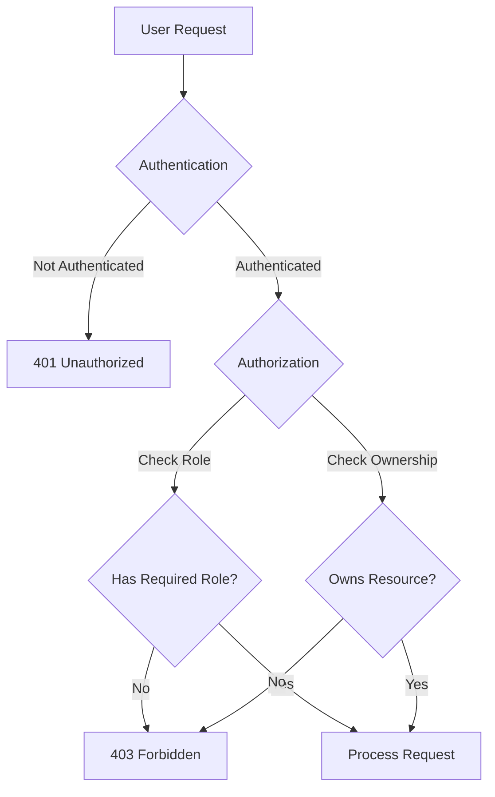
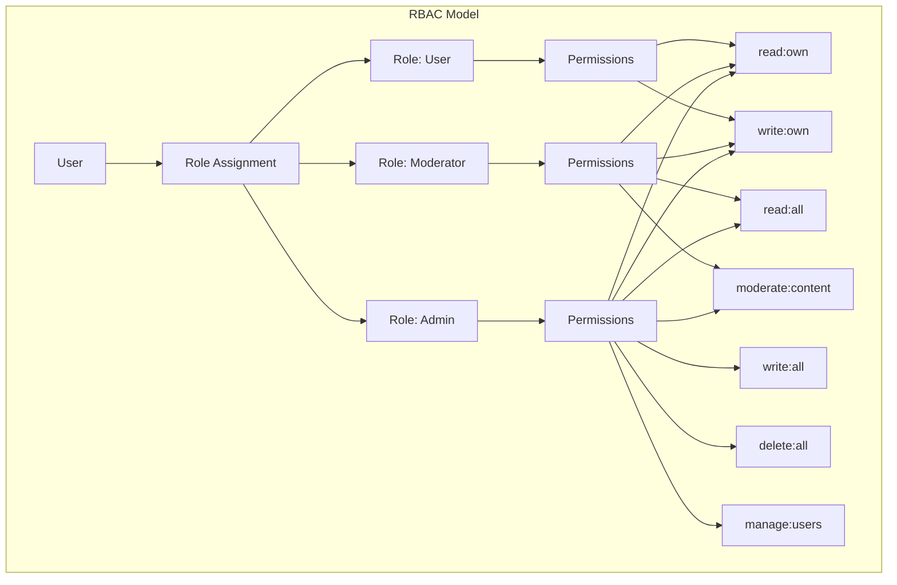
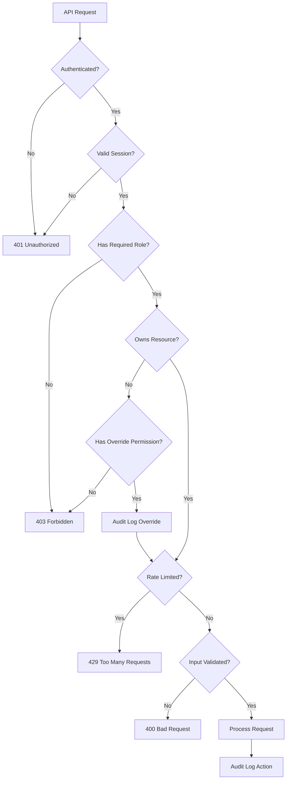

# How to Fix "Broken Access Control" Vulnerabilities

Author: [nawazdhandala](https://github.com/nawazdhandala)

Tags: Security, OWASP, Access Control, Authorization, Backend

Description: Learn how to identify and fix broken access control vulnerabilities including IDOR, privilege escalation, and missing authorization checks.

---

Broken Access Control consistently ranks as the number one vulnerability in the OWASP Top 10. It occurs when users can access resources or perform actions beyond their intended permissions. This guide covers common access control flaws and how to fix them with practical code examples.

## Understanding Access Control Vulnerabilities

Access control determines what authenticated users are allowed to do. When these controls fail, attackers can view other users' data, modify records they shouldn't access, or perform administrative actions.



## Common Vulnerability Types

### 1. Insecure Direct Object References (IDOR)

IDOR occurs when an application exposes internal object references (like database IDs) and fails to verify that the user has permission to access them.

```javascript
// VULNERABLE: No ownership check
// Attacker can change the ID to access any user's data
app.get('/api/users/:id/documents', async (req, res) => {
  const documents = await Document.find({ userId: req.params.id });
  res.json(documents);  // Returns ANY user's documents!
});

// FIXED: Verify the user owns the requested resource
app.get('/api/users/:id/documents', authenticate, async (req, res) => {
  // First check: is the user requesting their own data?
  if (req.params.id !== req.user.id) {
    // Second check: is the user an admin who can access others' data?
    if (!req.user.roles.includes('admin')) {
      return res.status(403).json({ error: 'Access denied' });
    }
  }

  const documents = await Document.find({ userId: req.params.id });
  res.json(documents);
});
```

### Better Approach: Query-Based Authorization

```javascript
// BETTER: Include user ID in the query itself
// This is more secure because it's impossible to forget the check
app.get('/api/documents/:docId', authenticate, async (req, res) => {
  // Query requires BOTH document ID AND user ownership
  const document = await Document.findOne({
    _id: req.params.docId,
    $or: [
      { userId: req.user.id },      // User owns the document
      { sharedWith: req.user.id }   // Document is shared with user
    ]
  });

  // Return 404 for both "not found" AND "not authorized"
  // This prevents enumeration attacks
  if (!document) {
    return res.status(404).json({ error: 'Document not found' });
  }

  res.json(document);
});
```

### 2. Horizontal Privilege Escalation

Horizontal escalation occurs when a user accesses another user's resources at the same privilege level.

```javascript
// VULNERABLE: User can change their account to any account
app.put('/api/profile', authenticate, async (req, res) => {
  const { userId, name, email } = req.body;

  // Attacker can modify userId in the request body!
  await User.updateOne({ _id: userId }, { name, email });
  res.json({ success: true });
});

// FIXED: Never trust user input for identity
app.put('/api/profile', authenticate, async (req, res) => {
  const { name, email } = req.body;

  // Use authenticated user's ID from the session, not from request body
  await User.updateOne(
    { _id: req.user.id },  // Always use server-side user identity
    { name, email }
  );

  res.json({ success: true });
});
```

### 3. Vertical Privilege Escalation

Vertical escalation occurs when a regular user gains admin-level access.

```javascript
// VULNERABLE: Role can be set via request body
app.post('/api/users/register', async (req, res) => {
  const user = await User.create({
    email: req.body.email,
    password: await hashPassword(req.body.password),
    role: req.body.role  // Attacker sets role: "admin"!
  });

  res.json(user);
});

// FIXED: Never accept role from user input
app.post('/api/users/register', async (req, res) => {
  // Extract only expected fields - ignore everything else
  const { email, password } = req.body;

  const user = await User.create({
    email,
    password: await hashPassword(password),
    role: 'user'  // Hardcoded default role
  });

  res.json({ id: user.id, email: user.email, role: user.role });
});

// Admin-only endpoint to change roles
app.put('/api/admin/users/:id/role', authenticate, requireRole('admin'), async (req, res) => {
  const { role } = req.body;

  // Validate the role is a valid option
  const validRoles = ['user', 'moderator', 'admin'];
  if (!validRoles.includes(role)) {
    return res.status(400).json({ error: 'Invalid role' });
  }

  await User.updateOne({ _id: req.params.id }, { role });
  res.json({ success: true });
});
```

## Implementing Role-Based Access Control (RBAC)



```javascript
// Define role hierarchy and permissions
const ROLES = {
  user: {
    permissions: ['read:own', 'write:own', 'delete:own']
  },
  moderator: {
    inherits: ['user'],
    permissions: ['read:all', 'moderate:content']
  },
  admin: {
    inherits: ['moderator'],
    permissions: ['write:all', 'delete:all', 'manage:users']
  }
};

// Recursively get all permissions for a role
function getPermissions(role) {
  const roleConfig = ROLES[role];
  if (!roleConfig) return [];

  const inherited = (roleConfig.inherits || [])
    .flatMap(parentRole => getPermissions(parentRole));

  return [...new Set([...inherited, ...roleConfig.permissions])];
}

// Check if user has a specific permission
function hasPermission(user, requiredPermission) {
  const userPermissions = getPermissions(user.role);
  return userPermissions.includes(requiredPermission);
}

// Middleware factory for permission checks
function requirePermission(permission) {
  return (req, res, next) => {
    if (!req.user) {
      return res.status(401).json({ error: 'Authentication required' });
    }

    if (!hasPermission(req.user, permission)) {
      // Log the authorization failure for security monitoring
      console.warn(`Access denied: User ${req.user.id} lacks ${permission}`);
      return res.status(403).json({
        error: 'Insufficient permissions',
        required: permission
      });
    }

    next();
  };
}

// Usage in routes
app.get('/api/posts', authenticate, requirePermission('read:own'), async (req, res) => {
  // User can only see their own posts
  const posts = await Post.find({ authorId: req.user.id });
  res.json(posts);
});

app.get('/api/admin/posts', authenticate, requirePermission('read:all'), async (req, res) => {
  // Admin/moderator can see all posts
  const posts = await Post.find({});
  res.json(posts);
});
```

## Attribute-Based Access Control (ABAC)

For complex scenarios, ABAC provides more granular control based on multiple attributes.

```javascript
// ABAC policy engine
class AccessPolicy {
  constructor() {
    this.rules = [];
  }

  // Add a rule to the policy
  addRule(rule) {
    this.rules.push(rule);
  }

  // Evaluate if access should be granted
  evaluate(subject, action, resource, environment = {}) {
    for (const rule of this.rules) {
      const result = rule.evaluate(subject, action, resource, environment);
      if (result === 'DENY') return false;  // Explicit deny takes precedence
      if (result === 'ALLOW') return true;
    }
    return false;  // Default deny
  }
}

// Example rules
const policy = new AccessPolicy();

// Rule: Users can read their own documents
policy.addRule({
  evaluate: (subject, action, resource, env) => {
    if (action === 'read' &&
        resource.type === 'document' &&
        resource.ownerId === subject.id) {
      return 'ALLOW';
    }
    return 'CONTINUE';
  }
});

// Rule: Users can read documents shared with them
policy.addRule({
  evaluate: (subject, action, resource, env) => {
    if (action === 'read' &&
        resource.type === 'document' &&
        resource.sharedWith?.includes(subject.id)) {
      return 'ALLOW';
    }
    return 'CONTINUE';
  }
});

// Rule: Admins can do anything
policy.addRule({
  evaluate: (subject, action, resource, env) => {
    if (subject.role === 'admin') {
      return 'ALLOW';
    }
    return 'CONTINUE';
  }
});

// Rule: Block access during maintenance window
policy.addRule({
  evaluate: (subject, action, resource, env) => {
    if (env.maintenanceMode && subject.role !== 'admin') {
      return 'DENY';
    }
    return 'CONTINUE';
  }
});

// Middleware using the policy engine
function authorize(action, getResource) {
  return async (req, res, next) => {
    const resource = await getResource(req);
    const environment = {
      maintenanceMode: process.env.MAINTENANCE_MODE === 'true',
      ipAddress: req.ip,
      timestamp: new Date()
    };

    if (!policy.evaluate(req.user, action, resource, environment)) {
      return res.status(403).json({ error: 'Access denied' });
    }

    req.resource = resource;
    next();
  };
}

// Usage
app.get('/api/documents/:id',
  authenticate,
  authorize('read', async (req) => {
    const doc = await Document.findById(req.params.id);
    return { type: 'document', ...doc.toObject() };
  }),
  (req, res) => {
    res.json(req.resource);
  }
);
```

## Protecting Against Path Traversal

```javascript
const path = require('path');

// VULNERABLE: Path traversal attack
app.get('/files/:filename', (req, res) => {
  const filepath = `./uploads/${req.params.filename}`;
  res.sendFile(filepath);  // Attacker: "../../../etc/passwd"
});

// FIXED: Validate and sanitize the path
app.get('/files/:filename', authenticate, (req, res) => {
  const filename = req.params.filename;

  // Remove any path traversal attempts
  const sanitizedFilename = path.basename(filename);

  // Construct the full path
  const uploadsDir = path.resolve('./uploads');
  const filepath = path.join(uploadsDir, sanitizedFilename);

  // Verify the resolved path is still within uploads directory
  if (!filepath.startsWith(uploadsDir)) {
    return res.status(400).json({ error: 'Invalid filename' });
  }

  // Also verify the user owns this file
  File.findOne({ filename: sanitizedFilename, userId: req.user.id })
    .then(file => {
      if (!file) {
        return res.status(404).json({ error: 'File not found' });
      }
      res.sendFile(filepath);
    });
});
```

## API Endpoint Security Checklist



## Centralized Authorization Service

```javascript
// Centralized authorization service
class AuthorizationService {
  constructor(database, auditLogger) {
    this.db = database;
    this.audit = auditLogger;
  }

  async canAccess(userId, resourceType, resourceId, action) {
    // Get user with their roles
    const user = await this.db.users.findById(userId);
    if (!user) return false;

    // Get the resource
    const resource = await this.db[resourceType].findById(resourceId);
    if (!resource) return false;

    // Check ownership
    const isOwner = resource.ownerId === userId;

    // Check if resource is shared with user
    const isShared = resource.sharedWith?.includes(userId);

    // Check role-based permissions
    const userPermissions = getPermissions(user.role);
    const hasRolePermission = userPermissions.includes(`${action}:all`);
    const hasOwnPermission = userPermissions.includes(`${action}:own`) && isOwner;

    const allowed = hasRolePermission || hasOwnPermission || (action === 'read' && isShared);

    // Always log authorization decisions
    await this.audit.log({
      userId,
      resourceType,
      resourceId,
      action,
      allowed,
      reason: allowed ? 'authorized' : 'denied',
      timestamp: new Date()
    });

    return allowed;
  }
}

// Use in routes
const authService = new AuthorizationService(db, auditLogger);

app.delete('/api/:resourceType/:id', authenticate, async (req, res) => {
  const { resourceType, id } = req.params;

  // Validate resource type
  const validTypes = ['documents', 'comments', 'posts'];
  if (!validTypes.includes(resourceType)) {
    return res.status(400).json({ error: 'Invalid resource type' });
  }

  // Check authorization
  const canDelete = await authService.canAccess(
    req.user.id,
    resourceType,
    id,
    'delete'
  );

  if (!canDelete) {
    return res.status(403).json({ error: 'Access denied' });
  }

  // Perform deletion
  await db[resourceType].deleteOne({ _id: id });
  res.json({ success: true });
});
```

## Testing for Access Control Vulnerabilities

```javascript
// Test cases for access control
describe('Access Control Tests', () => {
  describe('IDOR Prevention', () => {
    it('should not allow user to access another user\'s document', async () => {
      const user1Token = await loginAsUser('user1@test.com');
      const user2Doc = await createDocumentAsUser('user2@test.com');

      const response = await request(app)
        .get(`/api/documents/${user2Doc.id}`)
        .set('Authorization', `Bearer ${user1Token}`);

      expect(response.status).toBe(404);  // Not 403, to prevent enumeration
    });
  });

  describe('Vertical Privilege Escalation', () => {
    it('should not allow regular user to access admin endpoints', async () => {
      const userToken = await loginAsUser('user@test.com');

      const response = await request(app)
        .get('/api/admin/users')
        .set('Authorization', `Bearer ${userToken}`);

      expect(response.status).toBe(403);
    });

    it('should not allow role escalation via request body', async () => {
      const userToken = await loginAsUser('user@test.com');

      const response = await request(app)
        .put('/api/profile')
        .set('Authorization', `Bearer ${userToken}`)
        .send({ role: 'admin', name: 'Hacker' });

      // Verify role was not changed
      const user = await User.findOne({ email: 'user@test.com' });
      expect(user.role).toBe('user');
    });
  });
});
```

## Security Best Practices Summary

| Practice | Description | Priority |
|----------|-------------|----------|
| Default deny | Deny access unless explicitly granted | Critical |
| Server-side identity | Never trust client-provided user IDs | Critical |
| Ownership verification | Always check resource ownership | Critical |
| Role-based access | Implement RBAC or ABAC | High |
| Audit logging | Log all authorization decisions | High |
| Input validation | Validate resource IDs and types | High |
| Centralized authorization | Use a single authorization service | Medium |
| Regular testing | Automate access control tests | Medium |

Broken access control vulnerabilities are dangerous because they are often overlooked during development. By implementing systematic authorization checks, using centralized policy engines, and testing thoroughly, you can prevent unauthorized access to sensitive resources and actions in your applications.
