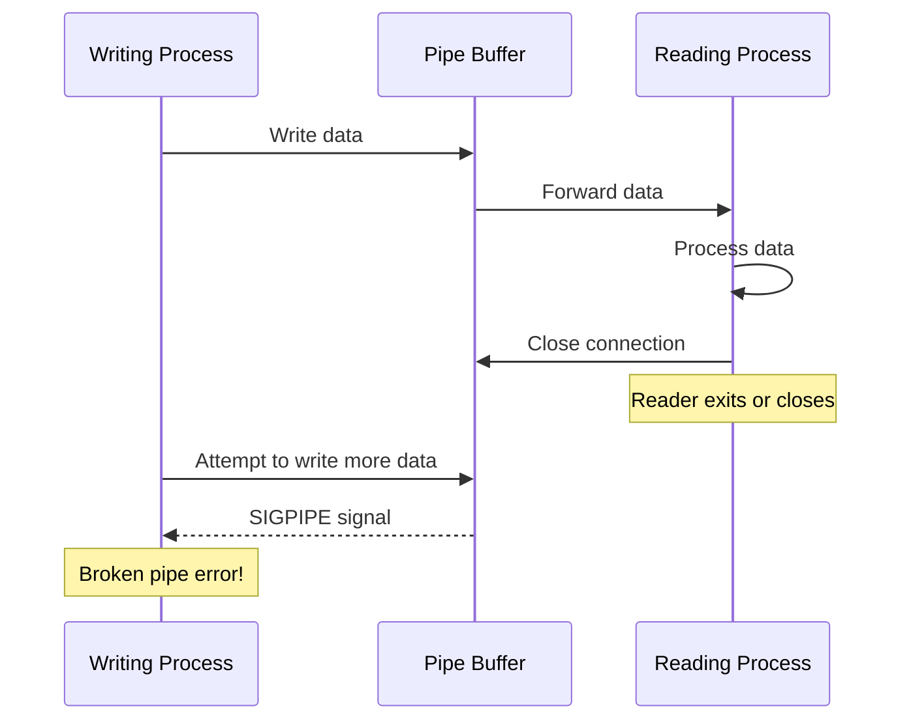
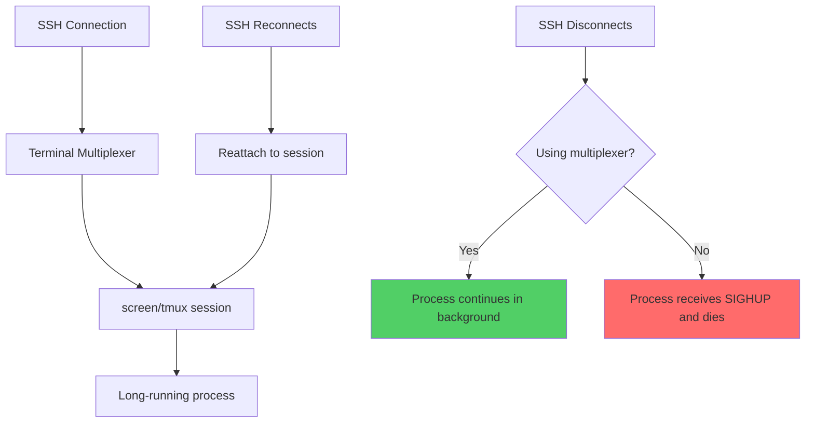
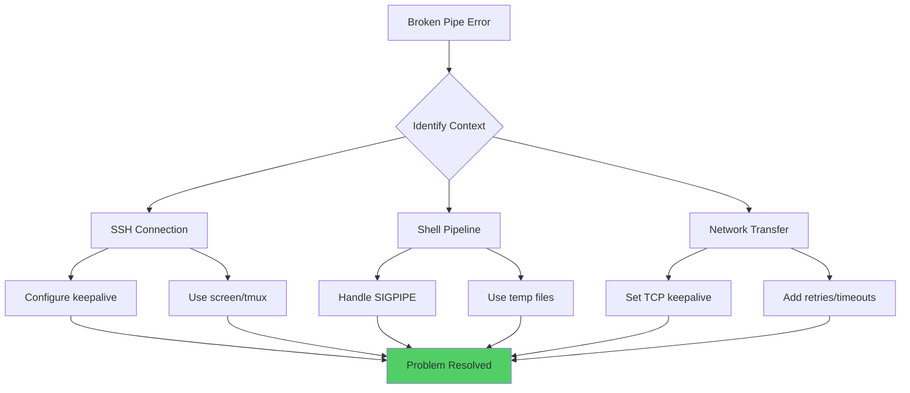
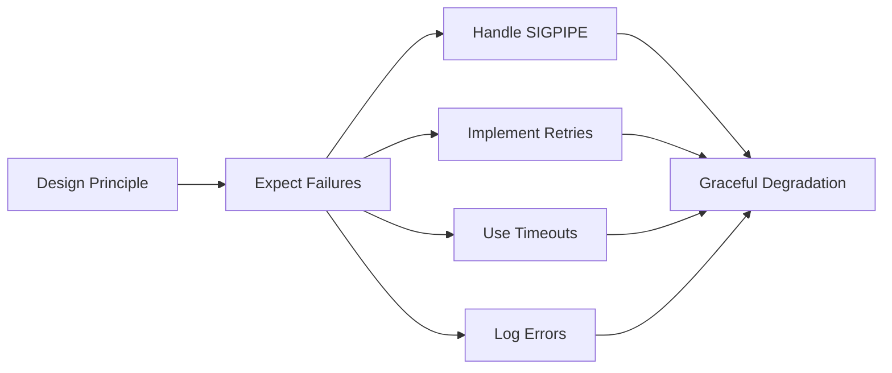

# How to Fix "Broken Pipe" Errors in Linux

Author: [nawazdhandala](https://www.github.com/nawazdhandala)

Tags: Linux, Troubleshooting, Networking, SSH, Pipes, System Administration, Signals

Description: Learn how to diagnose and fix broken pipe errors in Linux, including SSH disconnections, pipeline failures, and network timeouts.

---

The "Broken pipe" error is a common issue that Linux administrators encounter in various contexts, from SSH connections dropping unexpectedly to pipeline commands failing mid-execution. Understanding what causes broken pipes and how to prevent them is crucial for maintaining reliable systems and scripts.

## Understanding Broken Pipe Errors

A broken pipe occurs when a process tries to write to a pipe (a communication channel between processes) but the reading end of that pipe has been closed. The system sends a SIGPIPE signal to the writing process, which typically terminates the process and produces the "Broken pipe" error message.



## Common Scenarios for Broken Pipe Errors

### Scenario 1: SSH Connection Drops

The most common broken pipe scenario is when SSH connections timeout due to inactivity.

```bash
# Example error message
Write failed: Broken pipe
client_loop: send disconnect: Broken pipe
```

### Scenario 2: Pipeline Commands

When using pipes between commands, if the receiving command exits early:

```bash
# This can cause a broken pipe if head closes before yes finishes
yes | head -10

# This might fail if the remote end disconnects
cat largefile.txt | ssh user@server 'cat > /remote/path'
```

### Scenario 3: Network Operations

Network connections timing out during data transfers:

```bash
# Long-running operations over network connections
rsync -avz large_directory/ user@server:/backup/
```

## Fixing SSH Broken Pipe Errors

SSH broken pipes are typically caused by idle connection timeouts. Here are several solutions:

### Client-Side Configuration

Edit your SSH client configuration to send keepalive packets:

```bash
# Edit the SSH client config file
# This configuration applies to all SSH connections from this client
sudo nano ~/.ssh/config
```

Add the following configuration:

```
# Global SSH client settings
Host *
    # Send a keepalive packet every 60 seconds
    ServerAliveInterval 60

    # Disconnect after 3 failed keepalive attempts (180 seconds of unresponsiveness)
    ServerAliveCountMax 3

    # Enable TCP keepalives as a backup mechanism
    TCPKeepAlive yes
```

### Server-Side Configuration

Configure the SSH server to send keepalive packets to clients:

```bash
# Edit the SSH server configuration
sudo nano /etc/ssh/sshd_config
```

Add or modify these settings:

```
# Server sends keepalive to client every 60 seconds
ClientAliveInterval 60

# Disconnect after 3 failed keepalives
ClientAliveCountMax 3

# Enable TCP keepalive
TCPKeepAlive yes
```

Apply the changes:

```bash
# Restart SSH service to apply changes
# For systemd-based systems
sudo systemctl restart sshd

# For older init systems
sudo service sshd restart
```

### Using Screen or Tmux

For long-running sessions, use terminal multiplexers to persist sessions:

```bash
# Start a new screen session with a name
screen -S mysession

# Run your long-running command inside screen
./long_running_script.sh

# Detach from screen (Ctrl+A, then D)
# Your session continues running even if SSH disconnects

# Reattach to the session later
screen -r mysession

# Using tmux as an alternative
tmux new-session -s mysession

# Detach from tmux (Ctrl+B, then D)

# Reattach to tmux session
tmux attach-session -t mysession
```



## Fixing Pipeline Broken Pipes

### Handling SIGPIPE in Scripts

When writing scripts, you may want to handle broken pipes gracefully:

```bash
#!/bin/bash
# Script that handles broken pipe errors gracefully

# Trap SIGPIPE and handle it
trap '' PIPE

# Function to write with error handling
safe_write() {
    # Write to stdout, capturing any errors
    # The 2>/dev/null suppresses error messages
    echo "$1" 2>/dev/null || true
}

# Example: Generate data that might outlive its consumer
generate_data() {
    for i in $(seq 1 1000000); do
        # Use safe_write to avoid broken pipe termination
        safe_write "Line $i of output"

        # Check if we can still write
        if ! echo "" >/dev/null 2>&1; then
            # Consumer has closed, exit gracefully
            exit 0
        fi
    done
}

generate_data
```

### Using Intermediate Files

For complex pipelines, consider using intermediate files to avoid broken pipe issues:

```bash
# Instead of a long pipeline that might break
cat huge_file.txt | process1 | process2 | process3 > output.txt

# Use intermediate files for reliability
cat huge_file.txt > /tmp/stage1.txt
process1 < /tmp/stage1.txt > /tmp/stage2.txt
process2 < /tmp/stage2.txt > /tmp/stage3.txt
process3 < /tmp/stage3.txt > output.txt

# Clean up temporary files
rm /tmp/stage1.txt /tmp/stage2.txt /tmp/stage3.txt
```

### Using Process Substitution Carefully

```bash
# Process substitution can help manage complex data flows
# This creates named pipes automatically

diff <(sort file1.txt) <(sort file2.txt)

# For writing to multiple destinations
tee >(process1) >(process2) < input.txt > /dev/null
```

## Fixing Network-Related Broken Pipes

### Configuring TCP Keepalive System-Wide

```bash
# View current TCP keepalive settings
cat /proc/sys/net/ipv4/tcp_keepalive_time
cat /proc/sys/net/ipv4/tcp_keepalive_intvl
cat /proc/sys/net/ipv4/tcp_keepalive_probes

# Set TCP keepalive parameters temporarily
# Start keepalive probes after 300 seconds of idle time
sudo sysctl -w net.ipv4.tcp_keepalive_time=300

# Send keepalive probes every 60 seconds
sudo sysctl -w net.ipv4.tcp_keepalive_intvl=60

# Consider connection dead after 5 failed probes
sudo sysctl -w net.ipv4.tcp_keepalive_probes=5

# Make settings permanent by adding to sysctl.conf
cat << 'EOF' | sudo tee -a /etc/sysctl.d/99-tcp-keepalive.conf
# TCP Keepalive Configuration
# Start keepalive after 5 minutes of idle
net.ipv4.tcp_keepalive_time = 300
# Send probes every 60 seconds
net.ipv4.tcp_keepalive_intvl = 60
# Give up after 5 failed probes
net.ipv4.tcp_keepalive_probes = 5
EOF

# Apply the new settings
sudo sysctl --system
```

### Handling Network Timeouts in Applications

```bash
# For rsync, use partial transfers and compression
rsync -avz --partial --progress --timeout=300 source/ dest/

# For wget, set timeouts and retry
wget --timeout=60 --tries=3 --retry-connrefused http://example.com/file

# For curl, use connection timeout and retry
curl --connect-timeout 60 --retry 3 --retry-delay 5 http://example.com/file

# For scp, use compression and specify cipher for speed
scp -C -c aes128-ctr largefile user@server:/path/
```

## Debugging Broken Pipe Errors

### Identifying the Source

```bash
# Use strace to trace system calls and identify where the pipe breaks
strace -f -e write,pipe your_command 2>&1 | grep -E '(EPIPE|SIGPIPE|Broken)'

# Check for SIGPIPE signals in a running process
# First, find the process ID
ps aux | grep your_process

# Then trace it
sudo strace -p <PID> -e signal 2>&1 | grep SIGPIPE
```

### Monitoring Pipe Status

```bash
# List all open pipes for a process
ls -la /proc/<PID>/fd | grep pipe

# Use lsof to see pipe connections
lsof -p <PID> | grep PIPE

# Monitor pipe buffer status
cat /proc/sys/fs/pipe-max-size
```



## Application-Level Fixes

### Python Example

```python
#!/usr/bin/env python3
"""
Handle broken pipe errors gracefully in Python scripts.
"""
import signal
import sys

# Ignore SIGPIPE signal to handle broken pipes gracefully
# This prevents the default behavior of terminating the script
signal.signal(signal.SIGPIPE, signal.SIG_DFL)

def main():
    try:
        # Your main logic here
        for i in range(1000000):
            try:
                print(f"Line {i}")
                # Flush to detect broken pipe early
                sys.stdout.flush()
            except BrokenPipeError:
                # Consumer closed the pipe, exit gracefully
                # Close stderr to avoid error messages
                sys.stderr.close()
                sys.exit(0)
    except KeyboardInterrupt:
        sys.exit(0)

if __name__ == "__main__":
    main()
```

### Bash Function for Safe Piping

```bash
#!/bin/bash
# safe_pipe.sh - Functions for handling pipe operations safely

# Function to run a command with broken pipe protection
safe_pipe() {
    # Run the command and handle SIGPIPE
    # Returns 0 even if pipe breaks
    (
        trap '' PIPE
        "$@"
    ) 2>/dev/null
    return 0
}

# Function to check if stdout is connected to a valid consumer
stdout_valid() {
    # Returns true if stdout can be written to
    echo "" >/dev/null 2>&1
}

# Example usage
main() {
    # Generate large output safely
    for i in $(seq 1 100000); do
        if stdout_valid; then
            echo "Processing item $i"
        else
            echo "Consumer disconnected, exiting" >&2
            exit 0
        fi
    done
}

# Run with safe_pipe wrapper
safe_pipe main
```

## Prevention Best Practices

### 1. Design for Resilience



### 2. Monitoring and Alerting

```bash
# Create a script to monitor for broken pipe errors in logs
#!/bin/bash
# monitor_broken_pipes.sh

LOG_FILE="/var/log/syslog"
ALERT_THRESHOLD=10
WINDOW_SECONDS=300

# Count broken pipe errors in the last 5 minutes
count=$(grep -c "Broken pipe" "$LOG_FILE" 2>/dev/null | tail -$WINDOW_SECONDS)

if [ "$count" -gt "$ALERT_THRESHOLD" ]; then
    echo "Alert: $count broken pipe errors detected in last 5 minutes"
    # Add your alerting mechanism here (email, Slack, etc.)
fi
```

### 3. Connection Health Checks

```bash
# Script to test SSH connection health
#!/bin/bash
# ssh_health_check.sh

HOST="$1"
TIMEOUT=5

# Test SSH connection with timeout
if timeout $TIMEOUT ssh -o BatchMode=yes -o ConnectTimeout=5 "$HOST" echo "ok" >/dev/null 2>&1; then
    echo "SSH connection to $HOST is healthy"
    exit 0
else
    echo "SSH connection to $HOST failed or timed out"
    exit 1
fi
```

## Conclusion

Broken pipe errors are a fundamental part of working with Unix-like systems. They indicate that a communication channel has been disrupted, whether between local processes or across network connections. By understanding the underlying cause and implementing appropriate fixes, you can build more resilient systems and scripts.

**Key Takeaways:**
- Configure SSH keepalives for long-running sessions
- Use terminal multiplexers (screen/tmux) for persistent sessions
- Handle SIGPIPE gracefully in scripts and applications
- Configure TCP keepalive for network-intensive applications
- Design systems to expect and handle pipe failures

**Related Reading:**
- [How to Fix "Read-Only File System" Errors](https://oneuptime.com/blog/post/2026-01-24-read-only-file-system-errors/view)
- [How to Fix "Bus Error" Errors in Linux](https://oneuptime.com/blog/post/2026-01-24-bus-error-errors/view)
